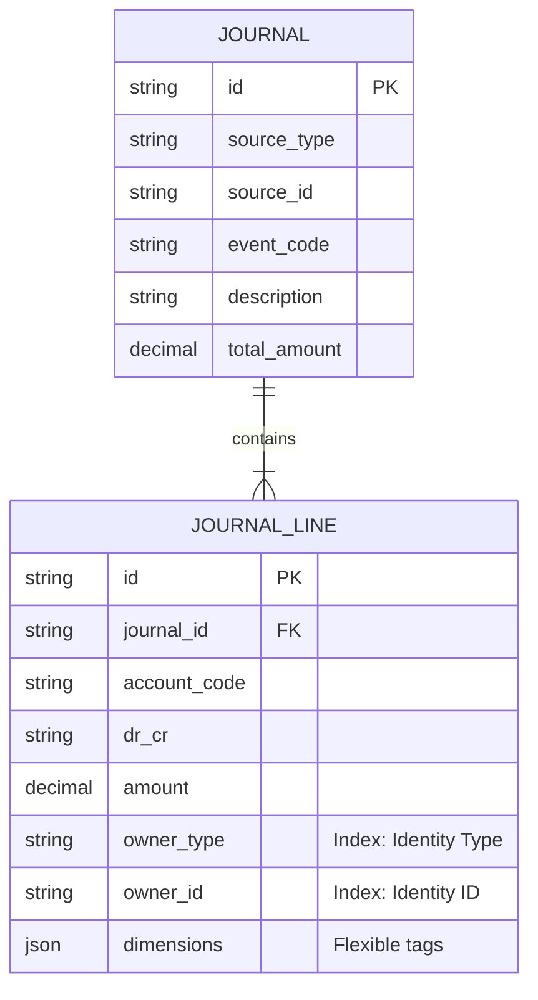

# Journal Structure Optimization Design Document

## 1. Overview

This design aims to elevate the **Identity Resolution** (OwnerType + OwnerId) from a dynamic JSON field (`bucketJson`) to first-class columns in the `JournalLine` table. This change will significantly improve query performance for customer balances, simplify data integrity checks, and align with the existing `Wallet` and `DepositTransaction` schema patterns.

## 2. Journal Line Structure (`journal_lines`)

We will transform the `bucketJson` field into specific structured columns for identity, while retaining a JSON field (renamed to `dimensions` for clarity) for extensible attributes.

| Field Name        | Type    | Required | Old Structure     | New Structure     | Description                                                       |
| :---------------- | :------ | :------- | :---------------- | :---------------- | :---------------------------------------------------------------- |
| `id`              | UUID    | Yes      | `id`              | `id`              | Primary Key (JEL\_...)                                            |
| `journalId`       | UUID    | Yes      | `journalId`       | `journalId`       | Foreign Key to Header                                             |
| `lineNo`          | Int     | Yes      | `lineNo`          | `lineNo`          | Sequence number within journal                                    |
| `accountCode`     | String  | Yes      | `accountCode`     | `accountCode`     | Chart of Account Code                                             |
| `drCr`            | Enum    | Yes      | `drCr`            | `drCr`            | Debit (DR) or Credit (CR)                                         |
| `amount`          | Decimal | Yes      | `amount`          | `amount`          | Transaction Amount                                                |
| `assetId`         | UUID    | Yes      | `assetId`         | `assetId`         | Asset ID for the amount                                           |
| **`subjectType`** | Enum    | **No**   | (In `bucketJson`) | **`ownerType`**   | **NEW**: `CUSTOMER`, `LP`, `PLATFORM`. Matches `Wallet.ownerType` |
| **`subjectId`**   | UUID    | **No**   | (In `bucketJson`) | **`ownerId`**     | **NEW**: The Entity ID (Customer ID, LP ID, etc.)                 |
| `bucketJson`      | JSON    | No       | `bucketJson`      | **`dimensions`**  | **Renamed**: Stores auxiliary tags (e.g. `campaign_id`, `region`) |
| `description`     | String  | No       | N/A               | **`description`** | **NEW**: Line-level explanation                                   |
| `referenceId`     | String  | No       | N/A               | **`referenceId`** | **NEW**: External ref specific to this line (e.g. Invoice ID)     |

**Key Improvements:**

* **Performance**: `ownerType` + `ownerId` are now indexable columns. Calculating "User Balance" becomes a simple `SUM` query instead of parsing JSON.

* **Consistency**: Matches `Wallet` table design.

* **Extensibility**: `dimensions` (formerly `bucketJson`) remains for future flexible needs.

## 3. Journal Header Structure (`journals`)

The Header structure is largely solid but benefits from minor standardization.

| Field Name      | Type    | Required | Old Structure   | New Structure     | Description                                  |
| :-------------- | :------ | :------- | :-------------- | :---------------- | :------------------------------------------- |
| `id`            | UUID    | Yes      | `id`            | `id`              | Primary Key                                  |
| `sourceType`    | Enum    | Yes      | `sourceType`    | `sourceType`      | Origin (PAYIN, ORDER, etc.)                  |
| `sourceId`      | UUID    | Yes      | `sourceId`      | `sourceId`        | Origin ID                                    |
| `eventCode`     | String  | Yes      | `eventCode`     | `eventCode`       | Accounting Event Code                        |
| `postingStatus` | Enum    | Yes      | `postingStatus` | `postingStatus`   | POSTED / VOID                                |
| `baseAssetId`   | UUID    | Yes      | `baseAssetId`   | `baseAssetId`     | Functional/Reporting Currency of the Journal |
| `totalAmount`   | Decimal | No       | N/A             | **`totalAmount`** | **NEW**: Sum of Debits (integrity check)     |
| `memo`          | String  | No       | `memo`          | **`description`** | **Renamed**: Standardize with other tables   |

## 4. Entity Relationship (ER) Diagram



## 5. SQL Implementation & Migration

### Step 1: Schema Migration (SQLite Compatible)

```sql
-- 1. Add new columns to journal_lines
ALTER TABLE "journal_lines" ADD COLUMN "ownerType" TEXT;
ALTER TABLE "journal_lines" ADD COLUMN "ownerId" TEXT;
ALTER TABLE "journal_lines" ADD COLUMN "description" TEXT;
ALTER TABLE "journal_lines" ADD COLUMN "referenceId" TEXT;

-- 2. Rename bucketJson to dimensions (SQLite requires recreating table usually, 
-- but for now we can just add new and copy, or keep bucketJson as is and alias it in code.
-- For strict schema change:)
-- ALTER TABLE "journal_lines" RENAME COLUMN "bucketJson" TO "dimensions"; -- (If supported by Prisma/SQLite version)

-- 3. Create Indexes for performance
CREATE INDEX "idx_journal_lines_owner" ON "journal_lines"("ownerType", "ownerId");
CREATE INDEX "idx_journal_lines_balance" ON "journal_lines"("accountCode", "ownerType", "ownerId");

-- 4. Journal Header updates
ALTER TABLE "journals" ADD COLUMN "totalAmount" DECIMAL;
-- Rename memo to description (Optional, strictly cosmetic)
-- ALTER TABLE "journals" RENAME COLUMN "memo" TO "description";
```

### Step 2: Data Migration (Backfill)

You will need a script to parse existing `bucketJson` and populate `ownerType`/`ownerId`.

```typescript
// Pseudo-code for migration script
const lines = await prisma.journalLine.findMany();
for (const line of lines) {
  const bucket = JSON.parse(line.bucketJson);
  // Assuming your bucket rules previously put 'client_id' or similar
  const ownerId = bucket.client_id || bucket.userId || bucket.lpId;
  const ownerType = bucket.client_id ? 'CUSTOMER' : (bucket.lpId ? 'LP' : 'PLATFORM');
  
  if (ownerId) {
    await prisma.journalLine.update({
      where: { id: line.id },
      data: { ownerType, ownerId }
    });
  }
}
```

## 6. Next Steps

1. Confirm this design.
2. I will update `prisma/schema.prisma`.
3. I will create a migration to apply these changes.
4. (Optional) I can update `JournalLineTemplate` to include `ownerSource` if you want to make the template configuration explicit rather than relying on `bucketRuleJson`.

