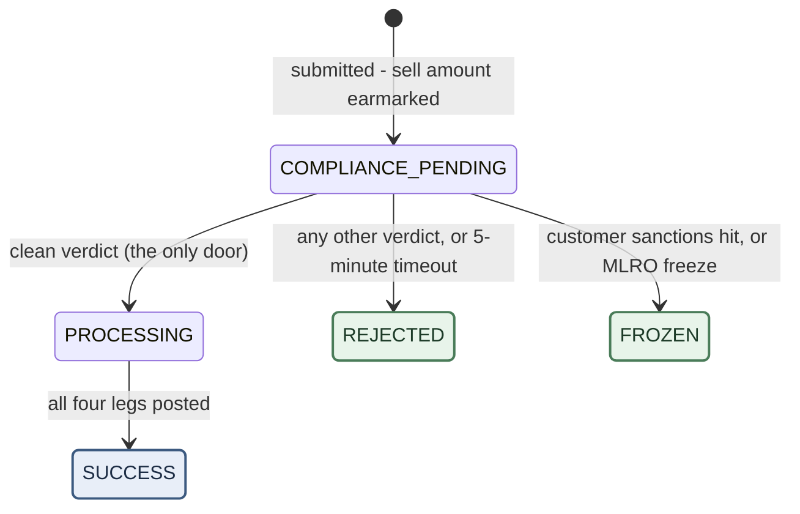

# Swap Processing — Process & Control Narrative

**Audience.** Compliance Officers, MLRO, Senior Management, Operations, and Internal Audit. This is not a specification for engineers — it explains how swap processing actually works, where the decision points sit, who owns each decision, and what you are expected to do when a swap lands in your queue.

**How to use this.** Sections 1–4 are the mental model; read them once. Section 5 is your day-to-day playbook by role. Section 6 tells you what a customer can see and what you may say to them. Section 7 is the clocks. Section 8 walks through real scenarios end to end.

**Companion documents.** This completes the set begun by *Deposit Processing* and *Withdrawal Processing — Process & Control Narrative*. The three flows are deliberately different answers to the same question — *when do we still control the money?* — and Section 1 places the swap answer against the other two.

**Environment note.** Threshold figures reflect the current demo configuration. Production values are set by Compliance and may differ; the mechanics do not. **State names** in this document are the system's own names — the same words you see in the admin console and in the audit trail. Only the customer's screen uses different words; the table at the end of Section 2 maps them.

---

## 1 The one thing to understand first

**Nothing moves until compliance says yes. Once it says yes, nothing can stop it.**

Place the three flows side by side:

- A **deposit** arrives whether we like it or not. Every decision afterwards is about *releasing* money we already hold.
- A **withdrawal** is money leaving. Every control is about the last moment we can still *stop* it.
- A **swap never leaves our custody.** There is no external counterparty: the customer trades against the firm itself, dealer-style. Settlement is four **real transfers** — on-chain and bank movements with their own submit/confirm lifecycles, each carried by a funds order — but every one of them runs between wallets **we** control: the customer's custody accounts and the firm's own. No outside party ever touches the money or gets a vote.

That produces the swap's defining rule, which is the exact inverse of the deposit's:

> **Approval comes before money. A swap that is refused, rejected, frozen, or timed out never posts an entry to the books.**

When a customer confirms a swap, the system records *that they want to trade*, places a **pending hold** on the sell amount in the ledger, and submits the trade for screening. No settlement leg exists yet and nothing is posted. Only a clean screening verdict triggers execution; any other outcome ends the swap with nothing ever posted — the hold is voided, and the books show a net-zero pending pair. A trade that did not happen leaves nothing posted, ever.

Two qualifications, and both matter operationally:

- **"No money moves" does not mean "no money is held."** The moment the swap is created, the **full sell-side amount is earmarked** against the customer's balance — their spendable balance drops instantly, and that money cannot be double-spent into a withdrawal or a second swap. Every non-success ending erases the earmark in full, automatically, as part of the ending itself. The earmark and its erasure stay visible in the ledger history as a net-zero pair — evidence, not movement.
- **The irreversible line is the clean verdict itself.** For a withdrawal the line exists because money physically leaves. For a swap nothing leaves our custody — yet the line is just as hard, because the trade has executed at a price the customer locked. Once execution starts there is **no freeze exit, no reject exit, and no failure ending**: the only way forward is completion. Anything that goes wrong mid-execution parks the swap under a review flag, *still executing*, until someone fixes the cause. A screening verdict that arrives after execution has begun changes no status and unwinds nothing — it writes an audit line, raises a flag, and (if it is a rejection) still punishes the *person* (Section 4.5).

One more inversion to internalise: when a swap **is** frozen, the freeze **releases** the customer's money back to their balance rather than impounding it. The enforcement weight sits on the **person** — a sanctions-cause restriction that blocks every capability they have — not on the order. The frozen order is evidence; the restriction is the control. Section 3 explains why that is safe.

---

## 2 The normal path

Most swaps never require a decision from anyone.

1. The customer requests a **quote**: live market rate, minus our spread, minus a fixed service fee — priced from the cheapest fee level applicable to that customer (Section 4's environment values). The quote is valid for **30 seconds**.
2. The customer confirms. A chain of checks runs (Section 4.1–4.2); if all pass, the swap record is created in **COMPLIANCE_PENDING**, the quote is consumed — one quote, one use, ever — and the **full sell amount is earmarked** against their balance.
3. The sell side is submitted to **Sumsub**, our transaction-monitoring provider, for screening. A **5-minute clock** starts.
4. Sumsub returns a verdict. If it is clean, the swap moves to **PROCESSING** and the four settlement legs execute one after another — each a real transfer between wallets we control, carried by a funds order and mirrored 1:1 in the ledger as it clears.
5. When the fourth leg posts, the swap is **SUCCESS**: the sold balance is gone, the bought balance (net of fee) has arrived, and the fee is firm revenue.

Elapsed time when nothing is flagged: seconds. No human touches it. Swaps are **the most automated of the three flows**: there is no signature gate, no manual-review state, no waiting-on-customer state — one gate, and it is Sumsub's.

### The state machine

Five live states and every move permitted between them. Green endings mean the earmark is erased and the money is back in the customer's spendable balance; **SUCCESS is the only ending where the exchange actually happened.**

**Reading it as an officer:**

- **Every swap is born in COMPLIANCE_PENDING**, with the earmark already placed. There is no other birth state and no pre-screening queue of any kind.
- **There is exactly one arrow into PROCESSING, and it is a clean Sumsub verdict.** Our own console has no release button, no approve button, and no way to create a second arrow. (Compare the withdrawal, which has three arrows into payout — all also clean verdicts.)
- **PROCESSING has exactly one exit.** No freeze, no reject, no failure. A leg that fails is retried automatically (three attempts per leg); a leg that exhausts its retries parks the swap in PROCESSING under a `needs review` flag. This is deliberate: the trade has been executed at a locked price, and a half-executed trade must never be stamped with a final status it has not earned.
- **FROZEN and REJECTED both erase the earmark on entry.** The money returns to the customer's spendable balance in full — including in the sanctions case. That looks alarming until you notice what else the sanctions case does: it opens an **all-capabilities restriction** on the customer in the same breath, so the returned balance is money they cannot swap, withdraw, or otherwise move. The freeze pins the person, not the pennies.
- **FROZEN has no exit at all.** Unlike a deposit or withdrawal freeze — a parking state with MLRO-signed ways out — a frozen swap is terminal. There is nothing left to decide *on the order*: no money is held, nothing is pending. The live question, "may this customer transact again?", has moved to the customer's restriction record, and that is where the MLRO acts (Section 5.2).
- **The three endings have no outgoing arrows.** A completed swap cannot be reversed by any control in the system. If a completed swap must be undone, that is a new, opposite trade — a business decision, not a button.

Two further enum values — `FAILED` and `REVERSED` — exist in the code but are **unreachable**: no transition leads into them and nothing writes them. If you see either in a report, treat it as a data error, not a state.

### The five states, and what each screen calls them

The admin console shows the system's own names. Only the customer's screen differs.

| # | State | What it means | Customer's screen shows |
|---|---|---|---|
| 1 | **COMPLIANCE_PENDING** | Submitted to Sumsub; waiting on a verdict. Sell amount pending-locked in the ledger; nothing posted | Processing |
| 2 | **PROCESSING** | Clean verdict received; the four legs are booking | Processing |
| 3 | **SUCCESS** | All four legs posted; exchange complete | Completed |
| 4 | **REJECTED** | No trade. Earmark erased, money back | **Unsuccessful** |
| 5 | **FROZEN** | Customer sanctions hit or MLRO freeze. No trade, earmark erased, customer restricted | **Unsuccessful** — identical to Rejected, deliberately |

That last row is the transaction-flow version of the tipping-off control, and it is stronger here than anywhere else in the system — Section 6 explains the three layers behind it.

---

## 3 Where a swap can end up

### 3.1 The three endings

| Ending | What it means | Where the money is | Customer sees |
|---|---|---|---|
| **SUCCESS** | The exchange executed | Sold balance exchanged for bought balance, net of fee; fee is firm revenue | Completed |
| **REJECTED** | We declined to trade — verdict, disposition, or timeout | **Back in the customer's spendable balance, in full** | Unsuccessful |
| **FROZEN** | The customer — not the order — is now the subject | **Back in the customer's spendable balance, in full** — but the customer is restricted from moving it | Unsuccessful |

Note what is **not** on this list:

- **There is no "Failed".** A swap cannot fail its way to an ending. Before the verdict there is nothing to fail — refusal is just Rejected. After the verdict, failure is always *temporary*: retried, then flagged for a human. This is a design rule: an ending must state where the money finished, and "failed halfway through an executed trade" cannot answer that.
- **There is no "Returned", "Confiscated" or "Seized".** Nothing external ever holds the money, so there is nothing to return; and seizure of a customer's own balance is an account-level action, not something a single swap record can express.
- **There is no "Cancelled".** Once submitted, the customer cannot recall a swap. Its life is at most 5 minutes plus execution time; a cancel button racing a compliance verdict would buy nothing and create ambiguity.

### 3.2 Refused before it exists

A request that fails any pre-creation check in 4.1–4.2 produces **no swap record at all** — nothing is earmarked, the quote is not consumed, and there is nothing for anyone to review. The customer gets one neutral error message. The only traces are an audit line for a limit rejection and, for a stale quote, the quote's own expiry.

### 3.3 Where a swap can stop moving

| It stops in | Who has to move it | How it is found |
|---|---|---|
| **COMPLIANCE_PENDING** | Nobody — **the 5-minute clock guarantees it moves by itself** (Section 7) | It cannot age — with one exception: if the submission to Sumsub can never succeed (the customer has no Sumsub profile, or Sumsub keeps refusing it), the sweep keeps re-submitting instead of rejecting, and the swap waits **indefinitely with the customer's money earmarked** and nothing flagging it |
| **PROCESSING + `needs review` flag** | Engineering, effectively — the console deliberately has **no repair button** (Section 5.3) | Swap list, "needs review" filter |
| **FROZEN** | Nothing — the order is finished. The open item is the **customer restriction**, owned by the MLRO | Swap list filtered to FROZEN; the restriction on the customer's profile |

Read that table against its withdrawal counterpart and the contrast is the point: a withdrawal's biggest ageing risk is *before* screening resolves; a swap **cannot** age there. The swap's only ageing risk sits *after* execution starts — rarer, but with no in-console remedy.

---

## 4 The gates, in order

A swap passes five gates. The first two run at request time and refuse outright — no record, no earmark, no quote consumed. The rest happen on and after the verdict.

### 4.1 May this customer swap, and can both sides land?

A chain of checks runs **before the swap record exists**. Any failure and the customer gets an error with nothing created.

- **Customer standing.** The customer relationship must be exactly **Active**, and the customer must carry no open restriction blocking swaps. All seven restriction causes block swaps by default; sanctions and administrative suspension block everything. Sanctions and hard risk restrictions are **silent** — the customer is shown no reason.
- **Trading-start precondition.** The customer must have completed the trading-start prerequisites (an active fiat withdrawal account on file) — the same gate that fronts deposits and withdrawals.
- **A receiving account on both sides.** The customer must have an active receiving account for the asset they are selling **and** the one they are buying. This check was moved to the front deliberately: it used to surface only mid-execution, after the verdict — by which point the quote was burned, the screening spent, and the swap stuck with no failure exit. Now it refuses before anything exists, with a prompt to open the missing account.
- **Sufficient sell-side balance.** The available balance must cover the full sell amount, checked before creation — and then actually **earmarked at creation**, so the same funds cannot back two transactions.
- **A live quote.** The request must carry a quote that exists, belongs to this customer, is active and unexpired. The rate, spread and fee come from that quote and nowhere else. It is consumed at submission — **one use, ever**. If the swap is later rejected, the quote is still gone; a customer cannot probe compliance with the same locked price twice.

**What the customer sees when this gate refuses:** one neutral message, indistinguishable from a system error — with two exceptions that are deliberately informative, because they are fixable by the customer and carry no investigation signal: the missing-receiving-account refusal names the asset and points to account opening, and the insufficient-balance refusal states the shortfall.

### 4.2 Is the amount within limits?

The same transaction-limit gate as withdrawals, run before the record is created. There is no human-review exit: every failure is an outright refusal, and every refusal writes an audit line.

| Rejected when | Current demo configuration |
|---|---|
| Below the per-transaction minimum | 10 (USDT and AED); 0.0001 BTC; 0.001 ETH |
| Above the per-transaction maximum | 1,000,000 (USDT and AED); 10 BTC; 100 ETH |
| The amount cannot be valued in AED and the customer's tier has cumulative limits | **Refused outright** — unlike a withdrawal, which routes to approval, a swap has no approval queue to fall back to. Fail-closed here means fail |
| The daily or monthly cumulative allowance would be exceeded | **Basic:** 100,000 AED per day, 1,000,000 per month. **Premium:** 1,000,000 per day, 10,000,000 per month |

Cumulative windows start on **Dubai time**. One counting rule to know: **every swap ever created counts against the allowance — including rejected and frozen ones.** The exclusion list names only the two unreachable legacy states, which no swap can occupy. A customer whose swaps keep getting rejected is still consuming their daily allowance with each attempt. (Contrast withdrawals, which give the allowance back on rejection.)

> **There is no large-value gate.** The 200,000 AED Senior Management signature line exists **only for withdrawals**. A 900,000 AED swap — inside the Premium daily allowance — goes straight to screening with no human signature anywhere. The reasoning: the money cannot leave our custody through a swap. Anyone re-weighing that reasoning should note the pairing it creates: swap large into the target asset with no signature, then withdraw in pieces below the withdrawal thresholds.

### 4.3 What did screening return?

Sumsub speaks four outcomes. The swap flow deliberately collapses them into two, because a swap has nowhere to wait:

| Sumsub outcome | In deposits / withdrawals | In swaps |
|---|---|---|
| **Clean** | Proceeds | Swap moves to PROCESSING — **the only door, crossed here** |
| **More information needed** | Order waits on the customer | **Rejected.** The document request attaches to the *person* (see 4.5) — never to the order |
| **On hold** | Order waits; clock refreshes | **Rejected** |
| **Not clean** | Routed by disposition tag | Routed by disposition — 4.4 |

The design rule behind the collapse: **a swap is a price promise, and prices rot.** The customer locked a rate for 30 seconds; parking the trade for days while documents arrive would leave us honouring a stale price or silently repricing — both worse than refusing. So the swap dies cheaply (nothing was booked), the *material request* lives on the customer, and once resolved the customer simply takes a fresh quote.

Consequences an officer should internalise:

- **"On hold" does not buy time here.** In deposits and withdrawals an on-hold verdict refreshes a 7-day clock. In swaps it kills the order. If your intent in Sumsub is "let me look at this one for a while", understand that for a swap the customer-visible outcome of that click is a rejection.
- **A rejection here is not an accusation.** It may mean "documents needed" as easily as "risk exceeded". What tells you which — and what decides everything that happens next — is the tag set, in 4.4, and the disposition, in 4.5.
- **After execution begins, no verdict does anything to the order.** It is recorded, flagged, and — if it is a rejection — the person is still restricted (4.5). The order keeps executing. There is no recall.

### 4.4 What is the disposition instruction?

When the verdict is anything but clean, the tags attached decide the route. Two kinds of tag exist, and confusing them is the classic error:

- **Scene tags** — attached by Sumsub's rule engine, stating *what was hit*: `SANCTION_APPLICANT`, `SANCTION_COUNTERPARTY`, `PEP_APPLICANT`, `PEP_COUNTERPARTY`. If several are present the system reads the most severe.
- **Disposition tags** — attached by an officer, stating *what to do*. Swaps recognise exactly one: `FROZEN_BY_MLRO`.

| Tag on the verdict | Route | Who owns it next |
|---|---|---|
| `SANCTION_APPLICANT` — the **customer** is the hit | **FROZEN** + all-capability silent restriction on the customer | MLRO (via the restriction) |
| `FROZEN_BY_MLRO` | **FROZEN** + restriction on the customer | MLRO (via the restriction) |
| `SANCTION_COUNTERPARTY`, either `PEP` tag, any other tag, or no tag | **REJECTED**, then the person-level disposition of 4.5 | Usually nobody — see 4.5 |

Mechanics that are not visible from the table:

- **Only the customer-side sanctions tag freezes.** A swap is an exchange inside one customer's own account — there is no counterparty. The counterparty tags exist in the shared vocabulary and are read for evidence, but they freeze nothing here. A `PEP` tag on its own does not freeze in any flow.
- **Tags are exact, officer-defined labels.** A misspelling or an unrecognised tag routes to an ordinary rejection with no error and no warning.
- **The order of operations is person first, order second.** The restriction on the customer is opened *before* the order is frozen, so a crash between the two writes fails safe: a restricted customer with an unfrozen order, never the reverse.
- **Deposit-style disposition tags do nothing here.** There is no return-to-sender and no confiscation arc, because there is nothing held to return or keep.

### 4.5 What happens to the person

Every rejected verdict — not just sanctions — triggers a **customer-level disposition**. This is the part of the swap flow with lasting consequences, and it outlives the order that triggered it.

**Every rejection restricts the customer's SWAP and WITHDRAW capabilities.** Deposits are deliberately left open — funds on their way in cannot be usefully refused, and blocking them only creates stranded money. The restriction takes one of three forms:

| Cause | Visibility | Blocks | Who releases it |
|---|---|---|---|
| **Sanctions** (`SANCTION_APPLICANT`) | **Silent** — customer told nothing | **Everything** | MLRO approval only. One restriction per customer, however many orders are involved |
| **Soft line** — Sumsub attached at least one thing the customer can actually fix (e.g. source-of-funds) | Disclosed — customer sees "Verification required" and a document request | Swap + withdraw | **Automatic**, when the resubmitted material is reviewed GREEN; or an operations-level approval |
| **Hard line** — Sumsub attached nothing actionable | **Silent** | Swap + withdraw | MLRO approval only |

Three rules govern the split:

- **The tipping-off decision is made exactly once, at this moment, on the write side.** A soft line registers a visible document request; the silent lines register nothing — the customer's app has no entry point at all, not a greyed-out one.
- **Sanctions silence is sticky, per customer, forever.** Once a customer has ever been sanction-hard-lined, every later disposition for them stays silent — even a later, independently soft rejection on a different swap will not re-open a visible entry point. There is deliberately no reset.
- **The sticky mark even outweighs a passing grade.** If a hard-lined customer's materials later come back GREEN, the restriction is deliberately **not** released; an audit line records that the GREEN was seen and consciously not acted on. Release for such a customer goes through the MLRO or not at all.

The rejected swap itself is closed and stays closed. When the restriction lifts — automatically on GREEN for the soft line, by MLRO approval otherwise — the customer takes a fresh quote and starts a new swap. Nothing revives an old one.

**The one rejection with no disposition at all: the timeout.** A swap that times out at 5 minutes is rejected with **no restriction, no document request, and no mark on the customer**. Sumsub failing to answer is our problem, and blame for the platform's latency must never be booked to the customer's account. A timed-out customer can retry immediately.

### 4.6 The gate that keeps running

Customer standing is not checked once. Two mechanisms keep it live:

- **Before every settlement leg**, the customer's swap capability is re-checked. If a restriction landed mid-execution, leg progression **halts** — the swap stays in PROCESSING with a `needs review` flag and an audit line. It is a pause, not a freeze: no status changes, no accounting is unwound. But note the sharp edge: **lifting the restriction does not restart the legs.** Nothing does, automatically — see Section 5.3.
- **When a restriction opens on a customer**, their whole in-flight book is swept. What happens to each swap depends on where it is and why the restriction exists:

| In-flight swap is in | Restriction cause | Effect |
|---|---|---|
| COMPLIANCE_PENDING | **Sanctions** | Swept to **FROZEN**, earmark erased |
| COMPLIANCE_PENDING | Any other cause (e.g. administrative suspension) | Flagged only — **not destroyed.** The swap stays pre-verdict, where the 5-minute clock still governs it: it resolves by verdict or times out like any other |
| PROCESSING | Any cause | Legs halt + `needs review`. The executed portion stands |

The cause filter is deliberate: an administrative suspension is an ordinary, releasable note, and sweeping orders into the exitless FROZEN on its account would destroy them permanently for a temporary reason. Only sanctions earn the terminal treatment.

---

## 5 Your playbook

### 5.1 Compliance Officer

**What lands in your queue: structurally, nothing.** A swap never waits for you. There is no manual-review state, no awaiting-customer state, and by the time you could form a view the swap is — by design — already finished, one way or the other, within 5 minutes. Your work on swaps is **upstream and after-the-fact**:

- **Upstream:** the Sumsub transaction rules *are* the swap policy. Every swap stands or falls on the automatic verdict those rules produce. Rule coverage, thresholds and tag discipline in the Sumsub console are where a Compliance Officer actually controls this flow.
- **After the fact:** rejected and frozen swaps, and the restrictions they opened, are found by filtering the swap list and the customer's profile. The full Sumsub evidence — verdict, score, matched rules, tags, raw report — is on the swap's detail page.

**What you can actually do — read this carefully:**

> **The admin console has no approve, reject, or freeze button for a swap. Anywhere.** Your levers are in the **Sumsub console**: the verdict and the tags. And because a swap cannot wait, your tag must be on the verdict *when it is issued* — there is no later. A tag applied to a swap transaction after its verdict has landed changes nothing on our side.

| Intended outcome | How you actually achieve it |
|---|---|
| Let the swap execute | Clean verdict in Sumsub. Know what it does: this is the irreversible line — four legs will book, and no one can stop them |
| Refuse this swap, ask the customer for documents | Rejected/awaiting verdict **with the document request attached**. The swap dies; the request and a "Verification required" restriction land on the customer; a GREEN review lifts it automatically |
| Refuse and silently restrict the person | Not-clean verdict with nothing actionable attached (hard line — MLRO holds the key) |
| Freeze — customer is a sanctions subject | Not-clean verdict with `SANCTION_APPLICANT` (rule-driven) or `FROZEN_BY_MLRO` (your hand). Order freezes, person is fully restricted, silently |

> **In the demo environment only,** the swap detail page shows a ⚡ Simulation panel with eight verdict buttons, plus a "Simulate SLA Timeout" button. They stand in for Sumsub's webhooks and clock so the flow can be demonstrated without the real console; they are not production controls.

**Judgement note.** For a swap, "reject" is cheap — nothing was booked, the customer lost only a 30-second price. What is *not* cheap is the disposition that rides on it: every rejection restricts the person's swap and withdraw capability, and a silent one leaves them no way to ask why. Tag with the disposition in mind, not just the verdict.

### 5.2 MLRO

**What lands in your queue:** nothing, automatically. Frozen swaps are found by filtering the swap list on FROZEN. But understand what you are looking at:

> **A frozen swap requires no decision and offers none.** It is terminal: no money is held on it, nothing is pending, no button exists. Unlike a frozen deposit or withdrawal, there is no unfreeze and no refund to sign, because the money went back to the customer's balance the moment the freeze landed. **Your case is the customer restriction, not the order.** The frozen order is the evidence attached to it.

Your actual decisions, all on the customer's profile:

| Decision | What it does | Notes |
|---|---|---|
| Release a **sanctions** restriction | Restores all the customer's capabilities | Yours alone. One restriction per customer regardless of how many swaps were frozen — releasing it is one decision, not many |
| Release a **hard-line** (silent KYT) restriction | Restores swap + withdraw | Yours alone |
| Sticky-silenced customer whose materials came back GREEN | The system deliberately held the auto-release and wrote an audit line saying so | The release, if any, is your judgement — there is no automatic path back for a customer who has ever been sanction-hard-lined |

Points to carry into that judgement:

- **Releasing the restriction does not revive any swap.** Every frozen or rejected order stays finished. The customer starts fresh — new quote, new screening. There is deliberately no way to "let the old one through".
- **The customer's balance already contains the money.** The freeze returned it. What your release changes is not where the money *is* but whether the customer can *move* it. Until you release, they hold a balance they cannot swap or withdraw — and, for the sanctions cause, cannot do anything with at all.
- **The silence is yours to maintain.** Sanctions and hard-line restrictions are invisible to the customer, and the frozen swap reads "Unsuccessful" on their screen, identical to an ordinary rejection. Any outreach, any explanation, any distinct treatment is a tipping-off risk (Section 6).

### 5.3 Operations

**What lands in your queue:** swaps carrying the **`needs review` flag** — the swap list has a filter for it, and the detail page shows a banner. The flag has **three different causes**, and they need very different responses. The banner names all three; the audit trail tells you which one you have.

| Cause (find it in the audit trail) | What it means | Response |
|---|---|---|
| **Settlement leg exhausted its retries** (`SWAP_LEG_STUCK`) | A leg failed three attempts. The swap is parked mid-execution: earlier legs posted and stand; this leg's attempts were voided cleanly | Root-cause with engineering. **The console deliberately has no resume button** — see below |
| **A rejection verdict arrived after execution began** (`SWAP_POST_APPROVAL_VERDICT`) | The trade executed (or is executing) and Sumsub has since said it should not have. Nothing can be unwound. The customer *was* still restricted automatically | **Compliance escalation to the MLRO, immediately.** The order is beyond recall; the open questions — the customer, and whether a reverse trade is warranted — are not yours |
| **The customer was restricted mid-execution** (`SWAP_LEG_HALTED_BY_RESTRICTION`) | Legs halted as a precaution. Partial accounting stands; nothing is broken | Wait for the restriction's outcome. **Know the trap: when the restriction is released, the swap does not restart by itself** — nothing re-pushes a halted leg. Treat every released-restriction case as a stuck swap that needs the same engineering path as row 1 |

**On the missing resume button.** The backend keeps a permission-gated resume endpoint per leg, but the console deliberately does not expose it: the owner's ruling (2026-08-22) is that a flagged swap should be visibly red and *not* casually revivable from a list page, because pressing resume without fixing the underlying cause simply burns another attempt. Recovery is a deliberate, engineering-assisted act. Practical consequence: **a flagged swap will sit in PROCESSING indefinitely — no clock, no escalation — until someone notices the filter.** Make checking that filter a routine, not an event.

Operations has no other levers in this flow: no disposition queue (that is a deposit concept), no approvals, and no role in the verdict.

### 5.4 Senior Management Officer

**Nothing in this flow ever reaches you, and that is by design.** There is no large-value signature line for swaps — the 200,000 AED gate you sign for withdrawals does not exist here (Section 4.2 explains the reasoning and its limits). No approval of any kind exists in the swap flow. If a swap-related item does reach your desk, it will be indirect: a policy question about limits or fees, or an incident escalated past the MLRO — never a queue.

---

## 6 What the customer sees — and what you may say

### 6.1 The display

| Swap is actually… | Customer's screen shows |
|---|---|
| COMPLIANCE_PENDING | Processing |
| PROCESSING — including flagged and halted | Processing |
| SUCCESS | Completed |
| REJECTED — any cause: verdict, disposition, or timeout | Unsuccessful |
| **FROZEN** | **Unsuccessful** — byte-for-byte identical to Rejected |

The customer's history offers exactly two filters — Completed and Unsuccessful — matching the only distinctions their screen makes. Balance behaviour is part of the display: the spendable balance drops the moment they submit, and reappears in full the moment a swap turns Unsuccessful, whichever of the two real states is behind it.

### 6.2 Why enforcement is invisible — three layers

Under anti-money-laundering rules we may not tip off a person that they are under investigation. For swaps the control has **three layers**, and — unlike the withdrawal flow, whose narrative carries a warning on exactly this point — it holds up against a technically capable customer:

1. **The label collapses.** A frozen swap renders as "Unsuccessful", the same word, tone and styling as an ordinary rejection. (Deposits collapse their freeze into "Processing" instead — honest there because a deposit freeze is genuinely reversible. A swap freeze is terminal, so "Processing" would be a lie that also left the customer's screen refreshing forever. The truthful *and* silent answer is "Unsuccessful".)
2. **The data collapses too.** The API response the customer's browser receives is built from a field whitelist, and the status in it is collapsed **server-side** before it leaves the building. DevTools shows REJECTED, not FROZEN. Verdicts, rule names, risk scores, reject reasons, internal flags — none of it is in the payload.
3. **The filter cannot probe.** Status filters are expanded from the same collapse function, so filtering by a hidden state returns an empty list — precisely what a real state with no records returns. No error, no tell.

The same principle governs the silent restrictions (4.5): no banner, no greyed-out button, no entry point. A sanctioned customer attempting a new swap gets the same neutral refusal as a system fault.

**The trade-off we accepted:** a customer whose swap was frozen has no in-product route to ask about it — and because their screen says "Unsuccessful" and their money is visibly back, most will simply try again and meet the neutral refusal. That is intended.

### 6.3 If a customer contacts you about a swap

| Situation | What you may say |
|---|---|
| Processing | "It's being processed. Swaps normally complete within minutes." |
| Unsuccessful — and it was an ordinary rejection or timeout | Confirm it did not go through and the funds are back in their available balance. Never explain which check, rule, or verdict was behind it |
| Unsuccessful — and it was actually **FROZEN**, or the customer is silently restricted | **Exactly the same words as the row above, and nothing more.** Do not confirm or deny any review, freeze, or restriction. Escalate to the MLRO; never improvise |
| They have a "Verification required" notice and a document request | Confirm what is needed and how to submit it. On a GREEN review the restriction lifts by itself and they can swap again with a fresh quote |
| "Why can't I start a new swap?" | You may restate what their screen says. If their screen says nothing — that is the silent case above. Escalate; do not speculate |
| Their quote expired | Confirm quotes last 30 seconds and a new one is free. Prices are live; expiry is normal |

> **The rule of thumb:** you may always describe what the customer can already see on their own screen. You may never describe anything they cannot.

**There are no customer notifications of any kind** — not for completion, not for rejection, not for a document request. Customers learn everything by opening the app.

---

## 7 Timelines

| Clock | Duration | Starts when | On expiry |
|---|---|---|---|
| Quote | **30 seconds** | The quote is issued | Quote unusable. Expiry is checked at the moment of use — there is no background sweeper, so an expired quote can linger in lists looking stale but can never be consumed |
| Verdict clock | **5 minutes** | The swap enters COMPLIANCE_PENDING | **Rejected, fail-closed** — no verdict is treated as no clearance. Earmark released, **no customer disposition** (4.5). The sweep runs every 30 seconds |
| Leg retries | 3 attempts per leg, automatic | A settlement leg fails | `needs review` flag; swap stays in PROCESSING |

Three points worth internalising:

- **The 5-minute clock is the whole timeline story of this flow.** It is the same wait, for the same thing, as the deposit and withdrawal screening clocks — Sumsub's verdict — deliberately set to the same figure. But because a swap has no other waiting states, it is the *only* clock, and it makes COMPLIANCE_PENDING all but incapable of silent ageing — the sole exception being a submission that can never reach Sumsub at all (Section 3.3).
- **The clock is also the flow's dependency statement.** Everything hangs on Sumsub answering within 5 minutes, automatically. If the transaction rules are ever configured so that a class of swap needs a human look, that class will simply time out, every time, at minute five — rejected without a human ever seeing it. Keep this in view when writing rules (see also Section 9).
- **No clock runs after the verdict.** PROCESSING (flagged or halted) and the customer restrictions opened by dispositions have no timers and no escalation. Ageing there is a management responsibility, not a system one.

---

## 8 Worked scenarios

**A — Ordinary swap**
The customer quotes 1,000 USDT into AED. Market rate 3.6725; their tier carries a 0.60% spread, so the locked rate is 3.65047 — 3,650.47 AED gross — and a flat 20 AED service fee is shown: 3,630.47 net. They confirm within 30 seconds. The record is born in COMPLIANCE_PENDING with 1,000 USDT earmarked — their spendable USDT drops at once. Screening returns clean in seconds; the four legs execute — the sold USDT moves from the customer's wallet to our operating wallet, an internal move rebalances our own pools, the gross AED is credited to the customer's account, the fee is collected back out — each carried by a funds order and posted to the ledger as it clears, and the swap is SUCCESS. The customer saw Processing, then Completed. The 22.03 AED difference between market value and the gross quote is the spread margin, recorded on the swap as a reporting figure; the 20 AED fee is posted revenue.

**B — Documents requested**
Screening comes back not clean with a source-of-funds request attached and no sanctions tag. The swap is **Rejected** — in this flow a document request does not pause the order, because the order is a 30-second price that cannot wait days. The earmark is erased; the customer sees Unsuccessful with their balance restored, plus a "Verification required" notice and an upload card. Swap and withdraw are restricted meanwhile. They submit the document; it is reviewed GREEN; the restriction lifts automatically. They take a fresh quote — at today's price — and this one clears.

**C — Sanctions hit**
Screening returns not clean tagged `SANCTION_APPLICANT`. In one motion the customer is silently restricted from **everything** and the swap goes to **FROZEN**, its earmark erased. Note the order: person first, order second — a crash in between leaves a restricted customer, never an unrestricted one. The customer's screen says Unsuccessful, identical to scenario B minus the notice, and their balance is visibly back — money they can no longer move anywhere. Nothing is pushed to the MLRO: the frozen swap is found by filtering the list, but the decision it points to lives on the customer's restriction. There is no unfreeze for the order, ever; if the MLRO eventually releases the person, they trade again from scratch.

**D — The counterparty tag that does nothing**
A verdict arrives tagged `SANCTION_COUNTERPARTY`. In a deposit or withdrawal that pattern means freeze. Here it routes as an ordinary rejection — a swap has no counterparty, so a counterparty hit cannot make this customer a sanctions subject. The tag is preserved in evidence; the disposition follows the soft/hard rules of 4.5. If you expected a freeze, check which flow you are in before checking anything else.

**E — Sumsub goes quiet**
A swap sits in COMPLIANCE_PENDING and no verdict comes. At minute five the sweep rejects it — fail-closed, we do not execute unscreened trades — and the earmark returns. **No restriction, no document request, no mark of any kind on the customer:** the platform's silence is not their fault. Their screen says Unsuccessful; they can retry immediately. (If the swap had never actually reached Sumsub — a submission hiccup — the sweep resubmits it instead of rejecting, so a recoverable order is not wasted.)

**F — A leg sticks**
Clean verdict, legs booking; leg 3 fails. The system voids the attempt cleanly and retries — three attempts in all — then flags the swap `needs review` and leaves it in PROCESSING. Legs 1–2 stand; nothing is half-posted, because each attempt is booked and voided whole. The customer sees Processing, indefinitely. There is no resume button and no clock: the swap waits for Operations to notice the filter and for engineering to fix the cause. This is the one place in the flow where silent ageing is possible — Section 5.3.

**G — Restricted mid-execution**
A restriction opens on a customer while their swap is executing. Legs halt; the swap is flagged and stays in PROCESSING. The restriction later proves administrative and is released — **and the swap stays exactly where it is.** Nothing restarts halted legs automatically. Unless someone treats it as scenario F and drives the recovery, the customer's swap remains "Processing" forever. When you release a restriction, checking that customer's in-flight swaps is the first follow-up.

**H — The sticky silence**
A customer was sanction-frozen on a swap last month (scenario C). Today — the restriction released or not — a *different* swap of theirs is rejected softly, with a document request attached. For an ordinary customer that would surface an upload card. For this customer it surfaces **nothing**: once sanction-hard-lined, every later disposition stays silent, permanently, so that a routine follow-up can never quietly reopen a visible channel to a sanctions subject. The GREEN-review auto-release is likewise withheld for them, with an audit line recording that the system saw the pass and deliberately did not act.

---

## 9 Current limitations you should know about

These are known gaps in the current build. They affect what you can actually do today.

| # | Limitation | Practical impact |
|---|---|---|
| 1 | **Automatic verdict delivery is assumed, not yet proven against live Sumsub.** The flow's viability rests on Sumsub's rules answering within 5 minutes with no human touch | If a rule set is ever deployed that holds swap transactions for manual review, every affected swap will time out and reject at minute five. Confirming automatic-verdict behaviour with Sumsub is the single most important pre-production check for this flow |
| 2 | **No resume path in the console** for flagged swaps, and **no automatic restart** after a mid-flight restriction is released | Scenarios F and G depend entirely on someone watching the needs-review filter and on engineering executing the recovery. No clock or alert will do it |
| 3 | **One flag, three causes.** `needs review` covers a stuck leg, a post-execution rejection verdict, and a restriction halt | The responses differ sharply (engineering vs. MLRO escalation vs. wait-then-recover). The audit trail is the only place that says which you have — read it before acting |
| 4 | **Rejected and frozen swaps still consume the cumulative allowance** | A customer with repeated rejections burns daily headroom with each attempt. Explainable, but surprising — and invisible to the customer, who only sees limit refusals arriving earlier than expected |
| 5 | **No customer notifications** anywhere in the flow | Document requests (scenario B) can sit unnoticed until the customer next opens the app. Consider manual outreach for material amounts — through channels vetted against the tipping-off rules |
| 6 | **Expired quotes linger.** Expiry is enforced at use, not swept | Admin quote lists can show stale "active" quotes. Cosmetic, but know it before quoting numbers from that screen |

Open questions currently with Compliance:

- Should the cumulative allowance give back the headroom of rejected and frozen swaps (as withdrawals do), or is counting attempts the intended conservative stance?
- Is the absence of any large-value human gate on swaps acceptable given the pairing described in 4.2 (large swap, then sliced withdrawals), or should a swap-side threshold exist?
- Should a timed-out swap retry screening once before rejecting, given the timeout carries no customer fault?

---

## 10 Glossary

| Term | Meaning |
|---|---|
| **Quote** | A 30-second price lock: market rate, minus spread, minus the flat service fee, from the cheapest fee level applicable to the customer. Consumed once at submission, never reusable — even if the swap is later rejected. |
| **Spread** | The platform's margin, taken inside the rate (the customer receives slightly worse than market). Recorded on the swap as a reporting figure; not a separate ledger posting. |
| **Service fee** | The explicit fee, denominated in the bought asset and deducted from the gross proceeds: net = gross − fee. Posted as firm revenue on leg 4. |
| **Earmark (birth lock)** | The full sell amount, locked the instant the swap is created as a **pending** ledger entry — a real two-phase hold in the ledger, keyed to leg 1, placed before any verdict. Voided in full by every non-success ending; converted into leg 1's posted entry on success. |
| **The only door** | The single transition into execution: a clean Sumsub verdict. No console button can substitute for it, and nothing can close it once crossed. |
| **Legs** | The four settlement transfers of execution: take the sold amount from the customer's wallet; rebalance the bought currency between the firm's own pools; credit the customer with the gross proceeds; collect the fee. Each is a real cross-wallet transfer with its own submit/confirm/clear lifecycle, carried by a funds order and mirrored 1:1 in the ledger. |
| **`needs review` flag** | The parking marker for a swap in PROCESSING that cannot proceed by itself. Three causes, one flag — see Section 5.3. |
| **Scene tag vs. disposition tag** | Scene tags (from Sumsub's rules) say *what was hit*; the disposition tag (from an officer) says *what to do*. Swaps freeze on exactly one of each: `SANCTION_APPLICANT` and `FROZEN_BY_MLRO`. |
| **Restriction** | An entry on the customer's record blocking capabilities. In this flow: opened automatically by every rejected verdict (swap + withdraw, or everything for sanctions), and the sole live object behind a frozen swap. |
| **Sticky silence** | Once a customer has been sanction-hard-lined, all their later dispositions stay silent forever, and GREEN reviews no longer auto-release their restrictions. No reset exists. |
| **Sumsub** | Our transaction-monitoring and screening provider. The swap flow's only gatekeeper — and for swaps its verdict must arrive automatically (Section 9, #1). |
| **Tipping off** | Alerting a person that they are the subject of a compliance investigation. Prohibited. In this flow the control is three-layered: label, data, and filter all collapse FROZEN into an ordinary "Unsuccessful". |

---

*Prepared by Product. Questions on process to Product; questions on obligations to Compliance.*
*Facts in this document were verified against the codebase at commit `c4fe8cc7` (2026-09-02). Where a statement contradicts a code comment or an older document, this document is the more recent verification.*
