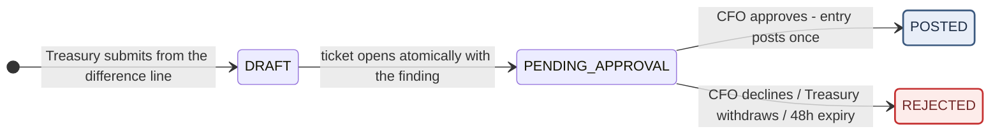

# Reconciliation — Process & Control Narrative

**Audience.** Finance (Treasury and the CFO's office), Compliance Officers, and Internal Audit. This is not a specification for engineers — it explains how daily reconciliation actually works: how runs and cases are produced, what a "break" is, who investigates it, which repairs exist, how each repair moves the books, and what evidence every step leaves behind.

**How to use this.** Sections 1–4 are the mental model; read them once. Section 5 is your day-to-day playbook by role. Section 6 tells you what a customer can see and what you may say to them. Section 7 is the clocks. Section 8 is a reference for the **seven repair verbs** — for each one: what it essentially means, how the accounting moves, and which causes it carries.

**Companion documents.** This completes the operational set begun by *Deposit*, *Withdrawal* and *Swap Processing — Process & Control Narrative*. Those three explain how money moves and where it can be stopped. This one explains how we **prove, every day, that our books match the outside world** — and what happens on the days they don't.

**Scope note.** The **incident register** — the formal process for severe findings such as unauthorized outflows or large unexplained breaks — is deliberately **out of scope** of this edition. Where the flow hands off to it, this document says so and stops. It will be covered separately.

**Environment note.** Threshold figures reflect the current demo configuration. Production values are set by Finance and Compliance and may differ; the mechanics do not. **State names, bucket names and button labels** in this document are the system's own — the same words you see in the admin console and in the audit trail. One demo-specific fact matters enough to state up front: the "bank and custodian statements" being reconciled are fabricated by a demo script; there is no live statement feed yet (Section 9, #1). Everything downstream of the statements — matching, buckets, cases, repairs, approvals, postings — is the real machinery.

---

## 1 The one thing to understand first

**The outside record is authoritative — and the system never guesses why it disagrees with us.**

When our ledger and the bank statement, the custodian balance, or the chain disagree, the outside is right. A break can only ever mean one of three things:

- **our books are wrong** — we booked a wrong amount, a wrong customer, or something that never happened;
- **our books are missing something** — money really moved out there and we never recorded it;
- **the timing hasn't settled** — nothing is wrong, the entry belongs to the next period.

There is deliberately **no "they are wrong" verdict** anywhere in the system — not in the cause menu, not in the audit trail. Even when a difference is visibly caused by the bank's behaviour (say, a fee netted out of an incoming amount), the finding is written as *fact plus our repair* ("bank remitted net of fee; we align our books to the actual amount"), never as blame.

Three further rules complete the mental model:

- **The system finds breaks; a person names causes.** Every morning the engine compares every wallet, line by line, and opens cases. From that point it will not guess. A Treasury officer investigates with outside evidence and picks a cause; the system's whole contribution is three-fold — **boundaries** (repairs that are impossible on a given line are simply not offered), **evidence** (cause and investigation note are captured together and land in the audit trail), and **review** (every repair that moves money passes the CFO).
- **We reconcile every wallet, every line — never totals.** Totals can net two errors into a clean-looking zero. A green day means every individual wallet matched, line by line.
- **No cosmetics.** A case that is explained but not repaired stays red. Putting a break "on hold" records why it exists; it does not make it look resolved. When the numbers genuinely still differ, the honest screen is a red one.

Placed against the three transaction narratives: deposits, withdrawals and swaps are about *controlling money in motion*. Reconciliation is the daily proof that everything they did actually happened in the outside world — and the repair shop, with its own controls, for the days when the proof fails.

---

## 2 The normal path

Most of reconciliation happens with nobody watching:

1. At **02:30 Dubai time**, after the previous day's bank and custodian statements have been ingested, the engine reconciles yesterday.
2. **It checks itself before checking the world.** An internal identity must hold first — customer assets equal customer liabilities in our own ledger. If our own books don't balance, the run stops right there and reports an internal break; we do not compare a broken ledger against the outside. Fail-closed.
3. **Every wallet's balance** is compared against the external record; **every flow** is then matched line by line — exact reference match first, then amount/direction/time-window match, then **in-transit recognition**: an external line with no internal counterpart is checked against unfinished funds orders, because money that is legitimately on its way is not a break.
4. Each wallet lands in exactly one **bucket** (below). Every non-clean wallet gets — or keeps — a **case**.
5. A Treasury officer investigates each difference line with outside evidence, clicks the repair button on the line itself, picks the cause from that repair's menu, and writes the mandatory investigation note.
6. Repairs that move money open a ticket **atomically on submission** and go to the **CFO**. Approval posts the accounting entry — one entry, once, mirrored 1:1 in the ledger.
7. Treasury clicks **Re-reconcile**; the difference zeroes; the case resolves.

Elapsed time when nothing breaks: the run takes minutes and no human touches it.

### The run and its scoreboard

Every execution produces a **run record** — the flow's unit of proof. The Runs page shows, per run:

- a **verdict banner** in plain words ("BREAK — N wallets checked: …") — one glance tells you whether the day is clean;
- the **bucket counts** across all wallets, plus a three-figure case tally: **opened / re-checked / closed** by this run;
- a **per-wallet snapshot, frozen at run time**. Historical numbers never drift: what run RUN20260910-1 says about a wallet is what was true at 02:30 that morning, even after later repairs change the wallet.

Runs are records, not workflow items — nothing "approves" a run. Treasury can also trigger a run manually (and does, after repairs); manual runs are attributed by name in the audit trail, scheduled runs to the system.

### The four buckets

Wallet classification is a pure, mutually exclusive decision — first hit wins. The key quantity is the **residual**: the balance difference minus everything explained by in-transit funds orders.

| Bucket | Meaning | Opens a case? |
|---|---|---|
| **BREAK** | Residual ≠ 0 — after in-transit explanations, a genuine difference remains | Yes |
| **IN_TRANSIT** | Residual = 0 and in-transit lines exist — the difference is fully explained by money legitimately on its way; it will self-heal when the funds order completes | Yes — expected to auto-heal |
| **COMPENSATING** | Residual = 0 but the flows don't actually match — the balance agrees **by coincidence**, with unmatched lines offsetting each other. A false match, treated with the same seriousness as a break | Yes |
| **MATCHED** | Balance agrees and every line paired cleanly | No |

COMPENSATING is the bucket to respect most: it is the engine refusing to be fooled by a clean-looking total — the exact failure mode that reconciling totals (instead of lines) would never catch.

### The case

A **case** is the per-wallet container for everything unresolved:

- **One open case per wallet, ever.** A wallet with three difference lines has one case carrying three lines, not three cases.
- **Born** when a run classifies the wallet into any non-MATCHED bucket; **re-observed** by every subsequent run (the case history records the latest re-check); **auto-healed** — closed by the engine — the first time a run finds the wallet clean again. **Auto-heal is the only way a case closes.** There is no manual close button: a case is resolved by the numbers matching, never by someone declaring it resolved.
- The case detail page shows: the case number and its badges (bucket, severity, **OVERDUE n d** once aging expires, status); a one-sentence conclusion; the account identity (wallet, customer, ledger account, asset and book, business day); a **history strip** — who opened it, when it was last re-checked, its aging; a **balance-explained** summary; and the **difference table** — every unresolved line with its type, direction, amount, external reference, source order (a clickable business number, never an internal id) and its disposition column, where the repair buttons live and where a linked ticket shows as **Explained · ADJ…**.

### The paper trail: two tickets

Every repair rides on one of two ticket types. The one you will see most is the **adjustment**:

**Reading it as an officer:**

- **All three no-posting endings collapse into REJECTED** — a decline, a withdrawal, and a 48-hour expiry are accounting-identical: nothing was posted.
- **REJECTED clears the line's lock but keeps the finding.** The investigated cause and note survive; the repair buttons come back; Treasury can re-open with a corrected ticket or change the finding. Nothing is lost except the ticket.
- **POSTED is forever.** The books only move forward: a wrong posted adjustment is repaired by an opposite adjustment, never by editing. There is no edit, no delete, no un-post — anywhere.

The second ticket is the **internal transfer** — the firm's own money moving to a customer (compensation after a recognised loss; an advance when a recall exceeds the customer's balance): PENDING_APPROVAL → EXECUTING → SUCCESS, with FAILED / REJECTED / CANCELLED as endings. Section 8.7 covers it.

### What each screen calls them

| Object | System state | The screen shows |
|---|---|---|
| Run | (a record — no state) | The verdict banner, bucket counts, opened / re-checked / closed, per-wallet snapshot |
| Case | OPEN / RESOLVED | Open / Resolved, plus bucket and severity badges; **OVERDUE n d** once the aging clock has expired |
| Difference line | (no state — carries a finding) | The repair buttons while unrepaired; a chip such as **Explained · ADJ…** once a ticket is linked |
| Adjustment | DRAFT / PENDING_APPROVAL / POSTED / REJECTED | Same words, in the Adjustments list and on the approval screen |

---

## 3 Where a break can end up

### 3.1 The endings

| Ending | What it means | What was posted | The case |
|---|---|---|---|
| **Auto-healed** | The next run found the wallet clean — typically an in-transit item that arrived | Nothing | Resolves by itself |
| **Explained & posted** | A correction, reversal, record entry, reattribution, write-off or loss recognition was approved and posted | Exactly one adjustment entry | Resolves on re-reconcile |
| **Supplemented through the business rails** | The money was real but never went through our flow — so the flow itself is run (deposit backfill, recall claim, return claim) | Whatever the *business flow* posts; the reconciliation side posts nothing | Resolves on re-reconcile |
| **Held, honestly red** | Cause is known ("next period") or exhausted ("investigating") — and the correct action is to not touch the books | Nothing | **Stays open and red.** This is a feature |
| **Escalated** | The break is severe (e.g. large and unexplainable past its clock) and leaves this flow for formal incident handling | Nothing at the point of hand-off | Out of scope of this document — see the Scope note |

Note what is **not** on this list:

- **There is no waiver and no tolerance band.** Our precision matches our providers' exactly (AED to 2 decimals, USDT to 6), so a genuine "dust" difference cannot exist — and a tolerance band would let one-fils errors accumulate into a write-off. The standing rule: **off by one fils is off; we chase it.**
- **There is no bulk anything.** Every repair is one line, one cause, one note, one ticket, one CFO signature.
- **There is no quiet adjustment.** No path exists that changes a balance without a cause code, an investigation note, and an approval — see Section 4.

### 3.2 Repairs that cannot exist are not offered

The reconciliation equivalent of "refused before it exists": the buttons on a difference line are computed from the line's **cell** (its shape × which book it sits on) and its **accounting facts**. A repair that cannot legally post is simply not rendered:

- a line whose internal source is a **swap** shows no Correction and no Reversal — swaps have no adjustment codes, so the button does not exist rather than erroring when pressed;
- firm-book lines never offer Supplement or Reattribute;
- Write off and Recognize loss do not appear at all until the aging clock has expired *and* the line meets the preconditions (Section 4.6).

If you are looking for a button and cannot find it, the system is telling you that repair is impossible here — check the cell before checking your permissions.

### 3.3 Where a break can stop moving

| It stops in | Who has to move it | How it is found |
|---|---|---|
| **Uninvestigated** — case open, no finding on the line | Treasury | Case list; the case's finding-progress column shows *explained / total* lines |
| **PENDING_APPROVAL** | CFO — and the 48-hour clock guarantees it cannot age silently: expiry auto-rejects | Approval centre |
| **Held · Investigating** | Nobody, until the aging clock expires and unlocks the endgame (Section 4.6) | Case list — the case stays red; **OVERDUE** badge after day 3 |
| **Awaiting compensation** — loss recognised, customer not yet made whole | Treasury (initiate) then CFO (approve) | The marker on the case line stays until the transfer settles |

---

## 4 The gates, in order

### 4.1 The self-check gate

Before comparing anything against the outside, the run proves the internal identity: **customer assets = customer liabilities** in our own ledger. A ledger that cannot balance itself has no business judging a bank statement. Failure aborts the run and surfaces an internal break — fail-closed, loudly.

### 4.2 The repair matrix

Every difference line sits in one of six cells — its **shape** (amount mismatch / we have it, they don't / they have it, we don't) times its **book** (customer money or firm money). The cell, plus the line's accounting facts, fixes the complete set of legal repairs:

| Shape | Book | Repairs offered |
|---|---|---|
| Amount mismatch | Customer | **Correction** (only if the internal source is a deposit or withdrawal) + the two Holds |
| Amount mismatch | Firm | **Record entry**, **Reversal** + Holds |
| We have it, they don't | Customer | **Reversal** (deposit/withdrawal source only), **Reattribute** + Holds |
| We have it, they don't | Firm | **Reversal** (same source rule) + Holds |
| They have it, we don't | Customer | **Supplement**, **Reattribute** + Holds *(this cell also carries the incident-escalation entry — out of scope here)* |
| They have it, we don't | Firm | **Record entry** + Holds |

The two Holds — **Hold · Next period** and **Hold · Investigating** — are available in every cell, because "the honest answer is to leave the books alone" can be true anywhere.

### 4.3 The cause menu

Clicking a repair opens one window: evidence (read-only) → **cause** → system-derived figures (read-only) → **investigation note** (mandatory) → submit.

- The cause menu is the intersection of *this repair* and *this cell*. The registry behind it holds **20 business causes plus "Other"**, and the same code with the same wording appears in four places at once: this menu, the investigation handbook, the audit trail, and the demo answer key. One vocabulary, no translation drift.
- A repair or cause outside the matrix is **refused with an explicit error** even if forced through the API — the menu is a convenience; the matrix is the control.
- **"Unexplained (exhausted)" is a formal cause, not a shrug.** Choosing it requires that the note states what was checked and ruled out. It is also the only cause that later unlocks a write-off — which is exactly why it demands the paper.
- **"Other" is recorded verbatim** — the free-text reason goes into the record as written. It exists so a genuinely novel situation is never squeezed into a wrong code.
- Exactly one cause **carries a machine clue**: a duplicate posting shows its twin (same reference, same amount, already matched). Every other cause is pure human judgement on outside evidence. The investigation handbook (*Reconciliation Investigation Handbook*) tells you, per cause, what evidence to pull and what the test is — this document does not repeat it.

### 4.4 The CFO review

Every ticket that would move money goes to the **CFO, single-step, 48 hours, withdrawable** — adjustments of all five families, all three supplement doors, and internal transfers.

- **The officer never picks accounts.** Debit and credit are derived entirely from *book × direction*; a correction's direction is computed from the sign of (external − internal), with outbound flows sign-flipped so "the bank took more than we booked" correctly *reduces* the customer. The cause code never touches the arithmetic — it exists for evidence, customer wording and gating only.
- The approval screen shows the **consequence in plain words** — what will be posted, to whom, effective when — not a ticket number to be rubber-stamped.
- **Decline, withdrawal, or expiry post nothing** and unlock the line (Section 2). Approval posts **once**, with the **effective date equal to the case's business day**, so the repair lands in the period where the break lives.
- The CFO holds **no ticket-opening permission of any kind** — the console will not let the reviewer be the maker. Self-approval is structurally impossible, not procedurally discouraged.

### 4.5 The gate that keeps reconciliation from minting money

**A credit to a customer's book must anchor an existing order.** If an adjustment would *increase* a customer balance, it must reference the original order (whose screening already ran). A real inflow with no order behind it cannot be repaired by adjustment at all — the only path is **Supplement → deposit backfill**, which builds a genuine inbound signal and runs the *entire* deposit pipeline: KYT screening, compliance verdicts, everything, ending in a normal deposit with the case's business day as its effective date.

This is the single most important compliance property of the flow: **reconciliation can align the books; it can never bypass screening to create spendable money.** The same logic runs in reverse for recalls and returned payouts — the original deposit or withdrawal is re-stated by its own flow (SUCCESS → CLAWED_BACK, SUCCESS → RETURNED), not by a free-form entry. And it is fiat-only by nature: chain transfers do not bounce, so crypto has no recall and no return door.

### 4.6 The aging clock and the write-off locks

Every open case carries one clock: **3 days from the end of its business day**. Expiry sets an **OVERDUE** badge and writes an audit line — the state does not move, and re-observation does not reset the clock. What expiry actually does is **unlock the endgame** for lines already held as *Investigating*:

| Book | Situation | ≤ small-amount line (AED 100.00 / USDT 30.000000) | Above the line |
|---|---|---|---|
| Firm | Unexplained after exhaustive investigation | **Write off** — one P&L entry, CFO approves, case heals | Escalation into the formal incident process — outside this document |
| Customer | Custody is genuinely short | **Recognize loss** — reduces the customer's book to the truth; case heals but the line carries **awaiting compensation** until the customer is made whole | Same — escalation, outside this document |
| Customer | Custody has *more* than we booked | Not a write-off at all — trace the owner and go through **Supplement** | Same |

A write-off needs **four preconditions at once** — case overdue, line held as *Investigating* and not already ticketed, book matched to the write-off cause, amount at or under the line — and the opening screen is a **locked view**: cause fixed, direction and amount read-only. Miss any one and the button simply is not there. One deliberate sharp edge: if an asset's currency has **no registered small-amount line, the check throws an error rather than assuming an answer** — fail-closed, no silent pass.

Why the locks are this heavy: a write-off is the one repair with no story — money is being declared unexplainable. Aging, the small-amount line and the CFO signature are the three locks that keep it from becoming the back door through which differences quietly disappear.

---

## 5 Your playbook

### 5.1 Treasury Officer

**You run this flow end to end.** As of the 2026-09-10 ruling, reconciliation is a two-role flow: Treasury executes, the CFO reviews. Everything below is yours:

| Action | Where | Goes to CFO? |
|---|---|---|
| Trigger a reconciliation run / **Re-reconcile** after a repair | Runs page / case page | No — direct |
| Investigate a line, record a finding, hold a line | Case page, buttons on the difference line | No — holds post nothing |
| Open a correction / reversal / record entry / reattribution | Same buttons — one window to submit | **Yes** |
| The three supplement doors (backfill / recall / return) | **Supplement** on the line | **Yes** |
| Write off / Recognize loss (after aging unlocks them) | Same line, locked view | **Yes** |
| Initiate compensation / advance | Case page, after loss recognition / on the recall line | **Yes** |
| Push a stuck funds-order leg (sync or manual with evidence) | Funds-order detail page | No — but every push is audited |
| ⚡ Fast-forward the aging clock | Case page — **simulation mode only** | No |

**What you cannot do: approve anything.** Not your own tickets, not anyone else's — you hold no approval role, and the SoD engine would refuse a self-approval even if a misconfiguration handed you one.

**Judgement note.** The system will accept any cause inside the matrix; only your investigation makes it the *right* one. The classic trap is the duplicate/phantom pair in Section 8.2 — identical shapes on screen, separated only by outside evidence. Write the note as if a regulator will read it without you in the room, because that is exactly what the audit trail is for.

### 5.2 CFO

**Everything that moves money crosses your desk exactly once:** all five adjustment families, all three supplement doors, and internal transfers. All single-step, all 48 hours, all withdrawable by the maker.

What to actually check, per family, before approving:

| Family | The question the ticket must answer |
|---|---|
| Correction | Does the delta match the outside evidence, and is the direction sensible for the flow's direction? (The system computed it; your check is against the *evidence*, not the arithmetic) |
| Reversal | Is there positive evidence the booking has no outside counterpart (twin found / bank says no such transaction / failure notice on file)? |
| Record entry | Is the statement line genuinely the firm's (interest, charges), not a mislabelled customer item? |
| Reattribution | Are the two cases really two halves of one booking — same day, same asset, same amount, opposite orphans — and is the original order referenced for the side being credited? |
| Write-off / loss recognition | Are all four preconditions visibly satisfied in the locked view — and does the note convince you the investigation was actually exhausted? |
| Supplement | Is this truly money that moved outside our flow — and never a shortcut around a flow that should have run? |
| Transfer | Is the amount the locked figure (recognised loss / statement shortfall) — never a penny more? |

**You cannot open anything.** You hold no ticket-opening permission; the maker–checker split here is structural. If a ticket looks wrong, decline it with a reason — declining posts nothing, costs nothing, and the finding survives for Treasury to correct.

### 5.3 Operations — and everyone else

**Operations has no role in this flow.** Under the 2026-09-10 ruling, the reconciliation pages, the funds-order actions and the aging clock belong to Treasury; Operations retains **read-only visibility of funds orders** and nothing else. If an Operations account can still press any reconciliation button, that is a permissions defect — report it, don't use it.

**MLRO** has no role in the flow as covered here (their involvement begins where a break escalates into the incident process — outside this document's scope). **Senior Management** signs nothing here — there is no large-value line in reconciliation; the CFO *is* the money gate. **Internal Audit** reads everything and touches nothing, as everywhere else.

---

## 6 What the customer sees — and what you may say

### 6.1 The display

Customers never see runs, cases, causes, tickets or the word "reconciliation". What they see is their statement — and only when a repair actually touched *their* money:

| Repair | Customer's statement shows |
|---|---|
| Correction (their book) | **Balance correction** — one line, the adjustment amount |
| Reversal of a duplicate | **Duplicate deposit reversal** |
| Reversal of a phantom booking | **Deposit reversal** |
| Reversal of an unexecuted payout | **Withdrawal refund** |
| Reattribution | **Account correction** — on *both* customers' statements, each seeing only their own side, with the original order referenced where their balance was credited |
| Loss recognition | **Balance adjustment** — followed, once compensation settles, by the compensating credit |
| Deposit backfill | An ordinary deposit, dated to the business day it belonged to |
| Recall / returned payout | The original deposit or withdrawal re-stated by its own flow; for a returned payout the principal comes back, **the fee does not** |
| Record entry, write-off, any firm-book repair | **Nothing.** Firm-book repairs never appear on any customer statement |
| Enforcement money that never reached their balance | **Nothing** — funds held in suspense never produced a statement line in the first place, so their disposal doesn't either. This is a property of the books, not a suppressed display |

Three invisibility rules worth internalising: the customer-facing wording is a **fixed, controlled vocabulary** (the labels above — nothing else can appear); the internal ticket number and your notes **never** reach the customer side — even the free-text "customer note" an officer types stays in the internal record, because the statement always renders the fixed label, not the field; and the two sides of a reattribution **cannot see each other** — neither statement names, or even implies, the other customer.

### 6.2 Why the reticence

A balance correction is an admission that we booked something wrong — the customer is owed the *correction*, not the forensics. Cause codes, case numbers and investigation notes describe our internal failure analysis; the anti-tipping-off discipline of the three transaction flows extends here unchanged. The controlled vocabulary is what makes the discipline enforceable: support staff cannot leak what the screen never shows.

### 6.3 If a customer contacts you about a statement line

| Situation | What you may say |
|---|---|
| "What is this Balance correction?" | Confirm what the line shows: an adjustment of that amount on that date, aligning their balance with the actual banking record. Nothing about causes, cases, or who erred |
| "What is this Account correction?" | Confirm the line. **Never** mention that another customer was involved |
| A recalled deposit ("my money went down") | Confirm the bank recalled the original transfer and the deposit was re-stated accordingly. Direct further questions about *why* to their bank |
| A returned withdrawal | Confirm the payout was returned by the receiving bank and the principal re-credited; the fee is not refunded |
| "Was I under investigation?" — any variant | **Never confirm or deny.** Escalate internally; do not improvise |

> **The rule of thumb is the same as everywhere:** you may always describe what the customer can already see on their own screen. You may never describe anything they cannot.

---

## 7 Timelines

| Clock | Duration | Starts when | On expiry |
|---|---|---|---|
| Daily run | — | **02:30 Dubai time**, reconciling the previous day | — |
| Case aging | **3 days** | End of the case's business day; set once at case opening, never reset by re-observation | **OVERDUE** badge + audit line; unlocks the endgame for eligible lines (4.6). Nothing else moves |
| Approval ticket | **48 hours** | Ticket submitted | Auto-rejected: nothing posts, the line unlocks, the finding survives |

**No clock runs on a held line.** *Hold · Next period* is expected to self-heal at the next period's run; *Hold · Investigating* waits for the aging clock and then for a human. The overdue badge is the only escalation — there are no notifications (Section 9, #5), so **watching the case list is a routine, not an event**.

In simulation mode, the ⚡ **Fast-forward aging** button moves a case's deadline into the past so the day-3 behaviour can be demonstrated in a minute. It moves the clock only — the badge is still set by the sweep, exactly as in production.

---

## 8 The seven repair verbs

For each verb: what it essentially means, how the accounting moves, and which causes it carries. (Debit/credit pairs below are the system's fixed derivations — the officer never chooses them.)

### 8.1 Correction

**What it is.** The transaction is real and stands — only the recorded amount is wrong. A correction does not touch the original booking; it posts **only the difference**, bringing the book to the actual external amount.

**How the books move.** Customer book only (an amount problem on the firm's own book is a Record entry or a Reversal instead). Direction is computed from sign(external − internal), with outbound flows sign-flipped:
- customer balance **reduce** → Dr Client payable / Cr Client asset;
- customer balance **increase** → Dr Client asset / Cr Client payable — and **only with the original order referenced** (Section 4.5).

**Its causes.**

| Cause (menu wording) | When it is the right one |
|---|---|
| Amount misbooked | Entry error on our side — the difference follows no pattern; the receipt shows the true figure |
| Bank fee netted | The channel remitted net of its fee while we booked gross — the difference equals the fee schedule, consistently per channel |
| Rounding difference | The money arrived in full; the difference sits at the smallest precision unit |
| Other | A genuinely novel amount problem — reason recorded verbatim |

### 8.2 Reversal

**What it is.** The booking should not exist at all — nothing (or nothing final) happened outside. A reversal cancels the **entire entry**, not a difference: the book is put back as if the booking had never been made.

**How the books move.** Same book × direction derivations as above, applied to the full original amount. Reversing a booked customer inflow **reduces**; reversing a payout that never executed **increases** (the customer gets their money back). Firm-book reversals move between the firm's own accounts.

**Its causes.**

| Cause | When it is the right one |
|---|---|
| Duplicate posting (twin) | The same real transaction was booked twice — this is the one cause with a machine clue: the matched list holds the twin (same reference, same amount) |
| Phantom posting | No trace outside — bank has no such transaction, chain has no such hash. Same shape as a duplicate, zero clues: pure evidence work |
| Payout not executed | We booked a withdrawal as sent; the bank never executed it (no receipt, or a failure notice). Reversal refunds the customer |
| Firm amount overbooked | The firm's own entry is larger than what actually happened |
| Firm entry error | A firm booking with no external counterpart — mis-entry or internal duplicate |
| Other | Novel — verbatim |

### 8.3 Record entry

**What it is.** The outside is right and we are simply missing an entry — a real item on the firm's own account that was never booked. A record entry creates the missing booking. Firm book only: a missing *customer* inflow is never repaired this way (that is Supplement — Section 8.5).

**How the books move.**
- **Increase** (bank credited us — e.g. interest) → Dr Firm asset / Cr Other income;
- **Reduce** (bank debited us — e.g. charges) → Dr Firm operating funds / Cr Firm asset.

**Its causes.**

| Cause | When it is the right one |
|---|---|
| Bank interest unbooked | The statement line is interest we never recorded |
| Bank charges unbooked | The statement line is a fee or account charge we never recorded |
| Firm amount underbooked | The firm's entry exists but is smaller than the actual movement — the difference is booked |
| Other | Novel — verbatim |

### 8.4 Reattribute

**What it is.** The money is exactly where it should be — in custody, untouched — but recorded under the **wrong customer**. Reattribution moves the *record of ownership*, not the money. It always involves a **pair** of breaks: the wrong customer shows a booking the outside doesn't support, the true customer shows the mirror image. One ticket anchors **both** cases; one re-reconcile heals both.

**How the books move.** Dr wrong customer's Client payable / Cr true customer's Client payable — a liability swap between the two customers. **The asset leg does not move**: custody never changed, only whose money it was. Guards: both sides must share the business day; the side being *credited* must reference the original order (its screening already ran); the counterpart is chosen from system-listed candidates (same day, same asset, same amount, opposite orphan).

**Its causes.** One per side, same label: **Misattributed customer** — on the "we have it, they don't" line of the wrong owner, and on the "they have it, we don't" line of the true owner. The ticket itself is recorded as a customer reattribution.

### 8.5 Supplement

**What it is.** The money is real and it is a **customer's**, but it never went through our flow — so the repair is not an accounting entry at all: it is **running the business flow itself**, with its screening and its own postings. Reconciliation contributes nothing to the books here; it only opens the door and records the link. This is the enforcement arm of Section 4.5: no unscreened money can enter through reconciliation.

**How the books move.** By the business flow, not by adjustment:

| Door (cause on the menu) | What runs | Book effect |
|---|---|---|
| Missed customer deposit | A genuine inbound signal is created and the **full deposit pipeline** runs — KYT, compliance, the works — to a normal SUCCESS, effective on the case's business day | The deposit flow's own postings |
| Deposit recalled | The original deposit is re-stated: SUCCESS → CLAWED_BACK | One entry — Dr Client payable / Cr Client asset. The customer's balance must cover the debit, checked at submission *and* at approval; a shortfall routes to an **advance** (8.7) |
| Payout returned by bank | The original withdrawal is re-stated: SUCCESS → RETURNED | Principal re-credited to the customer; **the fee is not refunded** |

All three are **fiat-only** — chain transfers do not bounce. Rejected, withdrawn or expired supplements leave the original order untouched and can be re-initiated.

### 8.6 Write off / Recognize loss

**What it is.** The ending for the unexplainable: investigation is exhausted, the aging clock has run out, and the amount is small. The firm absorbs the difference and the case closes — the one repair with no story, which is why it sits behind the heaviest locks (four preconditions, locked view, small-amount line, CFO — Section 4.6).

**How the books move.**
- **Firm book, short** → Dr Firm operating funds (a P&L charge) / Cr Firm asset;
- **Firm book, over** → Dr Firm asset / Cr Other income;
- **Customer book (loss recognition)** — only when custody is genuinely **short**, and only downward → Dr Client payable / Cr Client asset. The customer's book now tells the truth; the line carries **awaiting compensation** until the customer is made whole (8.7). A customer-book *surplus* is never written off — it goes through Supplement once the owner is traced.

**Its causes.** Not on any menu — the write-off path opens only on lines previously held as **Unexplained (exhausted)**, and the ticket carries a fixed reason per book: *Unexplained write-off* (firm) or *Client loss recognition* (customer).

### 8.7 Compensation / Advance

**What it is.** Not an adjustment at all — the firm's **own money actually moving** to a customer, as the second half of a two-step promise: first the books tell the truth (loss recognised), then the customer is made whole with real funds. The **advance** is the same instrument pointed the other way in time: fronting a recall shortfall so the recall can proceed, with the customer's shortfall recorded for follow-up (**no receivable is booked**).

**How the books move.** As a real transfer, not an entry: crypto in one leg, fiat in two legs through the settlement account, each leg carried by a funds order and mirrored 1:1 in the ledger as it clears. The custodian's (simulated) statement shows the legs as they submit, so the interim reconciliation sees the money **in transit — not as a fresh break**. Guards: the amount is **locked** (= the recognised loss, or = statement line − customer balance) and cannot be edited anywhere; the firm operating account's balance is re-checked at approval — insufficient funds fail the transfer before any funds order exists; one live transfer per source, ever — a failed, rejected or cancelled one can be re-initiated.

**Its causes.** None — it is not a cause-driven repair. It is initiated from the case (after a loss recognition, or on a shortfall recall line), approved by the CFO like everything else, and linked back to the line it settles.

---

## 9 Current limitations you should know about

These are known gaps in the current build. They affect what you can actually do today.

| # | Limitation | Practical impact |
|---|---|---|
| 1 | **The statements are fabricated.** There is no live bank/custodian statement feed; the demo script writes the external records | Everything downstream is real, but the single most important pre-production build item for this flow is the ingestion pipeline — and until it exists, "the outside record" in this document means the simulated one |
| 2 | **An unclaimed inflow has no return path.** Money arrived that belongs to no known customer and isn't the firm's; industry practice after aging is to return it to the sender. No such exit exists | The line can only sit in *Hold · Investigating*, indefinitely, past its overdue badge |
| 3 | **Reattribution does not re-screen the new owner.** The repair relies on the original order's KYT; no fresh check runs against the customer being credited | If the credited customer is under any cloud, check before approving, not after |
| 4 | **Severity grading is one threshold across assets.** The small-amount line is per-currency; the severity badge is not | A "severe" badge on a USDT case and an AED case are not comparable. Trust the amounts, not the badge colours |
| 5 | **No notifications.** Overdue cases badge and log, but nobody is told | Watching the case list is a standing routine — see Section 7 |
| 6 | **Swap-sourced lines have only the Holds.** No correction or reversal codes exist for swap-sourced differences — deliberately, until a real scenario demands them | A swap-side booking error today parks as *Hold · Investigating* and waits for the code to be introduced |
| 7 | **The case re-check counter reads zero.** A known counting defect; the screen no longer displays the number | Use the run history on the case ("last re-checked") instead |
| 8 | **No manual case closure.** Auto-heal on a clean re-run is the only way a case resolves | Aligned with the no-cosmetics stance — but it also means a case that *should* close can only close by the numbers actually matching |

Open questions currently with Finance:

- Should an aged unclaimed inflow gain a return-to-sender exit (industry practice), and under whose signature?
- Should a recall-shortfall advance create a booked receivable, or is register-only (today's behaviour) the intended stance?
- Should severity thresholds be per-currency, mirroring the small-amount line?

---

## 10 Glossary

| Term | Meaning |
|---|---|
| **Break** | A difference between our ledger and the outside record that survives matching and in-transit recognition. |
| **Run** | One execution of the daily comparison. Produces the verdict banner, bucket counts, case tally and a frozen per-wallet snapshot. A record, not a workflow item. |
| **Bucket** | A wallet's classification by a run: MATCHED, IN_TRANSIT, COMPENSATING, or BREAK — mutually exclusive, first hit wins. |
| **Residual** | The balance difference minus everything explained by in-transit funds orders. Non-zero residual = BREAK. |
| **COMPENSATING** | The false-match bucket: the balance agrees by coincidence while the underlying lines don't pair. Treated as seriously as a break. |
| **Case** | The per-wallet container for breaks. One open case per wallet; re-observed daily; auto-heals when the wallet comes clean — the only way a case closes. |
| **Finding** | The recorded investigation result on one line: cause code + mandatory note + the chosen repair. Overwritable until a ticket links; only ever overwritten, never deleted. |
| **Cause code** | One of 20 registered business causes (plus *Other*). Same code, same wording in the menu, the handbook, the audit trail and the demo answer key. |
| **The five families** | Correction (fix an amount), Reversal (undo a booking that shouldn't exist), Record entry (book a firm item we missed), Reattribution (move a booking to its true owner), Write-off / loss recognition (close the unexplainable, under locks). |
| **The three doors** | The supplement routes: deposit backfill, recall claim, return claim — repairs executed by the business flows themselves, never by adjustment. Fiat-only for recalls and returns. |
| **Hold** | A finding with no posting: *Next period* (timing) or *Investigating* (exhausted). The case stays red — deliberately. |
| **Aging** | The 3-day case clock. Expiry badges the case OVERDUE and unlocks the endgame for held lines. |
| **Small-amount line** | AED 100.00 / USDT 30.000000 — the ceiling for write-off and loss recognition. Above it, the break leaves this flow for formal handling. Unregistered currency → hard error, fail-closed. |
| **Compensation / Advance** | The internal transfer that moves the firm's own money to a customer: compensation after a recognised loss; an advance to front a recall shortfall. Amount locked, CFO-approved, executed as a real transfer with funds-order legs. |
| **Effective date** | Every reconciliation posting is dated to the case's business day — the repair lands in the period where the break lives. |
| **Re-reconcile** | The one-click re-run for a wallet after a repair. Healing is proven by the numbers matching, never asserted by a human. |
| **Minor units** | All internal amounts are integers in the smallest unit (fils, micro-USDT). Statements are normalised on ingestion; screens convert for display. The historic "fake break" was a unit-mixing bug — hence the contract. |

---

*Prepared by Product. Questions on process to Product; questions on obligations to Compliance; questions on accounting policy to Finance.*
*Facts in this document were verified against the codebase at commit `bccd4abd` (2026-09-10) — including the two-role ruling of the same date. Where a statement contradicts a code comment or an older document, this document is the more recent verification.*
