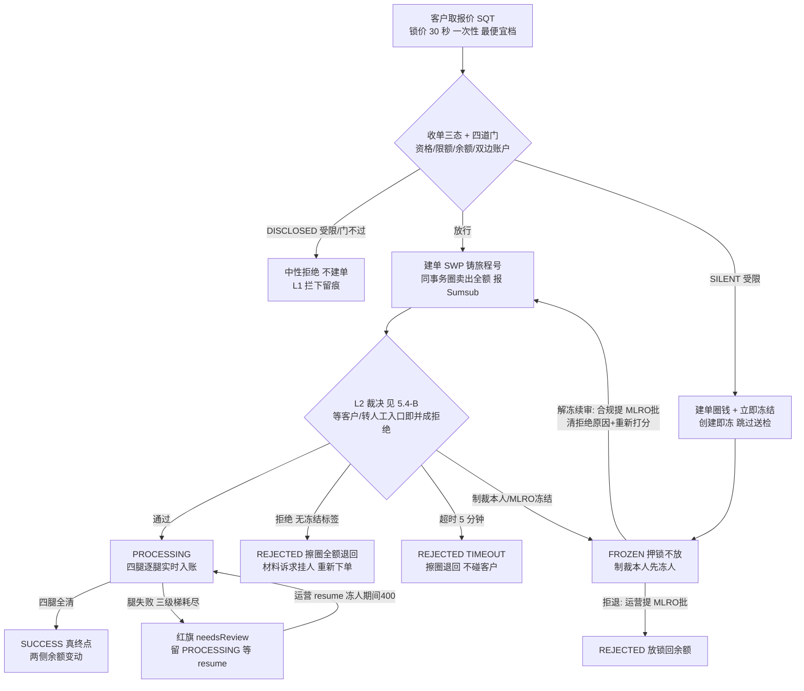

<title>7. 兑换 · Swap v2.0</title>

# **0　变更记录**

| 版本 | 日期 | 修订人 | 变更摘要 |
|-|-|-|-|
| v2.0 | 2026-09-17 | — | **新建文档**：兑换域首篇九模块全量 PRD，取代旧《7. 兑换流程》时代文档（原件保留不改、不再维护，冲突以本篇为准）。对齐代码现状 @ main `4a8b1063`。关键口径：① 状态机 **5 态 / 7 动作 / 7 边**——`FAILED`/`REVERSED` 两个死枚举已物理删除（2026-09-13）；② **FROZEN 翻案为中间态**（2026-09-14）：押锁不放、两条出边（解冻续审 / 拒退），"冻结即退余额、押人不押钱"旧口径作废；③ 人级处置收窄：只有制裁·客户本人才开便签，MLRO 冻结=调查扣审冻单不冻人，软/硬线自动便签退役（粘性静默作为兑换独有保留件不扩散）；④ 收单三态（静默受限客户创建即冻）；⑤ 冻结单客户可见值从"未成功"改为**处理中**（钱押着、结局未定——状态跟着钱走）；⑥ 审计名册现役 **26 码**（波五 +4 冻结双弧码）；⑦ ⚡按钮为三域共享表的 8 键子集。 |

---

# **1　背景与问题陈述**

**兑换管平台内的余额交换（虚拟币 ⇄ 法币），哲学与充值相反**：充值是被动收钱、先收下再处置；兑换是主动交易、**合规点头之前一分钱不动**。客户确认兑换的那一刻，系统只记下"他想换"并圈住卖出侧全额；只有裁决"通过"落地，四条结算腿才一次性实时入账。被拒绝的单，圈擦除、金额回到可用余额——**没发生的交易就该像没发生过**。钱从不离开托管：客户与平台自己对做，没有任何外部对手方。

一笔顺利的兑换是：取报价（30 秒）→ 四道门 → 建单锁卖出全额 → 合规通过 → 四腿清算 → 成功。真实世界的其余情况是：Sumsub 判了制裁命中或 MLRO 要求扣审；要求补料——但兑换等不起；五分钟没有裁决；结算腿卡在半路；以及冻结之后的两难——续审还是拒退。

本篇必须同时解决的矛盾：

- **兑换不能等** —— 它是一个 30 秒的价格承诺，等人签字、等客户补料价格都会烂掉。所以四种裁决被塌缩成两种：干净 → 执行；其余一律拒单，材料诉求挂到**人**身上、客户补完重新下单。
- **批准先于动钱** —— 裁决放行前唯一的账务痕迹是出生锁；一旦执行开始，就没有中途叫停，也没有失败终局。
- **冻结要押得住、也要有出口** —— 押锁不放；解冻续审或拒退，两条路都过 MLRO。
- **超时不迁怒客户** —— 五分钟没裁决是平台的技术问题，只关单、不碰客户。
- **对被调查人零痕迹（tipping-off）** —— 冻结单在客户端与普通在途单逐字不可区分，连筛选器都探测不出。

**范围形态声明**：兑换是账内交换，**没有对手方概念**——制裁·对手方 / PEP·对手方两类场景标签在本域不存在；大额签字门**已裁定不设**（钱不出门 + 自身累计额度天花板，见《交易域总纲》决议三）。

---

# **2　目标**

- **零痕迹拒绝** —— 被拒 / 超时的单：出生圈擦除、金额分毫不差回到可用余额，账本只留圈+擦圈两笔净额为零的证据。
- **押得住的冻结** —— 冻结不放锁；解冻与拒退均须 MLRO 审批，开案人碰不到钱。
- **合规 fail-closed** —— 五分钟无裁决即拒单；漏提交的单重提后拿满完整合规窗口，不误杀。
- **客户端对冻结零信息泄露** —— 冻结与执行中逐字不可区分（状态 / 字段 / 时间线 / 筛选四层）。
- **三查成立** —— 按单号、按客户、按旅程查得到全链留痕（含报价三动作）。

---

# **3　监管依据**

**牌照边界先行**：平台持 VARA **Broker-Dealer（BD）**牌照。兑换全程账内、不涉及虚拟资产转出，**无 Travel Rule 报文义务**（与充值/提现的差异点）。

| # | 义务内容 | 来源锚点 |
|-|-|-|
| R-1 | 对虚拟资产交易进行交易监控与风险评分，命中制裁名单须冻结并报告 | **⚠ 待定：逐条条款号待合规锚定**（CRM Rulebook 交易监控章） |
| R-2 | 不得向被调查主体泄露其正被调查（tipping-off 禁止） | **⚠ 待定：条款号待合规锚定** |
| R-3 | 客户尽职调查资料不足时不得继续业务关系 | CRM Rulebook I.E |
| R-4 | 全部活动留痕并保存 8 年，接受 MLRO 复核 | **⚠ 待定：条款号待合规锚定** |

R-1 / R-2 在模块 5.1 的 FR 表中标 **Must（监管）**，不可被砍。

---

# **4　角色与用例**

## **4.1 主要角色（人）**

| 角色 | 定义 | 目标 | 权限边界 | 频率 |
|-|-|-|-|-|
| 客户 Customer | 在平台开户并兑换的自然人 | 按锁定价把 A 换成 B | 只能看自己的兑换单；冻结对其显示为处理中 | 每日 |
| 运营 Ops Officer | 动钱的手 | 发起冻结拒退；对卡腿单 resume | 无解冻权；冻人期间 resume 被拒（400） | 每日 |
| 合规专员 Compliance Officer | 判是非的口 | 发起解冻续审 | 只能发起、不能自批；兑换无人工复核态，复核动作全在 Sumsub 侧 | 每周 |
| MLRO | 反洗钱报告官 | 冻结双弧的终局裁决 | 解冻 / 拒退的唯一审批人 | 每周 |

兑换是三域里**最自动化**的一条：没有人工复核态、没有运营处置态、没有大额审批门——人只出现在冻结双弧和卡腿恢复上。

## **4.2 次要角色（外部系统）**

| 角色 | 定义 | 与本系统的交互 |
|-|-|-|
| Sumsub（KYT 交易监控） | 交易监控与风险评分 | 接收提交 → webhook 裁决 → 拉 `getTxn` 存证；解冻后接收重新打分请求 |
| 价源（演示=Binance 模拟） | 实时汇率 | 报价引擎取价（3 秒缓存；AED 钉 3.6725） |

**系统本身不是角色。**自动行为在 5.2/5.3 以保留词**「系统（自动）」**表示。

## **4.3 权限包切分（本域动作怎么分给人）**

| 动作 | 权限组 | 出厂持有职务 |
|-|-|-|
| 看兑换单 | `TRADING_SWAP_READ` | 多数后台职务 |
| 建单 / 报价通道、卡腿 resume | `TRADING_SWAP_WRITE` | 运营 |
| 发起冻结拒退 | `SWAP_REFUND_WRITE` | 运营 |
| 发起解冻续审 | `SWAP_UNFREEZE_WRITE` | **合规专员**（运营刻意不持有） |

**切分理由**：与充值提现同一条线——解冻（推翻一次冻结）是合规判断，动钱（拒退、推腿）归运营；两弧开案人都碰不到钱，执行只在 MLRO 批准后由系统完成。兑换的"放行"没有任何我方权限组——**进入执行态的唯一通道是 L2 放行**。

## **4.4 用例清单**

| 编号 | 角色 | 用例 |
|-|-|-|
| UC-1 | 客户 | 取报价（30 秒倒计时）、确认兑换，直至两侧余额变动或被拒退回 |
| UC-2 | 客户 | 被要求补料后，在个人验证页补交材料、重新取价下单 |
| UC-3 | 合规专员 + MLRO | 对冻结单发起解冻续审 |
| UC-4 | 运营 + MLRO | 对冻结单执行拒退（放锁回余额） |
| UC-5 | 运营 | 对结算卡住的红旗单 resume 重推 |

## **4.5 关键用例展开**

**UC-3　解冻续审**

| 字段 | 内容 |
|-|-|
| 主要角色 | 合规专员（发起）+ MLRO（审批） |
| 前置 | 兑换单处于 `FROZEN`（押锁中） |
| 触发 | 调查结论为误伤 / 可续审 |
| 主成功场景 | 1) 合规在冻结单上发起解冻 → 系统开审批案（开案不动单）；2) MLRO 批准 → 单回 `COMPLIANCE_PENDING`、清除拒绝原因，系统对同一笔 Sumsub 交易**请求重新打分**（失败只告警不回滚）；3) Sumsub 异步回新裁决，按正常链路落地——通过则执行、再拒则按新裁决处置 |
| 异常流 2a | MLRO 驳回 → 单留 `FROZEN`，锁不动 |
| 后置-成功保证 | 单重新获得完整裁决机会；锁全程未动 |
| **后置-最低保证** | 冻结期间钱押着不放；解冻不是放行——放行仍只能来自新的 L2 裁决 |

**UC-4　冻结拒退**

| 字段 | 内容 |
|-|-|
| 主要角色 | 运营（发起）+ MLRO（审批） |
| 前置 | 兑换单处于 `FROZEN` |
| 触发 | 调查结论为不放行 |
| 主成功场景 | 1) 运营发起拒退 → 开审批案；2) MLRO 批准 → 单落 `REJECTED`，**出生圈擦除、卖出全额回到可用余额** |
| 后置-成功保证 | 客户余额恢复到建单前；账本留圈+擦圈配对痕迹 |
| **后置-最低保证** | 不存在"单已拒、钱还圈着"的中间态 |

## **4.6 角色 × 子流程矩阵**

| 子流程 | 客户 | 运营 | 合规专员 | MLRO |
|-|-|-|-|-|
| 报价与建单 | 执行 | — | — | — |
| 补料（挂人）与重新下单 | 执行 | — | — | — |
| 解冻续审 | — | — | **发起** | **审批** |
| 冻结拒退 | — | 发起 | — | **审批** |
| 卡腿 resume | — | 执行（冻人期间被拒） | — | — |

**职责分离**：**解冻发起（合规）与拒退发起（运营）分开；两弧开案人碰不到钱；审批 48 小时时效、可撤回；放行本身无人可批——只有 L2。**

---

# **5　功能需求**

## **5.0 部件清单**

| 实体 | 在本流程扮演什么 | 归属文档 | 本文档只写什么 |
|-|-|-|-|
| 兑换单 SwapTransaction | 主线单据，状态机主体 | **本篇** | 全部 |
| 兑换报价单（`SQT`） | 锁价（市场价+点差+服务费）30 秒 | 《5. 交易费率等级》 | 接缝：一次性、关闭即取消、最便宜档 |
| Sumsub 交易与裁决 | 外部合规判断（L2） | 《交易合规裁决》 | 裁决 × 本域状态 → 迁到哪（5.4-B）；塌缩定则 |
| L1 十项闸 | 我方准入判断，兑换 9/10（无大额门） | 《交易域总纲》§3.1 | 失败=中性拒绝留 `SWAP_L1_BLOCKED` 痕 |
| 资金单（四条结算腿，`FDO`） | 卖出 / 结转 / 买入 / 费四腿的执行凭证 | 《2. 资金单》 | 接缝：腿 1 圈的特殊性、三级梯与 resume |
| 账本 Ledger | 记账落点 | 《1. 账本与记账》 | 5.8 资金动线（腿 → 科目方向） |
| 审批单 ApprovalCase | 解冻 / 拒退的载体 | 《权限与审计》 | 接缝：谁提谁批 |
| 材料请求单 / 限制便签 | 补料挂**人**（不挂单、不附便签）；人级处置落点 | 《交易合规裁决》§7/§8 | 接缝：塌缩后如何登记 |

兑换**没有**对账伸入边——钱从未离开托管，外面没有人能把它退回来；`SUCCESS` 是三域唯一的真终点。

## **5.1 功能清单**

| FR | 需求（系统应…） | 级别 |
|-|-|-|
| FR-1 | 建单必须消费一张**有效**的兑换报价（`SQT`，锁市场价+点差+服务费，按客户费率受众取**总费最低档**）；**30 秒**懒过期、一次性（提交即作废、被拒不退还）、关闭确认框即取消；三动作留痕 | Must |
| FR-2 | 四道门全过才建单、才耗报价：资格（L1 快照 9/10）、限额（单笔+周期累计，AED 估值快照落单）、余额（卖出侧足额）、双边收款账户（买卖两侧都有账户，缺哪侧提示先去开） | Must |
| FR-3 | 建单**同事务**圈住卖出侧全额（出生锁=腿 1 首次尝试的圈，建腿时不再重复画）；此前零记账 | Must |
| FR-4 | **塌缩定则**：等客户 / 转人工两种裁决在入口一律并成拒绝——兑换没有"等"的语义；材料诉求登记到**人**身上（不附任何限制便签），客户补完料重新取价下单 | Must |
| FR-5 | 裁决通过 → 进入执行并逐腿实时入账（卖出 / 结转 / 买入 / 费四腿）；**执行开始后没有中途叫停**（无冻结入边）、没有失败终局 | Must |
| FR-6 | 冻结判据只认两条：场景标签=制裁·客户本人，或处置标签=MLRO 冻结（调查扣审）——**对手方命中不冻单**（无对手方概念）；制裁·本人**先冻人、再冻单**；MLRO 冻结与无标签拒绝**不碰客户** | **Must（监管 R-1）** |
| FR-7 | `FROZEN` 押锁不放（中间态）；两条出边均须 MLRO 单步审批（48h）：解冻续审（合规发起 → 回等合规、清拒绝原因、请求 Sumsub 重新打分）/ 拒退（运营发起 → 落已驳回、放锁回余额） | **Must（监管 R-1）** |
| FR-8 | 被拒 / 超时的单**擦圈全额退回**，账本留圈+擦圈两笔净额为零的证据（锁定与解锁严格配对，配对对象是终局） | Must |
| FR-9 | SLA 仅一格：等裁决 **5 分钟硬**超时 → 拒单（`TIMEOUT`），**不做任何客户处置**；扫描每 30 秒；**从未提交成功的单**（漏提交）扫描时先重试提交，成功后把死线**重新拉满一个完整窗口** | Must |
| FR-10 | 结算腿失败自动重试，耗尽后单留执行中 + 红旗（needsReview）等运营 resume——**兑换刻意没有失败终态**；客户被冻结期间 resume 被拒（400），解除限制后自动放行 | Must |
| FR-11 | 客户级冻结广播碰到执行中的单**只落旗与审计、不打断结算**（原地冻）；管理台以独立的"客户被冻"徽章与"技术卡单"红旗分开展示（派生值，不落库，随解冻自动消失） | Must |
| FR-12 | 客户端状态走 4 态白名单（等合规 / 执行中 / 成功 / 已驳回原样；**冻结收敛为等合规**——钱押着就显示处理中）；`completedAt` 只在成功 / 已驳回输出；筛选按收敛值反向展开，`?status=FROZEN` 探测不到；冻结单时间线与普通在途单逐字不可区分 | **Must（监管 R-2）** |
| FR-13 | 收单三态：静默受限客户报价与建单放行、建单后立即冻结（创建即冻，跳过提交 Sumsub）；明示受限客户中性拒绝 | **Must（监管 R-2）** |
| FR-14 | 迟到裁决不驱动状态机：执行中 / 终态上记录（`SWAP_POST_APPROVAL_VERDICT`+红旗），且**拒绝类照样跑人级处置**（终态不豁免冻人）；冻结态上只落忽略取证（**已知缺口：此处不回填人级限制**，见模块 8 G-1） | **Must（监管 R-1/R-4）** |
| FR-15 | 粘性静默（兑换独有保留件，不扩散）：被制裁硬线处置过的客户，补料入口永久静默；其材料即便审过也不自动解限，只记"看到通过但按规矩没动作"（`SWAP_ACTION_GREEN_HARDLINE_HELD`） | **Must（监管 R-2）** |
| FR-16 | 建单铸旅程号全链继承；时间线操作者语义化（`SUMSUB_KYT` / `LEG_SETTLEMENT` / `RESTRICTION_BROADCAST` / `SLA_SWEEP`）；三查成立 | **Must（监管 R-4）** |
| FR-17 | 仿真模式提供三域共享表的 **8 键子集**（缺对手方两键与处置标签键，各有结构性理由，见 5.9） | Should |

## **5.2 端到端流程**

图管全貌，具体值与副作用只活在 5.3 / 5.4 的表里。

## **5.3 状态机（5 态 / 7 动作 / 7 边）**

### **5.3.1 状态定义**

| 状态 | 含义 | 资金位置 | 客户可见 | 计时（SLA） | 终态 |
|-|-|-|-|-|-|
| `COMPLIANCE_PENDING` | 合规审查中（出生态） | 卖出全额圈定 | 是（处理中） | **5 分钟硬** → 拒单 |  |
| `PROCESSING` | 执行中（四腿结算） | 逐腿划转中 | 是（处理中） | 不计时（腿三级梯+红旗） |  |
| `FROZEN` | 制裁 / MLRO / 创建即冻 | **押锁不放** | **收敛为处理中** | 不计时（刻意） |  |
| `SUCCESS` | 已成交 | 两侧余额已变动 | 是 | — | ✓（真零出边） |
| `REJECTED` | 已驳回（拒绝 / 超时 / 拒退） | **圈已擦除、全额退回** | 是（未成功） | — | ✓（真零出边） |

**枚举即状态**：`FAILED` / `REVERSED` 两个不可达死值已于 2026-09-13 物理删除（管理台 Exception 筛选组随之少两个永远筛不到的选项）。

### **5.3.2 跃迁表（7 条）**

信封：每次跃迁写状态历史与审计（从/到、成因、操作者语义标签、旅程号）。

| T | 起始 | 动作 | 目标 | 触发条件 | 副作用 |
|-|-|-|-|-|-|
| T-01 | `COMPLIANCE_PENDING` | `KYT_APPROVED` | `PROCESSING` | 系统（自动）：裁决通过 | 开始四腿逐腿实时入账（腿 1 的圈出生时已画，首腿只落笔不重复画圈）；审计 `SWAP_KYT_APPROVED` |
| T-02 | `COMPLIANCE_PENDING` | `KYT_REJECTED` | `REJECTED` | 系统（自动）：裁决拒绝（含入口被塌缩的等客户 / 转人工） | **擦圈全额退回**；材料诉求登记到人（不附便签）；仅制裁·本人开便签；审计 `SWAP_KYT_REJECTED`（处置结果另记 `SWAP_KYT_REJECTED_DISPOSED`） |
| T-03 | `COMPLIANCE_PENDING` | `SLA_BREACH` | `REJECTED` | 系统（自动）：等裁决超 5 分钟 | 擦圈退回；`rejectReason=TIMEOUT`；**不做客户处置**；审计 `SWAP_SLA_BREACHED` |
| T-04 | `COMPLIANCE_PENDING` | `FREEZE` | `FROZEN` | 系统（自动）：制裁·本人 / MLRO 冻结标签 / 创建即冻 / 客户级广播 | **押锁不放**；制裁·本人先冻人；审计 `SWAP_FROZEN` |
| T-05 | `PROCESSING` | `SUCCESS` | `SUCCESS` | 系统（自动）：四腿全部清算完成 | 两侧余额落定；审计 `SWAP_SUCCEEDED` |
| T-06 | `FROZEN` | `RESUME` | `COMPLIANCE_PENDING` | 系统（自动）：解冻审批（合规提、MLRO 批）通过 | 清 `rejectReason`；请求 Sumsub 对同笔交易重新打分（失败只告警）；审计 `SWAP_UNFROZEN` |
| T-07 | `FROZEN` | `REJECT_REFUND` | `REJECTED` | 系统（自动）：拒退审批（运营提、MLRO 批）通过 | **放锁回可用余额**；审计 `SWAP_REFUNDED` |

### **5.3.3 约束**

- **`PROCESSING` 刻意没有冻结入边**——钱已经在动，中途冻结会造半截账；冻人广播碰到执行中的单只落旗与审计（`SWAP_LEG_HALTED_BY_RESTRICTION` 语义），不打断结算。
- **兑换刻意没有失败终态**——腿失败是临时状态（三级梯 + 红旗 + resume），"一笔已执行交易失败到一半"回答不了钱在哪。
- **锁定与解锁严格配对（对象是终局）**：`REJECTED` 必然伴随擦圈 / 放锁；`FROZEN` 不是终局、不放锁。
- **四个 FROZEN 判据常量答案刻意不同**（本域最易做错处）：迁移表——FROZEN 有两条出边；材料请求终态集——**不含** FROZEN（防撕材料卡片泄密）；冻结扫描排除集——**含** FROZEN（已冻无需再捞）；客户面白名单——**不含** FROZEN（收敛为等合规）。
- **守则单测锁边数 7**。

## **5.4 判定决策表**

**5.4-A　建单四道门（全过才建单、才耗报价）**

| # | 门 | 不过的表现 |
|-|-|-|
| A1 | 资格（L1 快照 9/10，含资产可用、客户限制） | 中性拒绝；`SWAP_L1_BLOCKED` 留痕（主体=客户，无单号） |
| A2 | 限额（单笔上下限 + 周期累计，AED 估值快照落单） | 中性拒绝，提示额度 |
| A3 | 余额（卖出侧足额——建单前就查，防止合规通过后建腿才发现没钱、单子卡死中途） | 中性拒绝 |
| A4 | 双边收款账户（买卖两侧都要有） | 提交被禁 + 引导先去开户 |

**5.4-B　裁决落地（塌缩后只有三分支）**

| # | 裁决（入口归一后） | 标签 | → 我方 |
|-|-|-|-|
| B1 | 通过 | （不读标签） | `PROCESSING` 四腿入账 |
| B2 | 拒绝（含被塌缩的等客户 / 转人工） | 制裁·客户本人 | **先冻人、再冻单** `FROZEN` |
| B3 | 拒绝 | MLRO 冻结 | 冻单 `FROZEN`，**不冻人**（调查扣审） |
| B4 | 拒绝 | 其它 / 无标签 | `REJECTED` 擦圈退回，**不碰客户**；带可补材料时登记补料请求挂人 |

**迟到裁决（不在等合规态上）**：执行中 / 成功 / 已驳回 → 记录 + 红旗，拒绝类**照样跑 B2~B4 的人级部分**（终态不豁免冻人）；冻结态 → 只落忽略取证（**不回填人级**，已知缺口 G-1）。

**5.4-C　收单三态**：与充值篇 5.4-D 同一判据（静默受限 → 建单圈钱、立即冻结、跳过送检；明示受限 → 中性拒绝）。

## **5.5 数据要求与双端可见性**

**金额最小单位存储。单号**：兑换单 `SWP`、报价 `SQT`、资金单 `FDO`；建单铸旅程号全链继承。

**业务级字段（本篇专有）**：

| 字段 | 含义 | 谁写 |
|-|-|-|
| `quoteNo` / 费率档与费用明细 | 消费的报价号、命中档位、逐项费 | 建单时（快照，不随后续费率变动） |
| `fromAmount` / `toAmount` / 汇率与点差 | 兑换两侧与定价事实 | 建单时 |
| `sumsubTxnIdOut` / `sumsubVerdict` / 报文存证 | L2 侧真相 | 提交与 webhook 时 |
| `rejectReason` | 拒绝成因（含 `TIMEOUT`）；解冻时清空 | 系统 |
| `needsReview` | 腿卡死红旗 | 系统 |
| `slaDeadline` | 合规死线（漏提交重提后重新拉满） | 系统 |
| `ownerRestricted`（派生，不落库） | 管理台"客户被冻"徽章判据 | 读时计算，customerScope 不带 |

**双端可见性表**（客户侧：4 态白名单——等合规 / 执行中 / 成功 / 已驳回原样；**冻结收敛为等合规**；`completedAt` 只在成功 / 已驳回输出；筛选按收敛值反向展开）：

| 我方状态 | 客户看到 | 管理台看到 | 说明 |
|-|-|-|-|
| `COMPLIANCE_PENDING` / `PROCESSING` | PROCESSING | 真实状态 + 腿进度 | |
| **`FROZEN`** | **PROCESSING（与在途单逐字不可区分：状态 / 字段 / 时间线 / 筛选四层）** | 真实状态 + `CUSTOMER_FROZEN` 徽章（人被冻）与 `needsReview`（技术卡单）分开 | **刻意不一致：tipping-off（FR-12）**——钱押着就显示处理中（2026-09-14 起，不再显示"未成功"） |
| `SUCCESS` | SUCCESS（断言句措辞 You sold / Net received） | 真实状态 | |
| `REJECTED` | DECLINED（未成交单一律降级中性词 Quoted amount——钱没到账不能断言"已收到"） | 真实状态 + 拒绝成因 | 擦圈后客户看得见余额回来 |

## **5.6 审计事件（26 码封闭名册）**

信封（主体/操作者语义标签/旅程号/从-到）每条均记；失败不起名；扩码同步名册数。

| 组 | Action 常量 | 触发时机 |
|-|-|-|
| 出生与闸（2） | `SWAP_CREATED` / `SWAP_L1_BLOCKED` | 建单；门前拦下（主体=客户） |
| 裁决（6） | `SWAP_KYT_SUBMITTED` / `SWAP_KYT_APPROVED` / `SWAP_KYT_REJECTED` / `SWAP_KYT_REJECTED_DISPOSED` / `SWAP_KYT_VERDICT_IGNORED` / `SWAP_POST_APPROVAL_VERDICT` | 送检、通过、拒绝与处置结果、冻结态忽略取证、执行中/终态迟到裁决记录 |
| 冻结双弧（5） | `SWAP_FROZEN` / `SWAP_UNFREEZE_REQUESTED` / `SWAP_UNFROZEN` / `SWAP_REFUND_REQUESTED` / `SWAP_REFUNDED` | 冻结落地；解冻与拒退的开案与落地（带审批号、因果链） |
| 结算腿（5） | `SWAP_LEG_POSTED` / `SWAP_LEG_RETRIED` / `SWAP_LEG_STUCK` / `SWAP_LEG_RESUMED` / `SWAP_LEG_HALTED_BY_RESTRICTION` | 逐腿落账、三级梯、红旗、resume、冻人广播拦腿 |
| 终局与粘性（2） | `SWAP_SUCCEEDED` / `SWAP_ACTION_GREEN_HARDLINE_HELD` | 成交；粘性静默客户材料通过但按规矩不动作 |
| SLA 与演示（3） | `SWAP_SLA_BREACHED` / `SWAP_SLA_TIMEOUT_SIMULATED` / `SWAP_DEMO_SCENARIO_RUN` | 超时拒单与⚡ |
| 报价（3） | `SWAP_QUOTE_CREATED` / `SWAP_QUOTE_USED` / `SWAP_QUOTE_CANCELLED` | 报价三动作（按 `SQT` 号可查全链） |

## **5.7 配置面（配置边界表）**

| 参数 | 出厂值 | 可调范围 / 生效 | 不许调什么 | 谁有权改 |
|-|-|-|-|-|
| 报价 TTL | **30 秒** | 代码常量——兑换"不能等"的物理根因，调宽等于改产品性格 | 一次性消费；关闭即取消 | — |
| 单笔 / 累计限额 | 五币种上下限；BASIC 日 10 万/月 100 万、PREMIUM 日 100 万/月 1000 万（AED） | 配置行，改动走限额审批 | 维度；累计天花板是"不设大额门"裁定的前提，砍掉须重开该议题 | 限额审批链 |
| SLA | 5 分钟（唯一一格，硬） | 代码常量（2026-08-21 由 60 秒调宽对齐三域） | 超时只关单不碰客户；漏提交重提必须拉满整窗 | — |
| 大额签字门 | **无——已裁定不设**（业主 2026-09-12） | 不再评估 | — | — |
| 审批链 | 解冻 / 拒退均 MLRO 单步 48h | 审批策略为配置 | **硬门清单：两弧不许配成免审；maker≠checker**；冻结落地免审批（保护动作）不许加审 | 审批策略治理 |

## **5.8 资金动线**

出生圈是 **TB pending 一笔**（卖出全额），不是分录。科目用 COA 真名，逐腿借贷组合的权威在《1. 账本与记账》，本表锁"腿 → 钱的走向"：

| 跃迁 / 腿 | 动什么 | 科目落点 |
|-|-|-|
| 建单出生圈 | 圈住卖出全额 | pending 锁（客户卖出侧可用余额当场减少） |
| T-01→T-05 腿 1 卖出 | 客户卖出侧划出（圈转实扣） | 客户应付 `CLIENT_PAYABLE`（卖出币）→ 运营对手盘 `FIRM_OPS` |
| 腿 2 结转 | 对手盘两币种对倒（点差留在对手盘——点差不单独立户记账，已永久否决） | `FIRM_OPS` 内部 |
| 腿 3 买入 | 客户买入侧划入 | `FIRM_OPS` → 客户应付 `CLIENT_PAYABLE`（买入币） |
| 腿 4 费 | 服务费 / 合规费 | 客户侧 → 兑换手续费收入 `INCOME_SWAP_FEE` |
| T-02 / T-03 / T-07 拒绝·超时·拒退 | **擦圈**，全额回可用余额 | void（账本留圈+擦圈两笔，净额为零） |
| T-04 冻结 / T-06 解冻 | **零记账**，圈保持原样 | — |

## **5.9 演示装置（⚡仿真裁决按钮，三域共享表的 8 键子集）**

| 按钮 | 兑换预期去向 |
|-|-|
| ① Approved | `PROCESSING` 四腿入账 |
| ② / ③ / ⑤ Awaiting user（含 PEP·客户本人 / 多条材料） | **并入拒绝**：`REJECTED` 擦圈 + 材料挂人 |
| ⑥ On hold | **并入拒绝**：`REJECTED` 擦圈 |
| ⑦ Rejected · Sanctions（客户本人） | **先冻人再冻单** `FROZEN` |
| ⑨ Rejected · MLRO freeze | 冻单 `FROZEN`（不冻人） |
| ⑪ Rejected · no tag | `REJECTED` 擦圈，不碰客户 |

**缺三键各有结构性理由**：④/⑧（PEP / 制裁·对手方）——兑换是账内换币，没有对手方；⑩（处置标签）——充值退回 / 提现终局拒绝是拒绝裁决**自带**的处置标签，兑换的解冻 / 拒退是冻结**之后**单独发起的 maker-checker 审批，不是标签，两者不是一回事。**材料复核（GREEN/RED）不在这张表里**——那是另一个 webhook，入口在客户详情页 Verification Requests 区块，三域共用。SLA 超时另有拨钟工具。

---

# **6　范围与非目标**

**范围**：单笔客户兑换从「取报价」到「成功 / 已驳回」的全部路径（含四道门、塌缩定则、冻结双弧、卡腿恢复、客户端展示与审计）。

1）**定价机制与费率档位治理**（价源、点差、受众谓词）—— 见《5. 交易费率等级》与《3. 财务配置》，本篇只写消费接缝。
2）**Travel Rule** —— 兑换全程账内，无转账、无 TR 义务（这是与充值提现的结构差异，不是缺口）。
3）**资金单状态机与记账引擎** —— 见《2. 资金单》《1. 账本与记账》。
4）**审批流的角色/权限模型** —— 见《权限与审计》。
5）**Sumsub 裁决机制层** —— 见《交易合规裁决》（塌缩定则的机制位置：webhook 入口归一表）。
6）**充值与提现** —— 相邻流程。
7）**客户通知** —— 全域缺口，归《交易域总纲》G1。

**非目标 ≠ 缺口。**已知未做完的一律进模块 8。

---

# **7　验收标准**

**A 组　报价与四道门（FR-1/2，5.4-A 全 4 行）**

□ AC-1　无有效报价建单 → 拒绝；消费后重放 → 拒绝；被拒单的报价不退还
□ AC-2　**边界：第 30 秒整报价过期**（懒判定）；关闭确认框 → 立即取消并留痕
□ AC-3　同资产对多档命中 → 取总费最低档；报价明细含市场价、点差、逐项费
□ AC-4　卖出侧余额不足 → 建单前被拒（不进合规）
□ AC-5　缺买入侧收款账户 → 提交被禁 + 开户引导
□ AC-6　超单笔上限 / 周期累计 → 中性拒绝；AED 估值快照落单
□ AC-7　L1 拦下（未建单）留 `SWAP_L1_BLOCKED`，主体=客户

**B 组　出生锁与零痕迹拒绝（FR-3/8，T-02/03）**

□ AC-8　建单瞬间卖出侧可用余额减少全额；同一笔钱再发提现被余额门拦下
□ AC-9　裁决拒绝 → `REJECTED`，**擦圈全额退回分毫不差**，账本留圈+擦圈净额为零
□ AC-10　超时拒单 → 同上，且 `rejectReason=TIMEOUT`、**客户身上零处置**
□ AC-11　被拒单在账本上除圈+擦圈外零分录

**C 组　塌缩定则（FR-4，5.4-B）**

□ AC-12　等客户裁决 → 入口即并成拒绝：`REJECTED` + 材料请求登记到人、**不附任何限制便签**
□ AC-13　转人工裁决 → 同上并成拒绝
□ AC-14　客户补完料重新取价下单 → 新单新价走全新流程

**D 组　冻结与双弧（FR-6/7，T-04/06/07）**

□ AC-15　拒绝+制裁·客户本人 → 先冻人（便签已开）再冻单；圈保持
□ AC-16　拒绝+MLRO 冻结 → 冻单不冻人
□ AC-17　拒绝无标签 → `REJECTED`，客户不受限（2026-09-14 前会挂便签，已收窄）
□ AC-18　解冻批准 → 回 `COMPLIANCE_PENDING`、`rejectReason` 清空、已请求重新打分；新裁决按正常链路落地
□ AC-19　拒退批准 → `REJECTED` + 放锁回余额，客户余额当场恢复
□ AC-20　两弧开案后单据状态不变；开案人自批被拒；运营发起解冻 → 无权限
□ AC-21　冻结态收到迟到裁决 → 只落 `SWAP_KYT_VERDICT_IGNORED`（G-1 的现状取证）
□ AC-22　执行中 / 终态收到迟到制裁裁决 → 记录+红旗，**人级处置照跑**（终态不豁免冻人）

**E 组　执行与卡腿（FR-5/10/11，T-01/05）**

□ AC-23　通过 → 四腿逐腿实时入账 → `SUCCESS`，两侧余额变动，四腿 `CLEARED`，恒等式通过
□ AC-24　腿失败三次 → 单留 `PROCESSING` + 红旗，无半截终态
□ AC-25　运营 resume → 腿重推成功后红旗消失
□ AC-26　客户被冻期间 resume → 400（`SWAP_CUSTOMER_RESTRICTED`）；解除限制后放行
□ AC-27　冻人广播碰到执行中的单 → 状态不变、结算不断、落旗与审计；管理台"客户被冻"徽章出现、解冻后自动消失

**F 组　SLA（FR-9，T-03）**

□ AC-28　等裁决超 **5 分钟** → 拒单；**边界：第 4 分 59 秒收到裁决 → 正常落地**
□ AC-29　漏提交的单被扫描发现 → 先重试提交，成功后死线重新拉满一个完整窗口（不被下一轮扫描误杀）

**G 组　客户端信息隔离（FR-12/13/15）**

□ AC-30　`FROZEN` 单客户端与 `COMPLIANCE_PENDING`/`PROCESSING` 在途单逐字不可区分（状态 / 字段 / 时间线）
□ AC-31　`?status=FROZEN` 探测 → 按收敛语义返回，无泄露；DevTools 读不到白名单外状态
□ AC-32　冻结单 `completedAt` 恒为空（即便行上意外带值也不透传）
□ AC-33　静默受限客户报价与建单放行、建单即冻、跳过送检；客户全程只见处理中
□ AC-34　明示受限客户 → 中性拒绝，不建单
□ AC-35　未成交单详情措辞全为中性词（Quoted amount），成交单才用断言句
□ AC-36　粘性静默客户材料审过 → 限制不自动解除，落 `SWAP_ACTION_GREEN_HARDLINE_HELD`

**H 组　审计与三查（FR-16）**

□ AC-37　顺利单审计链 `SWAP_CREATED → SWAP_KYT_SUBMITTED → SWAP_KYT_APPROVED → SWAP_LEG_POSTED×4 → SWAP_SUCCEEDED` 顺序完整
□ AC-38　时间线操作者为语义标签（SUMSUB_KYT / LEG_SETTLEMENT / RESTRICTION_BROADCAST / SLA_SWEEP），无裸 SYSTEM
□ AC-39　全链留痕（含报价三动作、审批、腿、忽略档）同旅程号；三查成立

**覆盖对账**

- **FR 覆盖**：FR-1→AC-1/2/3｜FR-2→AC-4~7｜FR-3→AC-8｜FR-4→AC-12/13/14｜FR-5→AC-23｜FR-6→AC-15/16/17｜FR-7→AC-18/19/20｜FR-8→AC-9/10/11｜FR-9→AC-28/29｜FR-10→AC-24/25/26｜FR-11→AC-27｜FR-12→AC-30/31/32｜FR-13→AC-33/34｜FR-14→AC-21/22｜FR-15→AC-36｜FR-16→AC-37/38/39｜FR-17 不设独立验收。
- **跃迁覆盖**：T-01~T-07 逐条被 B/D/E/F 组覆盖。
- **决策表覆盖**：5.4-A 四行→AC-4~7｜5.4-B 四行+迟到规则→AC-12/15/16/17/21/22｜5.4-C→AC-33/34。
- **未验收项**：模块 8 各 G 按「未实现的不写验收」不设 AC。

---

# **8　待决问题**

**8.1 待决策 Q（等人拍板）**

| 编号 | 问题 | 类型 | 影响 | 等谁 |
|-|-|-|-|-|
| Q-1 | 冻结单长期无人处置怎么办：FROZEN 刻意不计时（与充提对齐），调查扣审"天然限时"目前只靠人盯冻结列表——要不要给冻结加一格软 SLA（只标红催办） | 业务口径 | 决定冻结列表的例行盯法是否要系统辅助 | 业主 + 合规 |

**8.2 已知缺口 G（等实现，真相源 `BACKLOG.md` / 《交易合规裁决》§10）**

| 编号 | 缺口 | 影响 |
|-|-|-|
| G-1 | **冻结态上的迟到制裁裁决不回填人级限制**（执行中 / 终态会照跑，唯独冻结守卫早退只记审计）——《交易合规裁决》G2 同源 | "单因广播先冻、本单制裁裁决后到"的场景漏掉冻人这一笔 |
| G-2 | **KYT 规则自动裁决未真机验证**（命门）：无人工介入时 Sumsub 会不会自动发裁决未实测——不发则真集成下每笔兑换都超时死 | 上真环境前必须验证 |
| G-3 | 成交通知未接（全域通知缺口的本域体现） | 演示别承诺 |
| G-4 | 报价过期无定时清扫（只懒过期），列表可能躺着过期报价 | 讲解时说明 |
| G-5 | 命名债：结算腿代码仍用旧名 InternalFund*（行为无影响） | 读码提示 |
| G-6 | Sumsub / 价源为模拟件（Binance 模拟、AED 钉 3.6725） | 验收以 ⚡ 注入为触发 |

---

# **9　附录 A　与旧文档的关系**

- 旧《7. 兑换流程》时代文档为本篇前身，原件保留不改、不再维护；冲突以本篇为准。
- 上游：《交易域总纲》《交易合规裁决》；现状层唯一真相：`doc-final/modules/v6-swap.md`。
- 兑换没有对账伸入边、没有 TR 义务、没有大额门、没有人工复核态——这四个"没有"都是结构性设计，不是缺口。

---

— 文档结束 —
