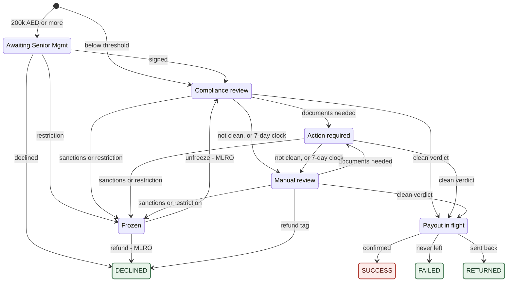

# Withdrawal Processing — Process & Control Narrative

**Audience.** Compliance Officers, MLRO, Senior Management, Operations, and Internal Audit. This is not a specification for engineers — it explains how withdrawal processing actually works, where the decision points sit, who owns each decision, and what you are expected to do when a withdrawal lands in your queue.

**How to use this.** Sections 1–4 are the mental model; read them once. Section 5 is your day-to-day playbook by role. Section 6 tells you what a customer can see and what you may say to them. Section 7 is the clocks. Section 8 walks through real scenarios end to end.

**Companion document.** This mirrors *Deposit Processing — Process & Control Narrative*. The two flows are deliberate mirror images, and Section 1 explains why that matters more than any other single fact in this document.

**Environment note.** Threshold figures reflect the current demo configuration. Production values are set by Compliance and may differ; the mechanics do not. **State names** in this document are the system's own names — the same words in the admin console and in the audit trail. The table at the end of Section 2 maps them to what the customer sees, and to the previous names for anyone reading an older screen or an older report.

---

## 1 The one thing to understand first

**Until a withdrawal is handed to the payout stage, the money is still ours to stop. After that, it is gone.**

This is the exact opposite of a deposit. A deposit arrives whether we like it or not, and every decision afterwards is about *releasing* money we already hold. A withdrawal is the reverse: the customer's money sits in our custody the entire time we are reviewing it. We are not deciding whether to accept something — we are deciding whether to **let it leave**.

That single asymmetry produces the most important line in this document:

> **The irreversible point is the moment a withdrawal enters *Payout In Flight*.**

That state has exactly three ways out — confirmed, never left, sent back — and all three are decided by the bank or the network, not by us. It has **no freeze exit and no reject exit**. The actual handover of money to the chain or the bank happens inside that state; the system deliberately draws the line one step earlier, at the moment the payment instruction is generated, because that is the last moment any control still exists.

- **Before that line:** stopping a withdrawal costs nothing and harms no one. We void the two reservations, the money returns to the customer's spendable balance, and no payment ever existed. There is no reversal, no counterparty to claw back from, and no posted accounting entry to undo.
- **After that line:** we cannot take it back. Not by freezing, not by approval, not by any button in any console. A screening verdict that arrives after this point — even a sanctions hit — changes no status and moves no money. It writes an audit line and raises an internal flag. That is all that is left.

Everything in Sections 2–7 is organised around that line. Every control we have is a **pre-payout** control, because after the line there are no controls left — only reporting.

**A second consequence, which surprises people:** because the money never leaves our custody during review, **freezing a withdrawal moves no money at all.** A frozen withdrawal's funds sit in exactly the same reservation they were in one second earlier. There is no separate "frozen funds" account. The difference between a frozen withdrawal and an ordinary one in flight exists only in its status and its audit trail — at the ledger level they are identical.

---

## 2 The normal path

Most withdrawals never require a decision from anyone.

1. The customer takes a **quote**, which fixes the fee, and submits the withdrawal to an address or bank account they registered earlier.
2. We immediately reserve the **full requested amount**, split in two: the net the beneficiary will receive, and our fee. **The fee comes out of the requested amount, not on top of it** — request 1,000 with a fee of 5 and we reserve 1,000, of which 995 is paid out. The customer's spendable balance drops by the requested amount straight away, but the money is still theirs and still with us.
3. We submit the transaction to **Sumsub**, our transaction-monitoring provider, for screening.
4. Sumsub returns a verdict. If it is clean — and if the customer is still in good standing at that moment — the withdrawal moves to **Payout In Flight** and the payment instruction is generated. This is the irreversible line.
5. When the network or bank confirms, the reservations convert into a real outflow, the fee becomes firm revenue, and the withdrawal completes.

Elapsed time when nothing is flagged: seconds to minutes, plus network or banking settlement time. No human touches it.

Everything in the rest of this document is about the cases where step 4 does not go straight through — plus one large exception: **any withdrawal at or above 200,000 AED requires a Senior Management signature before it reaches screening.**

### The state machine

Ten states and every move permitted between them. Green endings mean the money is back with the customer; the red ending means it has left our control for good. **Payout In Flight** is the point of no return — everything before it can still be stopped at no cost, and nothing after it can.

**Reading it as an officer:**

- **A withdrawal is born in one of two states, never anywhere else.** At or above 200,000 AED it lands in *Awaiting Signature*; below the threshold it goes straight to *Awaiting Screening*. The reservation on the customer's money is placed before either.
- **The senior signature comes first, screening second.** A large-value withdrawal is **not submitted to Sumsub at all** until it is signed. Nothing is screened, no clock runs, and no verdict can arrive while it waits — which is why an unsigned large-value withdrawal is completely inert. *(For Internal Audit: the record is written and then routed within the same instant, so a large-value withdrawal shows two status lines at the very start. No screening takes place against the first one.)*
- The customer's money is unspendable from the very first state, but it stays **theirs, and stays with us**, until the payout is confirmed — and that happens *inside* *Payout In Flight*, not on entry to it.
- **All three arrows into *Payout In Flight* are the same mechanism: a clean Sumsub verdict.** Our own console has no release button anywhere. That is why there cannot be a fourth way in — and it is why an MLRO unfreeze does not release money either: it only returns the withdrawal to screening, where it must still earn a clean verdict.
- **Green endings return the money** to the customer's spendable balance. The red one is the only ending that takes it away. One nuance: *Rejected* and *Failed* return the fee as well; *Returned* returns the principal, and returns the fee only if we had not yet collected it (see 3.1).
- ***Frozen* is not an ending.** It has two exits, both requiring an MLRO signature: back to *Awaiting Screening*, or out to *Rejected* with a refund. It is a parking state, not a verdict.
- **The four endings have no outgoing arrows at all.** In particular there is no arrow from *Success* to *Returned*: a payout that bounces after the withdrawal reached Success has no route back into this flow and must be handled through reconciliation.

### The ten states, and what each screen calls them

The first column is the name used everywhere internal — this document, the admin console, the audit trail and the status history. Only the customer's screen differs, and only where it has to.

| # | State | What it means | Customer's screen shows | Previously called |
|---|---|---|---|---|
| 1 | **Awaiting Signature** | Large value; waiting on a Senior Management signature. Not yet screened | Processing | `PENDING_APPROVAL` |
| 2 | **Awaiting Screening** | Submitted to Sumsub; waiting on a verdict | Processing | `COMPLIANCE_PENDING` |
| 3 | **Awaiting Customer** | The customer must supply documents | Action required | `ACTION_PENDING` |
| 4 | **Awaiting Compliance** | With our Compliance Officer for a judgement call | Processing | `MANUAL_CHECKING` |
| 5 | **Frozen** | Sanctions or MLRO hold. Hard stop | Processing | *(unchanged)* |
| 6 | **Payout In Flight** | Past the irreversible line | Processing | `PAYOUT_PENDING` |
| 7 | **Success** | Paid out | Success | *(unchanged)* |
| 8 | **Rejected** | We refused to send it; money returned | **Declined** | *(unchanged)* |
| 9 | **Failed** | Attempted but never left; money returned | Failed | *(unchanged)* |
| 10 | **Returned** | Left, then sent back; money returned | Returned | *(unchanged)* |

Three things to read off this table:

- **The four *Awaiting* states name whoever has to act** — a signature, Sumsub, the customer, our Compliance Officer. That is the whole point of the naming: if a withdrawal is not moving, its state already tells you whose desk it is on. Section 3.3 is the same four states, with how to find them.
- ***Frozen* deliberately breaks that pattern.** It is not a queue waiting on someone; it is an enforcement stop with a different legal character. It is meant to stand out in a list.
- **Only two names differ on the customer's screen**, and both are deliberate: states 1, 2, 4, 5 and 6 all collapse into a single "Processing" (Section 6.2 explains why), and *Rejected* reads as "Declined" — neutral wording that answers where the money went without asserting why.

> **A note for anyone comparing screens.** The diagram above still carries the older display labels. The name in this table is the one to trust.

---

## 3 Where a withdrawal can end up

### 3.1 The four endings

There are exactly **four endings**. Each states plainly where the money went.

| Ending | What it means | Where the money is | Customer sees |
|---|---|---|---|
| **Success** | Paid out | With the beneficiary — gone | Success |
| **Rejected** | We refused to send it | **Back in the customer's spendable balance** — net *and* fee released in full | Declined |
| **Failed** | The payout was attempted but never left | **Back in the customer's spendable balance** — net *and* fee released in full | Failed |
| **Returned** | It left, then the bank or network sent it back | **Principal re-credited** to the customer. The fee is returned too if we had not yet collected it; if it had already been collected, we keep it | Returned |

**Three of the four endings return the money to the customer.** That is not a coincidence — it is the direct consequence of Section 1. Before the line, refusing costs the customer nothing but time.

On the fee in a *Returned* withdrawal: because the fee is deliberately settled **after** the principal, a bounce normally arrives while the fee is still only reserved — in which case it goes back to the customer. The audit record states which of the two happened.

Note what is **not** on this list:

- **There is no "Confiscated" and no "Seized" ending.** A deposit can be kept or handed to law enforcement because the money is sitting in our custody with no owner-side claim on it yet. A withdrawal's money is unambiguously the customer's own balance. If the *customer* must be sanctioned or their assets seized, that happens at the **account level** — it is not something a single withdrawal record can express. The withdrawal itself just gets rejected and the funds stay in the (restricted) account.
- **There is no "Cancelled".** Customers cannot cancel a withdrawal once submitted. This was removed deliberately: a cancel button racing against a compliance decision creates exactly the kind of ambiguity that is impossible to defend to a regulator.

### 3.2 Refused before it exists

A request that fails any of the pre-creation checks in 4.1–4.2 produces **no withdrawal record at all**. The customer gets an error, nothing is reserved, and there is nothing for anyone to review. These are not endings — they are non-events. The only trace is an audit line for a limit rejection.

### 3.3 Where a withdrawal can stop moving

Four states can hold a withdrawal indefinitely. None of them has a timer, and **none of them pushes anything to anyone** — there is no work queue, no assignment and no alert. Each is found by someone deliberately looking.

| It stops in | Who has to move it | How they find it |
|---|---|---|
| **Awaiting Signature** | Senior Management Officer | Approvals list. The 48-hour figure on screen is a display value; approvals do not expire |
| **Awaiting Screening** | Sumsub, by returning a verdict | Nothing surfaces it. If screening never started — the customer has no Sumsub profile, or the submission failed — the withdrawal simply waits, with the customer's money reserved, and no clock ever starts |
| **Awaiting Compliance** | Compliance Officer, acting in the Sumsub console | Withdrawal list, filtered to Awaiting Compliance |
| **Frozen** | MLRO, via one of two approvals | Withdrawal list, filtered to Frozen |

**This table is the real ageing risk in the flow.** A withdrawal sitting in *Awaiting Screening* does not mean anyone is screening it.

---

## 4 The gates, in order

A withdrawal passes six gates, plus one that keeps running throughout. The first three happen at request time and reject outright; the rest are asynchronous and park the withdrawal for a human.

### 4.1 May this customer transact, and is the destination registered?

A chain of checks runs **before the withdrawal record exists**. Any one of them fails and the customer gets an error with nothing created.

- **Customer standing.** The customer relationship must be exactly **Active**. Prospect, in verification, awaiting final approval, rejected, withdrawn and off-boarded all fail.
- **No blocking restriction.** The customer must carry no open restriction that blocks withdrawals. Restrictions are a separate register from the relationship state, and there are seven causes — sanctions hit, administrative suspension, expired documents, tier upgrade under review, risk decision (soft and hard), and outstanding document request. **All seven block withdrawals by default**; sanctions and administrative suspension block every capability. Two of them — sanctions and a hard risk decision — are **silent**: the customer is shown no reason at all.
- **A usable bank account on file.** The customer must already have at least one **active fiat (bank) withdrawal account** — including when they are withdrawing crypto, and including before they are allowed to register a crypto address at all. The last remaining active bank account cannot be deactivated.
- **Destination registration.** The address or bank account must already be on the customer's own registered list and **active**. New crypto addresses sit through a **24-hour cooling period**; the first bank account a customer registers is active immediately, subsequent ones also cool for 24 hours.
- **A live quote.** The request must carry a quote that exists, belongs to this customer, is active and has not expired, and whose asset and amount match the request. **The fee comes from that quote and nowhere else** — it is fixed at quote time and consumed at submission. If the quote expires the customer starts over.

The cooling period is the control that stops an attacker who has taken over an account from immediately draining it to a fresh address. Two things qualify it, and both matter when assessing account-takeover risk:

- An administrator holding the withdrawal-address write permission can **waive the cooling period single-handedly** — no approval, no mandatory reason, one audit line.
- The registration check matches on the **address string** only. It does not verify that the registered destination was registered *for that asset or that network*.

**What the customer sees when this gate refuses.** Deliberately, nothing informative: a single neutral message, indistinguishable from a system error. Sanctions and hard risk decisions are silent — the withdrawal button is not even greyed out. This is an anti-tipping-off control, and it means **a refused customer cannot tell the difference between being blocked and the site being broken.** Support must be briefed accordingly.

### 4.2 Is the amount within limits?

A transaction-limit gate runs before the record is created and rejects outright — there is no human review exit from it.

| Rejected when | Current demo configuration |
|---|---|
| Below the per-transaction minimum | 10 (USDT and AED) |
| Above the per-transaction maximum | 1,000,000 (USDT and AED) |
| The amount cannot be valued in AED and the customer's tier has cumulative limits | — |
| The daily or monthly cumulative allowance would be exceeded | **Basic:** 50,000 AED per day, 500,000 per month. **Premium:** 500,000 per day, 5,000,000 per month |

Cumulative windows start on **Dubai time**, and count everything except withdrawals that ended Failed, Rejected, Cancelled or Returned. Every rejection writes an audit line.

> **Read 4.2 and 4.3 together.** With the current configuration, a **Basic-tier customer can never reach the Senior Management gate** — their daily allowance (50,000 AED) stops them long before 200,000. Only Premium-tier customers can generate a large-value approval. Anyone setting these two numbers needs to see them side by side.

### 4.3 Is this a large-value withdrawal?

Every withdrawal is valued in AED. **At or above 200,000 AED it requires a Senior Management Officer signature before anything else happens** — the withdrawal lands in *Awaiting Signature* and is not screened until it is signed. The comparison is inclusive: exactly 200,000 AED requires approval.

This gate is **fail-closed**: if the withdrawal cannot be valued in AED, or if no threshold rule is configured at all, it is routed to approval anyway regardless of size. When in doubt, it asks for a human — so a small withdrawal appearing in the Senior Management queue is a safety default, not a data error.

While it waits for that signature, the customer's money is reserved. Their balance already shows the reduction.

**A refused signature is final, not a pause.** Declining, cancelling or expiring the request sets the withdrawal to *Rejected* and releases the reservation in full. The customer may immediately submit a new one. **Not signing at all is a different outcome entirely** — the withdrawal and the customer's money simply stay where they are, indefinitely.

### 4.4 How is this transaction reported to Sumsub?

Under VARA rules, a virtual-asset transfer must carry Travel Rule information when it crosses a threshold **and** the counterparty is another regulated provider (a "VASP").

**This step blocks nothing.** It decides which transaction type we label the submission with when we report it to Sumsub. Either way the withdrawal waits in *Awaiting Screening* for a verdict.

All three conditions must hold for Travel Rule treatment:

| Condition | |
|---|---|
| The asset is a virtual asset (not fiat) | AND |
| The destination belongs to a VASP | AND |
| The amount is **at or above** the threshold for that currency | |

Current thresholds: **1,000 USDT** · **3,500 AED**. A withdrawal exactly at the threshold **does** qualify. Only these two currencies are configured; a third currency would be reported as an ordinary transaction with a warning logged.

**The scope of this control, stated plainly.** The system *identifies* which transfers carry the Travel Rule obligation and records that determination in the audit trail. It does **not transmit originator or beneficiary information**, and whether a destination "belongs to a VASP" is decided by a placeholder rather than a VASP directory. Compliance should describe this as detection, not as discharge of the obligation.

### 4.5 What did screening return?

Sumsub returns one of four outcomes. This is where almost all human work originates.

| Sumsub outcome | What it means | What happens |
|---|---|---|
| **Clean** | No risk indicators | Withdrawal moves to *Payout In Flight* — the irreversible line is crossed here |
| **More information needed** | The customer must supply documents | Withdrawal moves to *Awaiting Customer*; 7-day clock starts |
| **On hold** | Sumsub's own officer is reviewing | Withdrawal stays in *Awaiting Screening*; 7-day clock starts |
| **Not clean** | Risk threshold exceeded | Routed by disposition tag — see 4.6 |

**Only a clean verdict releases money.** Everything else holds the line. This is the single most important control in the withdrawal flow, and it is enforced in the state machine itself: there is no path from any waiting state to a payout except a clean verdict.

Four qualifications an officer needs:

- **"On hold" is not a state.** It only refreshes the 7-day clock, and only while the withdrawal is still in *Awaiting Screening*. An on-hold verdict arriving after the withdrawal has already moved on does nothing at all.
- **A "more information needed" verdict with no actual items for the customer does not move the withdrawal.** It stays where it is with a warning on the record. This is intentional — we never park a customer on an upload page with nothing to upload — but it means a verdict can arrive and the withdrawal visibly not move.
- **Sumsub can change its mind.** A withdrawal in *Awaiting Compliance* can be reopened by their officer as "more information needed", and it returns to *Awaiting Customer* with a fresh 7-day clock. A **frozen** withdrawal is not re-routed this way; the verdict is logged and ignored.
- **After the payout is in flight, no verdict does anything.** Whatever it says, it changes no status and moves no money. A "not clean" verdict at that point raises an internal `needs review` flag and writes an audit line — see 5.3.

### 4.6 What is the disposition instruction?

When screening returns "not clean", the tag attached determines the route.

| Tag from Sumsub | Route | Who owns it next |
|---|---|---|
| Sanctions hit | **Frozen** — no money moves at all | MLRO |
| MLRO freeze instruction | **Frozen** | MLRO |
| Refund instruction | Depends on where the withdrawal is — see below | — |
| Any other tag, or no tag | **Awaiting Compliance** | Compliance Officer |

Three mechanics that are not visible from the table:

- **The tags are exact labels, and only officer-defined tags are read.** Four are recognised: `SANCTION` and `PEP` as risk tags, `FROZEN_BY_MLRO` and `REJECT_REFUND` as disposition tags. Anything else — a misspelling, a differently-typed tag, a tag borrowed from the deposit flow — produces no error and no route; the withdrawal simply goes to *Awaiting Compliance* looking untouched. Note `PEP` on its own does **not** freeze.
- **Freeze wins over refund.** A verdict carrying both a sanctions tag and a refund tag freezes; the refund instruction is discarded, not queued.
- **Tags are only read on "not clean" and "more information needed" verdicts.** A disposition tag attached to a transaction Sumsub has marked **clean** is never looked at — the payout proceeds. An officer who tags a case for freeze but leaves the verdict green has done nothing. And a sanctions tag on a "more information needed" verdict does not freeze either; it goes to *Awaiting Customer* like any other document request, on a path that can still reach payout.

**The refund tag has three different outcomes depending on where the withdrawal is:**

| Withdrawal is in | Refund tag does |
|---|---|
| **Awaiting Compliance** | Rejects immediately, reservation released, money back to the customer — **with no second signature** |
| **Awaiting Screening or Awaiting Customer** | **Rejects nothing.** The withdrawal is routed to *Awaiting Compliance*, and the tag must be re-applied from there to actually refund |
| **Frozen** | **Ignored** and logged, because unlocking sanctioned funds must go through MLRO approval |

> ⚠️ **Two things to take from that table.** First, an officer who tags a case for refund early will see it move to *Awaiting Compliance* rather than reject — the money is still locked, and they must act again. Second, the *identical* tag is a **single-person action** in one state and a **blocked action** in another. The design is intentional; the risk is an officer who learns "tagging refund kills the withdrawal" and does not realise which state they are in.

A **frozen** withdrawal is a hard stop. No operator can release it and no later "clean" verdict can override it. The only ways out are the two MLRO approvals in Section 5.2.

### 4.7 The gate that keeps running

Customer standing is not checked once. It is re-checked at three later points — just after creation, at the moment a large-value approval is granted, and immediately before the payout phase begins — and at those points the consequence is different: **the withdrawal is frozen, not refused.**

Two consequences that matter operationally:

- **A signature is not an authorisation to pay.** Between a Senior Management approval and the actual payout there is still a customer-standing check. A withdrawal can be signed and then land straight in *Frozen*.
- **One restriction on a customer freezes their whole in-flight book at once.** Opening a restriction on a customer sweeps every one of their non-terminal withdrawals into *Frozen* simultaneously — each of which then needs its own MLRO disposition. The exception is any withdrawal already in *Payout In Flight*: it has no freeze exit, so it is skipped and **will still pay out**. When an MLRO restricts a customer, that is the first thing to check.

---

## 5 Your playbook

### 5.1 Compliance Officer

**What lands in your queue:** nothing is pushed to you. Withdrawals in ***Awaiting Compliance*** — screening returned "not clean" with no specific instruction, or a hold/document request ran past its 7-day deadline — are found by filtering the withdrawal list. The state is named after you: if a withdrawal is sitting there, it is waiting on your judgement and on nothing else.

**What you can see:** the full Sumsub report — risk score, which rules fired, all tags, the raw report, and every approval ever raised against the withdrawal.

**What you can actually do — read this carefully:**

> **The admin console has no "approve", "reject" or "freeze" button for a withdrawal in *Awaiting Compliance*.** The detail page shows only a note saying disposition happens in Sumsub. Your levers are in the **Sumsub console**, not ours: you set the verdict or the disposition tag there, and our system reacts. Our console offers exactly three buttons across the whole flow — **Bounce Payout** (only while in *Payout In Flight*), **Initiate Unfreeze** and **Reject & Freeze Customer** (both only while *Frozen*).

In practice this means:

| Intended outcome | How you actually achieve it today |
|---|---|
| Release the withdrawal | Approve the transaction in Sumsub → clean verdict arrives → payout is created |
| Reject and return the funds | Attach the `REJECT_REFUND` tag in Sumsub **while the withdrawal is in *Awaiting Compliance*** → it is rejected and the reservation is released |
| Escalate to a freeze | Attach the `FROZEN_BY_MLRO` or `SANCTION` tag in Sumsub on a not-clean verdict → withdrawal freezes, MLRO owns it |

> **In the demo environment only,** the detail page also shows a ⚡ Simulation panel with ten verdict buttons that stand in for Sumsub webhooks. Those exist purely to drive a demo; the endpoint behind them is not registered in a production build. If you see buttons on this screen that appear to approve or freeze a withdrawal directly, that is what they are.

**Judgement note.** A withdrawal reaches you because a rule fired, not because wrongdoing is established. Record your reasoning. And remember what your "release" decision actually does: it crosses the irreversible line. There is no recall.

### 5.2 MLRO

**What lands in your queue:** nothing, automatically. A freeze raises no approval and no task — it only changes a status. Frozen withdrawals are found by filtering the withdrawal list on *Frozen*. An approval only appears once **someone has pressed a button** to start a disposition.

**Who starts a disposition:** any administrator with access to the withdrawal detail page can initiate both requests. Your role gate is on the **decision**, not on the initiation. You will see these cases only after someone else has raised them.

| Approval | Signatures required | Mandatory inputs |
|---|---|---|
| Unfreeze | **You alone** | An **order reference** (e.g. delisting or release order) + reason |
| Sanction refund (reject + return funds) | **You alone** | Reason only |

> ⚠️ **Note the asymmetry and treat it as a control weakness.** Loosening a freeze demands a documented external order reference. Killing the withdrawal and **unlocking a sanctioned customer's funds back into their spendable balance** demands only free text. If your policy requires a case or sanctions-list reference for the second action, you must enforce it by procedure — the system will not.

**The button you will be shown is misleading.** The console labels the sanction refund **"Reject & Freeze Customer"**, and its dialogue asks for a reason for "rejecting this withdrawal and freezing the customer". **No account-level freeze occurs.** The action rejects the withdrawal and returns the funds; freezing the customer is a separate action you must perform yourself. Do not treat the button label as evidence the account was restricted.

**On duplicate and competing requests.** The same withdrawal cannot have two pending unfreeze requests, or two pending refund requests — a second attempt is refused. But the two are **not** mutually exclusive: an unfreeze and a sanction refund can both be pending on the same withdrawal at the same time, pointing in opposite directions. Whichever you sign first decides the outcome. Check what else is pending before you sign.

**If you refuse to sign.** Declining, cancelling or letting either request lapse leaves the withdrawal **exactly where it was — *Frozen*** — with the customer's money still reserved. Nothing is returned to the customer, nobody is notified, and the case must be raised again from scratch to move.

**On unfreezing.** Unfreezing does **not** release the money to the beneficiary. It sends the withdrawal back to *Awaiting Screening* and asks Sumsub to re-score it. If you believe the payment should go out, unfreeze and let the process re-run. There is deliberately no direct release path from a freeze.

> One caution on that re-scoring: the request to Sumsub is best-effort. If it fails, or if the withdrawal was never submitted to Sumsub in the first place, the withdrawal sits in *Awaiting Screening* waiting for a verdict that will not arrive — with the customer's money still reserved and nothing flagging it. After an unfreeze, confirm the case actually reappeared in Sumsub.

**On the sanction refund.** Approving it rejects the withdrawal and returns the full amount — including the fee — to the customer's **spendable** balance. Nothing is seized, quarantined, or moved anywhere else. In the rare case where the release of the reservation itself fails, the withdrawal still shows *Rejected* while the balance stays locked, and only the server log records it — so if a customer reports a rejected withdrawal whose money has not come back, treat it as real.

### 5.3 Operations

**What lands in your queue:** nothing is pushed. Withdrawals carry a `needs review` flag, which cannot be filtered on — noticing them means checking deliberately.

The flag has **two very different causes**, and they need opposite responses:

| Cause | What it means | Urgency |
|---|---|---|
| **Fee could not be booked** after three automatic attempts | The customer has been paid. The problem is purely internal: their fee is reserved but neither collected nor returned, and the withdrawal sits in *Payout In Flight* indefinitely | Internal accounting. Engineering involvement needed |
| **A "not clean" verdict arrived after the payout was already in flight** | The money is out the door and Sumsub has since said it should not have gone. No status change is possible; the system can only flag it | **Compliance escalation. Escalate to MLRO immediately** — any recovery window is measured in hours |

The admin console's banner text only describes the second cause, so a fee-stuck withdrawal will show an explanation that does not match it. Check which one you are looking at before acting.

Operations does **not** have a below-minimum disposition queue in withdrawals. That concept exists only on the deposit side.

### 5.4 Senior Management Officer

**What lands in your queue:** withdrawals in *Awaiting Signature* — at or above 200,000 AED, plus any withdrawal the system could not value (see 4.3). You are the **sole** signature; unlike a deposit seizure, there is no countersignature.

Four things to keep in mind:

- The request is raised automatically by the system, not by a person. There is no maker to consult.
- **Your signature is not the final release.** Customer standing is re-checked the moment you approve; if the customer has been restricted in the meantime, the withdrawal freezes instead of proceeding, and moves to the MLRO.
- **Refusing to sign is terminal, not a deferral.** It rejects the withdrawal and returns the customer's money in full. The customer can immediately submit a new request.
- **Nothing chases you, and nothing expires.** The 48-hour figure on the request is a display value only. A withdrawal left in *Awaiting Signature* sits indefinitely with the customer's funds reserved and no escalation, no alert and no ageing report. This is the single most likely way for a legitimate customer's money to be stuck for weeks without anyone noticing.

---

## 6 What the customer sees — and what you may say

### 6.1 The display

| Withdrawal is actually… | Customer's screen shows |
|---|---|
| **Awaiting Signature** | **Processing** |
| **Awaiting Screening** | Processing |
| **Awaiting Compliance** | **Processing** |
| **Frozen** (sanctions or MLRO) | **Processing** |
| **Payout In Flight** | Processing |
| **Awaiting Customer** | Action required |
| **Success** | Success |
| **Rejected** | Declined |
| **Failed** | Failed |
| **Returned** | Returned |

**Five different states render as an identical "Processing".** That includes *Awaiting Signature* — deliberately, because a distinct label for "your withdrawal needed senior sign-off" would itself signal that the customer is being treated differently.

### 6.2 Why enforcement states look identical to normal processing

Under anti-money-laundering rules we may not tip off a person that they are under investigation. A different colour, a different label, or a "contact support" prompt would each be enough of a signal.

So the enforcement states display **exactly** as ordinary processing — same wording, same styling, no note. The same principle governs the refusal message at 4.1: one neutral sentence, indistinguishable from a system fault, with nothing about the cause.

**The trade-off we accepted:** a customer whose withdrawal is frozen has no in-product route to ask about it. That is intended.

> ⚠️ **Do not over-trust this control.** The *label* on screen is neutral; the underlying data sent to the customer's browser is not. A technically capable customer can read the true state from the raw response and can filter their own history by it. Assume a determined subject can discover that their withdrawal is frozen, and escalate on that assumption rather than relying on the display.

### 6.3 If a customer contacts you about a withdrawal

| Situation | What you may say |
|---|---|
| Normal processing | "It's being processed. We'll confirm once it completes." |
| **Awaiting Signature** | **"It's being processed."** Do not mention an approval or a threshold. |
| **Awaiting Customer** | Confirm what is needed and how to submit it. |
| ***Frozen* / *Awaiting Compliance*** | **"It's being processed."** Nothing further. Do not confirm or deny any review or freeze. Escalate to MLRO; never improvise. |
| **Rejected / Failed** | Confirm the funds are back in their available balance. **You will need to say this explicitly — the screen shows one word and no explanation.** Note the customer's screen says "Declined", not "Rejected". |
| **Returned** | Confirm the payment was sent back and the funds are back in their balance. |
| Their withdrawal request was refused outright | You may confirm only what the neutral message says. Never explain which check refused it. Escalate anything that looks like a restriction. |

> **The rule of thumb:** you may always describe what the customer can already see on their own screen. You may never describe anything they cannot.

**There are no customer notifications of any kind** — not for success, failure, rejection, return, or a document request. Customers learn everything by opening the app, which is why a document request can pass its deadline unnoticed.

---

## 7 Timelines

| Clock | Duration | Starts when | On expiry |
|---|---|---|---|
| Sumsub hold | 7 calendar days | Sumsub returns an "on hold" verdict — **not** on entry to *Awaiting Screening* | Moves to *Awaiting Compliance* |
| Customer document request | 7 calendar days | The withdrawal enters *Awaiting Customer* | Moves to *Awaiting Compliance* |
| Address cooling | 24 hours | A new withdrawal address is registered | Address becomes usable |
| Approval request | *displayed as 48 hours* | The request is raised | **Nothing. Approvals do not expire** |

**Calendar days, not business days.** No holiday calendar exists. The sweep runs every five minutes, Dubai time.

**Note where the 7-day clocks do and do not start.** A withdrawal in *Awaiting Screening* is only on a clock if Sumsub has already returned an "on hold" verdict. One that is simply waiting for a first verdict — including one where screening never started at all — is on no clock and will not move by itself.

**No clock runs on:** *Awaiting Signature*, *Awaiting Compliance*, *Frozen*, or *Payout In Flight*. Once a withdrawal is in one of these states it stays there until a human acts. **Ageing in these queues is a management responsibility, not a system one — there is no ageing report and no filter for the `needs review` flag.**

---

## 8 Worked scenarios

**A — Ordinary withdrawal**
Customer requests 500 AED to their registered bank account. The reservation is placed instantly and their spendable balance drops by the full 500 — the fee comes out of that 500, so the bank is instructed to pay 500 minus the fee. It sits in *Awaiting Screening*; the verdict returns clean, customer standing is re-checked, and it moves to *Payout In Flight* — irreversible line crossed. The bank confirms; the reservations convert to a real outflow and the fee becomes our revenue. The customer sees Processing, then Success.

**B — Large-value withdrawal**
A Premium-tier customer requests 250,000 AED. Above the 200,000 threshold, so it lands in *Awaiting Signature* and a Senior Management approval is raised automatically — **before any screening**. The customer's funds are reserved throughout. Their screen says Processing — no indication that a human signature is pending. Once signed, customer standing is re-checked and it moves to *Awaiting Screening* as normal.

*If nobody signs, it stays exactly there. Indefinitely. Nothing will remind anyone.* And note the tier: a Basic-tier customer could not have submitted this at all — their 50,000 AED daily allowance would have refused it before a record was created.

**C — Sanctions hit before payout**
Customer requests 3,900 USDT to an external address. Screening returns not clean with a sanctions tag. The withdrawal moves straight to *Frozen*. **No money moves — the funds stay in the same reservation they were already in.** The customer's screen still says Processing.

Nothing is pushed to the MLRO. The freeze raises no approval and no task; someone has to filter the withdrawal list on *Frozen*, open the withdrawal and initiate one of the two dispositions — and only that opens the MLRO's approval. The two exits are unfreeze (back to *Awaiting Screening*) or sanction refund (*Rejected*; the full amount including fee returns to the customer's spendable balance). **Nothing is seized.** The button for the second one is labelled "Reject & Freeze Customer" but freezes no account — if the customer should be restricted, that is a separate action.

**D — Customer stops responding**
Customer requests 2,000 AED. Screening asks for source-of-funds documents, so it moves to *Awaiting Customer* and the customer's screen shows "Action required". Seven days pass with no response. The withdrawal moves to *Awaiting Compliance*, and the Compliance Officer decides — via the Sumsub console — whether to release or to tag it for refund.

> Before reading silence as non-cooperation: there are no notifications, so a customer who is not checking the app will not know a document was ever requested.

**E — Fee cannot be booked**
Customer requests 1,000 AED. Screening clean, payment sent, network confirms, the customer has their money. The internal fee booking then fails three times. The withdrawal is flagged `needs review` and stays in *Payout In Flight*. The customer sees Processing even though they were paid. Their fee is reserved — not collected, not returned. This is the internal cause of the flag, not the compliance one (5.3).

**F — Bank sends it back**
A payout completes, then the beneficiary bank returns it days later. An administrator uses Bounce Payout — available only while the withdrawal is still in *Payout In Flight*. We re-credit the net amount to the customer immediately. The same mechanism handles a returned on-chain transfer; it is not bank-only.

**The fee treatment depends on timing and is usually favourable to the customer:** because the fee is deliberately settled only after the principal, at bounce time it is normally still reserved — in which case it is **released back to the customer**. If it had already been collected, we keep it. The audit record states which happened.

> Note for anyone who has read the code or older documents: several comments still claim the fee is never refunded on a bounce. **That is out of date.** The behaviour above is what actually runs.

**G — It bounces after we already marked it Success**
Same as F, but the return arrives after the withdrawal reached *Success*. *Success* is final and Bounce refuses to act on it. The returned funds land in our account with no record tying them to the withdrawal, and it must be handled through reconciliation and manual correction.

**H — The customer is restricted while withdrawals are in flight**
An MLRO opens a restriction on a customer who has four withdrawals outstanding. Three of them — one in *Awaiting Screening*, one in *Awaiting Customer* and one in *Awaiting Signature* — are all moved to *Frozen* at once, and each now needs its own MLRO disposition. The fourth was already in *Payout In Flight*: it has no freeze exit, so it is skipped and **will still pay out**. Restricting a customer does not stop money that has already crossed the line.

---

## 9 Glossary

| Term | Meaning |
|---|---|
| **Reservation (hold)** | The amount set aside against a customer's balance from the moment they request a withdrawal — split into the net payout and the fee. Not spendable by them, not yet ours. |
| **The irreversible line** | Entry into *Payout In Flight*. Before it, a withdrawal can be stopped at no cost; after it, the only outcomes are the bank's or the network's. |
| **Awaiting …** | The four states named after whoever must act next — Signature, Screening, Customer, Compliance. If a withdrawal is not moving, its state names the desk it is on. |
| **Sumsub** | Our transaction-monitoring and screening provider. Most compliance actions on a withdrawal are performed in *their* console, not ours. |
| **VASP** | Virtual Asset Service Provider — a regulated crypto business, such as another exchange. |
| **Travel Rule** | The obligation to transmit originator and beneficiary information alongside qualifying virtual-asset transfers. See 4.4 for the scope of what this system does. |
| **Disposition tag** | The instruction an officer attaches to a screening result telling us what to do with the withdrawal: freeze it, or refund it. A not-clean result with no disposition tag goes to *Awaiting Compliance* by default. A separate sanctions tag also forces a freeze. |
| **Restriction** | An entry on a customer's record blocking one or more capabilities. Separate from the customer's relationship state; opening one freezes their in-flight withdrawals. |
| **Freeze** | A hard stop on a withdrawal. Moves no money. It can only be lifted through an MLRO approval. It deliberately sits outside the *Awaiting* family: it is an enforcement stop, not a queue. |
| **Sanction refund** | Rejecting a frozen withdrawal and returning the funds to the customer's spendable balance. Requires MLRO approval. Labelled "Reject & Freeze Customer" in the console; it freezes no account. |
| **Bounce** | Recording that a payout which already left us was sent back by the bank or network, and returning the money to the customer. Available only while the withdrawal is still in *Payout In Flight*. |
| **Tipping off** | Alerting a person that they are the subject of a compliance investigation. Prohibited. |

---

*Prepared by Product. Questions on process to Product; questions on obligations to Compliance.*
*Facts in this document were verified against the codebase at commit `91076d0e` (2026-08-17). Where a statement contradicts a code comment or an older document, this document is the more recent verification.*
