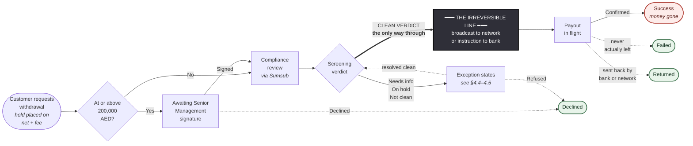

# Withdrawal Processing — Process & Control Narrative

**Audience.** Compliance Officers, MLRO, Senior Management, Operations, and Internal Audit. This is not a specification for engineers — it explains how withdrawal processing actually works, where the decision points sit, who owns each decision, and what you are expected to do when a withdrawal lands in your queue.

**How to use this.** Sections 1–4 are the mental model; read them once. Section 5 is your day-to-day playbook by role. Section 6 tells you what a customer can see and what you may say to them. Section 8 walks through real scenarios end to end. **Section 9 lists what the system genuinely cannot do today** — read it before you rely on any control described above it.

**Companion document.** This mirrors *Deposit Processing — Process & Control Narrative*. The two flows are deliberate mirror images, and Section 1 explains why that matters more than any other single fact in this document.

**Environment note.** Threshold figures reflect the current demo configuration. Production values are set by Compliance and may differ; the mechanics do not.

---

## 1 The one thing to understand first

**Until we broadcast, the money is still ours to stop. After we broadcast, it is gone forever.**

This is the exact opposite of a deposit. A deposit arrives whether we like it or not, and every decision afterwards is about *releasing* money we already hold. A withdrawal is the reverse: the customer's money sits in our custody the entire time we are reviewing it. We are not deciding whether to accept something — we are deciding whether to **let it leave**.

That single asymmetry produces the most important line in this document:

> **The irreversible point is the moment we broadcast to the blockchain or send the payment instruction to the bank.**

- **Before that line:** stopping a withdrawal costs nothing and harms no one. We release the hold, the money returns to the customer's spendable balance, and no payment ever existed. There is no "reversal", no counterparty to claw back from, no accounting entry to undo.
- **After that line:** we cannot take it back. Not by freezing, not by approval, not by any button in any console. The money is with the beneficiary.

Everything in Sections 2–7 is organised around that line. Every control we have is a **pre-broadcast** control, because after the line there are no controls left — only reporting.

**A second consequence, which surprises people:** because the money never leaves our custody during review, **freezing a withdrawal moves no money at all.** A frozen withdrawal's funds sit in exactly the same hold they were in one second earlier. There is no separate "frozen funds" account. The difference between a frozen withdrawal and an ordinary one in flight exists only in its status and its audit trail — at the ledger level they are identical.

---

## 2 The normal path

Most withdrawals never require a decision from anyone.

1. The customer requests a withdrawal to an address or bank account they registered earlier.
2. We immediately place a **hold** on the amount plus the fee. Their spendable balance drops right away — but the money is still theirs and still with us.
3. We submit the transaction to **Sumsub**, our transaction-monitoring provider, for screening.
4. Sumsub returns a verdict. If it is clean, we create the payout instruction and **broadcast** — this is the irreversible line.
5. When the network or bank confirms, the hold converts into a real outflow, the fee becomes firm revenue, and the withdrawal completes.

Elapsed time when nothing is flagged: seconds to minutes, plus network or banking settlement time. No human touches it.

Everything in the rest of this document is about the cases where step 4 does not go straight through — plus one large exception: **any withdrawal at or above 200,000 AED requires a Senior Management signature before it even reaches screening.**

### The flow at a glance

Everything to the left of the black bar is reversible at no cost. The heavy arrow is the only way through it.

**Reading it as an officer:**

- The customer's money is unspendable from the very first box, but it stays **theirs, and stays with us**, right up to the black bar.
- **Only a clean verdict crosses that bar.** No approval, no override and no operator button can push a withdrawal across it — that is a property of the system's design, not a convention someone could waive.
- **Green endings return the money** to the customer's spendable balance. The red one is the only ending that takes it away.
- Two branches loop backwards: an exception state that resolves cleanly re-enters screening, and can then proceed normally. Nothing loops back across the bar.
- Note there is **no arrow from Success to Returned.** A payment that bounces after we have marked it Success has nowhere to go in this system — see 9.2.

*(This shows the shape, not every route. All four endings are in Section 3; the gates and their branches are in Section 4. The exception states — waiting on the customer, manual review, frozen — are collapsed into one box here deliberately; they are where the work is, and they get their own sections.)*

---

## 3 Where a withdrawal can end up

There are exactly **four endings**. Each states plainly where the money went.

| Ending | What it means | Where the money is | Customer sees |
|---|---|---|---|
| **Success** | Paid out | With the beneficiary — gone | Success |
| **Declined** | We refused to send it | **Back in the customer's spendable balance** — hold released in full | Declined |
| **Failed** | The payout was attempted but never left | **Back in the customer's spendable balance** — hold released in full | Failed |
| **Returned** | It left, then the bank or network sent it back | **Back in the customer's balance**, re-credited | Returned |

**Three of the four endings return the money to the customer.** That is not a coincidence — it is the direct consequence of Section 1. Before the line, refusing costs the customer nothing but time.

Note what is **not** on this list:

- **There is no "Confiscated" and no "Seized" ending.** A deposit can be kept or handed to law enforcement because the money is sitting in our custody with no owner-side claim on it yet. A withdrawal's money is unambiguously the customer's own balance. If the *customer* must be sanctioned or their assets seized, that happens at the **account level** — it is not something a single withdrawal record can express. The withdrawal itself just gets declined and the funds stay in the (frozen) account.
- **There is no "Cancelled".** Customers cannot cancel a withdrawal once submitted. This was removed deliberately: a cancel button racing against a compliance decision creates exactly the kind of ambiguity that is impossible to defend to a regulator.

---

## 4 The gates, in order

A withdrawal passes up to five gates. The first two happen instantly at request time; the rest are asynchronous.

### 4.1 Is the customer allowed to transact, and is the destination registered?

Two checks run before the withdrawal record even exists — if either fails, the customer gets an error and **nothing is created**.

- **Customer standing:** onboarding approved, account active, not compliance-frozen.
- **Destination registration:** the address or bank account must already exist on the customer's own registered list and be **active**. New crypto addresses sit through a **24-hour cooling period** before they can be used. The first bank account a customer registers is active immediately; subsequent ones also cool for 24 hours.

The cooling period is the control that stops an attacker who has taken over an account from immediately draining it to a fresh address.

> ⚠️ **Known gap — see 9.11.** The destination check only runs when a destination is actually supplied. A request that omits it entirely slips past this gate.

### 4.2 Is this a large-value withdrawal?

Every withdrawal is valued in AED. **At or above 200,000 AED, it requires a Senior Management Officer signature before anything else happens.**

This gate is **fail-closed in three ways** — if the exchange rate cannot be fetched, if the withdrawal cannot be valued, or if no threshold is configured at all, the withdrawal is routed to approval anyway. When in doubt, it asks for a human.

The comparison is **inclusive**: exactly 200,000 AED requires approval.

While it waits for that signature, the customer's money is held. Their balance already shows the reduction.

### 4.3 Does this transaction require Travel Rule treatment?

Under VARA rules, a virtual-asset transfer must carry Travel Rule information when it crosses a threshold **and** the counterparty is another regulated provider (a "VASP").

All three conditions must hold:

| Condition | |
|---|---|
| The asset is a virtual asset (not fiat) | AND |
| The destination belongs to a VASP | AND |
| The amount is **at or above** the threshold for that currency | |

Current thresholds: **1,000 USDT** · **3,500 AED**. A withdrawal exactly at the threshold **does** require Travel Rule treatment. Only these two currencies are configured; a third currency would fall through as an ordinary transaction with a warning logged.

> ⚠️ **This gate does not do what its name suggests — see 9.3.** Today the system correctly *decides* that a transfer needs Travel Rule treatment and labels the submission accordingly, but **it does not actually transmit any originator or beneficiary information.** The obligation is identified, not discharged. Compliance must treat this as an open regulatory gap, not a working control.

> ⚠️ **And the VASP determination is a placeholder — see 9.3.** Whether a destination "belongs to a VASP" is currently decided by a stub, not by any VASP directory or attribution service.

### 4.4 What did screening return?

Sumsub returns one of four outcomes. This is where almost all human work originates.

| Sumsub outcome | What it means | What happens |
|---|---|---|
| **Clean** | No risk indicators | **Payout is created and broadcast** — the irreversible line is crossed here |
| **More information needed** | The customer must supply documents | Withdrawal waits; customer is asked. 7-day clock starts |
| **On hold** | Sumsub's own officer is reviewing | Withdrawal waits; 7-day clock starts |
| **Not clean** | Risk threshold exceeded | Routed by disposition tag — see 4.5 |

**Only a clean verdict releases money.** Everything else holds the line. This is the single most important control in the withdrawal flow, and it is enforced in the state machine itself: there is no path from any waiting state to a payout except through a clean verdict or an explicit officer release.

**Sumsub can change its mind.** A withdrawal marked "not clean" can later be reopened by their officer as "more information needed", and our system re-routes accordingly. An item in your review queue yesterday may legitimately have moved back to waiting-on-customer today.

### 4.5 What is the disposition instruction?

When screening returns "not clean", the tag attached determines the route:

| Tag from Sumsub | Route | Who owns it next |
|---|---|---|
| Sanctions hit | **Frozen** — no money moves at all | MLRO |
| MLRO freeze instruction | **Frozen** | MLRO |
| Refund instruction | **Declined immediately**, hold released, money back to the customer | *(no approval — see the warning below)* |
| Any other tag, or no tag | **Manual review** | Compliance Officer |

> ⚠️ **Asymmetry you must understand.** A refund tag arriving while the withdrawal is in **manual review** takes effect immediately with **no second signature** — the withdrawal is declined and the customer's money is unlocked on the strength of a tag set in the Sumsub console. The *identical* tag arriving while the withdrawal is **frozen** is deliberately ignored and logged, because unlocking sanctioned funds must go through MLRO approval. The design is intentional. The risk is that an officer who learns "tagging refund declines the withdrawal" may not realise that this is a **single-person action** in one state and a **blocked action** in the other.

A **frozen** withdrawal is a hard stop. No operator can release it and no later "clean" verdict can override it. The only ways out are the two MLRO approvals in Section 5.2.

---

## 5 Your playbook

### 5.1 Compliance Officer

**What lands in your queue:** withdrawals in **Manual review** — screening returned "not clean" with no specific instruction, or a hold/document request ran past its 7-day deadline.

**What you can see:** the full Sumsub report — risk score, which rules fired, all tags, the raw report, and every approval ever raised against the withdrawal.

**What you can actually do — read this carefully:**

> **The admin console has no "approve", "reject" or "freeze" button for a withdrawal in manual review.** Your levers are in the **Sumsub console**, not ours: you act by setting the verdict or the disposition tag there, and our system reacts. The only buttons our console offers are Bounce (post-payout only), Initiate Unfreeze and Initiate Refund (both frozen-only).

In practice this means:

| Intended outcome | How you actually achieve it today |
|---|---|
| Release the withdrawal | Approve the transaction in Sumsub → clean verdict arrives → payout is created and broadcast |
| Decline and return the funds | Attach the refund disposition tag in Sumsub → withdrawal declines, hold released |
| Escalate to a freeze | Attach the MLRO-freeze tag in Sumsub → withdrawal freezes, MLRO owns it |

**Judgement note.** A withdrawal reaches you because a rule fired, not because wrongdoing is established. Record your reasoning. And remember what your "release" decision actually does: it crosses the irreversible line. There is no recall.

### 5.2 MLRO

**What lands in your queue:** every frozen withdrawal, plus approval requests.

| Approval | Signatures required | Mandatory inputs |
|---|---|---|
| Unfreeze | **You alone** | An **order reference** (e.g. delisting or release order) + reason |
| Sanction refund (decline + return funds) | **You alone** | Reason only |

> ⚠️ **Note the asymmetry and treat it as a control weakness.** Loosening a freeze demands a documented external order reference. Killing the withdrawal and **unlocking a sanctioned customer's funds back into their spendable balance** demands only free text. If your policy requires a case or sanctions-list reference for the second action, you must enforce it by procedure — the system will not.

**On unfreezing.** Unfreezing does **not** release the money to the beneficiary. It sends the withdrawal back to the start of compliance review and asks Sumsub to re-score it. If you believe the payment should go out, unfreeze and let the process re-run. There is deliberately no direct release path from a freeze.

**On the sanction refund.** Approving it declines the withdrawal and returns the full amount — including the fee — to the customer's **spendable** balance. Nothing is seized, quarantined, or moved anywhere else. **If the customer's account itself should be frozen, that is a separate action outside this flow** — today the system records the intent in the audit trail but performs no account-level freeze (see 9.6).

**On the 48-hour clock.** Approval requests display a 48-hour timeout. **It does not actually expire anything** (see 9.4). Treat every pending approval as open until you act on it.

### 5.3 Operations

**What lands in your queue:** withdrawals flagged `needs review` — the payout succeeded but the fee could not be booked after three automatic attempts.

The customer has been paid. The problem is internal: their fee is still locked — neither collected by us nor returned to them — and the withdrawal will sit at "payout in progress" indefinitely.

> ⚠️ **There is no repair button (see 9.7).** These items require engineering involvement today. What Operations owns is *noticing* them — and there is no filter for the flag, so noticing means checking deliberately.

Operations does **not** have a below-minimum disposition queue in withdrawals. That concept exists only on the deposit side.

### 5.4 Senior Management Officer

You are the **sole** signature on large-value withdrawals — at or above 200,000 AED. Unlike a deposit seizure, there is no countersignature: your approval alone releases the withdrawal into screening.

Two things to keep in mind:

- The request is raised automatically by the system, not by a person. There is no maker to consult.
- **Nothing chases you.** A large-value withdrawal with no signature sits indefinitely with the customer's funds locked and no escalation, no alert, and no ageing report. This is the single most likely way for a legitimate customer's money to be stuck for weeks without anyone noticing.

---

## 6 What the customer sees — and what you may say

### 6.1 The display

| Withdrawal is actually… | Customer's screen shows |
|---|---|
| Awaiting Senior Management signature | **Processing** |
| In compliance review | Processing |
| **In manual review** | **Processing** |
| **Frozen (sanctions or MLRO)** | **Processing** |
| Payout in flight | Processing |
| Waiting on customer documents | Action required |
| Paid out | Success |
| Declined | Declined |
| Failed | Failed |
| Returned | Returned |

**Five different states render as an identical "Processing".** That includes the large-value approval wait — deliberately, because a distinct label for "your withdrawal needed senior sign-off" would itself signal that the customer is being treated differently.

### 6.2 Why enforcement states look identical to normal processing

Under anti-money-laundering rules we may not tip off a person that they are under investigation. A different colour, a different label, or a "contact support" prompt would each be enough of a signal.

So the enforcement states display **exactly** as ordinary processing — same wording, same styling, no note.

**The trade-off we accepted:** a customer whose withdrawal is frozen has no in-product route to ask about it. That is intended.

> ⚠️ **But do not over-trust this control — see 9.10.** The *label* on screen is neutral; the underlying data sent to the customer's browser is not. A technically capable customer can read the true state (`FROZEN`) from the raw response, and can even filter their own history by it. Assume a determined subject can discover that their withdrawal is frozen. Escalate accordingly rather than assuming the display protects you.

### 6.3 If a customer contacts you about a withdrawal

| Situation | What you may say |
|---|---|
| Normal processing | "It's being processed. We'll confirm once it completes." |
| Awaiting senior approval | **"It's being processed."** Do not mention an approval or a threshold. |
| Awaiting their documents | Confirm what is needed and how to submit it. |
| **Frozen / manual review** | **"It's being processed."** Nothing further. Do not confirm or deny any review or freeze. Escalate to MLRO; never improvise. |
| Declined / Failed | Confirm the funds are back in their available balance. **You will need to say this explicitly — the screen shows one word and no explanation** (see 9.9). |
| Returned | Confirm the payment was sent back and the funds are back in their balance. |

> **The rule of thumb:** you may always describe what the customer can already see on their own screen. You may never describe anything they cannot.

---

## 7 Timelines

| Clock | Duration | Starts when | On expiry |
|---|---|---|---|
| Sumsub hold | 7 calendar days | Sumsub puts the transaction on hold | Moves to Manual review |
| Customer document request | 7 calendar days | We ask the customer for documents | Moves to Manual review |
| Address cooling | 24 hours | A new withdrawal address is registered | Address becomes usable |
| Approval request | *displayed as 48 hours* | The request is raised | **Nothing — see 9.4** |

**Calendar days, not business days.** No holiday calendar exists. The sweep runs every five minutes, Dubai time.

**No clock runs on:** awaiting senior approval, manual review, frozen, or payout in flight. Once a withdrawal is in one of these states it stays there until a human acts. **Ageing in these queues is a management responsibility, not a system one — and today there is no ageing report to help you** (see 9.13).

---

## 8 Worked scenarios

**A — Ordinary withdrawal**
Customer withdraws 500 AED to their registered bank account. The hold is placed instantly and their spendable balance drops by 500 plus fee. Screening returns clean. The payment instruction goes to the bank — irreversible line crossed. The bank confirms; the hold converts to a real outflow and the fee becomes our revenue. The customer sees Processing, then Success.

**B — Large-value withdrawal**
Customer withdraws 250,000 AED. Above the 200,000 threshold, so a Senior Management approval is raised automatically before screening. The customer's funds are held throughout. Their screen says Processing — no indication that a human signature is pending. Once signed, it enters screening as normal.

*If nobody signs, it stays exactly there. Indefinitely. Nothing will remind anyone.*

**C — Sanctions hit before broadcast**
Customer withdraws 3,900 USDT to an external address. Screening returns not clean with a sanctions tag. The withdrawal freezes immediately. **No money moves — the funds stay in the same hold they were already in.** It appears in the MLRO's queue; the customer's screen still says Processing.

The MLRO has two exits, both requiring their own signature: unfreeze (back to screening) or sanction refund (decline; the full amount including fee returns to the customer's spendable balance). **Nothing is seized.** If the customer's account should be frozen, that is a separate account-level action.

**D — Customer stops responding**
Customer withdraws 2,000 AED. Screening asks for source-of-funds documents; the customer's screen shows Action required. Seven days pass with no response. The withdrawal moves to Manual review, and the Compliance Officer decides — via the Sumsub console — whether to release or to tag it for refund.

> ⚠️ In a real (non-demo) deployment the customer **cannot actually upload anything** (see 9.1). The document-upload screen fails to load. So this scenario currently ends in Manual review through no fault of the customer.

**E — Fee cannot be booked**
Customer withdraws 1,000 AED. Screening clean, payment sent, network confirms, the customer has their money. The internal fee booking then fails three times. The withdrawal is flagged `needs review` and stays at "payout in progress" forever. The customer sees Processing even though they were paid. Their fee is locked — not collected, not returned. **There is no repair button** (9.7).

**F — Bank sends it back**
A fiat payout completes, then the beneficiary bank returns it days later. An administrator uses Bounce. We re-credit the net amount to the customer immediately.

**The fee treatment depends on timing and is usually favourable to the customer:** because we book the fee only after the principal settles, at bounce time the fee is normally still on hold — in which case it is **released back to the customer**. If it had already been collected, we keep it. The audit record states which happened.

> Note for anyone who has read the code or older documents: several comments still claim the fee is never refunded on a bounce. **That is out of date.** The behaviour above is what actually runs.

**G — It bounces after we already marked it Success**
Same as F, but the return arrives after the withdrawal reached Success. **There is no route for this at all** (9.2). Success is final; Bounce refuses to act on it. The returned funds land in our account with no record tying them to the withdrawal. This must be handled through reconciliation and manual correction.

---

## 9 What the system cannot do today

These are verified gaps in the current build, ranked by operational significance. Read this section before relying on any control above.

| # | Limitation | Practical impact |
|---|---|---|
| 1 | **Customers cannot actually upload documents outside demo mode.** The verification screen depends on a component that is not loaded in the shipped build. | Every real document request fails on the customer's side, then breaches its 7-day SLA and lands in Manual review as if the customer ignored us. **Do not read "no response" as non-cooperation.** |
| 2 | **A withdrawal that bounces after Success has no home.** | Returned money is off-book against that withdrawal. Reconciliation and manual correction only. |
| 3 | **Travel Rule information is never transmitted, and the VASP determination is a stub.** We label qualifying transfers correctly but send no originator/beneficiary payload; whether a destination "is a VASP" is decided by a placeholder, not a directory. | The Travel Rule obligation is **not discharged** by this system today. Treat 4.3 as detection, not compliance. |
| 4 | **The 48-hour approval timeout does not run.** No process expires anything. | A large-value withdrawal can sit unsigned indefinitely with customer funds locked, with no alert. Manage pending approvals by hand. |
| 5 | **No customer notifications of any kind.** Not for success, failure, decline, return, or a document request. | Customers learn everything by checking the app. A document request may never be noticed before its deadline. |
| 6 | **A sanction refund does not freeze the customer's account.** The intent is recorded in the audit trail; no account-level action is taken. | MLRO must perform any account freeze separately, outside this flow. |
| 7 | **No repair path for a stuck fee.** | The customer is paid, the fee is locked in limbo, and the withdrawal never reaches a terminal state. Engineering involvement required. |
| 8 | **The refund tag declines a withdrawal with no second signature** (from manual review). | A single Sumsub-side action releases a hold and kills the withdrawal. Ensure your Sumsub role assignments reflect that this is effectively a unilateral power. |
| 9 | **Declined / Failed / Returned show one word and no explanation.** The explanatory text exists in the system but is never displayed. | Expect support contacts. Section 6.3 gives you the wording. |
| 10 | **Anti-tipping-off holds at the label level only.** The true state is present in the data the customer's browser receives, and the customer can filter their own history by internal states. | Assume a determined subject can learn that their withdrawal is frozen. |
| 11 | **The destination-registration check can be bypassed** by submitting a request with no destination at all. | A request can be created without passing the registered-address control. |
| 12 | **No balance check when a withdrawal is created.** Nothing verifies the customer can cover the amount before the hold is placed. | A malformed or oversized request can drive a balance negative. Never observed, but nothing prevents it. |
| 13 | **No ageing visibility and no way to list flagged items.** The `needs review` flag cannot be filtered on, and none of the human-owned queues have an ageing view. | Stale items are found by chance. Build a manual review cadence. |
| 14 | **`SUPER_ADMIN` bypasses segregation of duties entirely** — it can raise and approve the same request, and it is the only role that can cancel a system-raised large-value approval. | Whoever holds this role holds every control in this document. Treat its allocation as a governance decision. |
| 15 | **Quote pricing is not audited.** The events exist in the code but are never written. | A pricing dispute can only be answered from the current quote record, which is mutable. |
| 16 | **Only AED and USDT are wired to the ledger.** A third currency would complete a withdrawal with no accounting entries at all. | Latent today; blocking on the day a new currency is listed. |

**Open questions currently with Compliance:**

- Is 7 calendar days the right window for a customer to gather source-of-funds evidence, given there are no reminders and (today) no working upload path?
- Should the sanction refund require a documented sanctions-case reference, as unfreeze already requires an order reference?
- Should a second signature be required to release a large-value withdrawal, or is a single Senior Management signature the intended standard?
- Who is accountable for ageing withdrawals in the frozen, manual-review and awaiting-approval queues, given no system escalation exists?

---

## 10 Glossary

| Term | Meaning |
|---|---|
| **Hold** | The amount reserved against a customer's balance from the moment they request a withdrawal. Not spendable by them, not yet ours. |
| **The irreversible line** | The broadcast (crypto) or payment instruction (fiat). Before it, a withdrawal can be stopped at no cost; after it, never. |
| **Sumsub** | Our transaction-monitoring and screening provider. Most compliance actions on a withdrawal are performed in *their* console, not ours. |
| **VASP** | Virtual Asset Service Provider — a regulated crypto business, such as another exchange. |
| **Travel Rule** | The obligation to transmit originator and beneficiary information alongside qualifying virtual-asset transfers. See 9.3 for our current status. |
| **Disposition tag** | The instruction attached to a screening result telling us what to do — freeze, refund, or refer to manual review. |
| **Freeze** | A hard stop on a withdrawal. Moves no money. Only MLRO can lift it. |
| **Sanction refund** | Declining a frozen withdrawal and returning the funds to the customer's spendable balance. Requires MLRO approval. |
| **Bounce** | Recording that a completed payout was sent back by the bank or network, and re-crediting the customer. |
| **Tipping off** | Alerting a person that they are the subject of a compliance investigation. Prohibited. |

---

*Prepared by Product. Questions on process to Product; questions on obligations to Compliance.*
*Facts in this document were verified against the codebase at commit `a2c5938f` (2026-08-14). Where a statement contradicts a code comment or an older document, this document is the more recent verification.*
