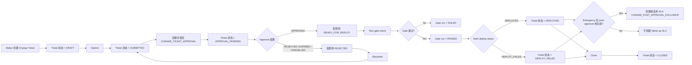
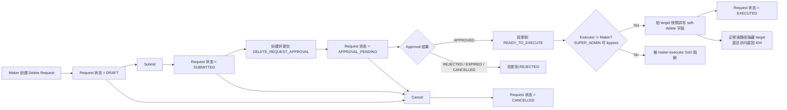
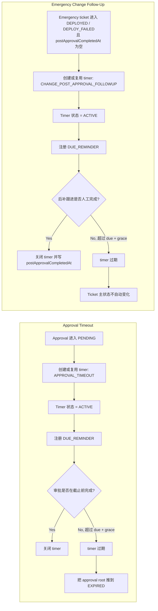

Status: active
Owner: project-owner-and-agents
Last Updated: 2026-03-31
Applies To: `Exchange_js`
Supersedes: none
Depends On: `docs/roadmap/project-version-plan.md`, `docs/constraints/governance-approval-constraints.md`, `docs/constraints/governance-change-ticket-constraints.md`, `docs/constraints/governance-delete-request-constraints.md`, `docs/constraints/governance-sla-timer-constraints.md`, `docs/constraints/rbac-member-management-constraints.md`, `docs/constraints/audit-logging-constraints.md`, `docs/specs/entities/approval-case-entity.md`, `docs/specs/entities/change-ticket-entity.md`, `docs/specs/entities/delete-request-entity.md`, `docs/specs/entities/governance-sla-timer-entity.md`, `docs/specs/modules/approvals-module.md`, `docs/specs/modules/rbac-member-management-module.md`, `docs/specs/workflows/change-ticket-release-gate-workflow.md`, `docs/specs/workflows/delete-request-soft-delete-workflow.md`, `docs/specs/workflows/governance-sla-timer-workflow.md`, `docs/specs/workflows/audit-evidence-export-approval-workflow.md`
Source of Truth Level: product-narrative-supporting-doc

# Wave 1 串讲稿：控制底座（Control Foundation）

## 文档目的
- 本文是一份面向开发、产品、内部讲解场景的 `Wave 1` 串讲稿。
- 它的用途是帮助讲解者从产品视角把 `Wave 1` 讲清楚，而不是替代 `constraints`、`specs`、`acceptance` 或 `roadmap`。
- 如果本文与系统运行时真相冲突，以 `docs/constraints/**` 和 `docs/specs/**` 为准。

## 使用方式
- 适合在正式进入代码、表结构、页面之前，用来给开发建立系统全局认知。
- 推荐讲解顺序：
1. 开场定义
2. Wave 1 官方范围
3. 核心对象
4. 六块能力逐一展开
5. 三张关键流程图
6. Wave 1 如何支撑后续波次
- 这份稿子适合 `15-25` 分钟的口头串讲。

## 开场定义
- `Wave 1` 不是第一条客户业务主链。
- `Wave 1` 是整个平台的控制底座。
- 它先回答 5 个平台级问题，之后 `onboarding`、`deposit`、`swap`、`withdraw` 才能被视为合格的业务闭环：
1. 谁可以操作
2. 哪些动作必须走 maker-checker
3. 哪些条件不满足时必须阻断
4. 哪些动作必须写入统一审计
5. 证据如何被导出、审批、回放

## Wave 1 官方范围
- `Wave 1` 当前官方范围固定为：
1. `WF-01 Audit Events + Evidence Export`
2. `WF-02 RBAC + Auth Boundary`
3. `WF-03 SoD Block + Maker-Checker`
4. `WF-04 Notice Registry + SLA Timers`
5. `WF-05 Retention + Delete Gate`
6. `WF-06 Change Ticket + Release Gate`
- `Wave 1` 不负责把客户资金主链跑通。
- 它负责先定义一套后续所有波次都会复用的治理规则。

## 一开始就要点名的核心对象
- `User`
- `Role`
- `Permission`
- `ApprovalCase`
- `ChangeTicket`
- `DeleteRequest`
- `SlaTimer`
- `AuditLogEvent`
- `AuditEvidencePackage`

## 推荐讲法

### 第一部分：为什么系统要从这里开始
- 开场建议直接说：
  `这个平台不是从充值、兑换、提现开始，而是从控制开始。`
- 然后补一句解释：
  `如果后面的每条业务链都各自发明一套审批、导出、删除、发布规则，系统最后一定会出现多个彼此冲突的控制面。Wave 1 的任务就是先把统一控制面搭起来。`

### 第二部分：RBAC 与后台身份边界
- 产品含义：
  `系统在治理动作之前，必须先知道谁是操作者、操作者属于哪条身份边界。`
- 当前运行时真相：
1. admin member 采用邀请激活制
2. 权限真相在 `user_roles + role_permissions`
3. `users.role` 只是兼容/展示字段，不是授权真相
4. `Platform Members` 是创建成员和绑定角色的主入口
5. `Role Management` 是只读角色目录说明页，不是角色创建工具
- 对开发的解释建议：
  `Wave 1 有意冻结了运行时角色创建。当前系统支持快速创建成员、绑定已有角色，但不支持在后台自由新建角色。这是治理上的简化，不是漏了 CRUD。`
- 站在更成熟运营体系的产品判断：
  `长期看，平台应该支持自定义角色，但角色创建本身应该是一个治理动作，而不是随手点一下就生效的后台功能。`

### 第三部分：审批引擎与 Maker-Checker
- 产品含义：
  `Approval Case` 是全平台共享的治理对象，用来承载需要第二双眼睛的敏感动作。`
- 当前 approval action type 固定为 `5` 类：
1. `AUDIT_EVIDENCE_EXPORT_APPROVAL`
2. `CASE_EVIDENCE_EXPORT_APPROVAL`
3. `CHANGE_TICKET_APPROVAL`
4. `DELETE_REQUEST_APPROVAL`
5. `ONBOARDING_FINAL_APPROVAL`
- 当前审批状态机：
1. `DRAFT`
2. `PENDING`
3. `APPROVED`
4. `REJECTED`
5. `EXPIRED`
6. `CANCELLED`
- 当前执行状态：
1. `NOT_EXECUTED`
2. `EXECUTED`
3. `EXECUTION_FAILED`
- 当前 Wave 1 审批仍然是单步审批，不支持多级串行、并行或每单自定义 checker policy。

#### Maker-Checker 实际是怎么定义的
- 讲给开发时建议拆成 3 层：
1. `permission`
   - 决定你能不能进入这个页面、接口或动作面
2. `approval action type`
   - 决定这个业务动作本身是不是审批型动作
3. `checkerRoles`
   - 决定哪些治理角色有资格来审批它
- 当前系统不是 `permission -> checker`，而是 `actionType -> checkerRoles`。
- 当前默认 checker 角色集合如下：
1. 审计证据导出 -> `DPO`、`MLRO`
2. 案件证据导出 -> `DPO`、`MLRO`
3. Change Ticket -> `CISO`、`TECH_ADMIN`
4. Delete Request -> `DPO`、`TECH_ADMIN`
5. Onboarding Final Approval -> `SM`

#### Maker、Checker、SoD 到底怎么理解
- 建议原话讲给开发：
  `Maker 不是没配置，而是配置在上游发起动作的权限和范围里；Checker 才是配置在 approval policy 里。`
- 当前 SoD 规则很明确：
  `同一个用户不能既当 maker 又当 checker`
- `SUPER_ADMIN` 可以 bypass，但审计里必须带 `superAdminBypass=true`
- 站在更成熟产品设计的判断：
  `如果未来支持自定义角色，checker 的资格依然最好挂在稳定的审批责任组或审批策略上，而不是直接挂在裸 permission 上。`

### 第四部分：统一审计与证据导出
- 产品含义：
  `Wave 1 不把日志当成技术输出，而把审计当成产品对象。`
- 当前规则重点：
1. 新的治理写入必须走统一审计
2. 证据导出本身必须审批背书
3. 导出动作自己也要写审计
4. 检索默认是 `No-first`，不是裸 UUID-first
- 讲解时建议强调：
  `敏感动作在这个平台里，只有做成了治理动作并写进统一审计，才算真正完成。`
- 一句很好用的话术：
  `一个敏感导出，不是下载动作，而是一条审批背书的证据生产工作流。`

### 第五部分：Change Ticket 与 Release Gate
- 产品含义：
  `Change Ticket` 是变更治理根对象，不是一张发布备注单。`
- 当前 canonical `changeType` 固定为 `6` 类：
1. `ADMIN_ACCESS_CHANGE`
2. `RBAC_CATALOG_CHANGE`
3. `GOVERNANCE_POLICY_CHANGE`
4. `COMPLIANCE_WORKFLOW_CHANGE`
5. `CUSTOMER_LIFECYCLE_WORKFLOW_CHANGE`
6. `AUDIT_EVIDENCE_POLICY_CHANGE`
- 对开发的解释建议：
  `这些类型不是技术标签，而是治理标签。它们说明这次变更影响的是哪类控制对象。`

#### Change Ticket 状态机
- 当前状态集合：
1. `DRAFT`
2. `SUBMITTED`
3. `APPROVAL_PENDING`
4. `REJECTED`
5. `READY_FOR_DEPLOY`
6. `DEPLOYED`
7. `DEPLOY_FAILED`
8. `CLOSED`

#### Change Ticket 每一步到底在干嘛
- `DRAFT`
  - maker 在定义变更意图
  - 这张票开始成为一个可治理、可审计的变更对象
- `SUBMITTED`
  - maker 表示这张票已经准备好进入治理流程
  - 它是一个短暂的交接状态，不是主要等待状态
- `APPROVAL_PENDING`
  - 系统创建并提交一个 `CHANGE_TICKET_APPROVAL`
  - 这一步在回答：这张变更是否被治理上授权
- `READY_FOR_DEPLOY`
  - 治理授权已经完成
  - 但这还不等于已经部署完成
- `gate-check`
  - 平台校验这一次具体的部署尝试是否满足前置条件
  - 它校验的是某个具体环境、某个具体版本是否允许执行
  - 当前最小必备证据包括：
1. `changeType`
2. `scopeSummary`
3. `riskLevel=HIGH`
4. `testEvidenceRef`
5. `rollbackPlanRef`
6. `latestApprovalStatus=APPROVED`
- `DEPLOYED / DEPLOY_FAILED`
  - 操作者把真实执行结果回写到治理对象上
  - 这一步把“治理上批准过什么”和“实际上发了什么”绑定起来
- `CLOSED`
  - 这次变更的治理生命周期收口
- `emergency = true`
  - 部署后如果还没完成后补跟进，就会挂一个 SLA follow-up

#### Change Ticket 最好用的一句总结
- 直接讲：
  `Approval 决定这次变更是否被授权，Gate Check 决定这次具体部署尝试是否合法，Deploy Mark 决定真实执行结果是否被治理对象接住。`

### 第六部分：Delete Request 与 Soft Delete Gate
- 产品含义：
  `Delete Request` 把删除从数据库操作变成了一个治理工作流。`
- 当前支持的 target type 只有 `4` 个：
1. `CHANGE_TICKET`
2. `AUDIT_EVIDENCE_PACKAGE`
3. `COMPLIANCE_CASE_EVIDENCE_PACKAGE`
4. `ADMIN_USER`
- 当前 delete request 状态机：
1. `DRAFT`
2. `SUBMITTED`
3. `APPROVAL_PENDING`
4. `READY_TO_EXECUTE`
5. `EXECUTED`
6. `EXECUTION_FAILED`
7. `REJECTED`
8. `CANCELLED`

#### 为什么系统需要 Delete Request
- 建议这样讲：
  `顶层治理对象不能被裸删。它的退役必须被看见、被审批、被快照、被审计，而且删完以后这条治理链还要能被回看。`
- 当前规则里最值得点名的地方：
1. approval 结果投影到 delete request 状态
2. execute 前必须重新校验 approval 是否真的通过
3. execute 前必须先拍下 target snapshot
4. 正常读路径要隐藏软删对象
5. 对被删对象的直达详情或下载必须返回 `404`

#### Delete Request 最好用的一句总结
- 直接讲：
  `在这个平台里，删除不是 SQL，而是治理动作。`

### 第七部分：SLA Timer
- 产品含义：
  `Wave 1 的 SLA 是治理工作流的时间控制层。`
- 当前运行时范围是刻意收窄的。
- 当前 timer type 只有 `2` 个：
1. `APPROVAL_TIMEOUT`
2. `CHANGE_POST_APPROVAL_FOLLOWUP`
- 当前 timer 状态也只有 `3` 个：
1. `ACTIVE`
2. `CLOSED`
3. `EXPIRED`
- 当前通知注册表也只有 `2` 类：
1. `DUE_REMINDER`
2. `EXPIRE_MARK`
- 要特别强调：
  `当前 notification registry 不是发邮件/短信/站内信的消息系统，而是一个时间事件注册表。`

#### SLA 流程本质
- 讲解时建议先下一个总定义：
  `SLA 不是提醒器，而是时间驱动的责任治理机制。`
- 可以拆成 4 层讲：
1. 定义义务
   - 谁必须在多久内处理什么事
2. 跟踪时间
   - `dueAt`、`grace window`、`overdue`、`breach`
3. 推动责任
   - 到期前提醒当前责任组，超时后把责任上收给更高责任组
4. 施加后果
   - 如果最终还是没人处理，SLA 必须反作用到原始 workflow，而不只是留下一条提醒记录
- 一句很适合讲给开发的话术：
  `定时通知和责任升级只是手段，不是 SLA 的全部；只有当超时最终会改变业务状态，SLA 才是完整的治理流程。`
- 放到 `approval` 场景里，完整语义应该是：
1. 到期前提醒当前审批责任组
2. 超时后把责任从 `L0` 升级到 `L1`
3. 如果最终仍未处理，把 `approval` 推到 `EXPIRED`
- 这里要主动区分“目标态”和“当前 Wave 1 现状”：
  `从产品本质上讲，SLA 应该包含义务、时间、责任升级和超时后果四层；但当前 Wave 1 运行时更接近 SLA V1，已经具备时限、提醒、过期和部分状态联动，但还没有完整的责任组升级链。`

#### Approval Timeout：一步一步讲
- `DRAFT`
  - 不创建 SLA
  - 因为这时还没有正式形成待处理义务
- `PENDING`
  - 系统创建或复用一个 `APPROVAL_TIMEOUT`
  - timer 绑定到 `approvalNo`、`workflowNo`、`subjectNo`、`traceId`
  - 同时注册一条 `DUE_REMINDER`
- 截止前
  - timer 保持 `ACTIVE`
  - 平台明确知道这是一条有时限的治理义务，但还没有 breach
- 到了 `dueAt`
  - `DUE_REMINDER` 被触发
  - 但 timer 还不一定立刻 `EXPIRED`，因为还有 grace window
- 超过 `dueAt + grace`
  - timer 进入 `EXPIRED`
  - approval root 也会被主动推进到 `EXPIRED`
  - 后续治理对象再消费这个审批过期结果
- 如果审批在时限内完成
  - timer 自动 `CLOSED`
  - 未触发的 reminder 会被标为 `SKIPPED`

#### Change Follow-Up：一步一步讲
- 当 emergency ticket 进入 `DEPLOYED` 或 `DEPLOY_FAILED`
- 且 `postApprovalCompletedAt` 仍然为空时
  - 系统创建或复用一个 `CHANGE_POST_APPROVAL_FOLLOWUP`
- 这个 timer 追踪的不是“部署有没有完成”
  - 而是“后补跟进有没有按时完成”
- 人工 `close` 这个 timer 时
  - 系统也会回写 `postApprovalCompletedAt`
- 如果 timer 过期
  - timer 本身变成 `EXPIRED`
  - 但 change ticket 主状态不会被自动推进

#### 为什么当前 SLA 会让人觉得只是个定时器
- 这里建议直接讲清楚：
  `这个感觉是对的。当前 Wave 1 的 SLA 更接近一个 V1 timer registry，而不是完整的升级治理引擎。`
- 当前它已经具备：
1. 明确 due time
2. grace window
3. reminder registry
4. expiry audit
5. approval timeout 对 approval root 的过期联动
- 但它还没有具备：
1. owner escalation chain
2. backup checker 自动接管
3. 上级责任链升级
4. 独立 obligation work item
5. 多阶段 breach ladder

#### 如果以后要把 Excel 里的 obligation / controls 做进系统
- 更可能的演进对象会是：
1. `Obligation`
2. `FollowUpWorkItem`
3. `EscalationRule`
4. `EscalationEvent`
- 这样 SLA 才会从“时间记录器”升级为“时间治理引擎”
- 但这不是当前 Wave 1 的运行时真相，只是未来可扩展方向

## 三张流程图

### Change Ticket 工作流

### Delete Request 工作流

### SLA 工作流

## 对象之间的关系一句话讲清
- `RBAC` 决定谁能进入治理动作面
- `Approval Case` 决定敏感动作能不能被第二人授权
- `Change Ticket` 决定变更能不能被治理地发布
- `Delete Request` 决定删除能不能被治理地执行
- `SLA Timer` 决定这些治理动作有没有按时被处理
- `Audit Log` 把上述所有治理动作串回统一可回放链路

## 串讲收尾建议
- 收尾时建议说：
  `从 Wave 2 开始，平台才陆续进入 onboarding、deposit、swap、withdraw 这些业务主链。但后面这些业务并不是重新发明治理，而是建立在 Wave 1 这套控制面之上。`

## 一段话总结
- `Wave 1` 建立的是平台控制面。
- 它把后台身份边界、敏感动作审批、变更治理、删除治理、统一审计、审批背书的证据导出、以及治理型 SLA 时间控制先搭起来。
- 后面的每条业务链都不是裸跑，而是挂在这套控制底座上继续长出来。
