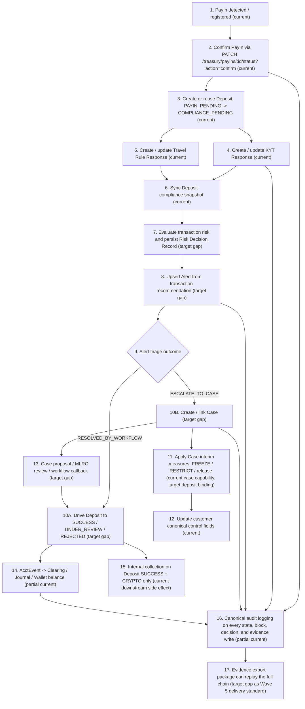

Status: active
Owner: project-owner-and-agents
Last Updated: 2026-03-26
Applies To: `Exchange_js`
Supersedes: none
Depends On: `docs/roadmap/project-version-plan.md`, `docs/constraints/customer-transaction-flow-constraints.md`, `docs/constraints/internal-transaction-flow-constraints.md`, `docs/constraints/compliance-alert-incident-constraints.md`, `docs/constraints/audit-logging-constraints.md`
Source of Truth Level: roadmap

# Wave 5 充值主链分阶段规划（PayIn -> Deposit）

## 1. 文档目的

本文件用于把总版本规划中的 `Wave 5` 进一步展开成一份可执行的充值主链专项规划文档，统一回答这几个问题：

- `Wave 5` 的最终目标闭环到底是什么。
- 当前代码已经实现了什么，哪些只是局部锚点，哪些关键链路仍然缺失。
- 后续实现线程应该先补哪些 gap，哪些 contract 需要先冻结。

适用原则：

- 本文是 `Wave 5` 的 roadmap / phase plan 文档，不替代 `docs/constraints/**` 与 `docs/specs/**`。
- 当本文与约束或规格发生冲突时，以 `docs/constraints/**`、`docs/specs/**` 为准。
- 本文允许记录“目标态 / planned gap / future contract”，但这些内容必须明确标注为目标态，不能冒充当前实现真相。

### 当前状态说明

- `Phase 0-4` 对应的 runtime 实现已经落地。
- `Wave 5` 的 durable runtime truth 现已迁移到：
  - `docs/constraints/customer-transaction-flow-constraints.md`
  - `docs/constraints/internal-transaction-flow-constraints.md`
  - `docs/specs/workflows/payin-deposit-canonical-workflow.md`
  - `docs/specs/entities/inbound-transfer-signal-entity.md`
  - `docs/specs/entities/payin-entity.md`
  - `docs/specs/entities/deposit-transaction-entity.md`
  - `docs/acceptance/wave-5-payin-deposit-final-acceptance-checklist.md`
  - `docs/acceptance/wave-5-deposit-accounting-blocked-runbook.md`
  - `docs/acceptance/wave-5-deposit-evidence-export-runbook.md`
- `Wave 5` cleanup / closeout 已完成；`docs/cleanup/wave-5-cleanup-master-plan.md` 现仅保留为历史 closure record。
- 下文 remaining gaps / gap inventory 主要保留历史规划上下文，不再代表当前 runtime 真相，也不代表当前 active backlog。
- `Wave 1-4` 已经完成控制底座、合规中台、客户准入主线，以及账务/钱包/定价底座。
- 当前代码已经存在这些 `Wave 5` 相关实现锚点：
  - `src/modules/asset-treasury/payins/**`
  - `src/modules/trading/deposit-transactions/**`
  - `src/orchestrators/deposit-workflow.service.ts`
  - `src/modules/risk-engine/transaction-compliance/**`
  - `src/modules/risk-engine/compliance-alerts/**`
  - `src/modules/risk-engine/compliance-incidents/**`
  - `src/orchestrators/internal-collection-workflow.orchestrator.ts`
  - `src/modules/risk-engine/audit-logs/**`
- 当前 runtime 已具备：
  - `PayIn -> Deposit` 的初始检测与推进锚点
  - deposit 侧 `KYT / Travel Rule` provider response 容器创建与 snapshot 同步
  - deposit 事件触发 accounting hook
  - case 对 customer `FREEZE / RESTRICT` 的控制能力
  - deposit 成功后的 crypto internal collection 侧效应
- 在本 phase plan 起草时，runtime 仍未形成一条正式定义完成的充值闭环：
  - 交易侧 `risk decision record` 还没有像 onboarding / periodic review 一样落为正式闭环
  - `tx compliance -> alert/case` 桥接仍未真正接通
  - `alert/case -> deposit workflow` 的交易侧回驱 contract 尚未正式定义
  - 充值证据链虽有分段留痕，但尚未以 `Wave 5` 名义收束成统一交付标准

---

## 2. Wave 5 总目标

`Wave 5` 的正式目标是完成客户“资金进入系统”的第一条真实业务主链，并把当前散落在多个模块里的充值锚点收束成一条完整、可审计、可阻断、可取证、可演示的交易工作流。

本波目标闭环固定为：

1. `PayIn ingestion`
2. `PayIn` 状态推进
3. `Deposit` 创建与状态机推进
4. `KYT / Travel Rule` response 容器创建与更新
5. 交易侧 `Risk Decision Record`
6. `Alert` upsert 与 triage
7. `Case` escalation、proposal、measure、MLRO review
8. customer canonical control state 变更
9. `Deposit` 成功 / 挂起 / 拒绝的 workflow 回驱
10. `AcctEvent -> Clearing / Journal / Wallet Balance`
11. `Audit trace -> evidence package`

本波成功标志不是“页面更多了”，而是：

- 充值主线不再停留在 `PayIn / Deposit / tx response / case / accounting` 各自独立存在。
- 每个关键动作都能回答：
  - 谁触发
  - 改了哪些主体
  - 会阻断什么
  - 写了哪些审计
  - 如何幂等 / 重试 / 补偿
- 一条充值链可以稳定串出：
  - `payinId`
  - `depositId`
  - `riskDecisionRecordId`
  - `kyt / travel rule response`
  - `alertId / caseId`
  - `journalId`
  - `audit evidence package`

---

## 3. 主体全景图

### 3.1 主体与边界

| 主体 | 当前状态机 / 生命周期 | 当前职责 | 主要驱动者 | 会反向影响 |
| --- | --- | --- | --- | --- |
| `PayIn` | `FIAT: DETECTED -> CONFIRMED -> CLEARED / FAILED`；`CRYPTO: DETECTED -> CONFIRMING -> CONFIRMED -> CLEARED / FAILED` | 承载外部到账检测、回执登记、与 `Deposit` 的绑定根 | payin service、operator、未来 provider callback | 创建或复用 `Deposit`；写 audit；推进充值 workflow 根触发 |
| `Deposit` | `PAYIN_PENDING -> COMPLIANCE_PENDING -> SUCCESS / UNDER_REVIEW / REJECTED / FAILED` | 客户充值业务交易主体 | deposit service、deposit workflow、后续 case 回驱 | 驱动 tx compliance snapshot、accounting、internal collection、admin/client read model |
| `KYT Response` | 证据容器生命周期统一为 `CREATED -> RECEIVED -> FINAL` | 承载 deposit 侧 transaction screening evidence container | transaction-compliance service、provider callback/mock | 更新 deposit snapshot；风险判断由 decision record / alert / case callback 承担 |
| `Travel Rule Response` | 证据容器生命周期统一为 `CREATED -> RECEIVED -> FINAL` | 承载 counterparty information exchange evidence container | transaction-compliance service、provider callback/mock | 更新 deposit snapshot；不再直接等同于风险放行结论 |
| `Risk Decision Record` | `CREATED -> COMPLETED / FAILED` | 作为 risk explanation root，沉淀 decision、reasonCodes、recommendedActions | risk engine evaluate | 上游解释 `alert / case` 编排，不直接等同于 `Alert` 或 `Case` |
| `Alert` | `OPEN -> ASSIGNED -> ESCALATED -> CLOSED` | triage kernel，承接 risk recommendation 并决定是 workflow clear 还是 escalate | compliance alerts service、operator | 触发 case escalation；后续应回驱 deposit workflow |
| `Case` | `OPEN -> ASSIGNED -> INVESTIGATING -> PENDING_MLRO_REVIEW -> CLOSED` | investigation kernel，承接 escalation、measure、proposal、MLRO review、filing follow-up | compliance cases service、investigator、MLRO | 可写 customer control state；后续应回驱 deposit workflow |
| `Customer control state` | 组合字段：`operatingStatus`、`restrictionStatus`、`complianceHoldStatus` | 表达客户是否可操作、是否受限、是否被冻结 | compliance case measures | 阻断充值成功推进、阻断客户登录或交易能力 |
| `Journal / Clearing / Wallet balance` | 事件驱动 durable output，不是 customer-visible workflow 状态机 | 沉淀记账、清分、余额投影 | journals / clearing / wallet balance projection | 提供最终账务证据与资金状态 |
| `Internal collection` | `deposit SUCCESS` 后的 downstream treasury side effect | 对 `CRYPTO` 充值执行 `DEP_TO_MASTER` 归集 | internal collection orchestrator | 不改变 customer-visible deposit 主状态机，但会产生内部资金事实与审计 |
| `Audit evidence package` | `PENDING_APPROVAL -> READY` | 将充值链条上的关键动作导出为统一证据包 | audit logging + approvals | 为 UAT、demo、审计取证提供统一导出物 |

### 3.2 完整工作流图

下面这张图描述的是 `Wave 5` 目标闭环，其中：

- 标注 `current` 的节点表示当前代码已有明确实现锚点。
- 标注 `target gap` 的节点表示当前未形成正式闭环，属于本波必须补齐的目标。

### 3.3 步骤影响矩阵

| 步骤 | 触发点 | 修改主体 | 审计 / 证据 | Event / Template | Block / Retry / Idempotency | 当前状态 |
| --- | --- | --- | --- | --- | --- | --- |
| `PayIn detect/register` | 手工模拟、未来 provider callback | `payin`，必要时后续绑定 `deposit` | `PAYIN_CREATED` audit | 无统一 accounting event | 需要 payin ingestion 幂等；当前更多是 demo 入口 | 部分已有 |
| `PayIn confirm` | `PATCH /treasury/payins/:id/status` | `payin.status`、`deposit.status` | `PAYIN_*`、`DEPOSIT_*` audit | 触发 `deposit.status.changed` 链 | deposit 主入口必须幂等，重复 confirm 不得重复推进 | 部分已有 |
| `Deposit compliance sync` | payin confirmed | `kytCase`、`travelRuleCase`、`deposit` snapshot | `KYT_CASE_*`、`TRAVEL_RULE_*`、`DEPOSIT_COMPLIANCE_EVIDENCE_SYNCED` | 无正式 risk event | callback idempotency 已有规则；仍缺 workflow 级桥接 | 部分已有 |
| `Transaction risk decision` | tx response snapshot ready | `workflowDecisionRecord` | risk decision audit / trace | future risk evaluate contract | 必须可重放，当前 deposit 场景未正式接入 | 缺失 |
| `Alert upsert` | risk recommendation | `alert` | `ALERT_*` audit | alert dedupe key | 相同 source/stage 应 dedupe；当前交易侧未接入 | 缺失 |
| `Case escalation / measures` | alert triage / case action | `case`、`customer control state` | `INCIDENT_*` audit | 无 transaction workflow callback | 当前 case measure 能力已有，但未绑定 deposit 回驱 | 部分已有 |
| `Workflow callback to deposit` | alert resolved / MLRO approved | `deposit` | workflow-bound audit trace | deposit status transition + accounting event | 必须防止重复回驱、非法回驱 | 缺失 |
| `Accounting / balance` | deposit confirmed / success | `journal`、`clearing`、`wallet balance` | `DEPOSIT_ACCOUNTING_POSTED` audit | `EVT_DEPOSIT_CONFIRMED__*`、`EVT_DEPOSIT_SUCCESS__*` | missing template hard fail；重放不得重复记账 | 部分已有 |
| `Internal collection` | deposit success + crypto | `internal_transaction`、`internal_fund` | internal tx audit | `DEP_TO_MASTER` related events | 以 `(sourceType, sourceId, type)` 幂等 | 已有 |
| `Evidence export` | operator 发起导出并审批 | `audit_evidence_packages` | `EVIDENCE_EXPORT` audit | evidence package manifest/digest | 导出必须 approval-backed；充值链尚未收束成标准包 | 部分已有 |

---

## 4. 初始现状评审与实现锚点（历史规划上下文）

### 4.1 当前代码锚点

| 领域 | 当前锚点 |
| --- | --- |
| PayIn 入口与状态机 | `src/modules/asset-treasury/payins/payins.controller.ts`、`payins.service.ts`、`dto/payin.dto.ts` |
| Deposit 入口与状态机 | `src/modules/trading/deposit-transactions/deposit-transactions.controller.ts`、`deposit-transactions.service.ts`、`dto/deposit-transaction.dto.ts` |
| Deposit 编排 | `src/orchestrators/deposit-workflow.service.ts` |
| Tx compliance 容器 | `src/modules/risk-engine/transaction-compliance/transaction-compliance.service.ts`、`transaction-compliance-admin.controller.ts` |
| Risk / Alert / Case | `src/modules/risk-engine/risk-engine.service.ts`、`risk-decision-records.service.ts`、`compliance-alerts.service.ts`、`compliance-incidents.service.ts` |
| Accounting contract | `src/modules/accounting/acct-events/acct-config.service.ts`、`src/modules/accounting/journals/journals.service.ts` |
| Internal collection | `src/orchestrators/internal-collection-workflow.orchestrator.ts` |
| Audit / evidence | `src/modules/risk-engine/audit-logs/**` |

### 4.2 起草时已确认事实

> 注：本节记录的是本 phase plan 初次落档时的 planning baseline。当前 active truth 以本文前述 durable references 与 `constraints/specs/acceptance` 为准。

- `transaction-compliance` 已能在 `payin confirmed` 时创建 / 更新 deposit 侧 `KYT` 和 `Travel Rule` response 容器，并同步 `deposit` lifecycle snapshot 字段。
- 当前 `maybeTriggerKytAlert()` 与 `maybeTriggerTravelRuleAlert()` 明确仍是 no-op，交易侧并没有真正接上 `Alert / Case` 闭环。
- `risk-engine` 当前 `contextType` 和 orchestrator 主要服务 onboarding / periodic review；交易场景 `decision record` 不是现成闭环。
- `compliance case` 已支持 `TRANSACTION` 类型，也支持 `FREEZE / UNFREEZE / RESTRICT / UNRESTRICT`，并能写 customer canonical control fields。
- `deposit` 已有状态机、audit、confirmed / success accounting hook、success 后 crypto internal collection 侧效应，但“完整充值闭环”尚未被正式定义。
- 当前 `deposit` 的 accounting event 合同只显式校验：
  - `EVT_DEPOSIT_CONFIRMED__CRYPTO`
  - `EVT_DEPOSIT_CONFIRMED__FIAT`
  - `EVT_DEPOSIT_SUCCESS__CRYPTO`
  - `EVT_DEPOSIT_SUCCESS__FIAT`
- 当前测试已经能静态证明这些局部锚点存在：
  - `deposit-transactions.service.spec.ts`
  - `deposit-workflow.service.spec.ts`
  - `transaction-compliance.service.spec.ts`
  - `compliance-incidents.service.spec.ts`
  - `audit-logs.service.spec.ts`

### 4.3 历史 Gap 清单

| 能力类别 | 当前实现锚点 | 状态 | 缺的是什么 | 为什么会阻塞完整 Wave 5 | 后续应落档层级 |
| --- | --- | --- | --- | --- | --- |
| `payin` 状态机与入口路径 | `payins.service.ts`、`payins.controller.ts` | 部分已有 | 缺正式 `provider callback / manual receipt / ingestion idempotency` 合同；crypto / fiat 差异仍是局部实现 | 没有稳定入口 contract，就无法把充值主线定义为可复用业务工作流 | roadmap + constraints + code |
| `deposit` 状态机与重试/补偿路径 | `deposit-transactions.service.ts`、`deposit-workflow.service.ts` | 部分已有 | 缺“主线入口 vs manual compensation path”的正式专项定义；缺 case 回驱后的合法状态转移合同 | 没法保证充值不是靠人工点状态完成 | roadmap + constraints + specs + code |
| `transaction-compliance` response 容器与 snapshot 同步 | `transaction-compliance.service.ts` | 部分已有 | 已有 response container upsert，但缺与后续 risk / alert / case 的正式桥接 | 只能停在 provider response 记录，无法形成交易治理闭环 | constraints + specs + code |
| 交易场景 `risk decision record` | `risk-engine.service.ts`、`risk-decision-records.service.ts` | 缺失 | 缺 `DEPOSIT` 上下文 evaluate contract、交易 signals、decision output 与 trace binding | 没有上游解释根，后续 alert / case 编排会失去统一依据 | specs + code |
| `tx compliance -> alert / case` 桥接 | `maybeTriggerKytAlert()`、`maybeTriggerTravelRuleAlert()` 明确 no-op | 缺失 | 缺 transaction recommendation -> alert upsert / escalate contract | 交易风险 hit 后无法进入 triage / investigation 主链 | constraints + specs + code |
| `alert / case -> deposit workflow` 回驱 | 当前只在 onboarding / periodic review 明确存在 workflow-bound transition | 缺失 | 缺 deposit 场景的 workflow proposal、MLRO approval、deposit callback 语义 | case 做完调查后无法正式推动充值成功 / 挂起 / 拒绝 | specs + code |
| `case -> freeze / restrict` 对 customer canonical fields 的影响 | `compliance-incidents.service.ts` | 部分已有 | measure 本身已有，但缺 transaction case 与 deposit gate 的正式绑定规则 | 限制动作存在却不一定真正阻断充值链路的关键节点 | constraints + specs + code |
| `deposit -> AcctEvent / Journal / Clearing / balance` 接线完整度 | `deposit-workflow.service.ts`、`acct-config.service.ts` | 部分已有 | confirmed / success 已有锚点，但 reject / hold / retry / replay contract 仍未收束为 Wave 5 交付标准 | 账务侧无法稳定支撑完整充值闭环验收 | constraints + specs + acceptance + code |
| `deposit success -> internal collection` 的边界与归属 | `internal-collection-workflow.orchestrator.ts` | 部分已有 | 运行时已有 side effect，但 Wave 5 文档里尚未正式声明它只是 downstream treasury effect | 充值主线容易和内部资金流主线混淆，影响范围判断 | roadmap + constraints |
| `audit logging / trace / evidence chain` 完整度 | `audit-logs.service.ts`、audit workflow specs | 部分已有 | 分段留痕已存在，但缺正式 `payin -> deposit -> decision -> alert/case -> journal -> export` 统一证据链标准 | 没法用同一套证据包证明 Wave 5 完成 | constraints + specs + acceptance + code |
| admin / client read model 与异步收敛 | admin/client 页面与交易接口 | 部分已有 | 缺交易侧 workflow 中间态、case 处理中状态、回驱结果的统一 read-model 和 UI async convergence contract | 用户与操作员看到的只是局部状态，无法支撑演示与排查 | constraints + specs + code |
| connector / callback 合同 | 目前以 mock / manual placeholder 为主 | 缺失 | 缺最小 provider connector v1 的请求、回调、签名、幂等合同 | 没法把 “ingestion + response update” 从 demo helper 升级为业务主线 | roadmap + constraints + code |

---

## 5. Wave 5 规划

### 5.1 `P0` 官方 Wave 5 必做

本轮将 `Wave 5` 的 `P0` 明确定义为“完整充值闭环”，至少包括以下内容：

1. 工作流主链
   - 明确定义 `PayIn -> Deposit` 主工作流。
   - 明确定义 `PayIn` 与 `Deposit` 双状态机。
   - 锁定 canonical entry path：
     - `PATCH /treasury/payins/:id/status?action=confirm` 是充值主线入口。
     - `PATCH /deposit-transactions/:id/status?action=payin_confirmed` 仅是 manual compensation path，不是正常主线。
   - 锁定 crypto / fiat 差异：
     - crypto payin 含 `CONFIRMING`
     - fiat payin 不经过该中间态

2. 交易合规与风险决策
   - 定义 deposit 侧 `KYT / Travel Rule` response 创建 / 更新节点。
   - 定义 callback idempotency 与 response append-report contract。
   - 定义 transaction `Risk Decision Record` 节点：
     - 输入快照
     - `policyVersion`
     - `reasonCodes`
     - `recommendedActions`
     - output status

3. `Alert / Case` 桥接
   - 定义 risk recommendation 如何 upsert `Alert`。
   - 定义哪些场景仅 `Alert` 解决，哪些场景必须 escalate 到 `Case`。
   - 定义 `Case` 如何承接：
     - `FREEZE / UNFREEZE`
     - `RESTRICT / UNRESTRICT`
     - workflow proposal
     - MLRO review

4. workflow 回驱与 customer control
   - 定义 `Alert / Case` 处理后如何正式回驱 `Deposit`：
     - `SUCCESS`
     - `UNDER_REVIEW`
     - `REJECTED`
   - 定义 `freeze / restrict` 如何写 customer canonical fields：
     - `operatingStatus`
     - `restrictionStatus`
     - `complianceHoldStatus`
   - 定义这些字段如何阻断充值继续推进到成功入账

5. 账务与取证
   - 定义充值节点对应的 `AcctEvent / Clearing / Journal / Wallet balance` 合同。
   - 定义 `Deposit SUCCESS` 与 internal collection 的边界：
     - internal collection 是 downstream treasury side effect
     - 不是 customer-visible deposit 主状态机的一部分
   - 定义 Wave 5 的 evidence chain 最低标准：
     - `payinId -> depositId -> riskDecisionRecordId -> tx response -> alertId / caseId -> journalId -> export package`

### 5.2 建议本波预留 contract，但实现可后置

- richer provider connector callback contract：
  - callback signature
  - callback payload normalization
  - operator/manual override metadata
- 更细的 transaction risk policy context：
  - source wallet / counterparty / channel / network / amount band / repeated behavior
- 更完整的 case disposition taxonomy：
  - 针对 transaction case 的最终结论与 filing follow-up 展开
- deeper internal treasury follow-up：
  - `Deposit SUCCESS` 之后更多运营 / treasury 编排
- 更细的 admin/client async convergence contract：
  - polling
  - intermediate status rendering
  - stale response reconciliation

### 5.3 明确不属于本波

- `swap`
- `withdraw / payout`
- full safeguarding reconciliation
- 非充值主链的治理台账与运营扩展
- 对 `Wave 1-4` 既有 contract 的破坏性重写

### 5.4 分阶段执行建议

| Phase | 名称 | 目标 | 必须收口的 gap | Exit Criteria |
| --- | --- | --- | --- | --- |
| `Phase 0` | 语义冻结与 gap 锁定 | 冻结充值闭环对象、状态机、入口、边界 | 主体全景图、状态机、entry path、gap inventory | 后续线程不再重新讨论“谁是主体、谁驱动谁” |
| `Phase 1` | `PayIn -> Deposit` 工作流闭环 | 先把充值主线自身走通 | payin ingestion、deposit 状态机、manual compensation 边界 | 充值主流程与异常补偿路径都有正式 contract |
| `Phase 2` | `tx compliance -> risk -> alert / case` | 把交易合规容器接到风险与调查主链 | transaction risk decision、alert upsert、case escalation、measure | 交易 hit 不再停在 provider response 容器层 |
| `Phase 3` | workflow 回驱 + customer control | 把调查结果正式回驱到充值交易 | case proposal / MLRO review / deposit callback、freeze/restrict gate | `Deposit` 能被 case 结论正式推进或阻断 |
| `Phase 4` | accounting / audit / evidence closeout | 形成可演示、可导出、可追溯的证据闭环 | accounting contract、trace chain、evidence export、internal collection boundary | Wave 5 DoD、UAT、证据包标准可落地 |

### 5.5 Wave 5 DoD

`Wave 5` 达到完成态，至少需要满足：

1. `PayIn` 与 `Deposit` 状态机正式收口，主线与手工补偿路径明确分离。
2. `KYT / Travel Rule` response 容器创建 / 更新 / callback idempotency 明确。
3. 交易侧 `Risk Decision Record` 成为正式 explanation root。
4. `tx compliance -> alert / case` 真正接通，而不是停在 no-op。
5. `Alert / Case` 结论可正式回驱 `Deposit`。
6. `FREEZE / RESTRICT` 能通过 customer canonical fields 实际阻断充值推进。
7. deposit 关键节点的 `AcctEvent / Journal / Clearing / Wallet balance` 合同清楚且可验证。
8. `Deposit SUCCESS + CRYPTO` 的 internal collection 被明确声明为 downstream treasury side effect。
9. 充值证据链可导出并能回放全链动作。
10. 至少通过 1 条主流程和 1 条异常流程 UAT。

### 5.6 代表性 UAT

主流程：

1. operator 录入或接收 payin
2. payin confirm
3. 系统创建 / 复用 deposit 并进入 `COMPLIANCE_PENDING`
4. 系统创建 / 更新 `KYT / Travel Rule` response
5. risk decision 产出 recommendation
6. alert triage 或 case 调查完成
7. workflow 回驱 deposit 成功
8. 触发 accounting
9. crypto deposit 成功后触发 internal collection
10. Audit Center 可导出完整证据包

异常流程：

1. 同一 payin 重复推送
2. 系统保持幂等，不重复创建 deposit / case / journal
3. risk hit 后 case 对 customer 执行 `FREEZE` 或 `RESTRICT`
4. deposit 不得继续推进到 `SUCCESS`
5. 阻断原因、measure、case 轨迹、账务结果均可查询与导出

---

## 6. 公共接口与类型口径

### 6.1 当前 canonical 接口

| 接口 / surface | 当前语义 | Wave 5 说明 |
| --- | --- | --- |
| `GET /treasury/payins` | 查询 payin 列表 | 当前 canonical payin read model |
| `GET /treasury/payins/:id` | 查询单个 payin | 当前 canonical payin detail |
| `PATCH /treasury/payins/:id/status` | 推进 payin 状态机 | 当前 canonical deposit trigger，应继续作为主线入口 |
| `GET /deposit-transactions` | 查询 deposit 列表 | 当前 canonical deposit list |
| `GET /deposit-transactions/:id` | 查询单个 deposit | 当前 canonical deposit detail |
| `PATCH /deposit-transactions/:id/status` | 推进 deposit 状态机 | 当前仅能视为 manual / compensation path，不应等同主线入口 |
| `POST /admin/compliance/tx-kyt-cases/callback` | KYT provider response callback | 当前 canonical deposit / withdraw KYT callback path |
| `POST /admin/compliance/tx-travel-rule-cases/callback` | Travel Rule provider response callback | 当前 canonical travel rule callback path |
| `GET /admin/compliance/tx-cases/:sourceType/:sourceId` | 聚合 tx compliance 容器读模型 | 当前 canonical tx evidence bundle read model |
| `GET /admin/compliance/alerts` / `PATCH /admin/compliance/alerts/:id/action` | alert triage surface | 当前 canonical alert runtime |
| `GET /admin/compliance/cases` / `PATCH /admin/compliance/cases/:id/action` / `POST /admin/compliance/cases/from-alert/:alertId` | case runtime surface | 当前 canonical case runtime |
| `GET /admin/audit-logs*` / `POST /admin/audit-logs/export/evidence-package` | canonical audit / evidence export surface | 当前 canonical evidence export surface |

### 6.2 Planned gap / target contract

下面这些 contract 属于 `Wave 5` 规划目标，不是当前已生效 truth：

| Planned gap / target contract | 说明 |
| --- | --- |
| transaction risk evaluate contract for `DEPOSIT` | 为充值场景新增正式 `contextType`、signals、decision output 规则 |
| transaction alert upsert contract | 明确 recommendation 如何映射为 `Alert` |
| transaction case workflow callback contract | 明确 `Case` proposal / MLRO approval 如何回驱 `Deposit` |
| provider connector v1 contract | 明确 payin receipt / callback / manual registration 的最小合同 |
| recharge evidence package standard | 明确 `payin -> deposit -> decision -> case -> journal -> export` 的统一导出标准 |

### 6.3 非变更边界

- `KYT / Travel Rule` 是 provider response / evidence container，不是 platform `Case`。
- `Risk Decision Record` 是上游解释根，不是 `Alert` 或 `Case`。
- `Customer` 真相字段仍是：
  - `onboardingStatus`
  - `operatingStatus`
  - `restrictionStatus`
  - `complianceHoldStatus`
- `internal collection` 是 `Deposit SUCCESS` 的 downstream treasury side effect，不默认升格为 customer-visible deposit 主状态机主体。

---

## 7. 静态核对与验证基线

当前 `Wave 5` 的实现、测试、build 已经具备静态核对与验证基线。后续线程应先读取 durable truth 文档，再参考下列实现锚点。

| 核对锚点 | 当前可确认内容 |
| --- | --- |
| `src/modules/trading/deposit-transactions/deposit-transactions.service.spec.ts` | deposit 状态迁移、合规 gate、fiat / crypto 差异 |
| `src/orchestrators/deposit-workflow.service.spec.ts` | payin confirmed 会触发 compliance sync 与 accounting；reject 会清理 payin |
| `src/modules/risk-engine/transaction-compliance/transaction-compliance.service.spec.ts` | deposit `MAIN KYT + Travel Rule` 容器创建 / 更新规则 |
| `src/modules/risk-engine/compliance-incidents/compliance-incidents.service.spec.ts` | case `FREEZE / UNFREEZE / RESTRICT / UNRESTRICT` 会写 customer canonical control fields |
| `src/modules/risk-engine/audit-logs/audit-logs.service.spec.ts` | deposit workflow trace 与 evidence export filter 已有 deposit 维度锚点 |

当前 durable reference 已固定在：

1. `docs/constraints/customer-transaction-flow-constraints.md`
2. `docs/constraints/internal-transaction-flow-constraints.md`
3. `docs/specs/workflows/payin-deposit-canonical-workflow.md`
4. `docs/specs/entities/inbound-transfer-signal-entity.md`
5. `docs/specs/entities/payin-entity.md`
6. `docs/specs/entities/deposit-transaction-entity.md`
7. `docs/acceptance/wave-5-payin-deposit-final-acceptance-checklist.md`
8. `docs/acceptance/wave-5-deposit-accounting-blocked-runbook.md`
9. `docs/acceptance/wave-5-deposit-evidence-export-runbook.md`

后续线程仍必须验证：

1. constraints / specs / roadmap 不互相打架
2. 目标态和当前态始终分开描述
3. `Wave 5` 的交易闭环没有误把 `swap / withdraw` 内容倒灌进来

---

## 8. 后续文档落档路线

本文件保留 `Wave 5` 的 phase 历史与 gap inventory 规划上下文，不再承担 active behavioral truth 角色。

当前 active truth 已迁移到：

- `docs/constraints/customer-transaction-flow-constraints.md`
- `docs/constraints/internal-transaction-flow-constraints.md`
- `docs/specs/workflows/payin-deposit-canonical-workflow.md`
- `docs/specs/entities/inbound-transfer-signal-entity.md`
- `docs/specs/entities/payin-entity.md`
- `docs/specs/entities/deposit-transaction-entity.md`
- `docs/acceptance/wave-5-payin-deposit-final-acceptance-checklist.md`
- `docs/acceptance/wave-5-deposit-accounting-blocked-runbook.md`
- `docs/acceptance/wave-5-deposit-evidence-export-runbook.md`

后续线程如再发生语义变更，按变更内容更新：

- `docs/constraints/customer-transaction-flow-constraints.md`
  - 当充值状态机、入口路径、阻断规则发生确定性变化时
- `docs/constraints/compliance-alert-incident-constraints.md`
  - 当交易侧 `Alert / Case` bridge、workflow callback、measure gate 发生确定性变化时
- `docs/constraints/audit-logging-constraints.md`
  - 当充值链 evidence / trace / export 标准发生确定性变化时
- `docs/specs/workflows/**`
  - 当充值 workflow、transaction risk / case callback workflow 需要 durable 定义时
- `docs/specs/entities/**`
  - 当 `PayIn / Deposit / tx response / decision record` 的 durable field semantics 被补齐时
- `docs/acceptance/**`
  - 当 `Wave 5` 的 UAT、operator runbook、evidence export walkthrough 再次变化时

---

## 9. 明确不做

本文件当前不宣称这些能力已经在 `Wave 5` 实现：

- `swap`
- `withdraw / payout`
- full safeguarding reconciliation
- 交易主链之外的运营治理扩展
- 对 `Wave 1-4` 已完成 contract 的破坏性重写
