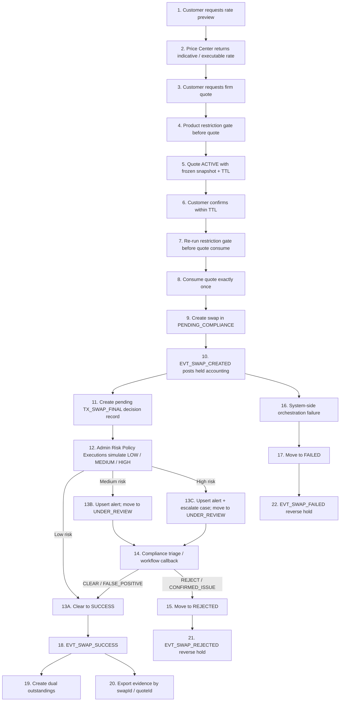

Status: active
Owner: project-owner-and-agents
Last Updated: 2026-03-27
Applies To: `Exchange_js`
Supersedes: none
Depends On: `docs/roadmap/project-version-plan.md`, `docs/constraints/customer-transaction-flow-constraints.md`, `docs/constraints/pricing-and-quote-constraints.md`, `docs/constraints/compliance-alert-incident-constraints.md`, `docs/constraints/audit-logging-constraints.md`
Source of Truth Level: roadmap

# Wave 6 兑换主链分阶段规划（Pricing -> Quote -> Swap）

## 1. 文档目的

本文件用于把总版本规划中的 `Wave 6` 进一步展开成一份正式的 `phase plan`，统一回答这几个问题：

- `Wave 6` 的正式目标闭环到底是什么。
- 当前代码与文档已经有哪些实现锚点，哪些属于 active truth，哪些只是历史规划上下文。
- 为什么本波必须按 `quote -> swap canonical accounting -> risk/case -> evidence closeout` 的顺序推进。
- 每个 `phase` 的目标任务、收口边界和验收标准分别是什么。

适用原则：

- 本文是 `Wave 6` 的 roadmap / phase plan 文档，不替代 `docs/constraints/**`、`docs/specs/**` 与 `docs/acceptance/**`。
- 当本文与约束或规格发生冲突时，以 `docs/constraints/**`、`docs/specs/**`、`docs/acceptance/**` 为准。
- 本文允许记录 `目标态 / 历史 gap / future follow-up contract`，但这些内容必须明确标注，不得冒充当前 runtime 真相。
- 本文的主要职责是解释：
  - `Wave 6` 的阶段范围
  - 阶段顺序
  - 关键缺口
  - 交付边界

## 2. 当前状态说明

- `Wave 1-5` 已完成治理底座、合规中台、客户准入主线，以及账务/钱包/定价/充值主链基础。
- 当前 `Wave 6` 的 durable runtime truth 已经下沉到：
  - `docs/constraints/customer-transaction-flow-constraints.md`
  - `docs/constraints/pricing-and-quote-constraints.md`
  - `docs/specs/workflows/swap-canonical-workflow.md`
  - `docs/specs/entities/swap-transaction-entity.md`
  - `docs/acceptance/wave-6-swap-final-acceptance-checklist.md`
  - `docs/acceptance/wave-6-best-execution-evidence-export-runbook.md`
- 当前 `Wave 6` 状态应视为：
  - `runtime complete`
  - `cleanup complete`
  - 本文继续保留为 `phase / sequencing record`
  - cleanup closure record 以 `docs/cleanup/wave-6-cleanup-master-plan.md` 为准
- 当前代码已经存在这些 `Wave 6` 相关实现锚点：
  - `src/modules/trading/pricing-center/**`
  - `src/modules/trading/swap-transactions/**`
  - `src/modules/trading/swap-transactions/swap-workflow.orchestrator.ts`
  - `src/modules/trading/swap-transactions/swap-transaction-workflow.service.ts`
  - `src/modules/risk-engine/transaction-compliance/**`
  - `src/modules/risk-engine/compliance-alerts/**`
  - `src/modules/risk-engine/compliance-incidents/**`
  - `src/modules/risk-engine/audit-logs/**`
  - `client-web/src/pages/Swap.tsx`
  - `admin-web/src/pages/Swap*.tsx`
  - `admin-web/src/pages/Compliance*.tsx`
- 当前 runtime 已具备或已正式定义以下 `Wave 6` 关键能力：
  - 客户端两段式兑换交互：`rate preview -> firm quote -> consume quote -> create swap`
  - `quote` 的 `TTL / 单次消费 / 快照冻结`
  - `swap` 的 canonical workflow 与 `FAILED` 终态
  - `swap` 接入统一事件执行与 dual outstanding 语义
  - `TX_SWAP_FINAL` 风险评估、`alert / case` 桥接与 workflow callback
  - `swap fee` 能力与 `gross / fee / net` 读模型
  - best execution evidence package 的单 `LP` 证明口径

需要特别说明的是：

- 本文下方的 `历史 gap 清单` 主要用于解释为什么 `Wave 6` 要分成现在的几个 `phase`。
- 当前 active truth 以 `constraints / specs / acceptance` 为准，不再以本 roadmap 文档定义运行时细节。

## 3. Wave 6 总目标

`Wave 6` 的正式目标是完成客户“系统内资产兑换”的第二条业务主链，并把当前分散在 `pricing / quote / swap / risk / accounting / evidence` 的锚点收束成一条完整、可审计、可阻断、可回滚、可取证、可演示的交易工作流。

本波目标闭环固定为：

1. `Rate preview`
2. `Firm quote snapshot`
3. `Quote TTL + single consume`
4. `Swap create`
5. `EVT_SWAP_CREATED`
6. `TX_SWAP_FINAL`
7. `Alert / Case` triage
8. `Swap workflow callback`
9. `EVT_SWAP_SUCCESS / REJECTED / FAILED`
10. `Dual outstandings`
11. `Audit trace -> evidence package`

本波成功标志不是“页面更多了”，而是：

- 兑换不再停留在 `quote / swap / alert / journal / outstanding` 各自独立存在。
- `swap` 交易必须可以回答：
  - 谁发起
  - 消费了哪一个 `quote`
  - 走的是哪一版 pricing policy
  - 是自动放行还是进入复核
  - 生成了哪些分录和 outstanding
  - 如果失败或拒绝，如何回滚且不留下悬挂对象
  - 如何导出一份可回放的证据包
- 一条兑换链必须能稳定串出：
  - `quoteId / quoteNo`
  - `swapId / swapNo`
  - `riskDecisionRef`
  - `alertId / caseId`
  - `journalIds`
  - `outstandingIds`
  - `evidence package`

## 4. 主体全景图

### 4.1 主体与边界

| 主体 | 当前状态机 / 生命周期 | 当前职责 | 主要驱动者 | 会反向影响 |
| --- | --- | --- | --- | --- |
| `Rate preview` | 非 durable workflow 状态；按请求即时计算 | 仅做可展示价格预览，不可执行、不锁单 | customer、`Price Center` | 为 `quote` 提供前置参考，不产生交易事实 |
| `Quote` | `ACTIVE -> USED / CANCELLED / EXPIRED` | 冻结定价快照、`TTL`、pair/tier/provider、fee/totals | customer、`Price Center` | 是创建 `swap` 的唯一合法价格输入 |
| `Swap` | `PENDING_COMPLIANCE -> UNDER_REVIEW -> SUCCESS / REJECTED / FAILED` | 客户兑换交易主体 | customer、`SwapWorkflowOrchestrator`、workflow callback | 驱动 accounting、outstanding、evidence package |
| `Risk Decision Record` | `CREATED -> COMPLETED / FAILED` | 沉淀 `TX_SWAP_FINAL` 的 reason codes、decision 与 trace | `TransactionComplianceService`、risk engine | 解释 `alert / case` 编排，不直接等同于交易终态 |
| `Alert` | `OPEN -> ASSIGNED -> ESCALATED -> CLOSED` | triage kernel，承接中高风险 `swap` 推荐动作 | `Compliance Center`、alerts service | 触发 `UNDER_REVIEW` 或升级 `case` |
| `Case` | `OPEN -> ASSIGNED -> INVESTIGATING -> PENDING_MLRO_REVIEW -> CLOSED` | investigation kernel，承接 escalation、proposal 与最终结论 | investigators、MLRO、cases service | 回驱 `swap SUCCESS / REJECTED` |
| `Journal / Clearing / Wallet balance` | 事件驱动 durable output，不是客户可见状态机 | 记账、清分、held/release 与余额投影 | accounting engine、wallet projection | 提供最终账务证据，约束失败回滚与幂等 |
| `Outstanding` | `OUT + IN` 成对创建，后续由清结算流程消费 | 沉淀 `swap SUCCESS` 后待结算的双边义务 | swap success workflow、outstandings service | 是成功成交后的清结算事实，不参与失败/拒绝路径 |
| `Evidence package` | `PENDING_APPROVAL -> READY` | 导出 `swap` 交易链条上的审计和业务证据 | audit export workflow、operator | 为 demo、UAT、审计取证提供统一输出物 |

### 4.2 完整工作流图

### 4.3 步骤影响矩阵

| 步骤 | 触发点 | 修改主体 | 审计 / 证据 | Event / Template | Block / Retry / Idempotency | 当前口径 |
| --- | --- | --- | --- | --- | --- | --- |
| `Rate preview` | `GET /swap-transactions/rate` | 无 durable 交易主体 | rate request trace | 无 accounting event | 仅展示，不得作为执行输入 | 已锁定 |
| `Quote create` | `POST /swap-transactions/quotes` | `quote` | quote audit、policy/provider snapshot | 无 accounting event | `TTL`、owner、单次消费前提必须明确 | 已锁定 |
| `Restriction gate` | create quote / consume quote | 无或阻断交易创建 | restriction audit log | 无 accounting event | 返回 `restrictionCode`，禁止绕过 | 已锁定 |
| `Swap create` | `POST /swap-transactions` | `swap`、`quote` | swap create audit | `EVT_SWAP_CREATED` | quote 只能单次消费，重复提交必须幂等 | 已锁定 |
| `Risk decision` | `swap created` | `riskDecisionRecord` | risk trace / decision audit | `TX_SWAP_FINAL` | 必须可重放，不得直接写交易终态 | 已锁定 |
| `Alert / Case` | risk recommendation | `alert`、`case` | alert/case audit | workflow-bound triage | 同 source/stage 应 dedupe | 已锁定 |
| `Workflow callback` | triage / investigation outcome | `swap` | callback audit trace | canonical swap action | 禁止 compliance 直接改 `swap.status` | 已锁定 |
| `Success posting` | `swap SUCCESS` | `journal`、`outstanding`、wallet projection | journal / outstanding evidence | `EVT_SWAP_SUCCESS` | 只允许 success 创建 dual outstandings | 已锁定 |
| `Reject / fail rollback` | `swap REJECTED / FAILED` | `journal`、wallet projection | reversal / failed audit | `EVT_SWAP_REJECTED / FAILED` | 不得残留 held / orphan journal / outstanding | 已锁定 |
| `Evidence export` | operator 发起导出并审批 | `evidence package` | export audit + package manifest | evidence assembler | 必须支持 `swapId / quoteId` 回放 | 已锁定 |

## 5. 初始现状评审与历史 gap 清单

### 5.1 当前代码锚点

| 领域 | 当前锚点 |
| --- | --- |
| Pricing / quote runtime | `src/modules/trading/pricing-center/**` |
| Swap 入口与状态机 | `src/modules/trading/swap-transactions/**` |
| Swap 编排与 workflow | `src/modules/trading/swap-transactions/swap-workflow.orchestrator.ts`、`src/modules/trading/swap-transactions/swap-transaction-workflow.service.ts` |
| Transaction compliance / risk bridge | `src/modules/risk-engine/transaction-compliance/**` |
| Alert / case | `src/modules/risk-engine/compliance-alerts/**`、`src/modules/risk-engine/compliance-incidents/**` |
| Audit / evidence export | `src/modules/risk-engine/audit-logs/**` |
| 客户端 UI | `client-web/src/pages/Swap.tsx` |
| 管理端 UI | `admin-web/src/pages/Swap*.tsx`、`admin-web/src/pages/Compliance*.tsx` |

### 5.2 起草时已确认事实

> 注：本节记录的是 `Wave 6` phase plan 重写时已经确认的 durable references。当前 active truth 仍以 `constraints / specs / acceptance` 为准。

- `swap` 的 canonical entry path 已固定为：
  - `GET /swap-transactions/rate`
  - `POST /swap-transactions/quotes`
  - `POST /swap-transactions`
- `rate preview` 只做展示，不得直接执行成交。
- `quote` 的核心合同已固定：
  - `TTL`
  - 单次消费
  - owner 绑定
  - 不可篡改快照
- `swap` 的 canonical 状态已固定为：
  - `PENDING_COMPLIANCE`
  - `UNDER_REVIEW`
  - `SUCCESS`
  - `REJECTED`
  - `FAILED`
- `swap created / success / reject / fail` 必须走统一事件执行；直接 `createJournal` 再走第二条 replay path 的做法已被明确禁止。
- `compliance` 模块不得直接写 `swap.status`；交易终态必须经过 canonical swap workflow execution。
- `swap` 证据包必须支持：
  - `swapId` 回放
  - `quoteId` 回放
- 当前 best execution 的证明口径已固定为：
  - `policy-consistent execution evidence`
  - 不是“全市场多场所最优成交证明”

### 5.3 历史 Gap 清单

> 注：下表记录的是 `Wave 6` 首次立项和阶段拆分时需要收口的核心 gap，用于解释 phase 顺序；它不是当前 active backlog 的替代品。

| 能力类别 | 起草时实现锚点 | 当时状态 | 缺的是什么 | 为什么阻塞完整 Wave 6 | 后续应落档层级 |
| --- | --- | --- | --- | --- | --- |
| `rate` 与 `firm quote` 边界 | `pricing-center` 已有 rate 与 quote 锚点 | 部分已有 | 缺“只展示 vs 可执行”的正式 contract | 如果不分离，客户预览价格和真正成交价格会混淆 | roadmap + constraints + specs |
| `quote` 生命周期 | `swap quote` DTO / service 已存在 | 部分已有 | 缺 `TTL / used / cancelled / expired / owner mismatch` 的统一口径 | 不先锁死 quote 规则，后续 swap 幂等和回滚都不稳定 | constraints + specs + acceptance |
| 产品限制闸门 | pricing/pair/tier 锚点存在 | 缺失 | 缺 quote 前置阻断、quote consume 前复核、`restrictionCode` 与审计合同 | 会出现“先出价后阻断”或绕过产品限制的问题 | constraints + specs + code |
| swap canonical accounting | `swap` 已能创建，账务锚点已存在 | 部分已有 | 缺单一事件驱动入口、缺 reject/fail 回滚合同 | 双路径记账会带来重复分录和回滚不一致 | roadmap + constraints + specs + code |
| `FAILED` 终态 | swap 基础状态机已有 | 缺失 | 缺系统失败路径与 failure detail 合同 | orchestration 失败无法正式收口，也无法证明未留悬挂对象 | specs + code |
| `TX_SWAP_FINAL` 风险桥接 | risk engine、tx compliance 已存在 | 缺失 | 缺 swap 场景的 decision record、alert upsert、case escalation | 交易 hit 只能停在风险结果，无法进入正式 triage / investigation | specs + code |
| `alert / case -> swap` 回驱 | `Compliance Center` 已有 alert/case 能力 | 缺失 | 缺 workflow callback 与 `REVIEW_SWAP_FINAL` 合同 | 合规调查做完后无法正式推动交易成功或拒绝 | specs + code |
| swap fee 闭环 | `Price Center` 已有 fee skeleton | 缺失 | 缺 `gross / fee / net` 冻结、入账与展示合同 | fee 无法作为平台能力沉淀到 swap 主链 | specs + code + UI |
| best execution 证据包 | audit/evidence export 基础已存在 | 缺失 | 缺 swap-specific evidence assembler 与证明口径 | 不能稳定证明这笔 swap 是按 policy 和 quote snapshot 执行的 | acceptance + code |
| operator / admin read model 收口 | swap/admin 页面已存在 | 部分已有 | 缺 compliance-first 的操作叙事和更完整的 drill-down | UI 难以支撑演示、排查与 UAT 复核 | roadmap + specs + UI |

## 6. Wave 6 规划

### 6.1 `P0` 官方 Wave 6 必做

本轮将 `Wave 6` 的 `P0` 明确定义为“完整兑换闭环”，至少包括以下内容：

1. 报价主链
   - 明确定义 `rate preview -> firm quote -> quote consume` 主路径。
   - 锁定 `quote` 的 `TTL / 单次消费 / owner 绑定 / 快照冻结`。
   - 锁定 `swap` 只能消费有效 `quote` 创建。

2. 产品限制与交易准入
   - 定义产品限制闸门在两个关口都执行：
     - `create quote`
     - `create swap from quote`
   - 定义阻断返回值：
     - machine-readable `restrictionCode`
     - canonical audit log

3. Canonical accounting 与失败回滚
   - 定义 `swap` 的统一事件执行入口：
     - `EVT_SWAP_CREATED`
     - `EVT_SWAP_SUCCESS`
     - `EVT_SWAP_REJECTED`
     - `EVT_SWAP_FAILED`
   - 定义 `FAILED` 终态、reversal 合同与 no orphan held / journal / outstanding 规则。

4. 交易风控与 workflow 回驱
   - 定义 `TX_SWAP_FINAL` 风险评估节点。
   - 定义 `risk decision record -> alert -> case -> workflow callback` 主链。
   - 定义 `REVIEW_SWAP_FINAL` 作为 swap 的 canonical review stage。

5. Fee 与证据闭环
   - 定义 `swap fee` 作为平台能力：
     - 平台支持配置
     - 业务默认可为空或 `0`
   - 定义 best execution evidence package 的最低交付标准：
     - request snapshot
     - policy snapshot
     - market source snapshot
     - quote snapshot
     - risk / alert / case chain
     - journal / outstanding chain

### 6.2 建议本波预留 contract，但实现可后置

- 更丰富的 operator UX：
  - swap alert / case drill-down
  - 更细的 admin evidence read model
- 多 `LP` 对比字段：
  - 当前先保留单 `LP` 证明口径
  - 等 runtime 真正支持多 venue 后再升级
- 更复杂的产品限制规则模型：
  - 当前 `V1` 只做确定性 allow/block
  - 不引入独立 DSL
- post-trade rebate / rebate settlement：
  - 不属于本波主路径

### 6.3 分阶段执行建议

| Phase | 名称 | 目标 | 必须收口的 gap | Exit Criteria |
| --- | --- | --- | --- | --- |
| `Phase 0` | 语义冻结与 Gap 锁定 | 冻结 Wave 6 主体、状态机、入口、边界与缺口口径 | 主体全景图、入口路径、状态机、gap inventory | 后续线程不再重新讨论“谁是主体、谁驱动谁、哪些是当前真相” |
| `Phase 1` | Pricing / Quote 生命周期与产品限制闸门 | 先把 `rate -> firm quote` 做成正式 contract，并把闸门前置到报价与下单入口 | quote lifecycle、restriction gate、`restrictionCode`、阻断审计 | quote 生命周期可独立成立，不合规交易在 create swap 前就被阻断 |
| `Phase 2` | Swap 创建、Canonical Accounting 与终态回滚 | 把 `quote -> swap` 和账务收敛成单一 canonical path | dual accounting path、`FAILED` 终态、reversal/no orphan contract | `SUCCESS / REJECTED / FAILED` 都有稳定账务结果，不污染余额 |
| `Phase 3` | 交易合规、Alert / Case 与 Workflow 回驱 | 把 swap 接到交易风控主链上，形成低风险直通、高风险调查、调查结果回驱 | `TX_SWAP_FINAL`、alert/case bridge、`REVIEW_SWAP_FINAL`、workflow callback | swap 不再以 admin 手工 success/reject 作为 happy path |
| `Phase 4` | Fee、Best Execution 证据与 Acceptance Closeout | 补齐商业闭环和证据闭环，形成可演示、可导出的第二条客户交易主链 | fee closure、evidence package、admin/client read model、acceptance closeout | Wave 6 可稳定演示并满足项目总 roadmap 的 P0/DoD |

### 6.4 `Phase 0`：语义冻结与 Gap 锁定

**目标**

先把 `Wave 6` 的主体、状态机、入口路径、边界和 gap 口径锁死，避免后续实现过程中反复重定义。

**P0 交付物 / 目标任务**

- 固定 `Wave 6` 主体全景：
  - `rate preview`
  - `quote`
  - `swap`
  - `risk decision record`
  - `alert`
  - `case`
  - `journal / clearing / wallet balance`
  - `outstanding`
  - `evidence package`
- 固定客户主入口与 operator / compliance 边界：
  - `GET /swap-transactions/rate`
  - `POST /swap-transactions/quotes`
  - `POST /swap-transactions`
- 固定 `swap` 状态机与 `quote` 生命周期。
- 固定主路径与手工补偿路径的区别。
- 固定本波 gap inventory，明确哪些是 `P0`，哪些只是 future follow-up。

**Exit Criteria**

- 后续线程不再重新讨论“谁是主交易主体、谁驱动谁、哪些是当前真相”。
- 文档中的 planned gap 不再冒充 runtime truth。

### 6.5 `Phase 1`：Pricing / Quote 生命周期与产品限制闸门

**目标**

先把 `rate -> firm quote` 这条前半链做成正式 contract，并把产品限制闸门放到报价和下单两个入口。

**P0 交付物 / 目标任务**

- 定义 `rate preview` 只展示、不执行。
- 定义 `firm quote snapshot`：
  - `TTL`
  - 单次消费
  - 快照不可篡改
  - `policyRef / provider snapshot / matched pair/tier / fee / totals`
- 定义 `quote` 失效路径：
  - `expired`
  - `cancelled`
  - `used`
  - `owner mismatch`
- 定义产品限制闸门：
  - pair enabled
  - tier enabled
  - channel allowed
  - customer trading gate
  - blocked `investorClassification`
- 定义 `restrictionCode + audit log` 的阻断口径。

**Exit Criteria**

- `quote` 生命周期可以独立成立。
- 不合规或不允许的交易在 `quote` 或 `create swap` 之前就被阻断。

### 6.6 `Phase 2`：Swap 创建、Canonical Accounting 与终态回滚

**目标**

把 `quote -> swap` 和账务收敛成单一 canonical path，彻底消除双路径记账问题。

**P0 交付物 / 目标任务**

- 定义 `quote` 消费创建 `swap` 的唯一合同。
- 固定事件驱动单入口：
  - `EVT_SWAP_CREATED`
  - `EVT_SWAP_SUCCESS`
  - `EVT_SWAP_REJECTED`
  - `EVT_SWAP_FAILED`
- 固定账务语义：
  - `CREATED`：锁卖出资产到 `held`
  - `SUCCESS`：释放 `held` 并完成成交入账
  - `REJECTED / FAILED`：做反转回滚
- 正式引入 `FAILED` 终态与 failure detail 合同。
- 固定幂等、补偿、replay、`no orphan held / journal / outstanding` 合同。

**Exit Criteria**

- `swap` 不再依赖双记账路径。
- `SUCCESS / REJECTED / FAILED` 都有稳定账务结果。
- 失败或拒绝不会污染余额和未结清对象。

### 6.7 `Phase 3`：交易合规、Alert / Case 与 Workflow 回驱

**目标**

把 `swap` 接到交易风控主链上，形成“pending decision record -> Admin Risk Policy Executions simulate -> alert / case / workflow callback”的正式模型。

**P0 交付物 / 目标任务**

- 定义 `TX_SWAP_FINAL` 风险评估节点。
- 定义 `risk decision record` 在 `swap` 场景的输入、输出和 trace。
- 定义 `Risk Policy Executions` 作为 `LOW / MEDIUM / HIGH` 的 canonical operator simulation surface。
- 定义 `alert upsert` 与 `case escalation` 规则。
- 定义 `UNDER_REVIEW` 状态与 review stage：
  - `REVIEW_SWAP_FINAL`
- 定义 workflow callback：
  - `CLEAR / FALSE_POSITIVE -> SUCCESS`
  - `REJECT / CONFIRMED_ISSUE -> REJECTED`
- 固定“合规模块不得直接改 `swap` 状态，必须经 workflow consumer 回驱”的原则。

**Exit Criteria**

- `swap` 不再以 admin 手工 `success/reject` 作为 happy path。
- 风控命中后可以正式进入 `alert / case / callback` 主链。

### 6.8 `Phase 4`：Fee、Best Execution 证据与 Acceptance Closeout

**目标**

在主链稳定后，补齐 `Wave 6` 的商业闭环和证据闭环，形成可演示、可导出、可验收的第二条客户交易主链。

**P0 交付物 / 目标任务**

- 固定 `swap fee` 能力：
  - 平台支持配置
  - 业务默认可为空或 `0`
  - `gross / fee / net` 语义清楚
- 固定 best execution 证据口径：
  - 当前只证明 `policy-consistent execution evidence`
  - 不宣称全市场最优成交
- 定义 evidence package 组成：
  - request snapshot
  - policy snapshot
  - market source snapshot
  - quote snapshot
  - lifecycle proof
  - risk / compliance proof
  - journal / outstanding proof
  - final outcome
- 固定 admin/client read model 需要展示的关键字段。
- 收口 acceptance checklist、evidence export runbook 与代表性 UAT。

**Exit Criteria**

- `Wave 6` 可稳定演示：
  - `quote` 可追踪
  - `swap` 可落账
  - 风控可分流
  - fee 可开可关
  - 证据可导出
- 文档 `DoD` 与项目总 roadmap 的 `Wave 6` 口径一致。

## 7. Wave 6 DoD / 代表性 UAT / 明确不做

### 7.1 Wave 6 DoD

`Wave 6` 达到完成态，至少需要满足：

1. `quote` 生命周期正式收口，`TTL / 单次消费 / owner 绑定 / 快照冻结` 明确且可验证。
2. `swap` 只能从有效 `quote` 创建，并走 canonical `PENDING_COMPLIANCE -> SUCCESS / UNDER_REVIEW / REJECTED / FAILED` 主链。
3. `swap created / success / reject / fail` 全部走统一事件执行，不允许双路径记账。
4. 风控命中后，`swap` 能正式进入 `alert / case / callback` 闭环；合规模块不得直接写交易终态。
5. `swap fee` 可作为平台能力启用或关闭，`gross / fee / net` 三段值可冻结、可展示、可记账。
6. best execution 证据包可按 `swapId / quoteId` 导出，并能回放完整链路。

### 7.2 代表性 UAT

- 主流程：
  - 客户请求 `rate`
  - 创建 `firm quote`
  - 在有效期内单次消费 `quote`
  - 创建 `swap`
  - 在 `Risk Policy Executions` 模拟 `LOW` 后放行到 `SUCCESS`
  - 生成分录与 dual outstandings
  - 导出 best execution evidence package
- 复核流程：
  - 客户创建 `swap`
  - 系统命中中高风险
  - 生成 `alert` 或升级 `case`
  - 经调查 `CLEAR / FALSE_POSITIVE` 回驱到 `SUCCESS`
  - 或 `REJECT / CONFIRMED_ISSUE` 回驱到 `REJECTED`
- 异常回滚流程：
  - 客户使用过期、已取消、已消费或 owner 不匹配的 `quote`
  - 系统自动阻断
  - 不生成 `swap`、不生成分录、不污染余额
  - 若 orchestration 在创建后失败，交易进入 `FAILED` 且自动冲回 `held`
- Fee 流程：
  - 无 fee 配置仍可正常成交
  - fee 启用后冻结 `gross / fee / net`
  - success 分录包含 fee line
- 证据导出流程：
  - 按 `swapId` 导出
  - 按 `quoteId` 导出
  - 包含 quote、risk、alert/case、journal、outstanding 与最终结果

### 7.3 明确不做

- 多 `LP` 场所的最优成交证明
- `withdraw / payout`
- 日对账 `full break lifecycle`
- `complaints / disputes`
- 独立的 product-rule DSL
- 真实链上或银行资产移动

## 8. 完成后参考落点

`Wave 6` 验收完成后，本文件继续保留为 sequencing record；运行时真相必须继续落在：

- `docs/constraints/**`
- `docs/specs/**`
- `docs/acceptance/**`
