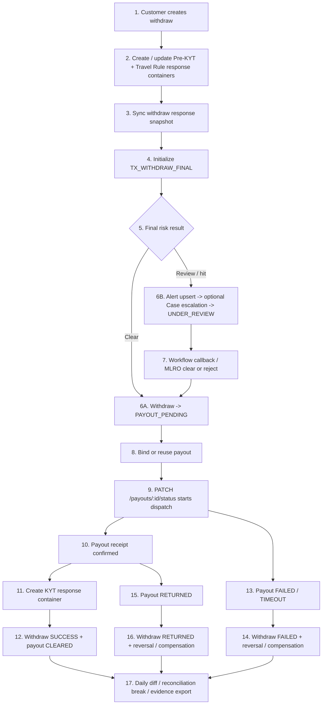

Status: active
Owner: project-owner-and-agents
Last Updated: 2026-03-27
Applies To: `Exchange_js`
Supersedes: none
Depends On: `docs/roadmap/project-version-plan.md`, `docs/constraints/customer-transaction-flow-constraints.md`, `docs/constraints/internal-transaction-flow-constraints.md`, `docs/constraints/audit-logging-constraints.md`
Source of Truth Level: roadmap

# Wave 7 提现主链分阶段规划（Withdraw -> Payout）

## 1. 文档目的

本文件用于把总版本规划中的 `Wave 7` 进一步展开成一份正式的 `phase plan`，统一回答这几个问题：

- `Wave 7` 的正式目标闭环到底是什么。
- 当前稳定态已经有哪些实现锚点，哪些只是专项规划上下文，哪些属于未来目标态。
- 为什么本波必须按 `withdraw/payout canonical -> accounting/reversal -> tx compliance -> reconciliation/evidence` 的顺序推进。
- 每个 `phase` 的目标任务、收口边界和验收标准分别是什么。

适用原则：

- 本文是 `Wave 7` 的 roadmap / phase plan 文档，不替代 `docs/constraints/**`、`docs/specs/**` 与 `docs/acceptance/**`。
- 当本文与约束或规格发生冲突时，以 `docs/constraints/**`、`docs/specs/**`、`docs/acceptance/**` 为准。
- 本文允许记录：
  - `当前稳定态`
  - `历史规划上下文`
  - `目标态 / future follow-up contract`
- 这些内容必须显式区分，不能把未来目标写成当前 runtime 真相，也不能把历史 gap 冒充当前 active backlog。

## 2. 当前状态说明

- `Wave 1-6` 已完成治理底座、合规中台、客户准入主线，以及账务/钱包/定价/充值/兑换主链基础。
- 当前 repo 已经存在这些 `Wave 7` 相关实现锚点：
  - `src/modules/trading/withdraw-transactions/**`
  - `src/modules/asset-treasury/payouts/**`
  - `src/orchestrators/withdraw-workflow.orchestrator.ts`
  - `src/modules/risk-engine/transaction-compliance/**`
  - `src/modules/risk-engine/compliance-alerts/**`
  - `src/modules/risk-engine/compliance-incidents/**`
  - `src/modules/risk-engine/audit-logs/**`
  - `admin-web/src/pages/Withdraw*.tsx`
  - `admin-web/src/pages/Payout*.tsx`
- 当前 repo 也已经开始出现 `Wave 7` 相关专项文档锚点，例如：
  - `docs/specs/workflows/withdraw-payout-canonical-workflow.md`
  - `docs/specs/entities/withdraw-transaction-entity.md`
  - `docs/specs/entities/payout-entity.md`
  - `docs/acceptance/wave-7-withdraw-payout-final-acceptance-checklist.md`
- 当前 `Wave 7` 应视为：
  - 主链 runtime 已落地
  - durable runtime truth 已进入 `constraints / specs / acceptance`
  - minimum daily reconciliation 与 withdraw evidence export 已进入 active truth
  - cleanup closeout 已完成，当前 posture 已从 active cleanup 降为 residual-only
- 当前 `Wave 7` roadmap 的职责仍然是：
  - 固定正式目标闭环
  - 固定 phase 顺序
  - 固定关键 gap
  - 固定交付边界

需要特别说明的是：

- 当前 `Wave 7` 相关 workflow / entity / acceptance 文档已经是 active truth 入口。
- 当前仍需记忆的主要是 residual compatibility inventory 与 `Wave 8` handoff 边界，而不是主链 feature 是否存在。
- 本文下方的 `历史 Gap 清单` 主要用于解释为什么 `Wave 7` 要按当前顺序拆 phase，它不是当前 active backlog 的替代品。

## 3. Wave 7 总目标

`Wave 7` 的正式目标是完成客户“资金离开系统”的第三条真实业务主链，并把当前分散在 `withdraw / payout / tx compliance / alert / case / accounting / reconciliation / evidence` 的锚点收束成一条完整、可审计、可阻断、可补偿、可回放、可取证、可演示的交易工作流。

本波目标闭环固定为：

1. `Withdraw create`
2. `PRE-KYT`
3. `Withdraw workflow`
4. `Payout bind`
5. `Dispatch gate`
6. `Payout dispatch`
7. `Payout receipt`
8. `Withdraw success / failed / returned`
9. `Risk Decision Record`
10. `Alert / Case / MLRO callback`
11. `AcctEvent -> Clearing / Journal / Wallet balance`
12. `Minimum daily reconciliation`
13. `Audit trace -> evidence package`

按总版本规划，`Wave 7` 的官方范围固定为：

- `WF-09` 全量
- `WF-12` Phase C2（transaction rollout）
- `WF-16` Phase A（minimum daily reconciliation）

本波成功标志不是“页面更多了”，而是：

- 提现不再停留在 `withdraw / payout / tx response / case / accounting / audit` 各自独立存在。
- 每个关键动作都能回答：
  - 谁触发
  - 改了哪些主体
  - 会阻断什么
  - 写了哪些审计
  - 如何幂等 / 重试 / 补偿
- 一条提现链可以稳定串出：
  - `withdrawId / withdrawNo`
  - `payoutId / payoutNo`
  - `riskDecisionRecordId`
  - `KYT / Travel Rule response`
  - `alertId / caseId`
  - `journalId`
  - `reconciliationBreakId`
  - `evidence package`

## 4. 主体全景图

### 4.1 主体与边界

| 主体 | 当前状态机 / 生命周期 | 当前职责 | 主要驱动者 | 会反向影响 |
| --- | --- | --- | --- | --- |
| `Withdraw` | `PENDING_COMPLIANCE -> UNDER_REVIEW -> PAYOUT_PENDING -> SUCCESS / FAILED / REJECTED / CANCELLED / RETURNED` | 客户提现业务交易主体 | customer、withdraw service、workflow callback | 驱动 payout、transaction compliance、accounting、evidence |
| `Payout` | `CRYPTO: CREATED -> SIGNING -> BROADCASTED -> CONFIRMING -> CONFIRMED -> CLEARED / FAILED / TIMEOUT`；`FIAT: CREATED -> CONFIRMING -> CONFIRMED -> CLEARED / FAILED / TIMEOUT / RETURNED` | 承载资金离开系统的执行与回执根 | treasury operator、payout service、未来 provider callback | 回驱 withdraw 终态、写 receipt trace、驱动补偿 |
| `PRE-KYT Response` | 证据容器生命周期统一为 `CREATED -> RECEIVED -> FINAL` | 承载 crypto withdraw create 时自动补齐的 pre-screening evidence | transaction-compliance service、provider callback/mock | 更新 withdraw snapshot；不再直接驱动 active workflow |
| `KYT Response` | 证据容器生命周期统一为 `CREATED -> RECEIVED -> FINAL` | 承载 crypto payout confirmed 时补齐的最终交易筛查 evidence | transaction-compliance service、provider callback/mock | 更新 withdraw snapshot；为 final review/evidence 提供材料 |
| `Travel Rule Response` | 证据容器生命周期统一为 `CREATED -> RECEIVED -> FINAL` | 承载 crypto withdraw create / crypto payin confirm 的信息交换 evidence | transaction-compliance service、provider callback/mock | 更新 withdraw snapshot；不再直接等同于放行结论 |
| `Risk Decision Record` | `CREATED -> COMPLETED / FAILED` | 作为 `TX_WITHDRAW_FINAL` 的 active risk explanation root；`TX_WITHDRAW_PRECHECK` 仅保留历史只读 | risk engine、transaction compliance | 解释 alert / case 编排，不直接等同于交易终态 |
| `Alert` | `OPEN -> ASSIGNED -> ESCALATED -> CLOSED` | triage kernel，承接中高风险提现推荐动作 | compliance alerts service、operator | 触发 `UNDER_REVIEW` 或升级 `case` |
| `Case` | `OPEN -> ASSIGNED -> INVESTIGATING -> PENDING_MLRO_REVIEW -> CLOSED` | investigation kernel，承接 escalation、measure、proposal 与最终结论 | investigator、MLRO、cases service | 回驱 withdraw workflow；写 customer control state |
| `Customer control state` | 组合字段：`operatingStatus`、`restrictionStatus`、`complianceHoldStatus` | 表达客户是否可操作、是否受限、是否被冻结 | compliance case measures | 阻断提现推进、阻断交易放行 |
| `Journal / Clearing / Wallet balance` | 事件驱动 durable output，不是 customer-visible workflow 状态机 | 沉淀记账、清分、余额投影与 reversal | accounting engine、wallet projection | 提供最终账务证据，约束失败回滚 |
| `Reconciliation break` | 目标态为 `OPEN -> UNDER_REVIEW -> RESOLVED / ACCEPTED_DIFFERENCE` | 承载每日差异与处理状态 | reconciliation job、finance/compliance operator | 提供最小 safeguarding closeout，不直接改交易状态 |
| `Evidence package` | `PENDING_APPROVAL -> READY` | 导出提现链条上的业务与审计证据 | audit export workflow、operator | 为 demo、UAT、审计取证提供统一输出物 |

### 4.2 完整工作流图

### 4.3 步骤影响矩阵

| 步骤 | 触发点 | 修改主体 | 审计 / 证据 | Block / Retry / Idempotency | 当前状态 |
| --- | --- | --- | --- | --- | --- |
| `Withdraw create` | `POST /withdraw-transactions` | `withdraw` | withdraw create audit | create path 需要 owner / quote / eligibility 合同 | 部分已有 |
| `PRE-KYT sync` | withdraw create | `kytCase`、`withdraw snapshot` | `KYT_CASE_*` audit | callback / mock append-report 需要幂等 | 部分已有 |
| `TX_WITHDRAW_FINAL` 初始化 | withdraw create / response snapshot ready | `riskDecisionRecord` | risk trace audit | 新单只允许一条 active final context | 已具备 |
| `Withdraw clear -> payout bind` | canonical withdraw action | `withdraw`、`payout` | withdraw / payout binding audit | 不得绕过 canonical withdraw workflow | 部分已有 |
| `KYT response sync` | payout confirmed | response container、`withdraw snapshot` | tx compliance audit | 仅作为 evidence 容器，不回填旧 precheck path | 已具备 |
| `TX_WITHDRAW_FINAL` | response snapshot ready / manual simulation | `riskDecisionRecord`、必要时 `alert / case` | risk trace / alert / case audit | 未 clear 不得进入 payout pending | 已具备 |
| `Payout dispatch` | `PATCH /payouts/:id/status` | `payout` | payout dispatch audit | receipt replay、callback replay 必须幂等 | 已具备 |
| `Payout receipt -> success` | payout confirmed | `withdraw`、`payout`、accounting outputs | withdraw / payout / accounting audit | `payout CLEARED` 不得先于 withdraw success posting | 部分已有 |
| `Failed / returned compensation` | payout fail / timeout / return | `withdraw`、journals、clearings、wallet balances | reversal / compensation audit | 重复回调不得重复冲正 | 部分已有 |
| `Daily reconciliation` | business date closeout | `reconciliation break`、必要时 linked case | reconciliation audit / diff evidence | break 不得直接改交易状态 | 缺失 |
| `Evidence export` | operator 发起导出并审批 | `evidence package` | export audit + manifest | 必须支持 `withdrawId / payoutId` 回放 | 缺失 |

## 5. 初始现状评审与历史 Gap 清单

### 5.1 当前代码锚点

| 领域 | 当前锚点 |
| --- | --- |
| Withdraw 入口与状态机 | `src/modules/trading/withdraw-transactions/**` |
| Payout 入口与状态机 | `src/modules/asset-treasury/payouts/**` |
| Withdraw 编排 | `src/orchestrators/withdraw-workflow.orchestrator.ts` |
| Tx compliance 容器 | `src/modules/risk-engine/transaction-compliance/transaction-compliance.service.ts` |
| Risk / alert / case | `src/modules/risk-engine/risk-engine.service.ts`、`risk-decision-records.service.ts`、`compliance-alerts.service.ts`、`compliance-incidents.service.ts` |
| Accounting contract | `src/modules/accounting/**`、`src/modules/clearing-settle/**` |
| Audit / evidence | `src/modules/risk-engine/audit-logs/**` |
| 管理端 UI | `admin-web/src/pages/Withdraw*.tsx`、`admin-web/src/pages/Payout*.tsx` |

### 5.2 起草时已确认事实

> 注：本节记录的是 `Wave 7` 专项规划时已经确认的稳定锚点与规划基线。当前 active truth 仍以 `constraints / specs / acceptance` 为准。

- `withdraw` 与 `payout` 已经在 repo 中作为独立业务对象存在。
- `withdraw` 已具备基础状态机、audit 与详情 / 列表 UI 锚点。
- `payout` 已具备独立状态机、回执字段与执行视图锚点。
- `transaction-compliance` 已经具备：
  - `withdraw` 侧 `PRE-KYT`
  - `withdraw` 侧 `KYT`
  - `Travel Rule response` 容器与 lifecycle snapshot 同步能力
- `withdraw` 已经具备：
  - `TX_WITHDRAW_FINAL`
  - `REVIEW_WITHDRAW_FINAL`
  - historical read-only `TX_WITHDRAW_PRECHECK / REVIEW_WITHDRAW_PRECHECK`
  - `alert / case -> canonical workflow callback`
  - dispatch-start final gate
- `risk engine`、`alert`、`case`、`workflow callback` 的平台基础能力已经在 onboarding、deposit、swap 场景中存在可复用模式。
- `accounting / clearing / wallet balance / reversal` 的平台底座已经存在，但提现场景尚未以 `Wave 7` 名义完成完整 closeout。
- 当前 repo 已经形成这些 `Wave 7` Phase 3-4 锚点：
  - extreme-volatility runtime gate
  - Wave 7 级别的 minimum daily reconciliation runtime
  - Wave 7 级别的 withdraw evidence export 标准包
  - reconciliation list/detail/admin actions 与 approval-backed export walkthrough
- 当前仍保留为后续 closeout / handoff 议题的内容主要是：
  - Wave 8 full safeguarding boundary
  - retained compatibility / cleanup 记录
  - 更宽范围的 treasury / funding reconciliation

### 5.3 历史 Gap 清单

> 注：下表记录的是 `Wave 7` 起草和阶段拆分时需要收口的核心 gap，用于解释 phase 顺序；它不是当前 active backlog 的直接替代品。

| 能力类别 | 起草时实现锚点 | 当时状态 | 缺的是什么 | 为什么阻塞完整 Wave 7 | 后续应落档层级 |
| --- | --- | --- | --- | --- | --- |
| withdraw canonical entry vs compensation boundary | withdraw service / controller 已存在 | 部分已有 | 缺“主线入口 vs manual compensation path”的正式定义 | 没法保证提现不是靠人工点终态完成 | roadmap + constraints + specs |
| payout dispatch vs receipt authority | payout service 已存在 | 部分已有 | 缺 dispatch-start 与 confirm/clear 的权责分离合同 | 如果 receipt 兼任补案或放行，会破坏可审计性 | constraints + specs + code |
| transaction-risk decision for withdraw | risk engine、decision record 框架已存在 | 已具备 | 需要回归测试与长期真相落档 | 若不锁定 truth，后续线程仍会把已落地能力误判为缺口 | specs + acceptance |
| alert / case -> withdraw callback | Compliance Center 已有平台能力 | 已具备 | 需要回归测试与 callback 边界文档化 | 若不锁定 callback contract，后续容易回退到直接写交易状态 | specs + acceptance |
| final dispatch gate | tx compliance snapshot 已存在 | 已具备 | 需要与 runtime restriction gate 一起形成完整 dispatch block 叙事 | 仍需避免只验证合规、不验证运营级限制 | constraints + specs + code |
| extreme volatility runtime gate | pricing policy / payout dispatch gate 底座已存在 | 缺失 | 缺基于 `WITHDRAWAL_PRICING` 的 shared runtime restriction | 不能满足 Wave 7 对一键限制提现能力的要求 | constraints + specs + code |
| failed / returned reversal idempotency | reversal / accounting 平台底座已存在 | 部分已有 | 缺 Wave 7 名义的 repeated callback / retry contract | 会留下重复冲正或 orphan object 风险 | constraints + specs + acceptance |
| minimum daily reconciliation | audit/accounting 基础已存在 | 缺失 | 缺 break register、daily diff、linked case contract | 无法满足 `WF-16 Phase A` | roadmap + constraints + specs + code |
| withdraw evidence export chain | audit export 基础已存在 | 缺失 | 缺 withdraw-specific evidence assembler 与最低导出标准 | 不能稳定证明一条提现链的完整合规与账务轨迹 | acceptance + code |
| admin/client async convergence | withdraw/payout 页面已存在 | 部分已有 | 缺中间态、gate blocked、callback result 的统一 read-model 叙事 | 演示与排查成本高，operator 心智易混乱 | specs + UI |

## 6. 已锁定决策

### 6.1 Canonical path

- `Wave 7` 的 canonical path 固定为：
  - `withdraw quote create -> quote confirm -> pending compliance -> final review -> payout pending -> payout dispatch -> payout receipt -> withdraw closeout`
- 不再采用“直接把 withdraw 打成 success/fail”作为 happy path。

### 6.2 Public interfaces

- `POST /withdraw-transactions`
  - 继续作为客户提现唯一主入口。
- `PATCH /withdraw-transactions/:id/status`
  - 仅保留：
    - withdraw workflow
    - compliance callback
    - manual compensation
  - 它不是 normal payout completion happy path。
- `PATCH /payouts/:id/status`
  - 是 payout dispatch / confirm / fail / return 的 canonical execution surface。

### 6.3 Dispatch gate timing

- `TX_WITHDRAW_FINAL` 是 payout pending 前的唯一主动放行 gate。
- crypto withdraw 的 `Pre-KYT / Travel Rule` 在 create 时生成并留档，`KYT` 在 `payout CONFIRM` 时补建并留档。
- response container 是 evidence container，不是 dispatch gate。
- `payout CONFIRMED` 只负责：
  - receipt 留痕
  - crypto `KYT` evidence 留档
  - success closeout
- `payout CONFIRMED` 不负责回补旧 PRECHECK 或旧 main compliance 心智。

### 6.4 Workflow-bound risk naming

- active 交易风控上下文固定为：
  - `TX_WITHDRAW_FINAL`
- active workflow review stage 固定为：
  - `REVIEW_WITHDRAW_FINAL`
- historical read-only compatibility：
  - `TX_WITHDRAW_PRECHECK`
  - `REVIEW_WITHDRAW_PRECHECK`

### 6.5 Deposit boundary

- `deposit` 在 `Wave 7` 只做 regression + shared convergence。
- 本波不引入新的 deposit workflow 状态或新的 deposit acceptance 主范围。

### 6.6 Reconciliation boundary

- `Wave 7` 只做 `WF-16 Phase A` 最小日对账：
  - `daily diff`
  - `break register`
  - `linked alert / case`
  - `status tracking`
- 不做：
  - full safeguarding threshold
  - full break lifecycle governance
  - internal treasury full operator tooling

## 7. Wave 7 规划

### 7.1 `P0` 官方 Wave 7 必做

本轮将 `Wave 7` 的 `P0` 明确定义为“完整提现闭环”，至少包括以下内容：

1. Withdraw / Payout canonical workflow
   - 明确定义 `withdraw -> payout` 主工作流。
   - 明确定义 `withdraw` 与 `payout` 双状态机。
   - 明确定义主线入口与 manual compensation path 的区别。

2. Payout dispatch gate
   - 定义 dispatch 前必须具备：
     - final transaction risk gate
   - 定义 response container 与 final risk gate 的边界：
     - response container 负责 evidence 留档
     - final transaction risk gate 决定是否进入 `PAYOUT_PENDING`
   - 定义未 clear 时的阻断返回、阻断审计与重试边界。

3. Tx compliance / risk / alert / case
   - 定义 `PRE-KYT / KYT / Travel Rule` 容器创建 / 更新节点。
   - 定义 `TX_WITHDRAW_FINAL` 的 active decision record 合同，并把 `TX_WITHDRAW_PRECHECK` 明确降为历史兼容只读。
   - 定义 risk recommendation 如何 upsert `alert`，以及哪些场景需要 escalate 到 `case` 或进入 `STR` 处置。

4. Workflow callback + customer control
   - 定义 `alert / case / MLRO` 处理后如何正式回驱 `withdraw`：
     - `PENDING_COMPLIANCE`
     - `UNDER_REVIEW`
     - `PAYOUT_PENDING`
     - `REJECTED`
   - 定义 `freeze / restrict` 如何影响 customer canonical control fields，并阻断提现推进。

5. Accounting / reversal / no orphan guarantee
   - 定义 `withdraw SUCCESS / FAILED / RETURNED` 对应的 `AcctEvent / Clearing / Journal / Wallet balance` 合同。
   - 定义 repeated fail / return / callback replay 不得留下 orphan journal、orphan clearing 或重复 reversal。

6. Evidence / reconciliation minimum closeout
   - 定义 Wave 7 的 evidence chain 最低标准：
     - `withdrawId -> payoutId -> riskDecisionRecordId -> alertId/caseId -> journalId -> export package`
   - 定义 `WF-16 Phase A` 的最小日对账：
     - 每日产出差异
     - 差异形成 break
     - break 可追踪处理状态

### 7.2 建议本波预留 contract，但实现可后置

- richer provider payout callback contract：
  - callback signature
  - payload normalization
  - operator/manual override metadata
- full safeguarding threshold / escalation：
  - 作为 `Wave 8` 的运营化扩展，不提前塞入 `Wave 7`
- richer treasury ops：
  - 更完整的 treasury dashboard、routing、operator tooling
- stronger evidence package manifest：
  - 更细的 digest、manifest versioning、package sections
- richer reconciliation operations contract：
  - break batching
  - threshold routing
  - finance operations dashboard

### 7.3 明确不属于本波

- full safeguarding threshold / threshold escalation
- internal treasury 全量运营工具
- governance registries（后移到 `Wave 9`）
- filing receipt effectiveness 与 governance registry 运营化联动（后移到 `Wave 9`）
- complaints / disputes / refunds
- regulatory calendar / policy attestation / security privacy evidence

### 7.4 分阶段执行建议

| Phase | 名称 | 目标 | 必须收口的 gap | Exit Criteria |
| --- | --- | --- | --- | --- |
| `Phase 0` | 语义冻结与 Gap 锁定 | 冻结 Wave 7 主体、状态机、入口、边界与缺口口径 | 主体全景图、状态机、入口路径、gap inventory | 后续线程不再重新讨论“谁是主体、谁驱动谁、哪些是当前真相” |
| `Phase 1` | Withdraw / Payout Canonical Workflow | 先把提现主线自身走通，固定 payout 是执行根、withdraw 是业务根 | 主线入口、payout bind、dispatch vs receipt authority | 提现 happy path 不再依赖 direct withdraw terminal action |
| `Phase 2` | Canonical Accounting / Reversal / Compensation | 把 success / failed / returned 的账务顺序、冲正合同与 replay 行为锁死 | payout clear ordering、reversal idempotency、no orphan contract | `SUCCESS / FAILED / RETURNED` 都有稳定账务结果 |
| `Phase 3` | Transaction Compliance Full Rollout | 把 withdraw 接到交易风控、alert/case 与 workflow callback 主链 | `TX_WITHDRAW_FINAL`、`REVIEW_WITHDRAW_FINAL`、dispatch gate | 提现不再以“先 payout 再补案”作为主线 |
| `Phase 4` | Minimum Daily Reconciliation + Evidence + Acceptance Closeout | 补齐最小日对账、证据包与 acceptance closeout | daily diff、break register、evidence package、runbook | Wave 7 可稳定演示并满足 roadmap 的 P0/DoD |

建议执行顺序：

1. 先完成 `Phase 0`
2. 再完成 `Phase 1`
3. 然后进入 `Phase 2`
4. 再完成 `Phase 3`
5. 最后以 `Phase 4` 收口

这个顺序不能反过来，原因是：

- 不先锁定 `withdraw / payout canonical workflow`，就无法给 accounting 和 compliance 定清楚权责边界。
- 不先锁定 accounting / reversal 合同，就无法证明 fail / return 不会留下悬挂对象。
- 不先锁定 dispatch gate，就无法把 `tx compliance` 从“证据容器”提升为“真实阻断能力”。
- reconciliation 和 evidence 必须建立在前面三层已经稳定的业务主链之上。

### 7.5 `Phase 0`：语义冻结与 Gap 锁定

**目标**

先把 `Wave 7` 的主体、状态机、入口路径、边界和 gap 口径锁死，避免后续实现线程反复重定义。

**P0 交付物 / 目标任务**

- 固定 `Wave 7` 主体全景：
  - `withdraw`
  - `payout`
  - `Pre-KYT / KYT / Travel Rule response`
  - `risk decision record`
  - `alert`
  - `case`
  - `journal / clearing / wallet balance`
  - `reconciliation break`
  - `evidence package`
- 固定客户主入口与 operator / compliance 边界：
  - `POST /withdraw-transactions`
  - `PATCH /withdraw-transactions/:id/status`
  - `PATCH /payouts/:id/status`
- 固定 `withdraw` 与 `payout` 状态机。
- 固定主路径与手工补偿路径的区别。
- 固定本波 gap inventory，明确哪些是 `P0`，哪些是 future follow-up。

**Exit Criteria**

- 后续线程不再重新讨论“谁是主交易主体、谁驱动谁、哪些是当前真相”。
- 文档中的 planned gap 不再冒充 runtime truth。

### 7.6 `Phase 1`：Withdraw / Payout Canonical Workflow

**目标**

先把提现主线做成正式 contract，并明确：

- withdraw 是业务根
- payout 是执行根
- receipt 不是放行根

**P0 交付物 / 目标任务**

- 定义 `withdraw quote -> confirm -> pending compliance -> final review -> payout pending` 主链。
- 定义 `payout bind` 是 final review clear 后的 canonical side effect。
- 定义 dispatch-start action：
  - crypto `SIGN`
  - fiat `SUBMIT`
- 定义 `payout CONFIRMED` 只是 receipt，不承担补案或最终放行语义。
- 收掉 direct admin happy-path terminal action 的长期真相地位。

**Exit Criteria**

- 提现 happy path 只剩一条正式路径。
- 页面、API、workflow 叙事不再互相冲突。

### 7.7 `Phase 2`：Canonical Accounting / Reversal / Compensation

**目标**

把提现成功、失败、退回三条路径的账务与补偿合同锁死，避免出现重复冲正和 orphan object。

**P0 交付物 / 目标任务**

- 定义 `withdraw SUCCESS` 的 posting 顺序。
- 定义 `payout CLEARED` 必须依赖 withdraw success posting 完成。
- 定义 `FAILED / RETURNED` 的 reversal / compensation 合同。
- 定义 repeated callback / retry / replay 的幂等边界。
- 定义 `no orphan journal / clearing / wallet projection` 规则。

**Exit Criteria**

- `SUCCESS / FAILED / RETURNED` 都能稳定 replay。
- fail / return 重复回调不产生第二次冲正。

### 7.8 `Phase 3`：Transaction Compliance Full Rollout

**目标**

在已具备 withdraw tx-risk / alert / case / callback 主链的基础上，补齐 runtime restriction gate、回归测试与 truth-hardening 文档。

**P0 交付物 / 目标任务**

- 定义 `TX_WITHDRAW_FINAL`：
  - final compliance snapshot
  - dispatch gate contract
  - alert / case escalation contract
- 定义 `REVIEW_WITHDRAW_FINAL`，并把 `REVIEW_WITHDRAW_PRECHECK` 明确为历史兼容只读 stage。
- 定义 `alert / case / MLRO` 只能通过 canonical withdraw workflow callback 回驱，不得直接写交易终态。
- 定义极端波动策略的最小边界：
  - 阻断新 withdraw quote create、withdraw create 和 payout dispatch start
  - 不回滚已确认 payout
- 定义 `STR` 在交易侧的最小联动边界：
  - 可由 final transaction review / case 结果触发
  - 必须写入 audit trace
  - `REPORT / STR` 仅形成 case / filing / evidence trace
  - 不得绕过 canonical workflow callback 直接改交易终态

**Exit Criteria**

- 未通过 final tx-risk gate 的提现不能进入成功放行。
- transaction compliance 不再只是 provider response 容器。

### 7.9 `Phase 4`：Minimum Daily Reconciliation + Evidence + Acceptance Closeout

**目标**

补齐最小日对账、证据包与 acceptance runbook，形成 `Wave 7` 的可演示、可导出、可复核闭环。

**P0 交付物 / 目标任务**

- 已落地 `WF-16 Phase A` 最小对账闭环：
  - `daily diff`
  - `reconciliation break`
  - linked alert
  - optional linked case visibility
  - status tracking
- 已落地 withdraw evidence package 最低标准。
- 已落地 Wave 7 final acceptance checklist。
- 已落地 fail / return / reconciliation / evidence runbook。

**Exit Criteria**

- 主流程、阻断流程、fail / return 流程、reconciliation 流程都有统一 acceptance 叙事。
- 一条提现链可以稳定导出统一证据包。
- Wave 8 边界被明确保留为 full safeguarding，而不是继续向 Wave 7 追加运营化功能。

### 7.10 Wave 7 DoD

`Wave 7` 达到完成态，至少需要满足：

1. `Withdraw` 与 `Payout` 状态机正式收口，主线与手工补偿路径明确分离。
2. `PRE-KYT / KYT / Travel Rule` response 创建 / 更新 / callback idempotency 明确。
3. `TX_WITHDRAW_FINAL` 正式接入 `risk decision record -> alert / case -> workflow callback` 主链；`TX_WITHDRAW_PRECHECK` 仅保留历史可读。
4. `payout dispatch` 在 final gate 前阻断，`payout CONFIRMED` 只负责补 `KYT` evidence container，不再承担旧 precheck 心智。
5. `FAILED / RETURNED` 的 reversal / compensation 合同明确，不出现重复冲正与 orphan object。
6. `WF-16 Phase A` 的最小日对账可运行、可追踪、可留痕。
7. 极端波动策略可一键限制相关提现能力并留痕。
8. `withdrawId / payoutId` 证据链可导出、可回放、可用于 UAT / demo / 审计取证。

### 7.11 代表性 UAT

**主流程**

- 客户创建 crypto withdraw
- 完成 quote 二次确认
- 进入 `PENDING_COMPLIANCE`
- 创建 `Pre-KYT / Travel Rule` evidence container
- 经过 `TX_WITHDRAW_FINAL`
- 进入 `PAYOUT_PENDING`
- 获取 payout receipt
- `payout CONFIRM` 自动补 `KYT` evidence container
- withdraw 成功出账并能导出完整 evidence package

**阻断流程**

- 客户提现在 `TX_WITHDRAW_FINAL` 命中 `MEDIUM / HIGH`
- 系统保持 `UNDER_REVIEW`
- 提现保持非终态
- 产生可追踪的 alert / case / audit 轨迹

**异常回滚流程**

- payout 失败或 returned
- 系统自动冲正 / 补偿
- 不出现重复冲正
- 差异与处理轨迹可导出

**极端波动限制流程**

- 打开极端波动限制
- 系统阻断新提现创建或 payout dispatch start
- 已确认 payout 不被回滚
- 全流程留有 machine-readable restriction audit

**最小日对账流程**

- 日终生成提现相关差异清单
- 自动形成 `reconciliation break`
- break 可关联 alert / case 并跟踪处理状态
- 可按 `withdrawId / payoutId` 导出差异与处理轨迹
