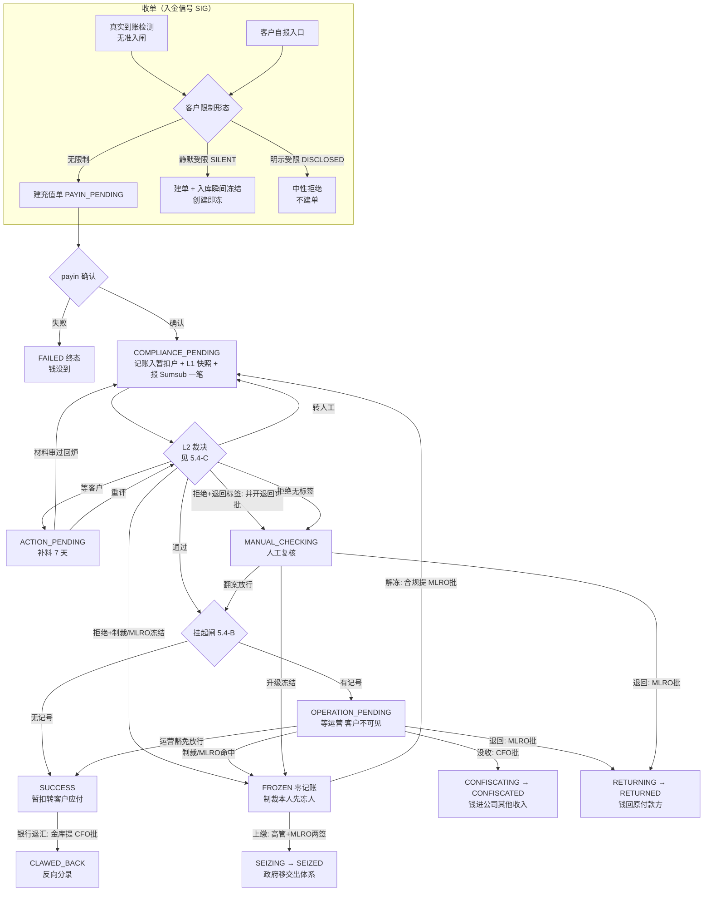

<title>4. 充值 · Deposit v2.0</title>

# **0　变更记录**

| 版本 | 日期 | 修订人 | 变更摘要 |
|-|-|-|-|
| v2.0 | 2026-09-17 | — | **新建文档**：整合《充值》V1（happy path）与 08-03《充值 V2 — 异常处理全流程 PRD》为单篇全量 PRD，两份旧文档不再维护、正文冲突以本篇为准。对齐代码现状 @ main `4a8b1063`，相对 08-03 基线的主要修订：① 状态机 14 态/15 动作/26 边 → **15 态/16 动作/29 边**（+`CLAWED_BACK` 终态与 `SUCCESS→CLAWED_BACK` 退汇边；`OPERATION_PENDING` 补冻结/退回两出边）；② Gate 0 退役，换 **L1 十项闸**（充值适用 6/10，三分流）；③ SLA 由"挂起 7 日"改为**四格**（等合规 5 分钟硬 / 补料 7 天硬 / 复核 3 天软 / 挂起 1 天软）；④ 制裁分主体（本人/对手方）+ **人级处置**（制裁·客户本人先冻人再冻单）；⑤ 迟到裁决**忽略档**落审计取证（冻结态含在内——08-03 的 G-2"FROZEN 收裁决抛错"已修销账）；⑥ 审批链易主：没收改 **CFO 单步**、上缴 **高管首签+MLRO 复签两步**；⑦ 退回已有 officer 入口（08-03 G-4 已修销账）；⑧ 新增补单两入口（漏记补录 / 退汇认领，均金库提 CFO 批）；⑨ 审计词表重铸 **47 码**封闭名册 + 旅程号全链；⑩ 收单三态（静默受限客户创建即冻）；⑪ ⚡仿真按钮 9 → 11 键（三域同表）。08-03 的 Q-5（KYC 材料页文案）移出本篇。 |
| v1.0 | 2026-08-02 | Shawn | 08-03 基线《充值 V2 — 异常处理全流程 PRD》首次定稿（本篇的内容前身，保留原件不改）。 |

---

# **1　背景与问题陈述**

**充值是资金进入体系的唯一客户侧入口，也是合规判定的输入端。**一笔充值的钱一旦到账，就已经在我们的托管地址 / 银行账户里——此后我们能决定的只有「给不给客户」，不能决定「收不收」。这个不可逆性决定了充值的形态：**别的流程可以在建单前拒绝，充值只能在收款后处置**；每一条岔路都必须走到有资金归宿的终点。

一笔顺利的充值只有三步：钱到账 → 合规通过 → 入客户账。真实世界的其余情况是：Sumsub 判了制裁命中；要求客户补资料而客户不理；金额小到退回成本比本金还高；MLRO 判定应当原路退回；执法机关要求上缴；钱入账之后又被银行退汇；以及——**Sumsub 会改口**：一笔已经判完的交易，官员可以随时改回"等客户补料"。

本篇必须同时解决的矛盾：

- **资金必须有归宿** —— 钱已到账，任何终局都要说得出「这笔钱去哪了」。说不出的终态就是资金悬空。
- **合规裁决优先于业务便利** —— 制裁命中要能在**任何非终态**落地，不因这单金额小、正排在运营队列里就落不下来。
- **裁决会来回翻，状态机必须接得住改口** —— 接不住就是单子永久卡死，而对方早已改口。
- **对被调查人不得泄露调查状态（tipping-off）** —— 客户端不能让客户看出自己这笔单与众不同；对被制裁客户，连"报错"本身都是信号。
- **无法验证来源的钱不能收下** —— 我们要求了资料而对方不给，等于来源不明。
- **单不动，人照办** —— 订单状态不该决定"这个人要不要被限制"；制裁命中的人级处置是独立的第二轨。

**形态共用声明**：crypto 与 fiat 充值共用同一条工作流与同一套状态机，差异仅两处：① TR 类型判定只对 crypto 生效（fiat 恒 `finance`）；② 对手方 VASP 字段只在 crypto 采集，fiat 不得携带。

---

# **2　目标**

- **每个终态都能回答「钱去哪了」** —— 6 个终态各有明确资金归宿，无悬空终态。
- **合规裁决 fail-closed 且可落地** —— 判定依据缺失时从严；制裁/冻结在任何非终态都能落地；迟到裁决不丢、落审计。
- **VARA Travel Rule 类型判定可判定、可追溯** —— 三条件 AND，判定理由随审计留痕。
- **客户端对执法态零信息泄露** —— 执法态与正常处理中在客户端逐字段一致，时间线同样不可区分；被制裁客户全程无感。
- **三查成立** —— 按单号、按客户、按旅程都查得到全链留痕，包括被拒绝的动作。

---

# **3　监管依据**

**牌照边界先行**：平台持 VARA **Broker-Dealer（BD）**牌照，**不持** VA Transfer & Settlement 牌照。托管与链上结算职责经 HexTrust 合同传导，本篇不直接引用 T&S Rulebook 条款。

| # | 义务内容 | 来源锚点 |
|-|-|-|
| R-1 | 对虚拟资产转账进行交易监控与风险评分，命中制裁名单须冻结并报告 | **⚠ 待定：逐条条款号待合规锚定**（CRM Rulebook 交易监控章） |
| R-2 | 虚拟资产转账金额达到门槛且对手方为 VASP 时，须交换 Travel Rule 报文 | **⚠ 待定：VARA TR 门槛条款号待合规锚定** |
| R-3 | 不得向被调查主体泄露其正被调查（tipping-off 禁止） | **⚠ 待定：条款号待合规锚定** |
| R-4 | 客户尽职调查资料不足时不得建立/继续业务关系 | CRM Rulebook I.E（客户尽职调查） |
| R-5 | 全部活动留痕并保存 8 年，接受 MLRO 复核 | **⚠ 待定：条款号待合规锚定** |

R-1 / R-2 / R-3 在模块 5.1 的 FR 表中标 **Must（监管）**，不可被砍。

---

# **4　角色与用例**

## **4.1 主要角色（人）**

| 角色 | 定义 | 目标 | 权限边界 | 频率 |
|-|-|-|-|-|
| 客户 Customer | 在平台开户并充值的自然人 | 把钱充进来并可用 | 只能看自己的充值单；看不到任何执法/处置细节 | 每日 |
| 运营 Ops Officer | 交易处置的一线动手人 | 处置挂起单；发起没收/退回/上缴 | 可豁免放行小额单（免审批）；三条处置弧的发起人；**没有任何解冻权** | 每日 |
| 合规专员 Compliance Officer | 人工复核队列的处理人 | 对人工复核单作出处置；发起解冻 | 复核结论经 Sumsub 侧裁决通道落地（我方后台无直接放行按钮）；解冻只能**发起**、不能自批 | 每日 |
| MLRO | 反洗钱报告官 | 对退回/解冻作终局裁决；上缴复签 | 退回、解冻的唯一审批人；上缴第二签 | 每周 |
| 高级管理人员 Senior Management Officer | 上缴（政府移交）的第一签 | 依执法令批准上缴 | 仅上缴首签 | 罕见 |
| CFO | 财务负责人 | 没收与补单的最终审批 | 没收、漏记补录、退汇认领的唯一审批人 | 每周 |
| 金库专员 Treasury Officer | 对账案子上的资金动手人 | 发起漏记补录与退汇认领 | 仅这两个补单入口；从对账案子发起，不在充值页 | 罕见 |

## **4.2 次要角色（外部系统）**

| 角色 | 定义 | 与本系统的交互 |
|-|-|-|
| Sumsub（KYT 交易监控） | 交易监控与风险评分服务商 | 接收我方提交的交易 → 跑规则 → webhook 通知 → 我方拉 `getTxn` 取当前状态存证 |
| HexTrust（托管）/ 银行 | 托管与结算通道 | 提供充值地址 / 收款账户、上报到账；事后可能退汇 |

**系统本身不是角色。**充值工作流、SLA 定时器、webhook 处理器均为被设计系统的部件，其自动行为在 5.2/5.3 中以保留词**「系统（自动）」**表示。

## **4.3 权限包切分（本域动作怎么分给人）**

| 动作 | 权限组 | 出厂持有职务 |
|-|-|-|
| 看充值单（列表/详情/审计栏） | `TRADING_DEPOSIT_READ` | 运营、合规、MLRO、金库等多数后台职务 |
| 小额豁免放行（免审批、立即执行） | `DEPOSIT_WAIVE_WRITE` | 运营 |
| 发起没收 | `DEPOSIT_CONFISCATE_WRITE` | 运营 |
| 发起退回 | `DEPOSIT_RETURN_WRITE` | 运营 |
| 发起上缴 | `DEPOSIT_SEIZE_WRITE` | 运营 |
| 发起解冻 | `DEPOSIT_UNFREEZE_WRITE` | **合规专员**（运营刻意不持有） |
| 发起漏记补录 | `DEPOSIT_SUPPLEMENT_WRITE` | 金库专员 |
| 发起退汇认领 | `DEPOSIT_CLAWBACK_WRITE` | 金库专员 |

**切分理由**：动钱的手（运营）与判是非的口（合规）分开——运营发起一切处置、但**解冻只在合规手里**（解冻等于推翻一次合规冻结，性质是合规判断不是操作）；对账伸进来的两个补单入口单独成组、归金库（它们从对账案子发起，证据链在对账域）。"出厂持有"只是出厂姿势——权限是运行时配置，本表锁的是**切法**不是持有人。另有 `TRADING_DEPOSIT_WRITE` 特殊组（演示装置端点专用，不进自定义角色目录）。

## **4.4 用例清单**

| 编号 | 角色 | 用例 |
|-|-|-|
| UC-1 | 客户 | 充值到账后等待处理直至可用或被退回 |
| UC-2 | 客户 | 按要求补充资料以解除挂起 |
| UC-3 | 合规专员 | 处置人工复核队列中的充值单 |
| UC-4 | 合规专员 + MLRO | 解冻一笔被冻结的充值单（合规提、MLRO 批） |
| UC-5 | 运营 + MLRO | 将一笔充值原路退回（运营提、MLRO 批） |
| UC-6 | 运营 + 高管 + MLRO | 依执法令上缴一笔充值（运营提、高管首签、MLRO 复签） |
| UC-7 | 运营（+ CFO） | 处置低于下限的小额充值单（豁免放行免审批；没收须 CFO 批） |
| UC-8 | 金库专员 + CFO | 从对账案子补录一笔漏记的入金 |
| UC-9 | 金库专员 + CFO | 认领一笔已成功入金的银行退汇 |

## **4.5 关键用例展开**

**UC-3　合规专员处置人工复核队列**

| 字段 | 内容 |
|-|-|
| 主要角色 | 合规专员 |
| 前置 | 充值单处于 `MANUAL_CHECKING` |
| 触发 | Sumsub 判 rejected 且无处置标签；或等合规/补料超时 |
| 主成功场景 | 1) 专员打开充值单详情，查看 Sumsub 报文（分数、命中规则、标签）→ 系统展示完整存证；2) 专员判定风险可接受，在 Sumsub 侧翻案改判为通过（演示=⚡①）→ 新裁决走正常链路入客户账落 `SUCCESS`；3) 系统写放行审计（含从/到状态） |
| 异常流 2a | 专员判定应升级冻结 → 经 Sumsub 侧 MLRO 冻结处置（演示=⚡⑨）落 `FROZEN`，此后解冻须合规提、MLRO 批 |
| 异常流 2b | 单据带扣留记号（低于下限 / L1 行政打标）→ 系统不入账，转 `OPERATION_PENDING` 交运营处置 |
| 异常流 2c | Sumsub 改口发来 `awaitingUser` → 系统自动转回 `ACTION_PENDING` 等客户补料 |
| 异常流 2d | 专员发起原路退回 → 开退回审批（MLRO 批），状态留 `MANUAL_CHECKING`，批准后走退回弧 |
| 后置-成功保证 | 资金进入客户可用余额，充值单终态 `SUCCESS` |
| **后置-最低保证** | **任何分支下，资金要么仍在充值暂扣户、要么已按某个终态完成处置；不存在既未入账又无归宿的状态** |

**UC-7　运营处置小额充值单**

| 字段 | 内容 |
|-|-|
| 主要角色 | 运营 |
| 前置 | 充值单处于 `OPERATION_PENDING`（合规已通过、带扣留记号） |
| 触发 | 合规通过后，入账唯一出口的挂起闸读到建单时落下的记号（低于下限 `BELOW_MIN`，或 L1 行政级打标） |
| 主成功场景 | 1) 运营查看单据 → 系统展示金额、下限差额与挂起原因；2) 运营选择豁免放行（免审批、立即执行）→ 系统清记号、入客户账落 `SUCCESS`，写 `DEPOSIT_LIMIT_WAIVED` 审计，该单转为客户可见 |
| 异常流 2a | 运营发起没收（退回成本高于本金）→ 开没收审批 → **CFO 批准** → `CONFISCATING` → 结算落 `CONFISCATED`，钱进公司其他收入 |
| 异常流 2b | 运营发起原路退回（L1 行政级挂起单的正路）→ MLRO 批准 → `RETURNING → RETURNED` |
| 异常流 2c | 挂起期间制裁/MLRO 冻结命中 → `FROZEN`（钱在暂扣户里，必须冻得住） |
| 后置-成功保证 | 资金入客户账、收归公司或退回原付款方，三者必居其一 |
| **后置-最低保证** | **未处置前资金锁在充值暂扣户；该单对客户全程不可见，不产生「钱到了但查不到」的投诉** |

## **4.6 角色 × 子流程矩阵**

| 子流程 | 客户 | 运营 | 合规专员 | MLRO | 高管 | CFO | 金库 |
|-|-|-|-|-|-|-|-|
| 补料 | 执行 | — | — | — | — | — | — |
| 人工复核处置 | — | — | 执行 | 知会 | — | — | — |
| 冻结 | — | — | 发起（升级冻结） | — | — | — | — |
| 解冻 | — | — | **发起** | **审批** | — | — | — |
| 原路退回 | — | 发起 | 发起 | 审批 | — | — | — |
| 上缴 | — | 发起 | — | **复签** | **首签** | — | — |
| 小额豁免放行 | — | 执行（免审批） | — | — | — | — | — |
| 没收 | — | 发起 | — | — | — | **审批** | — |
| 漏记补录 / 退汇认领 | — | — | — | — | — | **审批** | 发起 |

**职责分离**：**冻结的发起人与解冻的审批人不得为同一角色；解冻发起人（合规）与动钱发起人（运营）分开；上缴须高管首签 + MLRO 复签，单人不可完成；没收发起（运营）与审批（CFO）分开——全部审批 48 小时时效、可撤回。**

---

# **5　功能需求**

## **5.0 部件清单**

| 实体 | 在本流程扮演什么 | 归属文档 | 本文档只写什么 |
|-|-|-|-|
| 充值单 DepositTransaction | 主线单据，状态机主体 | **本篇** | 全部 |
| 入金信号 InboundTransferSignal（`SIG`） | 充值的上游——到账检测/客户自报/补录重放的统一入口，撞库匹配后建充值单 | **本篇** | 全部（收单三态在此层判定） |
| Sumsub 交易与裁决 | 外部合规判断（L2） | 《交易合规裁决》 | 裁决 × 本域状态 → 迁到哪、账怎么动（5.4-C） |
| L1 十项闸 | 我方自己的准入判断 | 《交易域总纲》§3.1 | 充值适用 6/10、三分流去向 |
| 资金单 FundsOrder（`FDO`） | 每条动钱腿的执行凭证（payin / 没收 / 退回 / 上缴） | 《2. 资金单》 | 接缝：何时建、何时收口 |
| 账本 Ledger | 记账落点 | 《1. 账本与记账》 | 5.8 资金动线（借贷组合结果） |
| 审批单 ApprovalCase | 没收/退回/上缴/解冻/补单的 maker-checker 载体 | 《权限与审计》 | 接缝：何时开、谁签几道、批准后驱动什么 |
| 材料请求单 MaterialRequest | 补料闭环的载体（5 态 6 边） | 《交易合规裁决》§8 | 接缝：awaitUser 登记、审过回炉 |
| 限制便签 CustomerRestriction（`RST`） | 人级处置的落点；收单三态的判据 | 《客户与合规》 | 接缝：制裁本人回填、先冻人再冻单 |
| 对账补单入口 | 漏记补录 / 退汇认领从对账案子发起 | 《9. 平账》 | **本域收编两件事**：补录信号走正常充值通道；`SUCCESS → CLAWED_BACK` 边 |

## **5.1 功能清单**

| FR | 需求（系统应…） | 级别 |
|-|-|-|
| FR-1 | 对每一笔充值**只向 Sumsub 提交一笔交易**，其 `type` 由 TR 判定器决定 | Must |
| FR-2 | 按「虚拟币 ∧ 对手方为 VASP ∧ 金额 ≥ 币种阈值」三条件 AND 判定 `type=travelRule`，否则 `finance`；阈值 USDT=1000、AED=3500，边界取 ≥ | **Must（监管 R-2）** |
| FR-3 | TR 判定理由码（`TR_REQUIRED` / `NOT_CRYPTO` / `COUNTERPARTY_NOT_VASP` / `BELOW_TR_THRESHOLD` / `NO_TR_THRESHOLD_CONFIGURED`）随提交审计留痕 | Must |
| FR-4 | crypto 充值必须采集对手方是否为 VASP；**fiat 充值不得携带该字段** | Must |
| FR-5 | 在**资金入账的唯一出口**处执行挂起闸：合规通过后读到扣留记号（低于下限 / L1 行政打标）则转 `OPERATION_PENDING`，不入账 | Must |
| FR-6 | 挂起判定依据取**建单时落的记号**，不在放行时重查限额规则 | Must |
| FR-7 | 制裁命中、MLRO 冻结指令与客户级冻结广播须在任何非终态落 `FROZEN` 且**零记账**；两条冻结路径（广播扫描 / L1 直判）均留痕并串同一旅程号 | **Must（监管 R-1）** |
| FR-8 | `FROZEN` 的唯一解除路径为解冻审批（合规提、MLRO 批）；批准后回炉 `COMPLIANCE_PENDING` 并请求 Sumsub 对同笔交易重新打分——任何单条 webhook 不得解除冻结 | **Must（监管 R-1）** |
| FR-9 | SLA 四格：等合规 **5 分钟硬**、补料 **7 天硬**（均推去人工复核），人工复核 **3 天软**、等运营 **1 天软**（只打标记不推状态）；扫描每分钟一次 | Must |
| FR-10 | 客户端对 `FROZEN` / `SEIZING` / `SEIZED` / `MANUAL_CHECKING` 的展示（含状态时间线）须与 `COMPLIANCE_PENDING` **逐字段一致**；状态下发走白名单收敛，白名单外一律收敛为处理中 | **Must（监管 R-3）** |
| FR-11 | 带扣留记号的单（挂起 / 没收弧）对客户**整行不可见**（服务端按记号过滤，非前端隐藏）；豁免放行清记号后方可见 | Must |
| FR-12 | 每条处置腿结算完成后须将其资金单收口至 `CLEARED` | Must |
| FR-13 | 落在忽略档的迟到裁决（终态、冻结态上）须写 `DEPOSIT_KYT_VERDICT_IGNORED` 审计取证行（含标签与当时状态；来几次写几行）；其中制裁·客户本人裁决**仍须回填客户限制**（单不动、人照办） | **Must（监管 R-1/R-5）** |
| FR-14 | 收单三态：真实到账检测**无准入闸**（拒收不存在）；客户自报入口对**静默受限**客户放行建单、入库瞬间冻结（创建即冻），对**明示受限**客户中性拒绝 | **Must（监管 R-3）** |
| FR-15 | 制裁·客户本人落地顺序固定：**先开客户限制、再冻订单**——中断时留下的必须是"人已限、单未冻" | Must |
| FR-16 | 充值单建单铸旅程号，此后全部留痕（含审批、资金单、补料、忽略档取证）继承同号；按单号/按客户/按旅程三查成立 | **Must（监管 R-5）** |
| FR-17 | 已成功入金被银行退汇时，经金库发起、CFO 批准的认领将单据 `SUCCESS → CLAWED_BACK`，落反向分录、**不建资金单**；客户余额不足时先走垫款（内部划转），到账后再认领 | Must |
| FR-18 | 漏记入金补录经金库发起、CFO 批准后**重放为入金信号走正常充值通道**——照常过 KYT 与合规，对账修复不得绕过筛查 | **Must（监管 R-1）** |
| FR-19 | 仿真模式下提供 11 个单步裁决按钮（三域同表），报文按该单实际 `type` 分型生成，去向完全交正式处理链路决定 | Should |

## **5.2 端到端流程**

图管全貌，**具体值与副作用只活在 5.3 跃迁表与 5.4 决策表里**，改值不改图。

## **5.3 状态机（15 态 / 16 动作 / 29 边）**

### **5.3.1 状态定义**

| 状态 | 含义 | 资金位置 | 客户可见 | 计时（SLA） | 终态 |
|-|-|-|-|-|-|
| `PAYIN_PENDING` | 等到账 | 未入托管 | 是 | 不计时（等外部） |  |
| `COMPLIANCE_PENDING` | 合规审查中 | 充值暂扣户 | 是 | **5 分钟硬** → 人工复核 |  |
| `ACTION_PENDING` | 等客户补料 | 充值暂扣户 | 是 | **7 天硬** → 人工复核 |  |
| `OPERATION_PENDING` | 等运营处置（带扣留记号） | 充值暂扣户 | **否（整行过滤）** | 1 天软（只打标） |  |
| `MANUAL_CHECKING` | 我方人工复核 | 充值暂扣户 | 收敛为处理中 | 3 天软（只打标） |  |
| `FROZEN` | 制裁 / MLRO / 广播冻结 | 充值暂扣户（零记账） | 收敛为处理中 | 不计时（刻意） |  |
| `CONFISCATING` | 没收在途 | 记账 pending 锁 | **否（整行过滤）** | 不计时（重试三级梯+红旗） |  |
| `RETURNING` | 退回在途 | 记账 pending 锁 | 是 | 同上 |  |
| `SEIZING` | 上缴在途 | 记账 pending 锁 | 收敛为处理中 | 同上 |  |
| `SUCCESS` | 已入客户账 | 客户可用余额 | 是 | — | ✓（仍有退汇一条出边） |
| `FAILED` | 到账失败 | 未入托管 | 是 | — | ✓ |
| `CONFISCATED` | 收归公司 | 公司其他收入 | **否（整行过滤）** | — | ✓ |
| `RETURNED` | 已退回原付款方 | 已出体系 | 是 | — | ✓ |
| `SEIZED` | 已上缴执法 | 已出体系 | 收敛为处理中 | — | ✓ |
| `CLAWED_BACK` | 入账后被银行退汇 | 已出体系（银行收回） | **是**（银行事实，非执法态） | — | ✓ |

**状态即枚举，无"已定义未使用"的死值。**

### **5.3.2 跃迁表（29 条）**

信封：每次跃迁均写状态历史与审计（含**从/到状态**、成因、操作者、旅程号）；下表「副作用」仅列此外的额外动作。触发条件里的人触发写角色名，自动触发写「系统（自动）」。

| T | 起始 | 动作 | 目标 | 触发条件 | 副作用 |
|-|-|-|-|-|-|
| T-01 | `PAYIN_PENDING` | `PAYIN_CONFIRMED` | `COMPLIANCE_PENDING` | 系统（自动）：payin 资金单确认 | 记账第一步（见 5.8）；payin 腿收口 `CLEARED`；L1 快照三分流；报 Sumsub 一笔交易（type 由 5.4-A 判定） |
| T-02 | `PAYIN_PENDING` | `FAIL` | `FAILED` | 系统（自动）：payin 资金单失败 | 无记账 |
| T-03 | `COMPLIANCE_PENDING` | `APPROVE` | `SUCCESS` | 系统（自动）：裁决通过且无扣留记号 | 记账第二步（暂扣 → 客户应付） |
| T-04 | `COMPLIANCE_PENDING` | `OPERATION_PENDING` | `OPERATION_PENDING` | 系统（自动）：裁决通过但带扣留记号 | 不记账（记号在建单时已落审计 `DEPOSIT_HELD` / `DEPOSIT_L1_HELD`） |
| T-05 | `COMPLIANCE_PENDING` | `ACTION_PENDING` | `ACTION_PENDING` | 系统（自动）：裁决=等客户 | 登记材料请求；设补料 SLA（7 天） |
| T-06 | `COMPLIANCE_PENDING` | `SLA_BREACH` | `MANUAL_CHECKING` | 系统（自动）：等合规超 5 分钟 | 置 `slaBreached`；审计 `DEPOSIT_SLA_BREACHED`（成因与 T-07 刻意分开） |
| T-07 | `COMPLIANCE_PENDING` | `KYT_REJECTED` | `MANUAL_CHECKING` | 系统（自动）：裁决拒绝且无处置标签 | 审计 `DEPOSIT_MANUAL_CHECKING`（带理由码） |
| T-08 | `COMPLIANCE_PENDING` | `FREEZE` | `FROZEN` | 系统（自动）：制裁（本人/对手方）/MLRO 标签、客户级冻结广播、或 L1 执法级 | **零记账**；制裁本人先冻人（FR-15）；审计 `DEPOSIT_FROZEN`（从/到） |
| T-09 | `ACTION_PENDING` | `APPROVE` | `SUCCESS` | 系统（自动）：补料后重评通过且无记号 | 记账同 T-03 |
| T-10 | `ACTION_PENDING` | `OPERATION_PENDING` | `OPERATION_PENDING` | 系统（自动）：重评通过但带记号 | 同 T-04 |
| T-11 | `ACTION_PENDING` | `SLA_BREACH` | `MANUAL_CHECKING` | 系统（自动）：补料超 7 天 | 同 T-06 |
| T-12 | `ACTION_PENDING` | `KYT_REJECTED` | `MANUAL_CHECKING` | 系统（自动）：收到最新拒绝裁决 | 同 T-07 |
| T-13 | `ACTION_PENDING` | `FREEZE` | `FROZEN` | 系统（自动）：补料期间判制裁/广播 | 同 T-08 |
| T-14 | `ACTION_PENDING` | `RESUME` | `COMPLIANCE_PENDING` | 系统（自动）：材料审过（GREEN）回炉重检 | 审计 `DEPOSIT_MATERIAL_APPROVED_RESUMED`（从/到）；等 Sumsub 重评的新裁决 |
| T-15 | `OPERATION_PENDING` | `APPROVE` | `SUCCESS` | 运营：豁免放行（免审批） | 清扣留记号；记账同 T-03；审计 `DEPOSIT_LIMIT_WAIVED`；该单转客户可见 |
| T-16 | `OPERATION_PENDING` | `CONFISCATE_START` | `CONFISCATING` | 系统（自动）：没收审批（运营提、CFO 批）通过 | 记账 pending 锁；建没收资金单 |
| T-17 | `OPERATION_PENDING` | `FREEZE` | `FROZEN` | 系统（自动）：挂起期间制裁/MLRO/广播命中 | 同 T-08（钱在暂扣户，必须冻得住） |
| T-18 | `OPERATION_PENDING` | `RETURN` | `RETURNING` | 系统（自动）：退回审批（运营提、MLRO 批）通过 | 记账 pending 锁；建退回资金单（目的地=原付款方，L1 行政级挂起单的正路出口） |
| T-19 | `MANUAL_CHECKING` | `APPROVE` | `SUCCESS` | 系统（自动）：合规专员经 L2 裁决通道翻案改判为通过（演示=⚡①） | 记账同 T-03；放行审计（从/到） |
| T-20 | `MANUAL_CHECKING` | `OPERATION_PENDING` | `OPERATION_PENDING` | 系统（自动）：翻案放行但带记号 | 同 T-04 |
| T-21 | `MANUAL_CHECKING` | `ACTION_PENDING` | `ACTION_PENDING` | 系统（自动）：Sumsub 官员改口 `awaitingUser` | 登记材料请求；设补料 SLA——改口必须接得住 |
| T-22 | `MANUAL_CHECKING` | `FREEZE` | `FROZEN` | 系统（自动）：MLRO 冻结 / 制裁裁决（Sumsub 侧处置，演示=⚡⑦⑧⑨）或客户级广播 | 同 T-08 |
| T-23 | `MANUAL_CHECKING` | `RETURN` | `RETURNING` | 系统（自动）：退回审批（发起可为运营或合规专员、MLRO 批）通过 | 同 T-18 |
| T-24 | `FROZEN` | `RESUME` | `COMPLIANCE_PENDING` | 系统（自动）：解冻审批（合规提、MLRO 批）通过 | **零记账**；审计 `DEPOSIT_UNFROZEN`；请求 Sumsub 对同笔交易重新打分（失败只告警不回滚） |
| T-25 | `FROZEN` | `SEIZE` | `SEIZING` | 系统（自动）：上缴审批（运营提、高管首签+MLRO 复签）通过 | 记账 pending 锁；建上缴资金单（含执法令文书号） |
| T-26 | `CONFISCATING` | `CONFISCATE_SETTLE` | `CONFISCATED` | 系统（自动）：没收资金单确认 | post（暂扣 → 公司其他收入）；腿收口 `CLEARED` |
| T-27 | `RETURNING` | `RETURNED_DONE` | `RETURNED` | 系统（自动）：退回资金单确认 | post（钱出体系）；腿收口 |
| T-28 | `SEIZING` | `SEIZED_DONE` | `SEIZED` | 系统（自动）：上缴资金单确认 | post（钱出体系）；腿收口 |
| T-29 | `SUCCESS` | `CLAWBACK` | `CLAWED_BACK` | 系统（自动）：退汇认领审批（金库提、CFO 批）通过 | 反向分录（客户应付↓/托管资产↓）；**不建资金单**；审计 `DEPOSIT_CLAWED_BACK`（从/到） |

### **5.3.3 约束**

- **每个终态都有资金归宿**：`SUCCESS`=入客户账｜`FAILED`=钱未到｜`CONFISCATED`=公司其他收入｜`RETURNED`=退回原路｜`SEIZED`=上缴执法｜`CLAWED_BACK`=银行收回。**新增终态必须先回答「钱去哪了」。**
- **`FAILED` 仅从 `PAYIN_PENDING` 可达**——payin 结束即钱已到，此后不再有失败终态（不建模链上重组）。
- **`FROZEN` 无 `APPROVE` 出边**——冻结不可被单操作者放行；唯二出口为解冻回炉与依令上缴。冻结单**不能没收**（据赃为己有）、**不能退回**（资助被制裁对象）——处置须先解冻回炉走正常弧。
- **没收只对挂起单开放；退回对复核单与挂起单开放**，且只退原付款方——退第三方等于开洗白通道。
- **卡住是旗不是状态**：处置腿失败自动重试三次，耗尽后单子原地不动 + `needsReview` 红旗，不发明失败态。
- **锁定与解锁严格配对**：任何 pending 锁必有对应 post 或 void；处置腿资金单与充值单终态同步收口。
- **守则单测锁边数 29**——加边减边当场抓住。
- **迟到裁决**：终态与 `FROZEN` 上的裁决落忽略档（FR-13）；**已知偏离：`OPERATION_PENDING` 上迟到的拒绝/等客户会撞不存在的边进死信**（业主裁定本轮不修，见模块 8 G-1 与《交易合规裁决》§5）。

## **5.4 判定决策表**

**5.4-A　Sumsub 交易类型判定（VARA Travel Rule）**

| # | 资产类型 | 对手方为 VASP | 金额 vs 币种阈值 | 阈值已配置 | → type | 理由码 |
|-|-|-|-|-|-|-|
| A1 | 非 crypto | — | — | — | `finance` | `NOT_CRYPTO` |
| A2 | crypto | 否 / 未提供 | — | — | `finance` | `COUNTERPARTY_NOT_VASP` |
| A3 | crypto | 是 | — | **否** | `finance` | `NO_TR_THRESHOLD_CONFIGURED`（fail-safe：漏配币种不卡单，落 warn 可被发现） |
| A4 | crypto | 是 | < 阈值 | 是 | `finance` | `BELOW_TR_THRESHOLD` |
| A5 | crypto | 是 | **≥ 阈值** | 是 | `travelRule` | `TR_REQUIRED` |

阈值：USDT = 1000｜AED = 3500，写死在代码（判定器在 `sumsub-shared/`，三域共用）。**边界为「大于等于即需 TR」。**

**5.4-B　挂起闸（合规通过后，入账唯一出口）**

| # | 建单时扣留记号 | → 去向 | 记账 |
|-|-|-|-|
| B1 | 无 | `SUCCESS` | 暂扣 → 客户应付 |
| B2 | `BELOW_MIN`（低于单笔下限） | `OPERATION_PENDING` | 不记账 |
| B3 | L1 行政级打标（客户暂停/生命周期非 Active 等） | `OPERATION_PENDING` | 不记账 |

**判定依据取建单时的记号，不在放行时重查限额规则**——规则可能在单子生命周期内被改，用出生时的记号更稳定、可追溯。单笔下限出厂种子 100（现役资产 AED、USDT 各一行，仅下限无上限）。对已在 `OPERATION_PENDING` 的单重复触发挂起闸 = 干净 no-op。

**5.4-C　裁决 → 我方去向（DISPATCH 档内）**

裁决先过档位判定（活状态派发 / 其余忽略只记审计——总规则见《交易合规裁决》§5；充值活状态 = 等合规 / 等补料 / 人工复核 / 等运营 ⚠）。派发档内按裁决 × 标签：

| # | 裁决 | 处置标签 | → 我方 |
|-|-|-|-|
| C1 | 通过 | （不读标签） | 走 5.4-B 挂起闸 |
| C2 | 拒绝 | 制裁·客户本人 | **先冻人、再冻单** `FROZEN` |
| C3 | 拒绝 | 制裁·对手方 / MLRO 冻结 | 只冻单 `FROZEN`，不冻人 |
| C4 | 拒绝 | 原路退回 | 开退回审批（MLRO 批），状态留/转 `MANUAL_CHECKING` |
| C5 | 拒绝 | 其它 / 无标签 | `MANUAL_CHECKING`，不碰客户 |
| C6 | 等客户 | — | `ACTION_PENDING` + 登记材料请求 |
| C7 | 转人工 | — | **状态不变、时钟照走**，只记 `DEPOSIT_ONHOLD` 审计（仅在等合规状态上有意义） |

**通过不读标签（三域定则）**；处置标签多个同发时最后一个赢——优先级表待定（《交易合规裁决》Q1）。

**5.4-D　收单三态（入金信号层）**

| # | 入口 | 客户限制形态 | → 处理 |
|-|-|-|-|
| D1 | 真实到账检测 | 任意 | **无准入闸**——照常建单（拒收不存在），L1/冻结在建单后落地 |
| D2 | 客户自报（Simulate Deposit） | 无 blocking 限制 | 放行，信号照常流入检测链 |
| D3 | 客户自报 | 仅静默（SILENT）限制 | **放行建单，入库瞬间走 FREEZE 边冻结**（创建即冻——持续报错本身就是信号） |
| D4 | 客户自报 | 存在明示（DISCLOSED）限制 | 中性拒绝，不建单（客户已被横幅告知，报错不泄密） |

## **5.5 数据要求与双端可见性**

**金额一律最小单位存储，展示层换算。单号**：充值单 `DEP`、入金信号 `SIG`、资金单 `FDO`（前缀 + 日期六位 + 随机六位）；建单铸**旅程号**，全链留痕继承（FR-16）。

**业务级字段（本篇专有）**：

| 字段 | 含义 | 取值 / 谁写 |
|-|-|-|
| `sumsubTxnId` / `sumsubTxnType` | 唯一 Sumsub 交易号与类型 | 系统提交时写；type 由 5.4-A 判定 |
| `sumsubVerdict` / `sumsubScore` / `sumsubTxnDetailJson` | 最近一次裁决 / 风险分 / `getTxn` 报文存证 | webhook 处理与拉取时写 |
| `counterpartyIsVasp` | 对手方是否为 VASP | 建单时由入金信号携带；fiat 恒为空 |
| `limitHoldReason` | 扣留记号 | `BELOW_MIN` / L1 行政原因码 / 空；建单落、豁免清 |
| `l1Snapshot` | L1 十项快照整包 | 建单时求值落单；详情页按固定顺序渲染 |
| `slaDeadline` / `slaBreached` | SLA 截止与超时标记 | 进计时状态时设；扫描置 |
| `needsReview` | 处置腿卡住红旗 | 重试三级梯耗尽时置 |
| `effectiveDate` | 业务日（补录单才有值） | 补录建信号时带入，记账按它入期 |

**双端可见性表**（客户侧规则：状态下发走 8 态白名单——`PAYIN_PENDING`/`COMPLIANCE_PENDING`/`ACTION_PENDING`/`SUCCESS`/`FAILED`/`RETURNING`/`RETURNED`/`CLAWED_BACK` 原样，**其余一律收敛为 `COMPLIANCE_PENDING`**；`completedAt` 只在 `SUCCESS`/`FAILED`/`RETURNED`/`CLAWED_BACK` 输出；带扣留记号的行整行过滤）：

| 我方状态 | 客户看到 | 管理台看到 | 说明 |
|-|-|-|-|
| `PAYIN_PENDING` / `COMPLIANCE_PENDING` | PROCESSING | 真实状态 | |
| `ACTION_PENDING` | ACTION REQUIRED + 补料入口 | 真实状态 | |
| **`FROZEN` / `SEIZING` / `SEIZED` / `MANUAL_CHECKING`** | **PROCESSING（逐字段一致，时间线同样不可区分）** | 真实状态 + 冻结成因 | **刻意不一致：tipping-off（FR-10）** |
| `OPERATION_PENDING` / `CONFISCATING` / `CONFISCATED` | **整行不存在**（按扣留记号服务端过滤） | 真实状态 + 挂起原因与差额 | **刻意不可见（FR-11）** |
| `RETURNING` / `RETURNED` | RETURNING / RETURNED + 退回文案 | 真实状态 | |
| `CLAWED_BACK` | 落 **Returned** 桶（银行事实，非执法态，客户本就该知道） | 真实状态 | 与 `RETURNED` 同桶：对客户都是「钱曾到账、现在没了」 |
| `SUCCESS` / `FAILED` | SUCCESS / FAILED | 真实状态 | |

客户面筛选桶共 6 个（处理中桶用**补集**定义——不落在其余五桶的一切状态含未来新增，天生归处理中，杜绝白名单滞后）；客户面查询**忽略任何 status 参数**，只认桶名。

## **5.6 审计事件（47 码封闭名册）**

信封字段（主体/操作者/旅程号/从-到状态）每条均记，不逐行重复。名册纪律：**失败不起名**（同动作双结局 = outcome + 原因码）；状态边审计必写从/到两列；扩码须同步名册数（守则校验 `verify:audit` 常绿）。

| 组 | Action 常量 | 触发时机 |
|-|-|-|
| 出生与主线（13） | `DEPOSIT_CREATED` / `DEPOSIT_PAYIN_COMPLETED` / `DEPOSIT_HELD` / `DEPOSIT_L1_HELD` / `DEPOSIT_SUMSUB_SUBMITTED`（含 type 与 TR 理由码） / `DEPOSIT_APPROVED` / `DEPOSIT_LIMIT_WAIVED` / `DEPOSIT_ONHOLD` / `DEPOSIT_MANUAL_CHECKING` / `DEPOSIT_FROZEN` / `DEPOSIT_ACTION_REQUIRED` / `DEPOSIT_MATERIAL_APPROVED_RESUMED` / `DEPOSIT_KYT_VERDICT_IGNORED` | 建单→送检→各裁决落地→忽略档取证 |
| 三弧与解冻（24） | `DEPOSIT_{CONFISCATION,RETURN,SEIZE,UNFREEZE}_REQUESTED`；`DEPOSIT_{CONFISCATION,RETURN,SEIZE}_STARTED`（带审批号、因果链）；`DEPOSIT_{CONFISCATION,RETURN,SEIZE}_RETRIED`；`DEPOSIT_CONFISCATION_EXECUTED` / `DEPOSIT_RETURNED` / `DEPOSIT_SEIZED`；`DEPOSIT_{CONFISCATION,RETURN,SEIZE}_STUCK`；`DEPOSIT_UNFROZEN`（带审批号、因果链） | 发起→批准启动→重试→落地/卡死→解冻 |
| 补单（7） | `DEPOSIT_SUPPLEMENT_{REQUESTED,STARTED,REJECTED}` / `DEPOSIT_SUPPLEMENTED`；`DEPOSIT_CLAWBACK_{REQUESTED,STARTED}` / `DEPOSIT_CLAWED_BACK` | 漏记补录与退汇认领两条对账伸入线 |
| SLA 与演示（3） | `DEPOSIT_SLA_BREACHED` / `DEPOSIT_SLA_TIMEOUT_SIMULATED` / `DEPOSIT_DEMO_SCENARIO_RUN` | 超时与⚡演示装置 |
| 入金信号与地址（7） | `INBOUND_SIGNAL_{SUBMITTED,SCANNED,MATCHED,BLOCKED,FAILED}` / `DEPOSIT_SIGNAL_REJECTED` / `CUSTOMER_DEPOSIT_ADDRESS_CREATED` | 建单之前的收单层（无旅程可继承） |

## **5.7 配置面（配置边界表）**

| 参数 | 出厂值 | 可调范围 / 生效 | 不许调什么 | 谁有权改 |
|-|-|-|-|-|
| 单笔下限（SINGLE 门，充值仅下限） | 100 × 现役资产（AED、USDT） | 配置行，改动走限额变更审批（运营提、高管批、48h） | 挂起判定必须取建单时记号（FR-6）不可改为放行时重查 | 限额审批链 |
| TR 阈值 | USDT 1000 / AED 3500 | **写死代码，非运行时旋钮**——监管参数，改动=发版+治理问题（谁有权改监管阈值） | 三条件 AND 判定结构；≥ 边界 | — |
| SLA 四格 | 5 分钟 / 7 天 / 3 天 / 1 天 | 代码常量，改动=发版 | 硬/软的归属：超时的是自己人（复核/运营）只打标不推状态，不得转嫁客户 | — |
| 审批链 | 见 4.6 矩阵 | 审批策略为配置 | **硬门清单：没收/退回/上缴/解冻/补录/认领六动作不许配成免审**；上缴不得少于两签；maker≠checker 不许自批；豁免放行的免审批是业主明示裁定（带审计），不是缺省 | 审批策略治理 |

## **5.8 资金动线**

科目用 COA 真名。凡副作用含「记账」的跃迁，落点只由本表回答：

| 跃迁 | 资金单 | 借（DR） | 贷（CR） |
|-|-|-|-|
| T-01 payin 确认（第一步） | payin 腿 | 客户托管资产 `CLIENT_ASSET` | 充值暂扣 `DEPOSIT_SUSPENSE` |
| T-03/T-09/T-15/T-19 放行入账（第二步） | —（账内结转） | 充值暂扣 `DEPOSIT_SUSPENSE` | 客户应付 `CLIENT_PAYABLE` |
| T-16→T-26 没收 | 没收腿 | 充值暂扣 `DEPOSIT_SUSPENSE` | 其他收入 `INCOME_OTHER` |
| T-18/T-23→T-27 退回 | 退回腿 | 充值暂扣 `DEPOSIT_SUSPENSE` | 客户托管资产 `CLIENT_ASSET`（钱出体系） |
| T-25→T-28 上缴 | 上缴腿 | 充值暂扣 `DEPOSIT_SUSPENSE` | 客户托管资产 `CLIENT_ASSET`（政府移交出体系） |
| T-29 退汇认领 | **不建资金单** | 客户应付 `CLIENT_PAYABLE` | 客户托管资产 `CLIENT_ASSET`（银行收回） |
| T-08/T-13/T-17/T-22 冻结、T-24 解冻 | — | **零记账** | — |

对账：29 条跃迁中副作用含记账的 = 本表覆盖的 10 条（T-01、四条放行、三弧两段各计一次、T-29）；在途三态的 pending 锁与 post 配对由资金单机制保证（《2. 资金单》）。

## **5.9 演示装置（⚡仿真裁决按钮，11 键三域同表）**

仅 `SUMSUB_MOCK_MODE=true` 时注册。**一个按钮 = 投递一次 Sumsub webhook + 一份按该单实际 `type` 分型的报文**，去向完全交正式链路决定，可自由串联（如 ② → ① 表示补料后通过）。

| 按钮 | 裁决 | 标签 | 充值预期去向 |
|-|-|-|-|
| ① Approved | 通过 | — | 走挂起闸 |
| ② Awaiting user | 等客户 | —（带补料任务） | `ACTION_PENDING` |
| ③ Awaiting user · PEP（客户本人） | 等客户 | `PEP_APPLICANT` | `ACTION_PENDING` |
| ④ Awaiting user · PEP（对手方） | 等客户 | `PEP_COUNTERPARTY` | `ACTION_PENDING` |
| ⑤ Awaiting user · 多条 | 等客户 | —（三条补料任务） | `ACTION_PENDING` |
| ⑥ On hold | 转人工 | — | 状态不变，仅审计 |
| ⑦ Rejected · Sanctions（客户本人） | 拒绝 | `SANCTION_APPLICANT` | **先冻人再冻单** `FROZEN` |
| ⑧ Rejected · Sanctions（对手方） | 拒绝 | `SANCTION_COUNTERPARTY` | 只冻单 `FROZEN` |
| ⑨ Rejected · MLRO freeze | 拒绝 | `FROZEN_BY_MLRO` | 冻单 `FROZEN`（不冻人） |
| ⑩ Rejected · MLRO return | 拒绝 | `RETURN_TO_SENDER` | 开退回审批，留 `MANUAL_CHECKING` |
| ⑪ Rejected · no disposition tag | 拒绝 | — | `MANUAL_CHECKING`（不碰客户） |

SLA 超时另有拨钟工具（`DEPOSIT_SLA_TIMEOUT_SIMULATED`，金库持有拨钟权限）。

---

# **6　范围与非目标**

**范围**：单笔客户充值从「入金信号」到「六个终态之一」的全部路径（happy path 与异常同管），含收单三态、L1/L2 两级门、挂起闸、四条处置弧、退汇认领、客户端展示与审计。crypto 与 fiat 同管。

1）**Travel Rule 报文的实际交换** —— 本篇只做 Sumsub 交易 `type` 判定与提交，报文收发是独立协议流程。
2）**对手方 VASP 归属识别服务** —— 演示系统由客户端弹窗录入；真实场景需接 VASP 目录服务。
3）**TR 阈值的可配置化** —— 监管参数写死；改可配置需先解决「谁有权改监管阈值」的治理问题（见 5.7）。
4）**资金单自身的状态机与记账引擎** —— 见《2. 资金单》《1. 账本与记账》，本篇只写接缝与借贷结果。
5）**审批流的角色/权限模型** —— 见《权限与审计》，本篇只写「谁提谁签几道」。
6）**Sumsub 裁决机制层**（四种裁决/标签体系/总规则/人级处置细则）—— 见《交易合规裁决》，本篇只写落到本域的去向。
7）**提现与兑换** —— 相邻流程，见各自订单文档。
8）**链上重组导致的事后到账失败** —— 明确不建模；payin 结束即视为钱已到（5.3.3 约束）。
9）**客户通知**（成功/失败/补料的主动通知）—— 全域性缺口，归《交易域总纲》G1，不属本篇。

**非目标 ≠ 缺口。**本篇已知未做完的缺口一律进模块 8。

---

# **7　验收标准**

**A 组　TR 类型判定**（FR-2/3/4，5.4-A 全 5 行）

□ AC-1　fiat 充值 3500 AED → `type=finance`，理由码 `NOT_CRYPTO`
□ AC-2　crypto 3000 USDT、对手方非 VASP → `finance`，`COUNTERPARTY_NOT_VASP`
□ AC-3　crypto 3000 USDT、对手方 VASP → `travelRule`，`TR_REQUIRED`
□ AC-4　**边界：恰好 1000 USDT、VASP → `travelRule`**（≥ 即需）
□ AC-5　**边界：999.99 USDT、VASP → `finance`**，`BELOW_TR_THRESHOLD`
□ AC-6　**fail-safe：币种未配阈值 → `finance`**，`NO_TR_THRESHOLD_CONFIGURED` 且日志有 warn
□ AC-7　fiat 请求携带 VASP 字段 → 拒绝建单
□ AC-8　crypto 请求缺 VASP 字段 → 拒绝建单

**B 组　挂起闸**（FR-5/6，5.4-B 三行，T-03/04/09/10/15/20）

□ AC-9　合规通过、金额 150（下限 100）→ `SUCCESS`，余额 +150
□ AC-10　**边界：恰好 100 → `SUCCESS`**（等于下限放行）
□ AC-11　**边界：99 → `OPERATION_PENDING`**，余额不变
□ AC-12　99 的单从 `ACTION_PENDING` 被通过 → 落 `OPERATION_PENDING`（不报错）
□ AC-13　99 的单从 `MANUAL_CHECKING` 被翻案 → 落 `OPERATION_PENDING`（不报错）
□ AC-14　L1 行政打标的单（金额正常）合规通过 → 同样落 `OPERATION_PENDING`
□ AC-15　运营豁免放行 → `SUCCESS`，记号清空、审计 `DEPOSIT_LIMIT_WAIVED`、该单转客户可见
□ AC-16　对已在 `OPERATION_PENDING` 的单重复触发 → 干净 no-op

**C 组　裁决分流**（5.4-C 全 7 行，T-05/07/08/12/21）

□ AC-17　通过 → 走挂起闸；**通过附带任何标签 → 标签被无视**（不读标签定则）
□ AC-18　拒绝+制裁本人 → `FROZEN`、账本零变动、**客户限制便签已开**
□ AC-19　拒绝+制裁对手方 → `FROZEN`、零变动、**客户不受限**
□ AC-20　拒绝+MLRO 冻结 → `FROZEN`、零变动、客户不受限
□ AC-21　拒绝+退回标签 → 开退回审批，状态留 `MANUAL_CHECKING`
□ AC-22　拒绝无标签 → `MANUAL_CHECKING`，客户不受限
□ AC-23　等客户 → `ACTION_PENDING`，详情页可见补料任务
□ AC-24　转人工 → 状态不变、SLA 时钟照走、审计 `DEPOSIT_ONHOLD`

**D 组　冻结与忽略档**（FR-7/8/13/15，T-08/13/17/22/24/25）

□ AC-25　`FROZEN` 单收到迟到通过裁决 → 状态不变，审计 `DEPOSIT_KYT_VERDICT_IGNORED`（含标签与当时状态）
□ AC-26　终态单收到迟到裁决 → 同上；同单三条迟到裁决写三行
□ AC-27　`FROZEN` 单上迟到的制裁·本人裁决 → 单不动、**客户限制照样回填**
□ AC-28　单一操作者尝试放行 `FROZEN` 单 → 被拒
□ AC-29　解冻审批（合规提、MLRO 批）→ 回 `COMPLIANCE_PENDING`、零记账、已向 Sumsub 发出重新打分请求
□ AC-30　上缴仅高管一签时 → 不得推进；补 MLRO 复签后 → `SEIZING`
□ AC-31　广播冻结与 L1 直判冻结两条路径 → 都留 `DEPOSIT_FROZEN` 且与该单同旅程号
□ AC-32　制裁本人落地中断注入 → 剩下的是"人已限、单未冻"，不得反向

**E 组　超时与改口**（FR-9，T-06/11/21）

□ AC-33　等合规超 **5 分钟** → `MANUAL_CHECKING`，审计 `DEPOSIT_SLA_BREACHED`
□ AC-34　补料超 **7 天** → `MANUAL_CHECKING`，成因与拒绝转复核可区分
□ AC-35　人工复核超 3 天 → 只置超时标记，状态不动
□ AC-36　等运营超 1 天 → 同上
□ AC-37　`MANUAL_CHECKING` 收到改口 `awaitingUser` → 转 `ACTION_PENDING`（不报错）

**F 组　客户端信息隔离**（FR-10/11/14，5.5）

□ AC-38　`FROZEN` 单客户端渲染与 `COMPLIANCE_PENDING` 逐字段一致（label/副文案/色调/时间线）
□ AC-39　`SEIZING`/`SEIZED`/`MANUAL_CHECKING` 同上
□ AC-40　客户端原始响应（DevTools）读不到白名单外的状态字符串——收敛发生在服务端
□ AC-41　带扣留记号的单在客户列表/详情响应中**整行不存在**
□ AC-42　`CLAWED_BACK` 客户可见、落 Returned 桶、`completedAt` 可见
□ AC-43　静默受限客户自报充值 → 建单成功、入库即冻，客户视角与普通在途单一致
□ AC-44　明示受限客户自报充值 → 中性拒绝，不建单
□ AC-45　客户端任何位置不出现 FROZEN / SEIZED / UNDER REVIEW / 制裁等字样

**G 组　资金归宿完整性**（FR-12/17/18，T-16/18/23/25/26/27/28/29）

□ AC-46　没收结算完成 → `CONFISCATED`，钱进其他收入，腿 `CLEARED`，恒等式通过
□ AC-47　退回结算完成 → `RETURNED`，钱出体系，腿 `CLEARED`，恒等式通过
□ AC-48　上缴结算完成 → `SEIZED`，同上
□ AC-49　**失败路径：结算连续失败 3 次 → 状态停在在途态、`needsReview` 红旗、`_STUCK` 审计，无半截记账**
□ AC-50　**失败路径：腿结算成功但收口失败 → 记账与终态不受影响，留可查异常**
□ AC-51　退汇认领批准 → `CLAWED_BACK`，反向分录（客户应付↓/托管资产↓）、不建资金单
□ AC-52　退汇认领时客户余额不足 → 先走垫款（内部划转）到账后才可认领
□ AC-53　漏记补录批准 → 生成入金信号走正常通道，**照常过 KYT**，终态 `SUCCESS` 后案子自愈
□ AC-54　任一终态下，该单名下全部资金单均为 `CLEARED`

**H 组　审计与三查**（FR-3/16，5.6）

□ AC-55　一笔顺利单的审计链按 `DEPOSIT_CREATED → DEPOSIT_PAYIN_COMPLETED → DEPOSIT_SUMSUB_SUBMITTED → DEPOSIT_APPROVED` 顺序出现且无缺项
□ AC-56　`DEPOSIT_SUMSUB_SUBMITTED` 含 `type` 与 TR 判定理由码
□ AC-57　该单全部留痕（含审批、资金单、补料、忽略档取证）继承同一旅程号；按单号/按客户/按旅程三查均命中
□ AC-58　被拒绝的动作（如单人放行冻结单被拒）也留痕可查

**覆盖对账**

- **FR 覆盖**：FR-1 由 A 组隐含（每笔仅一次提交）｜FR-2/3 → A｜FR-4 → AC-7/8｜FR-5/6 → B｜FR-7 → AC-18/19/20/31｜FR-8 → AC-28/29｜FR-9 → E｜FR-10 → AC-38/39/40/45｜FR-11 → AC-41｜FR-12 → AC-46/47/48/54｜FR-13 → AC-25/26/27｜FR-14 → AC-43/44｜FR-15 → AC-32｜FR-16 → AC-57/58｜FR-17 → AC-51/52｜FR-18 → AC-53｜FR-19（演示工具非交付物）不设独立验收，由 C/D/E 组间接覆盖。
- **跃迁覆盖**：T-01/02 由 happy path 走查覆盖；T-03～T-29 逐条被 B/C/D/E/G 组覆盖（T-14 由 AC-23→重评链隐含，明细见 G-6 实测项）。
- **决策表覆盖**：5.4-A 五行 → AC-1~8｜5.4-B 三行 → AC-9/11/14｜5.4-C 七行 → AC-17~24｜5.4-D 四行 → AC-43/44 + 走查。
- **未验收项**：模块 8 各 G 为已知缺口，按「未实现的不写验收」不设 AC。

---

# **8　待决问题**

**8.1 待决策 Q（等人拍板）**

| 编号 | 问题 | 类型 | 影响 | 等谁 |
|-|-|-|-|-|
| Q-1 | 补料超时（7 天）后资金的最终归宿口径。应然分析为**原路退回**（要求资料而不给＝来源不明，不应收下）；退回入口现已具备（officer 可发起），缺的是「超时单默认走退回还是逐单人判」的口径，以及小额单是否改走没收 | 业务口径 | 决定人工复核队列的标准作业流程 | 业主 + 合规 |
| Q-2 | 补料时限 7 天是否足够。跨境客户凑齐资金来源证明通常需更久，多数机构给 14–30 天并发两次提醒 | 业务口径 | 影响 SLA 常量与提醒机制（提醒依赖全域通知缺口） | 业主 + 合规 |
| Q-3 | 退回失败（原地址失效/账户注销）的资金归宿：长期挂账等认领，还是达到时限后收归 | 监管口径 | 无人认领资产的处理在监管上有明确要求 | 合规 |
| Q-4 | 我方租户的 Sumsub reject 规则是否会产出 `reviewRejectType=RETRY`（沙盒样本均为 `FINAL`） | 技术确认 | 若恒 `FINAL`，基于 RETRY 的分支为空转 | 合规 + Sumsub |

**8.2 已知缺口 G（等实现，真相源 `BACKLOG.md` / 生产纪要）**

| 编号 | 缺口 | 影响 |
|-|-|-|
| G-1 | **`OPERATION_PENDING` 收到迟到的拒绝/等客户裁决会抛错进死信**（业主已裁定本轮不给边、不修；正确修法=显式忽略+落审计，生产纪要在案） | 该状态上这两种迟到改判消失且不留审计；《交易合规裁决》G4 同源 |
| G-2 | 小额单的计次自动冻结、自动没收 cron 未做 | 现均为手动处置 |
| G-3 | `CONFISCATING` 重试耗尽后无手动重触发出口 | 红旗常亮只能等补口子 |
| G-4 | 人工复核翻案后，原命中证据被最新报文覆写、无历史留档 | 只剩最后一次报文可查 |
| G-5 | 法币「汇款人名义不符」分支无入口 | 法币异常只有退汇一类可演 |
| G-6 | 补料通过 → 回炉 → Sumsub 重评放行的整链未做端到端实测（迁移边与审计码均已确认存在） | 演示前应实跑一遍 |
| G-7 | Sumsub / 链上 / 银行均为模拟件 | 验收以 ⚡ 注入为触发条件 |

*08-03 基线的 G-2（`FROZEN` 收裁决抛错）与 G-4（officer 无退回入口）已修复销账，见模块 0。*

---

# **9　附录 A　与旧文档的关系**

- 《充值》V1（happy path 篇）与 08-03《充值 V2 — 异常处理全流程 PRD》为本篇前身，**原件保留不改、不再维护**；冲突以本篇为准。
- 本篇上游：《交易域总纲》（分野/两级门/七条决议）与《交易合规裁决》（裁决机制层）。
- 现状层唯一真相：`doc-final/modules/v4-deposit.md`；本篇为应然层，两者不一致即待办。

---

— 文档结束 —
