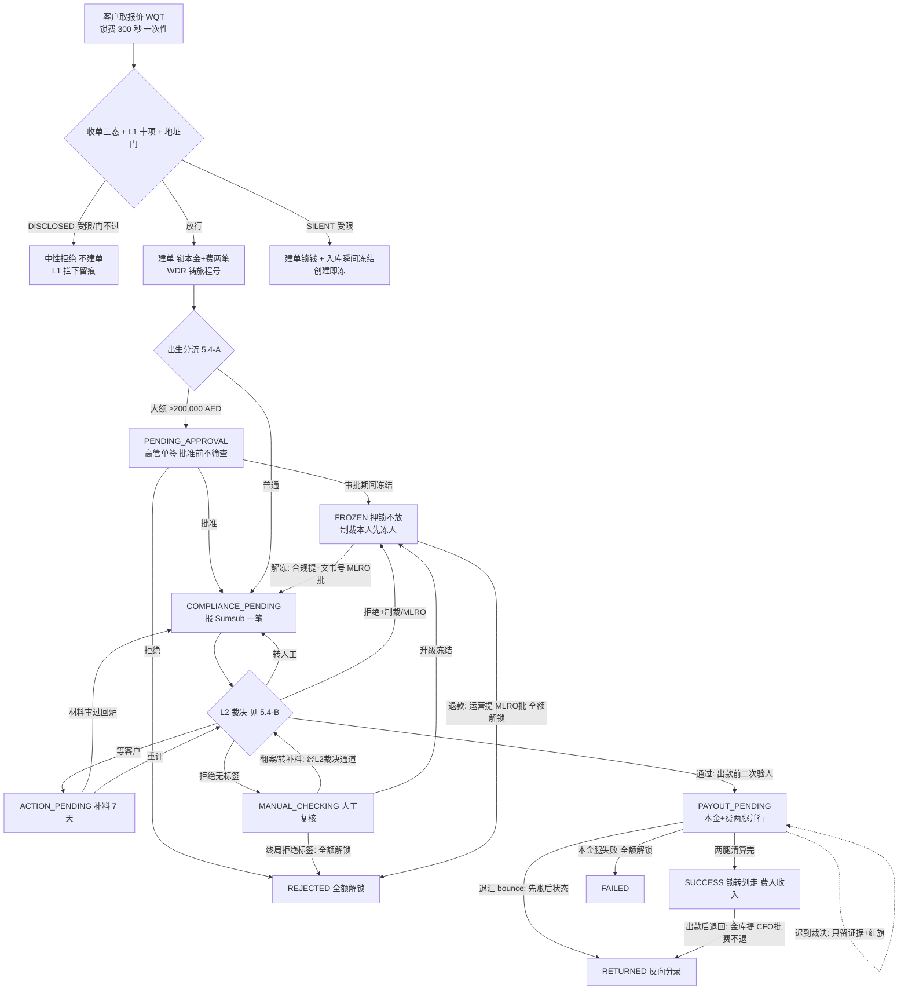

<title>6. 提现 · Withdraw v2.0</title>

# **0　变更记录**

| 版本 | 日期 | 修订人 | 变更摘要 |
|-|-|-|-|
| v2.0 | 2026-09-17 | — | **新建文档**：提现域首篇九模块全量 PRD，取代旧《6. 提现单》时代文档（原件保留不改、不再维护，冲突以本篇为准）。对齐代码现状 @ main `4a8b1063`。关键口径：① 状态机 **10 态 / 13 动作 / 23 边**（沿革 20→21→22→23：大额审批期间可冻、补料回炉边、出款成功后退回认领边）；② 报价 WQT TTL **300 秒**（2026-09-09 由 30 秒调宽）、三动作留痕；③ 裁决落地**三档**（忽略 / 证据 / 派发）——提现是唯一有"证据档"的域；④ 人工复核的翻案 / 转补料 / 退款拒绝**全部由 L2 裁决通道驱动**（我方后台无此三按钮，对齐总纲"L2 唯一放行入口"）；⑤ 冻结双弧：解冻（合规提、MLRO 批、必附解冻令文书号）/ 退款（运营提、MLRO 批、全额解锁）；⑥ 退回三形态分立（bounce / 出款后认领 / 冻结退款）；⑦ 审计名册现役 **33 码**；⑧ 收单三态（静默受限客户创建即冻，2026-09-14）；⑨ tipping-off 三防线（2026-09-12 波三补齐，与充值域镜像）。 |

---

# **1　背景与问题陈述**

**提现是资金离开体系的唯一客户侧出口，风险浓度最高。**钱一旦付出去就不可追回，所以提现是**门最多的一域**——资格、地址、限额、大额审批、合规筛查五道全有，也是 L1 十项快照**全部适用**的唯一一域。所有控制都在争取**最后一个还能拦下的时刻**。

一笔顺利的提现是：取报价 → 建单锁钱 → 合规通过 → 两腿清算 → 到账。真实世界的其余情况是：金额大到必须人眼过一遍；Sumsub 判了制裁命中；要求补料而客户不理；出款指令已广播却被银行打回；出款成功数日后钱又被退回来；以及冻结之后的两难——放行还是退款。

本篇必须同时解决的矛盾：

- **等待期里钱始终锁着、不少一分** —— 建单瞬间锁定本金+费；**任何非成功终局都必须全额解锁**（"拒绝即解锁"不变量），绕过解锁的拒绝会把客户的钱永久锁死。
- **门都开在出门之前** —— 大额单连筛查都不进，高管点头才开始；出款前还要再验一次人。
- **出了门就只剩登记** —— 指令已广播的单冻不回来，迟到裁决只能留证据。
- **对被调查人不得泄露调查状态（tipping-off）** —— 冻结、复核、待审批在客户端全部收敛成"处理中"。
- **无法验证来源的补料缺口不能放行**；**单不动，人照办**——人级处置独立于订单状态。

**形态共用声明**：crypto 与 fiat 提现共用同一条工作流与同一套状态机；差异在目的地（链上地址 / 银行账户，法币提现地址生效是前置门）与 TR 判定（对手方 = 提现地址注册时的 VASP 自报属性，判定器与充值同一份）。

---

# **2　目标**

- **资金零悬空** —— 锁定与解锁严格配对：成功=锁定金额划走；拒绝 / 退款 / 失败=全额解锁分毫不差；冻结=押锁待处置。
- **大额必过人眼且 fail-closed** —— 超线一律先审批后筛查；估值不可得的单在累计门当场被拒、不放行。
- **合规裁决 fail-closed 且不丢** —— 五分钟无裁决转人工；迟到裁决按三档落地、不丢不炸。
- **客户端对执法态零信息泄露** —— 冻结 / 复核 / 待审批 / 出款中全部收敛为处理中，时间线不可区分。
- **三查成立** —— 按单号、按客户、按旅程查得到全链留痕（含报价三动作、被拒绝的动作）。

---

# **3　监管依据**

**牌照边界先行**：平台持 VARA **Broker-Dealer（BD）**牌照，**不持** VA Transfer & Settlement 牌照。托管与链上结算职责经 HexTrust 合同传导，本篇不直接引用 T&S Rulebook 条款。

| # | 义务内容 | 来源锚点 |
|-|-|-|
| R-1 | 对虚拟资产转账进行交易监控与风险评分，命中制裁名单须冻结并报告 | **⚠ 待定：逐条条款号待合规锚定**（CRM Rulebook 交易监控章） |
| R-2 | 虚拟资产转账金额达到门槛且对手方为 VASP 时，须交换 Travel Rule 报文 | **⚠ 待定：VARA TR 门槛条款号待合规锚定** |
| R-3 | 不得向被调查主体泄露其正被调查（tipping-off 禁止） | **⚠ 待定：条款号待合规锚定** |
| R-4 | 客户尽职调查资料不足时不得继续业务关系 | CRM Rulebook I.E |
| R-5 | 全部活动留痕并保存 8 年，接受 MLRO 复核 | **⚠ 待定：条款号待合规锚定** |

R-1 / R-2 / R-3 在模块 5.1 的 FR 表中标 **Must（监管）**，不可被砍。

---

# **4　角色与用例**

## **4.1 主要角色（人）**

| 角色 | 定义 | 目标 | 权限边界 | 频率 |
|-|-|-|-|-|
| 客户 Customer | 在平台开户并提现的自然人 | 把钱提到自己的地址 / 账户 | 只能看自己的提现单；看不到任何执法 / 处置细节 | 每日 |
| 运营 Ops Officer | 动钱的手 | 发起冻结退款；登记退汇 bounce；处理费腿卡单 | **没有任何解冻权**（2026-08-30 定）；复核结论推不动（经裁决通道） | 每日 |
| 合规专员 Compliance Officer | 判是非的口 | 复核队列判断；发起解冻 | 复核结论经 Sumsub 侧裁决通道落地（我方后台无直接放行按钮）；解冻只能发起、不能自批 | 每日 |
| MLRO | 反洗钱报告官 | 解冻与退款的终局裁决 | 冻结双弧的唯一审批人 | 每周 |
| 高级管理人员 Senior Management Officer | 大额签字人 | 依阈值审批大额提现 | 大额单步审批（系统自动开案，无人工 maker） | 每周 |
| 金库专员 Treasury Officer | 对账案子上的资金动手人 | 发起出款退回认领 | 仅此入口，从对账案子发起 | 罕见 |
| CFO | 财务负责人 | 退回认领的审批 | 仅此审批 | 罕见 |

## **4.2 次要角色（外部系统）**

| 角色 | 定义 | 与本系统的交互 |
|-|-|-|
| Sumsub（KYT 交易监控） | 交易监控与风险评分服务商 | 接收提交 → 跑规则 → webhook 通知 → 拉 `getTxn` 存证；官员改口再发新 webhook |
| HexTrust（托管）/ 银行 | 出款通道 | 接收出款指令；可能中途打回（bounce）或出款成功后退回 |

**系统本身不是角色。**自动行为在 5.2/5.3 以保留词**「系统（自动）」**表示。

## **4.3 权限包切分（本域动作怎么分给人）**

| 动作 | 权限组 | 出厂持有职务 |
|-|-|-|
| 看提现单 | `TRADING_WITHDRAW_READ` | 多数后台职务 |
| 建单 / 报价通道 | `TRADING_WITHDRAW_WRITE` | 运营（主要服务客户端通道） |
| 登记退汇 bounce（直接执行） | `WITHDRAW_BOUNCE_WRITE` | 运营 |
| 发起冻结退款 | `WITHDRAW_REFUND_WRITE` | 运营 |
| 发起解冻 | `WITHDRAW_UNFREEZE_WRITE` | **合规专员**（运营刻意不持有） |
| 发起出款退回认领 | `WITHDRAW_RETURN_CLAIM_WRITE` | 金库专员 |

**切分理由**：与充值同一条线——动钱的手（运营）与判是非的口（合规）分开，**解冻只在合规手里**；大额审批**没有 maker 组**（超阈值系统自动开案，人只出现在 checker 位）；对账伸进来的认领入口单独成组归金库。人工复核的翻案 / 转补料 / 退款拒绝三个出口**不设我方权限组**——它们由 L2 裁决驱动（真实=合规官在 Sumsub 台处置，演示=⚡按钮），这正是"进入执行态的唯一通道是 L2 放行"的落点。

## **4.4 用例清单**

| 编号 | 角色 | 用例 |
|-|-|-|
| UC-1 | 客户 | 取报价、发起提现，直至到账或全额退回 |
| UC-2 | 客户 | 按要求补充资料以解除挂起 |
| UC-3 | 高级管理人员 | 审批一笔大额提现 |
| UC-4 | 合规专员 + MLRO | 解冻一笔被冻结的提现（附解冻令文书号） |
| UC-5 | 运营 + MLRO | 对冻结单执行退款（全额解锁） |
| UC-6 | 运营 | 登记一笔被银行 / 链上打回的出款（bounce） |
| UC-7 | 金库专员 + CFO | 认领一笔出款成功后被退回的钱 |
| UC-8 | 运营 | 处理费腿卡单红旗（resume 重试） |

## **4.5 关键用例展开**

**UC-3　高管审批大额提现**

| 字段 | 内容 |
|-|-|
| 主要角色 | 高级管理人员 |
| 前置 | 提现单出生即落 `PENDING_APPROVAL`（金额 ≥ 大额线） |
| 触发 | 系统（自动）建单时判定超线并开审批案——**批准之前连合规筛查都不进** |
| 主成功场景 | 1) 高管打开审批案，查看金额、目的地、客户档位 → 系统展示估值依据；2) 高管批准 → 单进 `COMPLIANCE_PENDING`，照常送 Sumsub 筛查 |
| 异常流 2a | 高管拒绝 → `REJECTED` 终态，**本金+费全额解锁** |
| 异常流 2b | 审批期间客户被冻结（制裁广播 / 材料到期自动触发）→ 单转 `FROZEN`——钱在锁里，冻得住也该冻 |
| 后置-成功保证 | 大额单未经高管批准不进入任何筛查或出款环节 |
| **后置-最低保证** | 任何分支下锁定金额分毫不差：批准=继续锁着，拒绝=全额回到客户余额 |

**UC-5　冻结单退款**

| 字段 | 内容 |
|-|-|
| 主要角色 | 运营（发起）+ MLRO（审批） |
| 前置 | 提现单处于 `FROZEN` |
| 触发 | 调查结论为不放行，钱应退回客户 |
| 主成功场景 | 1) 运营在冻结单上发起退款 → 系统开审批案（**开案不动单，开案的人碰不到钱**）；2) MLRO 批准 → 系统执行 `REJECT_REFUND`：单落 `REJECTED`，**本金+费两笔锁全额 void 解锁**，客户余额当场回来 |
| 异常流 2a | MLRO 驳回 → 单留 `FROZEN`，锁不动 |
| 后置-成功保证 | 客户余额恢复到建单前，账本留锁定与解锁配对痕迹 |
| **后置-最低保证** | 「拒绝即解锁」不变量：不存在"单已拒绝、钱还锁着"的中间态 |

## **4.6 角色 × 子流程矩阵**

| 子流程 | 客户 | 运营 | 合规专员 | MLRO | 高管 | CFO | 金库 |
|-|-|-|-|-|-|-|-|
| 报价与建单 | 执行 | — | — | — | — | — | — |
| 大额审批 | — | — | — | — | **单签**（系统开案） | — | — |
| 补料 | 执行 | — | — | — | — | — | — |
| 人工复核三出口（翻案/转补料/退款拒绝） | — | — | 经 L2 裁决通道（演示=⚡） | — | — | — | — |
| 解冻 | — | — | **发起**（附文书号） | **审批** | — | — | — |
| 冻结退款 | — | 发起 | — | **审批** | — | — | — |
| 退汇 bounce 登记 | — | 执行（直接，先账后状态） | — | — | — | — | — |
| 出款退回认领 | — | — | — | — | — | **审批** | 发起 |
| 费腿卡单 resume | — | 执行 | — | — | — | — | — |

**职责分离**：**解冻的发起人（合规）与冻结双弧的动钱发起人（运营）分开；两弧的开案人都碰不到钱——执行只在审批落地后由系统完成；大额由系统开案、高管独签，无人能替；全部审批 48 小时时效、可撤回。**

---

# **5　功能需求**

## **5.0 部件清单**

| 实体 | 在本流程扮演什么 | 归属文档 | 本文档只写什么 |
|-|-|-|-|
| 提现单 WithdrawTransaction | 主线单据，状态机主体 | **本篇** | 全部 |
| 提现报价单（`WQT`） | 锁费用快照（非汇率）的前置件 | 《5. 交易费率等级》 | 接缝：三动作、一次性、300 秒、关闭即取消 |
| 提现地址簿 | 出金目的地；VASP 自报来源；法币地址生效是前置门 | 《3. 财务配置》（地址安全闸） | 接缝：建单前校验 |
| Sumsub 交易与裁决 | 外部合规判断（L2） | 《交易合规裁决》 | 裁决 × 本域状态 → 迁到哪（5.4-B） |
| L1 十项闸 | 我方准入判断，**提现 10/10 全适用** | 《交易域总纲》§3.1 | 失败=中性拒绝留 `WITHDRAW_L1_BLOCKED` 痕 |
| 资金单 FundsOrder（`FDO`） | 出款两腿（本金 legSeq=1 / 费 legSeq=2）的执行凭证 | 《2. 资金单》 | 接缝：何时建、费腿三级梯 |
| 账本 Ledger | 记账落点 | 《1. 账本与记账》 | 5.8 资金动线 |
| 审批单 ApprovalCase | 大额 / 解冻 / 退款 / 认领的载体 | 《权限与审计》 | 接缝：谁提谁批、批准后驱动什么 |
| 材料请求单 / 限制便签 | 补料闭环；人级处置落点 | 《交易合规裁决》§7/§8 | 接缝：登记与回炉 |
| 对账补单入口 | 出款退回认领从对账案子发起 | 《9. 平账》 | **本域收编 `SUCCESS → RETURNED` 边**（不建资金单） |

## **5.1 功能清单**

| FR | 需求（系统应…） | 级别 |
|-|-|-|
| FR-1 | 建单必须消费一张**有效**的提现报价（`WQT`，锁费用快照）；报价 300 秒懒过期、**一次性**（提交即作废、被拒也不退还）、客户关闭确认框即取消；创建 / 消费 / 取消三动作逐一留痕 | Must |
| FR-2 | 建单瞬间锁定**本金+费两笔**；任何非成功终局（大额拒绝 / 退款 / 拒绝 / 出款失败）**全额解锁分毫不差**；冻结不解锁 | Must |
| FR-3 | 金额 ≥ 大额线（出厂 200,000 AED）时，出生直接落 `PENDING_APPROVAL`——高管批准前不进筛查；该落点是建单后的出生路由（表外直写，见 5.3.3 ⚠）。**估值不可得的单到不了这里**：已在累计门被拒（见《10. 交易限额》），大额门自留"估值缺失即转签字"后备防御 | Must |
| FR-4 | L1 十项全适用；法币提现须有已生效的提现地址（前置门）；L1 拦下留 `WITHDRAW_L1_BLOCKED` 痕（无单号、主体=客户） | Must |
| FR-5 | 向 Sumsub 提交一笔交易，`type` 由与充值同一份 TR 判定器决定（对手方 = 提现地址的 VASP 自报属性），判定理由码随审计留痕 | **Must（监管 R-2）** |
| FR-6 | 裁决按**三档**落地：忽略档（终态+冻结，落 `WITHDRAW_KYT_VERDICT_IGNORED` 取证）/ **证据档**（出款执行中：只写单据字段+`WITHDRAW_POST_BROADCAST_VERDICT` 广播审计+红旗，不动单）/ 派发档（四个活状态）——总规则见《交易合规裁决》§5 | **Must（监管 R-1/R-5）** |
| FR-7 | 制裁 / MLRO / 客户级广播在**除出款中外**的任何非终态落 `FROZEN`（`PAYOUT_PENDING` 刻意无冻结入边：指令已广播冻不回来）；制裁·客户本人**先冻人、再冻单** | **Must（监管 R-1）** |
| FR-8 | 解冻唯一路径：合规发起（**必附解冻令文书号**）→ MLRO 批 → 零记账回炉 `COMPLIANCE_PENDING` 并请求 Sumsub 重新打分；**从未送检的冻结单**（创建即冻）解冻后跳过打分，由 5 分钟 SLA 落人工复核接力，非死路 | **Must（监管 R-1）** |
| FR-9 | 冻结退款：运营发起 → MLRO 批 → `REJECTED` + 全额解锁 | Must |
| FR-10 | 出款阶段两腿并行（本金+费）；**出款启动前二次校验客户合规状态**，不过则冻结；**费腿失败不拖累本金**——本金照常到账，费腿三级梯重试、耗尽标红旗 | Must |
| FR-11 | 退汇 bounce（出款广播中途被打回）：仅本金已出账可登记，**先账后状态**（反向分录落定才翻 `RETURNED`） | Must |
| FR-12 | 出款成功后被退回：金库从对账案子发起认领 → CFO 批 → `SUCCESS → RETURNED`，**本金加回、手续费不退**、不建资金单 | Must |
| FR-13 | SLA 四格：等合规 **5 分钟硬**、补料 **7 天硬**（推人工复核）；人工复核 **3 天软**、大额待审批 **1 天软**（只标红不推状态——等自己人的单不该被系统毙掉） | Must |
| FR-14 | 客户端状态走 6 态白名单收敛（白名单外一律映射为处理中）、`completedAt` 终态白名单、客户身份下 `?status=` 参数被忽略改走桶补集；冻结单时间线与普通在途单不可区分 | **Must（监管 R-3）** |
| FR-15 | 收单三态：静默受限客户报价与建单放行、入库瞬间冻结（创建即冻，锁照常压上）；明示受限客户中性拒绝 | **Must（监管 R-3）** |
| FR-16 | 忽略档的制裁·客户本人裁决仍回填客户限制（单不动、人照办） | **Must（监管 R-1）** |
| FR-17 | 建单铸旅程号全链继承（含报价、审批、资金单、补料、忽略档取证）；三查成立 | **Must（监管 R-5）** |
| FR-18 | 仿真模式提供 11 键裁决按钮（三域同表，⑩ 为终局拒绝） | Should |

## **5.2 端到端流程**

图管全貌，具体值与副作用只活在 5.3 / 5.4 的表里。

## **5.3 状态机（10 态 / 13 动作 / 23 边）**

### **5.3.1 状态定义**

| 状态 | 含义 | 资金位置 | 客户可见 | 计时（SLA） | 终态 |
|-|-|-|-|-|-|
| `PENDING_APPROVAL` | 大额待签字 | 锁定（本金+费） | 收敛为处理中 | 1 天软（只标红） |  |
| `COMPLIANCE_PENDING` | 合规审查中（普通单出生态） | 锁定 | 是（处理中） | **5 分钟硬** → 人工复核 |  |
| `ACTION_PENDING` | 等客户补料 | 锁定 | 是（要求操作+补料入口） | **7 天硬** → 人工复核 |  |
| `MANUAL_CHECKING` | 我方人工复核 | 锁定 | 收敛为处理中 | 3 天软（只标红） |  |
| `FROZEN` | 制裁 / MLRO / 广播冻结 | 锁定（**押锁不放**） | 收敛为处理中 | 不计时（刻意） |  |
| `PAYOUT_PENDING` | 出款执行中（两腿） | 锁定 → 逐腿划出 | 收敛为处理中 | 不计时（腿三级梯+红旗） |  |
| `SUCCESS` | 已到账 | 锁定金额划走、费入收入 | 是 | — | ✓（仍有退回认领一条出边） |
| `REJECTED` | 已驳回（大额拒 / 退款 / 终局拒绝） | **全额解锁已退回** | 是 | — | ✓ |
| `FAILED` | 出款失败 | 全额解锁已退回 | 是 | — | ✓ |
| `RETURNED` | 已退回（bounce 或出款后退回） | 本金加回、费不退 | 是 | — | ✓ |

**动作枚举注**：声明的 13 个动作里 `REQUIRE_APPROVAL` 是零引用死值（随 10 态改造退役未删声明），不参与任何边——阅读代码时视为历史遗留。

### **5.3.2 跃迁表（23 条）**

信封：每次跃迁均写状态历史与审计（从/到状态、成因、操作者、旅程号），下表「副作用」仅列额外动作。

| T | 起始 | 动作 | 目标 | 触发条件 | 副作用 |
|-|-|-|-|-|-|
| T-01 | `PENDING_APPROVAL` | `GATE_APPROVE` | `COMPLIANCE_PENDING` | 系统（自动）：高管批准 | 审计 `WITHDRAW_LARGE_VALUE_PASSED`（带审批号、因果链）；报 Sumsub |
| T-02 | `PENDING_APPROVAL` | `REJECT` | `REJECTED` | 系统（自动）：高管拒绝 | **全额解锁**（本金+费两笔 void） |
| T-03 | `PENDING_APPROVAL` | `FREEZE` | `FROZEN` | 系统（自动）：审批期间制裁 / 广播 / 材料到期 | 零记账（锁保持）；制裁本人先冻人；审计 `WITHDRAW_FROZEN` |
| T-04 | `COMPLIANCE_PENDING` | `APPROVE` | `PAYOUT_PENDING` | 系统（自动）：裁决通过 | **出款前二次验人**（不过则改走冻结）；建两腿（本金 legSeq=1 / 费 legSeq=2）；审计 `WITHDRAW_COMPLIANCE_PASSED` / `WITHDRAW_PAYOUT_INITIATED` |
| T-05 | `COMPLIANCE_PENDING` | `ACTION_PENDING` | `ACTION_PENDING` | 系统（自动）：裁决=等客户 | 登记材料请求；设 7 天 SLA；审计 `WITHDRAW_ACTION_REQUIRED` |
| T-06 | `COMPLIANCE_PENDING` | `KYT_REJECTED` | `MANUAL_CHECKING` | 系统（自动）：拒绝且无处置标签 | 审计 `WITHDRAW_MANUAL_CHECKING` |
| T-07 | `COMPLIANCE_PENDING` | `SLA_BREACH` | `MANUAL_CHECKING` | 系统（自动）：等合规超 5 分钟 | 置超时标记；审计 `WITHDRAW_SLA_BREACHED` |
| T-08 | `COMPLIANCE_PENDING` | `FREEZE` | `FROZEN` | 系统（自动）：制裁（本人/对手方）/MLRO 标签 / 广播 / 创建即冻 | 同 T-03 |
| T-09 | `ACTION_PENDING` | `APPROVE` | `PAYOUT_PENDING` | 系统（自动）：补料后重评通过 | 同 T-04 |
| T-10 | `ACTION_PENDING` | `KYT_REJECTED` | `MANUAL_CHECKING` | 系统（自动）：最新拒绝裁决 | 同 T-06 |
| T-11 | `ACTION_PENDING` | `FREEZE` | `FROZEN` | 系统（自动）：补料期间命中 | 同 T-03 |
| T-12 | `ACTION_PENDING` | `SLA_BREACH` | `MANUAL_CHECKING` | 系统（自动）：补料超 7 天 | 同 T-07（成因与拒绝可区分） |
| T-13 | `ACTION_PENDING` | `RESUME` | `COMPLIANCE_PENDING` | 系统（自动）：材料审过（GREEN）回炉重检 | 审计 `WITHDRAW_MATERIAL_APPROVED_RESUMED`——2026-08-29 补边，此前材料审过后单子永远停在原地 |
| T-14 | `MANUAL_CHECKING` | `APPROVE` | `PAYOUT_PENDING` | 系统（自动）：翻案改判为通过（经 L2 裁决通道，演示=⚡①） | 同 T-04 |
| T-15 | `MANUAL_CHECKING` | `ACTION_PENDING` | `ACTION_PENDING` | 系统（自动）：Sumsub 官员改口 `awaitingUser` | 同 T-05 |
| T-16 | `MANUAL_CHECKING` | `FREEZE` | `FROZEN` | 系统（自动）：MLRO 冻结 / 制裁裁决 / 广播 | 同 T-03 |
| T-17 | `MANUAL_CHECKING` | `REJECT_REFUND` | `REJECTED` | 系统（自动）：终局拒绝标签（`FINAL_REJECTED`）落地——复核态上直接执行 | **全额解锁**；审计 `WITHDRAW_REFUNDED` |
| T-18 | `FROZEN` | `RESUME` | `COMPLIANCE_PENDING` | 系统（自动）：解冻审批（合规提+解冻令文书号、MLRO 批）通过 | **零记账回炉**（锁始终没动、无账可退）；审计 `WITHDRAW_UNFROZEN`；请求 Sumsub 重新打分（从未送检的单跳过，由 SLA 接力） |
| T-19 | `FROZEN` | `REJECT_REFUND` | `REJECTED` | 系统（自动）：退款审批（运营提、MLRO 批）通过 | **全额解锁**；审计 `WITHDRAW_REFUNDED` |
| T-20 | `PAYOUT_PENDING` | `SUCCESS` | `SUCCESS` | 系统（自动）：两腿清算完成 | post：本金出体系、费入提现手续费收入；腿收口；审计 `WITHDRAW_PAYOUT_COMPLETED` / `WITHDRAW_SUCCESS` |
| T-21 | `PAYOUT_PENDING` | `FAIL` | `FAILED` | 系统（自动）：本金腿失败 | **全额解锁**（客户看得见钱回来） |
| T-22 | `PAYOUT_PENDING` | `RETURN` | `RETURNED` | 运营：登记退汇 bounce（仅本金已出账） | **先账后状态**：反向分录落定才翻状态；审计 `WITHDRAW_BOUNCED` |
| T-23 | `SUCCESS` | `RETURN` | `RETURNED` | 系统（自动）：退回认领审批（金库提、CFO 批）通过 | 复用 bounce 分录：**本金加回、手续费不退**（费腿早已结清）；不建资金单；审计 `WITHDRAW_RETURNED_AFTER_SUCCESS` |

### **5.3.3 约束**

- **拒绝即解锁**：`REJECTED` / `FAILED` 的达成必然伴随全额解锁——管理台连"直接拒绝"的侧门都已物理删除，绕过解锁的拒绝会把客户的钱永久锁死。
- **`PAYOUT_PENDING` 刻意没有冻结入边**——指令已广播，冻不回来；迟到裁决只留证据档记录与红旗。
- **⚠ 大额单的出生落点是表外直写**：所有提现一律先落 `COMPLIANCE_PENDING`（"出生即着陆"），大额单随后由出生路由直写升 `PENDING_APPROVAL`——声明式迁移表刻意没有这条边，是铁律"状态只能沿边走"的已知点名豁免。
- **人工复核三出口全部由 L2 驱动**：翻案（⚡①）、转补料（官员改口）、终局拒绝（`FINAL_REJECTED` 标签）——我方后台没有这三个按钮，"进入执行态的唯一通道是 L2 放行"。
- **费腿失败不拖累本金**；卡住是旗（needsReview）不是状态。
- **守则单测锁边数 23**——加边减边当场抓住。

## **5.4 判定决策表**

**5.4-A　出生分流（建单后）**

| # | 金额估值（AED） | → 出生落点 |
|-|-|-|
| A1 | 可得且 < 大额线（出厂 200,000） | `COMPLIANCE_PENDING`（照常送检） |
| A2 | 可得且 **≥ 大额线** | `PENDING_APPROVAL`（先审批后筛查） |
| A3 | **不可得**（汇率缺失） | **建单被拒**（累计门 `UNPRICEABLE`，fail-closed 不放行）——大额门的转签字分支是后备防御，正常链路到不了 |

**5.4-B　裁决落地（三档，提现独有证据档）**

先判档位（总规则见《交易合规裁决》§5）：

| 档 | 状态集合 | 动作 |
|-|-|-|
| 派发 | 待签字 / 等合规 / 等补料 / 人工复核 | 按裁决 × 标签走 5.3.2 对应边 |
| **证据** | 出款执行中 | 写单据字段 + `WITHDRAW_POST_BROADCAST_VERDICT` 广播审计 + 红旗，**不动单** |
| 忽略 | 四个终态 + 冻结 | 落 `WITHDRAW_KYT_VERDICT_IGNORED` 取证行；制裁·本人仍回填客户限制 |

派发档内按裁决 × 标签：

| # | 裁决 | 处置标签 | → 我方 |
|-|-|-|-|
| B1 | 通过 | （不读标签） | 出款前二次验人 → `PAYOUT_PENDING`；验人不过 → `FROZEN` |
| B2 | 拒绝 | 制裁·客户本人 | **先冻人、再冻单** |
| B3 | 拒绝 | 制裁·对手方 / MLRO 冻结 | 只冻单，不冻人 |
| B4 | 拒绝 | **终局拒绝** `FINAL_REJECTED` | 复核态上直接驳回退款（T-17）；**冻结态上拒绝执行**，须先走解冻审批 |
| B5 | 拒绝 | 其它 / 无标签 | `MANUAL_CHECKING`，不碰客户 |
| B6 | 等客户 | — | `ACTION_PENDING` + 登记材料请求 |
| B7 | 转人工 | — | 状态不变、时钟照走，只记 `WITHDRAW_ONHOLD`（仅等合规态有意义） |

**5.4-C　退回三形态（同落 `RETURNED` / `REJECTED`，三条完全不同的路）**

| 形态 | 什么时候发生 | 谁发起 / 谁批 | 账务 | 落点 |
|-|-|-|-|-|
| **退汇 bounce** | 出款指令已广播、被银行/链上**中途打回** | 运营登记，直接执行 | 反向分录**先账后状态** | `PAYOUT_PENDING → RETURNED` |
| **出款后退回认领** | 出款**成功之后**钱又被退回（对账发现） | 金库提（对账案子）、CFO 批 | 本金加回、**手续费不退**；不建资金单 | `SUCCESS → RETURNED` |
| **冻结退款** | 调查结论=不放行 | 运营提、MLRO 批 | 全额解锁（钱从未出门） | `FROZEN → REJECTED` |

**5.4-D　收单三态**：与充值篇 5.4-D 同一判据（静默受限 → 建单锁钱、入库瞬间冻结；明示受限 → 中性拒绝；`WITHDRAW_L1_BLOCKED` 对静默客户不再发生，改为建单+冻结成对留痕）。

## **5.5 数据要求与双端可见性**

**金额最小单位存储。单号**：提现单 `WDR`、报价 `WQT`、资金单 `FDO`；建单铸旅程号全链继承。

**业务级字段（本篇专有）**：

| 字段 | 含义 | 谁写 |
|-|-|-|
| `quoteNo` / `feeLevelCode` / `tierName` | 消费的报价号与命中的费率档 | 建单时 |
| `sumsubTxnId` / `sumsubVerdict` / 报文存证 | L2 侧真相 | 提交与 webhook 时 |
| `slaDeadline` / `slaBreached` | SLA 截止与超时标记 | 进计时状态 / 扫描 |
| `needsReview` | 费腿卡死 / 迟到裁决红旗 | 系统 |
| `returnExternalLineId` / `returnReconCaseNo` | 出款后退回认领的对账锚 | 认领时 |
| `ownerNo` | 客户业务号（本域自带列） | 建单时 |

**双端可见性表**（客户侧：状态走 6 态白名单——`COMPLIANCE_PENDING` / `ACTION_PENDING` / `SUCCESS` / `REJECTED` / `FAILED` / `RETURNED` 原样，**其余（待签字 / 复核 / 冻结 / 出款中）一律收敛为 `COMPLIANCE_PENDING`**；`completedAt` 只在四个终态输出；`?status=` 参数被忽略，筛选走 6 桶补集）：

| 我方状态 | 客户看到 | 管理台看到 | 说明 |
|-|-|-|-|
| `COMPLIANCE_PENDING` | PROCESSING | 真实状态 | |
| `ACTION_PENDING` | ACTION REQUIRED + 补料入口 | 真实状态 | |
| **`PENDING_APPROVAL` / `MANUAL_CHECKING` / `FROZEN` / `PAYOUT_PENDING`** | **PROCESSING（逐字段一致，时间线不可区分）** | 真实状态 + 成因 | **刻意不一致：tipping-off（FR-14）**——大额在审、被查、在途，客户一律无感 |
| `SUCCESS` / `REJECTED` / `FAILED` / `RETURNED` | 真实结果（REJECTED 显示为未成功 DECLINED） | 真实状态 | 拒绝/失败/退回时客户看得见钱回来了 |

**⚠ 已知缺口**：建单接口的响应仍原样返回内部实体、未过白名单（新建单不可能立即是冻结态，风险面小于读面）——见模块 8 G-1。

## **5.6 审计事件（33 码封闭名册）**

信封（主体/操作者/旅程号/从-到）每条均记；失败不起名（outcome+原因码）；扩码同步名册数（`verify:audit` 常绿）。

| 组 | Action 常量 | 触发时机 |
|-|-|-|
| 出生与闸（4） | `WITHDRAW_CREATED` / `WITHDRAW_L1_BLOCKED` / `WITHDRAW_LARGE_VALUE_REQUESTED` / `WITHDRAW_LARGE_VALUE_PASSED` | 建单、L1 拦下、大额开案与放行 |
| 裁决主线（10） | `WITHDRAW_REJECTED`（大额拒）/ `WITHDRAW_SUMSUB_SUBMITTED` / `WITHDRAW_ONHOLD` / `WITHDRAW_MANUAL_CHECKING` / `WITHDRAW_ACTION_REQUIRED` / `WITHDRAW_MATERIAL_APPROVED_RESUMED` / `WITHDRAW_FROZEN` / `WITHDRAW_KYT_VERDICT_IGNORED` / `WITHDRAW_POST_BROADCAST_VERDICT` / `WITHDRAW_COMPLIANCE_PASSED` | 送检到各裁决落地、三档取证 |
| 出款（6） | `WITHDRAW_PAYOUT_INITIATED` / `WITHDRAW_PAYOUT_COMPLETED` / `WITHDRAW_SUCCESS` / `WITHDRAW_BOUNCED` / `WITHDRAW_FEE_RETRIED` / `WITHDRAW_FEE_STUCK` | 两腿启动、清算、退汇、费腿三级梯 |
| 冻结双弧（4） | `WITHDRAW_UNFREEZE_REQUESTED` / `WITHDRAW_UNFROZEN` / `WITHDRAW_REFUND_REQUESTED` / `WITHDRAW_REFUNDED` | 解冻与退款的开案与落地（带审批号、因果链） |
| 退回认领（3） | `WITHDRAW_RETURN_CLAIM_REQUESTED` / `WITHDRAW_RETURN_CLAIM_STARTED` / `WITHDRAW_RETURNED_AFTER_SUCCESS` | 对账伸入线 |
| SLA 与演示（3） | `WITHDRAW_SLA_BREACHED` / `WITHDRAW_SLA_TIMEOUT_SIMULATED` / `WITHDRAW_DEMO_SCENARIO_RUN` | 超时与⚡ |
| 报价（3） | `WITHDRAW_QUOTE_CREATED` / `WITHDRAW_QUOTE_USED` / `WITHDRAW_QUOTE_CANCELLED` | 报价三动作（按 `WQT` 号可查全链） |

## **5.7 配置面（配置边界表）**

| 参数 | 出厂值 | 可调范围 / 生效 | 不许调什么 | 谁有权改 |
|-|-|-|-|-|
| 大额线（LARGE_APPROVAL 门） | 200,000 AED（仅提现一行） | 配置行，改动走限额变更审批 | **fail-closed 方向**：估值不可得必拒不许放行（累计门先拒，大额门留转签字后备） | 限额审批链 |
| 单笔 / 累计限额 | 现役资产（AED、USDT）上下限；BASIC 日 5 万/月 50 万、PREMIUM 日 50 万/月 500 万（AED） | 配置行 | 维度（操作×资产 / 操作×档位×周期） | 限额审批链 |
| 报价 TTL | 300 秒 | 代码常量（2026-09-09 由 30 秒调宽：费率会被随时改，报价不能无时限；30 秒又短到确认框里犹豫即过期） | 一次性消费；关闭即取消 | — |
| SLA 四格 | 5 分钟 / 7 天硬；3 天 / 1 天软 | 代码常量 | 软格只标红不推状态（不转嫁客户） | — |
| 审批链 | 见 4.6 | 审批策略为配置 | **硬门清单：解冻 / 退款 / 认领不许配成免审；大额不许少于一签；解冻发起必附文书号；maker≠checker**；bounce 直接执行是业主定的登记动作 | 审批策略治理 |

## **5.8 资金动线**

建单锁定是 **TB pending 两笔**（本金+费），不是分录；分录只在下表跃迁发生。科目用 COA 真名：

| 跃迁 | 资金单 | 动作 |
|-|-|-|
| 建单 | — | pending 锁两笔（本金+费），客户可用余额当场减少 |
| T-20 成功 | 本金腿+费腿 | post：本金——客户应付 `CLIENT_PAYABLE` ↓ / 客户托管资产 `CLIENT_ASSET` ↓（钱出体系）；费——客户应付 ↓ / 提现手续费收入 `INCOME_WITHDRAW_FEE` ↑；两腿收口 `CLEARED` |
| T-02 / T-17 / T-19 / T-21 拒绝·退款·失败 | — | **void 解锁两笔**，余额全额恢复 |
| T-22 bounce | 本金腿 | 反向分录（本金加回：托管资产 ↑ / 客户应付 ↑），先账后状态 |
| T-23 出款后认领 | **不建资金单** | 同 bounce 分录、**跳过费腿**（手续费不退） |
| T-03/T-08/T-11/T-16 冻结、T-18 解冻 | — | **零记账**（锁保持原样） |

## **5.9 演示装置（⚡仿真裁决按钮，11 键三域同表）**

与充值篇 5.9 同一张表；提现差异仅一处：**⑩ = Rejected · Final rejected**（`FINAL_REJECTED` 标签）——复核态上直接驳回退款、冻结态上被拒绝执行。SLA 超时另有拨钟工具。

---

# **6　范围与非目标**

**范围**：单笔客户提现从「取报价」到「四个终态之一」的全部路径（含大额分流、冻结双弧、退回三形态、客户端展示与审计）。crypto 与 fiat 同管。

1）**Travel Rule 报文的实际交换** —— 同充值篇，只做 type 判定与提交。
2）**VASP 归属识别服务** —— 对手方 VASP 属性来自客户注册地址时的自报，无外部名录校验（诚实前提要讲清）。
3）**热钱包 / 公司侧流动性管理** —— 出款指令不查公司侧余额，流动性属金库域议题。
4）**报价与费率档位的定价机制** —— 见《5. 交易费率等级》，本篇只写消费接缝。
5）**资金单状态机与记账引擎** —— 见《2. 资金单》《1. 账本与记账》。
6）**审批流的角色/权限模型** —— 见《权限与审计》。
7）**Sumsub 裁决机制层** —— 见《交易合规裁决》。
8）**充值与兑换** —— 相邻流程。
9）**客户通知** —— 全域缺口，归《交易域总纲》G1。

**非目标 ≠ 缺口。**已知未做完的一律进模块 8。

---

# **7　验收标准**

**A 组　报价（FR-1）**

□ AC-1　无有效报价建单 → 拒绝
□ AC-2　消费后重放同一报价 → 拒绝（一次性）
□ AC-3　被合规拒绝的单，其报价不退还
□ AC-4　客户关闭确认框 → 报价立即取消，审计 `WITHDRAW_QUOTE_CANCELLED`
□ AC-5　**边界：第 300 秒整报价过期**（懒判定）；按 `WQT` 号三动作全链可查

**B 组　出生锁与大额（FR-2/3，5.4-A 三行，T-01/02/03）**

□ AC-6　建单瞬间客户可用余额减少本金+费；同一笔钱再发提现被余额门拦下
□ AC-7　**边界：恰好 200,000 AED → `PENDING_APPROVAL`**（≥ 即触发）
□ AC-8　**边界：199,999.99 AED → `COMPLIANCE_PENDING`**
□ AC-9　**fail-closed：币种汇率不可得 → 建单被拒（`UNPRICEABLE`）**，不放行也不出生
□ AC-10　大额拒绝 → `REJECTED`，本金+费**全额解锁分毫不差**
□ AC-11　大额批准 → 进 `COMPLIANCE_PENDING` 才首次送 Sumsub
□ AC-12　审批期间客户被冻结广播 → 单转 `FROZEN`，锁保持

**C 组　裁决分流与三档（FR-6/16，5.4-B 全行）**

□ AC-13　通过 → 二次验人过 → `PAYOUT_PENDING` 两腿建立
□ AC-14　**通过但二次验人不过 → `FROZEN`**，不出款
□ AC-15　拒绝+制裁本人 → 先冻人（便签已开）再冻单
□ AC-16　拒绝+制裁对手方 / MLRO → 只冻单
□ AC-17　拒绝+终局拒绝（复核态） → 直接 `REJECTED` + 全额解锁
□ AC-18　拒绝+终局拒绝（冻结态） → **被拒绝执行**，单留 `FROZEN`
□ AC-19　拒绝无标签 → `MANUAL_CHECKING`；转人工 → 状态时钟都不动
□ AC-20　出款中收到迟到裁决 → 单不动、字段+广播审计+红旗（证据档）
□ AC-21　终态/冻结收到迟到裁决 → `WITHDRAW_KYT_VERDICT_IGNORED`；制裁本人仍回填便签

**D 组　冻结双弧（FR-7/8/9，T-18/19）**

□ AC-22　解冻发起缺文书号 → 拒绝提交
□ AC-23　解冻批准 → 回 `COMPLIANCE_PENDING`、零记账、已请求重新打分
□ AC-24　**从未送检的冻结单解冻 → 跳过打分，5 分钟后 SLA 落人工复核**（非死路）
□ AC-25　退款批准 → `REJECTED` + 全额解锁，客户余额当场恢复
□ AC-26　两弧开案后单据状态不变（开案不动单）；开案人自批被拒
□ AC-27　运营尝试发起解冻 → 无权限（解冻只在合规手里）

**E 组　出款与退回三形态（FR-10/11/12，5.4-C 三行，T-20/21/22/23）**

□ AC-28　两腿清算完成 → `SUCCESS`，本金出体系、费入收入，两腿 `CLEARED`，恒等式通过
□ AC-29　本金腿失败 → `FAILED` + 全额解锁
□ AC-30　**费腿失败不拖累本金**：本金照常到账，费腿三级梯耗尽标红旗
□ AC-31　bounce：本金未出账时登记被拒；已出账登记 → 反向分录落定才翻 `RETURNED`
□ AC-32　出款后认领批准 → `SUCCESS → RETURNED`，**本金加回、手续费不退**、不建资金单
□ AC-33　任一终态下全部资金单 `CLEARED`

**F 组　超时（FR-13）**

□ AC-34　等合规超 **5 分钟** → `MANUAL_CHECKING`
□ AC-35　补料超 **7 天** → `MANUAL_CHECKING`，成因可区分
□ AC-36　复核超 3 天 / 大额超 1 天 → 只标红，状态不动

**G 组　客户端信息隔离（FR-14/15）**

□ AC-37　`PENDING_APPROVAL` / `MANUAL_CHECKING` / `FROZEN` / `PAYOUT_PENDING` 客户端渲染与 `COMPLIANCE_PENDING` 逐字段一致
□ AC-38　原始响应（DevTools）读不到白名单外状态字符串；`?status=FROZEN` 探测返回按桶语义、无泄露
□ AC-39　冻结单时间线与普通在途单不可区分
□ AC-40　静默受限客户报价与建单放行、入库即冻；客户全程只见处理中
□ AC-41　明示受限客户 → 中性拒绝，不建单
□ AC-42　拒绝/失败/退款后客户看得见余额恢复（状态跟着钱走）

**H 组　审计与三查（FR-5/17）**

□ AC-43　顺利单审计链 `WITHDRAW_CREATED → WITHDRAW_SUMSUB_SUBMITTED → WITHDRAW_COMPLIANCE_PASSED → WITHDRAW_PAYOUT_INITIATED → WITHDRAW_PAYOUT_COMPLETED → WITHDRAW_SUCCESS` 顺序完整
□ AC-44　`WITHDRAW_SUMSUB_SUBMITTED` 含 type 与 TR 理由码
□ AC-45　全链留痕（含报价、审批、资金单、忽略档取证）同旅程号；三查成立
□ AC-46　L1 拦下（未建单）留 `WITHDRAW_L1_BLOCKED`，主体=客户

**覆盖对账**

- **FR 覆盖**：FR-1→A｜FR-2→AC-6/10/25/29｜FR-3→AC-7~12｜FR-4→AC-46（地址门由走查覆盖）｜FR-5→AC-44｜FR-6→AC-20/21｜FR-7→AC-15/16/12｜FR-8→AC-22/23/24｜FR-9→AC-25｜FR-10→AC-13/14/28/29/30｜FR-11→AC-31｜FR-12→AC-32｜FR-13→F｜FR-14→AC-37/38/39｜FR-15→AC-40/41｜FR-16→AC-21｜FR-17→AC-45｜FR-18 不设独立验收。
- **跃迁覆盖**：T-01~T-23 逐条被 B/C/D/E/F 组覆盖（T-13 由补料回炉走查覆盖）。
- **决策表覆盖**：5.4-A 三行→AC-7/8/9｜5.4-B 七行→AC-13~21｜5.4-C 三行→AC-25/31/32｜5.4-D→AC-40/41。
- **未验收项**：模块 8 各 G 按「未实现的不写验收」不设 AC。

---

# **8　待决问题**

**8.1 待决策 Q（等人拍板）**

| 编号 | 问题 | 类型 | 影响 | 等谁 |
|-|-|-|-|-|
| Q-1 | **大额签字门可被分拆规避**（收编自《交易域总纲》Q2，归属本域）。签字线管单笔、累计额度管总量，两者正交：PREMIUM 客户每天 2 笔 19 万（低于 20 万线、合计在 50 万日额度内），一个月零签字提到月额度上限。堵法（滚动窗口累计计入签字判定 / 按行为触发）是风控口径 | 业务口径 | 不堵则"单笔大额须人眼"的控制意图在分拆场景落空 | 合规 + 产品 |
| Q-2 | 补料超时（7 天）后的默认处置口径（与充值 Q-1 同源：来源不明的单该退回还是逐单判） | 业务口径 | 人工复核队列的标准作业 | 业主 + 合规 |

**8.2 已知缺口 G（等实现，真相源 `BACKLOG.md`）**

| 编号 | 缺口 | 影响 |
|-|-|-|
| G-1 | **建单接口响应未过白名单**（列表/详情读面已收敛，建单这条独立路径未跟进） | 演示讲页面不讲网络面板；新建单不可能立即是冻结态，风险面小 |
| G-2 | **热钱包余额不查**：公司侧没钱也放行出款指令 | 演示别构造该场景 |
| G-3 | 费腿卡死后的视图残留（Linked 卡片看着像在途，红旗只在单上） | 观感问题 |
| G-4 | 大额出生路由是表外直写（点名豁免），待补边转正或长期豁免成文 | 铁律④的已知例外 |
| G-5 | 提现成功通知未接（全域通知缺口的本域体现） | 客户只能自己刷 |
| G-6 | 动作枚举残留零引用死值 `REQUIRE_APPROVAL` | 无行为影响，读码勿当活路 |
| G-7 | Sumsub / 链上 / 银行为模拟件 | 验收以 ⚡ 注入为触发 |

---

# **9　附录 A　与旧文档的关系**

- 旧《6. 提现单》时代文档为本篇前身，原件保留不改、不再维护；冲突以本篇为准。
- 上游：《交易域总纲》《交易合规裁决》；现状层唯一真相：`doc-final/modules/v5-withdraw.md`。
- 本篇对模块文档的一处订正：v5 §3"解冻由运营开案"系 2026-08-30 权限定案前旧口径——现状解冻发起人是**合规专员**（运营无任何解冻权），以审批常量与权限目录为准。

---

— 文档结束 —
