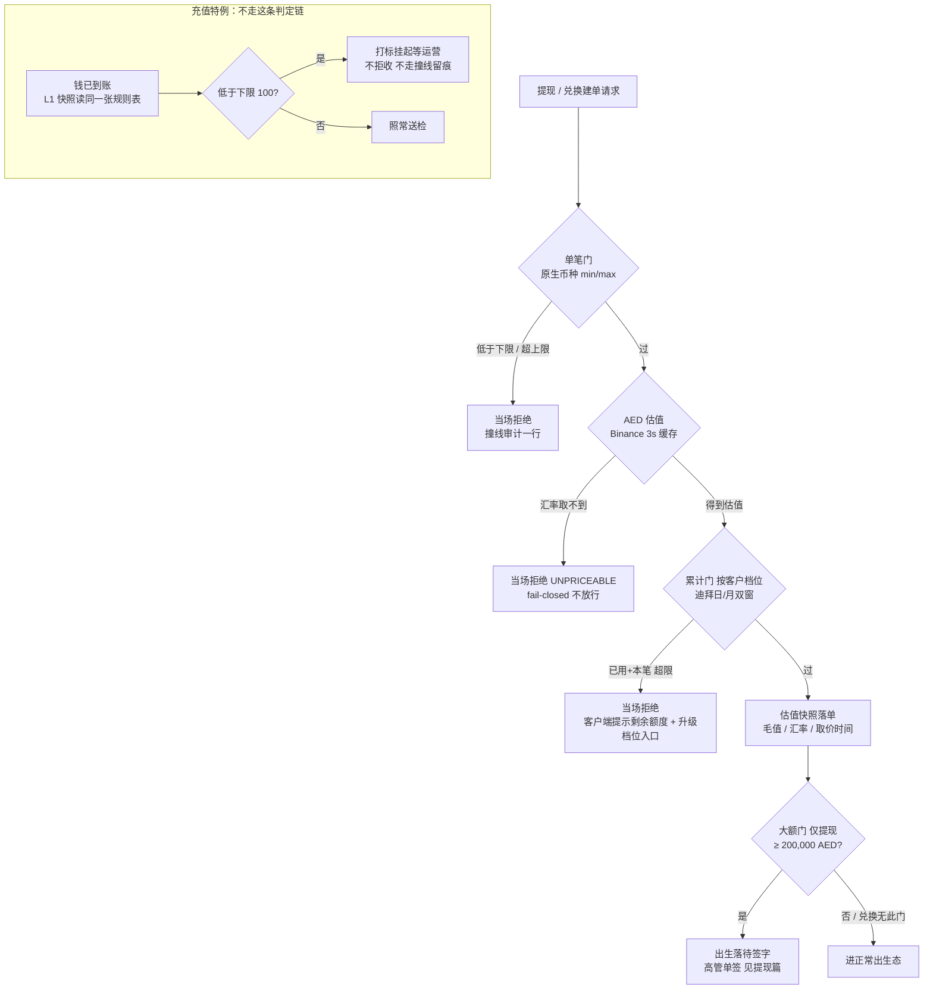

<title>10. 交易限额 · Transaction Limits</title>

# **0　变更记录**

| 版本 | 日期 | 修订人 | 变更摘要 |
|-|-|-|-|
| v1.0 | 2026-09-24 | — | 新篇建档：交易域三种限额门（单笔 / 累计 / 大额签字，即 L1 第 3/4/5 项）的规则模型、判定链、变更治理与留痕。对齐代码现状。**两处口径订正随本篇发布**：① 单笔门出厂种子按现役资产重核——是 **AED、USDT 两资产**各配上下限（"五币种"是默认值字典的误读，BTC/ETH/USD 只是上币时自动取默认档的预置值）；② fail-closed 的真实链路——**估值不可得时单据在累计门当场被拒（`UNPRICEABLE`），到不了大额门**，大额门自身的"估值缺失转签字"只是后备防御。《交易域总纲》决议三与《6. 提现 v2.0》对应处同步订正。 |

---

# **1　这份文档是什么**

**一句话定位：**交易限额是三条交易流程共用的**额度零件**——三种门、一张规则表、一条判定链。门的**位置**（谁在第几步撞上它）归各订单文档，门的**规则**（维度、数值、口径、怎么改）归本篇。

**本篇服务于谁（反向表）：**

| 流程 | 用到哪几种门 | 在哪一步撞上 | 入口章节 |
|-|-|-|-|
| 提现 | 单笔 + 累计 + **大额**（三门全有） | 建单时判定；大额决定出生落点 | 《6. 提现 v2.0》§5.4-A |
| 兑换 | 单笔 + 累计（**无大额门，已裁定不设**） | 建单四道门之一 | 《7. 兑换 v2.0》§5.4-A |
| 充值 | 仅单笔**下限**（累计与大额天然不适用——钱已经到了，拦不住也拒不了） | 收款后 L1 快照打标，**不拒收** | 《4. 充值 v2.0》§5.4-B |
| 客户档位升级 | 累计门按档位取数——升级即换档 | 客户端 Profile「Trading tier」入口 | 《客户与合规》升档章 |

**写什么 / 不写什么：**写规则模型、出厂种子、判定顺序与口径、变更审批、审计与演示。不写大额审批链的执行细节（提现篇）、不写估值引擎（定价件）、不写档位升级流程本身（客户域）。

---

# **2　目标**

- **三门一张表**：全部限额规则集中一张配置表，维度唯一、管理台可查，没有藏在代码里的第二处额度。
- **撞线必留痕**：每一次被限额拦下都是一行审计（谁、哪条规则、差多少），**同一条规则被撞十次写十行**。
- **改动必过人**：规则只改不建不删；改金额走 maker-checker（运营提、高管批），带双重冲突守卫。
- **fail-closed 方向明确**：算不出 AED 估值就拒单，绝不因为"算不了"而放行。

---

# **3　监管依据**

**牌照边界**：平台持 VARA **Broker-Dealer（BD）**牌照。限额是交易监控体系的量化阈值层。

| # | 义务内容 | 来源锚点 |
|-|-|-|
| R-1 | 按客户风险分层设置并执行交易限额，超阈值交易须有强化审查 | **⚠ 待定：条款号待合规锚定**（CRM Rulebook 交易监控章） |
| R-2 | 阈值类合规参数的变更须有授权与留痕 | **⚠ 待定：条款号待合规锚定** |
| R-3 | 全部活动留痕并保存 8 年 | **⚠ 待定：条款号待合规锚定** |

---

# **4　角色与用例**

## **4.1 主要角色（人）**

| 角色 | 定义 | 目标 | 权限边界 | 频率 |
|-|-|-|-|-|
| 客户 Customer | 发起交易、被额度判定的人 | 在额度内完成交易；不够用时升级档位 | 只看到撞线提示与自己档位的额度对照表；看不到规则表本身 | 每日 |
| 运营 Ops Officer | 限额的日常管理人 | 提出限额金额变更 | 只能**提**、不能批（改的是合规阈值，不许自批） | 低频 |
| 高级管理人员 Senior Management Officer | 限额变更的裁决人 | 审批限额变更；审批大额提现 | 限额变更与大额放行的唯一签字人 | 低频 |

**系统本身不是角色**；判定、留痕、窗口计算均为「系统（自动）」。**建规则和删规则没有任何角色能做**——规则随版本装载（上币即自动带默认档），管理台无入口。

## **4.2 权限包切分**

| 动作 | 权限组 | 出厂持有职务 |
|-|-|-|
| 看限额规则（列表 / 详情） | `TRANSACTION_LIMIT_READ` | 多数后台职务 |
| 提交限额金额变更 | `TRANSACTION_LIMIT_WRITE` | 运营 |

**切分理由**：限额是合规阈值，"谁能动"刻意收窄到一个提案口（运营）加一个裁决口（高管）；没有创建 / 删除权限组，因为那两个动作不存在——维度动结构，走开发发版，不走运行时配置。

## **4.3 用例清单**

| 编号 | 角色 | 用例 |
|-|-|-|
| UC-1 | 客户 | 交易被限额拦下，看清差多少、去升级档位 |
| UC-2 | 运营 + 高管 | 改一条限额的金额 |
| UC-3 | 高管 | 审批一笔大额提现（细节见《6. 提现 v2.0》UC-3，本篇只管"线怎么画"） |

## **4.4 关键用例展开**

**UC-2　改一条限额的金额**

| 字段 | 内容 |
|-|-|
| 主要角色 | 运营（提）+ 高管（批） |
| 前置 | 目标规则**没有**待批中的变更（一条规则同时只能有一张待批单） |
| 触发 | 业务要求调整某条门的数值 |
| 主成功场景 | 1) 运营在限额页打开规则详情，提交新金额 → 系统开变更审批单、规则挂"变更中"徽章（快照 before/after 一起落审计）；2) 高管批准 → **落地前冲突守卫**：快照里的 before 与规则当前值逐字段比对，一致才写入；3) 新值即刻生效——下一笔交易的判定就用新值，无追溯 |
| 异常流 1a | 该规则已有待批单 → 提交被拒："先处理掉那张" |
| 异常流 2a | 审批期间该规则被另一变更落地过 → before 与当前值漂移 → **落地失败**（`CHANGE_APPLY_FAILED` 留痕），须重新发起 |
| 异常流 2b | 高管驳回 / 运营撤回 → 徽章消失，规则原值不动 |
| **后置-最低保证** | 任何分支下，规则值要么是旧值要么是审批过的新值，**不存在半截生效**；每一步有审计 |

**UC-1　客户撞线**

| 字段 | 内容 |
|-|-|
| 主要角色 | 客户 |
| 触发 | 提现 / 兑换建单请求触发判定链（5.4-B） |
| 主成功场景 | 1) 撞累计线 → 确认框红框提示（额度类型 + **剩余额度**）+「升级档位」入口，**没有任何钱动、任何单生成**；2) 客户点入 Profile「Trading tier」对照表（两档 × 提现/兑换 × 日/月），发起升级；3) 升级批准后（材料过合规 + 高管核准），**同一笔交易重新发起即放行**——限额按档位实时判 |
| 异常流 1a | 撞单笔线 → 按错误码提示（低于下限 / 超过上限），无升级入口（单笔线不随档位变） |
| **后置-最低保证** | 拦截发生在记账之前——被拒的请求零资金痕迹；每次拦截留一行审计 |

**职责分离**：提变更（运营）≠ 批变更（高管）；批大额的也是高管，但那是**另一张单**（提现审批），与限额规则变更互不相干。

---

# **5　功能需求**

## **5.0 部件清单**

| 实体 | 扮演什么 | 归属文档 | 本篇只写 |
|-|-|-|-|
| 限额规则表 TransactionLimitRule（`TLR`） | 三种门的唯一配置来源 | **本篇** | 全部 |
| L1 十项闸 | 判定结果进快照第 3/4/5 格 | 《交易域总纲》§3.1 | 接缝：三格的取数来源 |
| AED 估值 | 累计与大额的换算口径 | 定价件（Binance 模拟源，3 秒缓存，AED 钉 3.6725） | 接缝：失败即 fail-closed |
| 审批单 | 限额变更的 maker-checker 载体 | 《权限与审计》 | 接缝：谁提谁批、冲突守卫 |
| 大额审批 | 超线提现的出生分流 | 《6. 提现 v2.0》 | 只写线怎么画、判据从哪来 |
| 客户档位 | 累计门的取数维度 | 《客户与合规》升档章 | 接缝：档位实时生效 |

## **5.1 功能清单**

| FR | 需求（系统应…） | 级别 |
|-|-|-|
| FR-1 | 三种门统一存于一张规则表，按 `门类型 × 操作类型 × 资产 / 档位 / 周期` 唯一：**单笔**（操作 × 资产，原生币种，min/max 可只填一边）、**累计**（操作 × 档位 × 日/月，AED）、**大额**（仅操作类型，AED） | Must |
| FR-2 | 规则随版本装载：出厂 **15 条**（单笔 6 / 累计 8 / 大额 1），每条铸确定性业务号（`TLR…`，重铺同号）并落 `TRANSACTION_LIMIT_SEEDED` 身世审计；**上币自动带单笔默认档**（默认值字典按币种取，未登记币种走兜底档） | Must |
| FR-3 | 规则**只改不建不删**：管理台仅有"改金额"入口；维度变更走开发发版重铺 | Must |
| FR-4 | 判定链固定顺序（提现 / 兑换建单时）：单笔（原生币种）→ AED 估值 → 累计（按客户档位）→ 大额（仅提现）；任一门拦下即**当场拒绝、零资金痕迹** | **Must（监管 R-1）** |
| FR-5 | **估值 fail-closed**：AED 汇率取不到时，凡该操作配有累计规则，一律当场拒绝（`TRANSACTION_LIMIT_UNPRICEABLE`），不放行；大额门自留"估值缺失即转签字"的后备防御（正常链路到不了） | **Must（监管 R-1）** |
| FR-6 | 累计口径：窗口 = **迪拜（UTC+4）日历日 / 日历月**；占用 = 窗口内建单的订单 `grossAedValue` 之和（**在途单占额度**）；判据 = 已用 + 本笔 > 限额即拒，**恰好用满放行**；提现的失败 / 拒绝 / 退回单**不占**额度，兑换现状**全部占**（含被拒，见模块 8 Q-1） | Must |
| FR-7 | 通过判定的单落**估值快照**（AED 毛值 / 汇率 / 取价时间）——大额判定与日后累计取数都用这份快照，不重新取价 | Must |
| FR-8 | 大额门仅提现一行（出厂 200,000 AED），判据 ≥；触发即出生落待签字（表外出生路由，见提现篇） | Must |
| FR-9 | 充值特例：只配**下限**（无上限——拒收不存在）；低于下限**不拒**，收款后 L1 打标 `BELOW_MIN` 挂起等运营处置（豁免 / 没收 / 退回，见充值篇） | Must |
| FR-10 | **每次撞线一行审计**（`TRANSACTION_LIMIT_REJECTED`，结果=拦下 DENIED，主体=规则号，客户与金额入 metadata，请求号逐次唯一——"撞了几次"本身是证据） | **Must（监管 R-3）** |
| FR-11 | 限额变更走 maker-checker（运营提 `TRANSACTION_LIMIT_WRITE`、高管批、48h、可撤回），带**双重冲突守卫**：同一规则同时只能有一张待批单；落地前 before-vs-current 逐字段比对，漂移即失败留痕 | **Must（监管 R-2）** |
| FR-12 | 客户端撞累计线时提示**剩余额度**并给档位升级入口；Profile 提供两档 × 双操作 × 双周期的额度对照表；档位升级批准后即刻按新档判定 | Should |

## **5.2 端到端判定链**

图管全貌，具体值与口径以 5.4 决策表为准。

## **5.3 规则的生命周期（刻意没有状态机）**

限额规则**无生命周期、恒生效**——没有草稿态、没有停用态、没有删除。唯一的"状态"是一把锁：

| 锁 | 含义 | 谁上 / 谁解 |
|-|-|-|
| 变更中（待批单号非空） | 该规则有一张待批的金额变更；详情页挂徽章；**再提变更被拒** | 提交变更时上；批准落地 / 驳回 / 撤回时解 |

**约束**：批准落地前必过 before-vs-current 冲突守卫；新值生效即刻、**无追溯**——已按旧值判过的单不重判；窗口口径（迪拜时区）与判定顺序不是配置，改它们=改产品。

## **5.4 判定决策表**

**5.4-A　三种门的维度与出厂种子（15 条）**

单笔（6 条，原生币种）：

| 操作 | AED | USDT |
|-|-|-|
| 提现 | min 10 / max 1,000,000 | min 10 / max 1,000,000 |
| 兑换 | min 10 / max 1,000,000 | min 10 / max 1,000,000 |
| 充值 | **仅 min 100**（无上限） | **仅 min 100**（无上限） |

累计（8 条，AED，按档位 × 周期）：

| 档位 × 操作 | 日 | 月 |
|-|-|-|
| BASIC × 提现 | 50,000 | 500,000 |
| BASIC × 兑换 | 100,000 | 1,000,000 |
| PREMIUM × 提现 | 500,000 | 5,000,000 |
| PREMIUM × 兑换 | 1,000,000 | 10,000,000 |

大额（1 条，AED）：仅**提现 200,000**——兑换不设已裁定（总纲决议三），充值天然不适用。

以上是出厂种子、运行时可改（走 UC-2）；**上币时新资产自动带单笔默认档**（默认值字典按币种预置了 BTC/ETH/USD 等档位，未预置的币种走兜底档）——配置先行，不用等人手配。

**5.4-B　判定出口（每一行都是"当场拒绝、零资金痕迹"，除末两行）**

| # | 条件 | 域 | 出口 | 留痕 |
|-|-|-|-|-|
| B1 | 金额 < 单笔下限 | 提现 / 兑换 | 拒绝（低于下限） | 撞线审计一行 |
| B2 | 金额 > 单笔上限 | 提现 / 兑换 | 拒绝（超过上限） | 同上 |
| B3 | AED 汇率取不到 | 提现 / 兑换 | **拒绝（UNPRICEABLE，fail-closed）** | 同上 |
| B4 | 已用 + 本笔 > 累计限额 | 提现 / 兑换 | 拒绝（含已用 / 剩余明细） | 同上 |
| B5 | 已用 + 本笔 = 累计限额 | 提现 / 兑换 | **放行**（恰好用满不算超） | — |
| B6 | 估值 ≥ 大额线 | 仅提现 | 放行建单，**出生落待签字** | 大额审计（提现篇） |
| B7 | 金额 < 充值下限 | 充值 | **不拒**：打标挂起等运营 | L1 打标（充值篇；不走撞线留痕，见 G-1） |

**5.4-C　累计占用口径（两域对照）**

| 口径 | 提现 | 兑换 |
|-|-|-|
| 窗口 | 迪拜日历日（00:00 UTC+4 起）/ 日历月（1 号起），双窗都查 | 同左 |
| 取数 | 窗口内**建单**的订单 AED 毛值快照求和 | 同左 |
| 在途单 | **占额度**（钱已锁定） | **占额度** |
| 失败 / 拒绝 / 退回单 | **不占**（死单还额度） | **⚠ 现状全占（含被拒、含超时拒）**——与提现口径相反，待裁定（Q-1） |

## **5.5 数据要求与双端可见性**

**规则字段（业务级）**：规则号（`TLR` 前缀确定性号——同一条业务规则每次重铺同号，`SEEDED` 身世审计能稳定对上活规则）｜门类型 / 操作类型｜资产（仅单笔）｜档位 + 周期（仅累计）｜min/max（单笔，原生币种）｜限额（累计，AED）｜阈值（大额，AED）｜待批变更单号（锁）。

**订单侧快照字段**（判定通过时落在订单行上）：AED 毛值 / 汇率 / 取价时间——一次取价三处用（大额判定、当笔存证、日后累计求和）。

**双端可见性**：

| 面 | 看得到什么 |
|-|-|
| 管理台（限额页） | 全部规则按三类筛选；详情含出厂值与当前值、变更中徽章；**没有新建与删除按钮** |
| 客户端 | 撞单笔线：按错误码提示；撞累计线：红框提示（额度类型 + **剩余额度**）+ 升级档位入口；Profile「Trading tier」：两档 × 双操作 × 双周期对照表。**规则表本身与他人额度不可见** |

## **5.6 审计事件（6 码）**

主体类型 = 限额规则（`TLR` 业务号）；域 = CONFIG。

| Action 常量 | 触发时机 | 要点 |
|-|-|-|
| `TRANSACTION_LIMIT_SEEDED` | 随版本装载 / 重铺 | 每条规则一行身世，afterData 全字段（资产用业务码不用 UUID） |
| `TRANSACTION_LIMIT_REJECTED` | 每次撞线 | 结果=拦下（DENIED）+ 原因码（低于下限 / 超上限 / 估值不可得 / 累计超限）；请求号逐次唯一——**同规则撞十次写十行** |
| `TRANSACTION_LIMIT_CHANGE_REQUESTED` | 运营提变更 | before/after 快照同落 |
| `TRANSACTION_LIMIT_CHANGE_APPLIED` | 高管批准且冲突守卫通过 | 带审批单号、因果链 |
| `TRANSACTION_LIMIT_CHANGE_APPLY_FAILED` | 落地时 before 与当前值漂移 | 因果链可追到是哪张审批单撞的 |
| `TRANSACTION_LIMIT_CHANGE_CANCELLED` | 驳回 / 撤回 | 带原因 |

大额提现自身的审计（开案 / 放行）归提现篇名册。

## **5.7 配置面（配置边界表）**

| 参数 | 出厂值 | 可调 / 生效 | 不许调什么 | 谁有权改 |
|-|-|-|-|-|
| 三门金额（15 条） | 见 5.4-A | 运行时可改，批准即刻生效、无追溯 | — | 运营提、高管批（48h、可撤） |
| 规则维度（唯一键） | 门 × 操作 × 资产 / 档位 / 周期 | **不可运行时改**——动维度走发版重铺 | 唯一键结构 | 开发 |
| 判定顺序 | 单笔 → 估值 → 累计 → 大额 | 代码固定 | 顺序本身（先便宜后贵、先原生后换算） | — |
| 累计窗口 | 迪拜日历日 / 月 | 代码固定 | 时区与"日历窗"语义（不是滚动窗） | — |
| fail-closed 方向 | 估值失败 → 拒单 | 代码固定 | **不许改成放行或降级** | — |
| 建 / 删规则 | 无入口 | 上币自动带默认档 | "只改不建不删"本身 | 开发（随版本） |

## **5.8 资金动线**

**不适用**——限额是判定件，不动钱：拦截发生在锁钱与记账之前，被拒请求零资金痕迹；放行后的资金动线归各订单篇。

## **5.9 演示走法（第一幕 · 站 5 + 第二幕 · 站⑤）**

- **规则面**：限额页三类筛选各看一眼 → 运营改一条单笔限额 → 详情待批徽章 → 换高管批准（讲一句：裁决人是高管不是运营自批；这页**没有新建按钮**，规则从种子来）。
- **撞线面**（第二幕档位升级站的前半）：BASIC 客户兑换 30,000 USDT→AED → 确认框红框「Daily limit exceeded — remaining …」+ 升级入口 → Profile 对照表 → 走升级（材料 + 高管核准）→ **同一笔重新发起，直接成交**——"限额按档位实时判，人升级了它就放行"。

---

# **6　范围与非目标**

**范围**：三种限额门的规则模型、出厂种子、判定链与口径、变更治理、审计、双端可见面。

1）**大额审批链的执行**（谁签、超时、冻结联动）—— 《6. 提现 v2.0》。
2）**充值累计门与充值大额门** —— 天然不适用（钱已到账，"拦"与"拒"都不成立），业主已逐条拍板，不是缺口。
3）**兑换大额门** —— 已裁定不设（总纲决议三），不再评估。
4）**估值引擎**（价源、缓存、点差）—— 定价件；本篇只消费"给我一个 AED 数或明确失败"。
5）**客户档位的升降流程** —— 《客户与合规》；本篇只按档位取数。
6）**TR 金额阈值**（USDT 1000 / AED 3500）—— 那是报送类型判定的阈值，写死在代码、不在限额规则表，归充值 / 提现篇 5.4-A。

**非目标 ≠ 缺口。**

---

# **7　验收标准**

**A 组　单笔门（FR-1/9，5.4-B B1/B2/B7）**

□ AC-1　**边界：恰好等于下限 → 放行；低一分 → 拒**，撞线审计一行
□ AC-2　**边界：恰好等于上限 → 放行；高一分 → 拒**
□ AC-3　充值 99 → **不拒**：单据落挂起、打标可见；**审计里没有撞线行**（现状即 G-1 的另一面）
□ AC-4　充值无上限：任意大额充值不因单笔门被拦

**B 组　估值 fail-closed（FR-5，B3）**

□ AC-5　汇率取不到 → 建单被拒（UNPRICEABLE），**不放行也不出生**，撞线审计一行
□ AC-6　破坏性反证：把估值失败改成放行 → A/B 组之外的累计判定全部失明（此检查证明 fail-closed 真的在链上）

**C 组　累计门（FR-6，B4/B5，5.4-C）**

□ AC-7　**边界：已用 + 本笔恰好 = 限额 → 放行**；再多 0.01 → 拒，提示含已用 / 剩余
□ AC-8　日窗与月窗**双查**：日内没超但月累计超 → 拒（反之亦然）
□ AC-9　**迪拜午夜（UTC+4）翻日**：前一日用满，翻日后同额请求放行；月窗 1 号同理
□ AC-10　在途单占额度：一笔在途提现存在时，剩余额度按已扣减计算
□ AC-11　提现被拒 / 失败 / 退回的单**不占**额度：拒掉一笔后重发同额 → 放行
□ AC-12　兑换被拒的单**占**额度（现状断言，挂 Q-1）：拒掉一笔后同额重发，剩余额度已减少
□ AC-13　档位实时生效：BASIC 撞线 → 升级 PREMIUM 批准 → 同笔重发放行

**D 组　大额门（FR-8，B6）**

□ AC-14　**边界：恰好 200,000 AED → 落待签字；199,999.99 → 正常出生**
□ AC-15　通过判定的单上有估值快照（毛值 / 汇率 / 取价时间），大额判定用的就是这份快照

**E 组　变更治理（FR-3/11）**

□ AC-16　提交变更 → 待批徽章；同一规则再提 → 被拒
□ AC-17　批准 → 新值即刻用于下一笔判定；已判过的单不重判
□ AC-18　**冲突守卫**：审批期间规则被另一变更落地 → 本单落地失败、`CHANGE_APPLY_FAILED` 留痕
□ AC-19　撤回 / 驳回 → 徽章消失、原值不动
□ AC-20　管理台无新建 / 删除入口；直接调建删端点 → 不存在（404）

**F 组　审计（FR-2/10）**

□ AC-21　重铺后 `TRANSACTION_LIMIT_SEEDED` 恰 15 行，规则号与上一次重铺一致（确定性号）
□ AC-22　同一客户连撞三次同一条线 → 三行撞线审计，请求号各不相同
□ AC-23　变更四码（提 / 落地 / 失败 / 撤）因果链完整，按规则号三查可达

**G 组　客户可见面（FR-12）**

□ AC-24　撞累计线的红框提示含**剩余额度**与升级入口；确认框不关、无任何资金变动
□ AC-25　Profile 对照表两档数值与规则表当前值一致（改一条限额后对照表跟着变）

**覆盖对账**

- **FR 覆盖**：FR-1→A/C/D 隐含｜FR-2→AC-21｜FR-3→AC-20｜FR-4→A/B/C/D 全体（顺序由 AC-5 的"不出生"与 AC-15 的"快照后判大额"共同钉住）｜FR-5→AC-5/6｜FR-6→AC-7~13｜FR-7→AC-15/10｜FR-8→AC-14｜FR-9→AC-3/4｜FR-10→AC-22｜FR-11→AC-16~19｜FR-12→AC-24/25。
- **决策表覆盖**：5.4-B 七行 → B1/B2→AC-1/2，B3→AC-5，B4/B5→AC-7，B6→AC-14，B7→AC-3｜5.4-C 对照 → AC-9~12。
- **未验收项**：模块 8 各条按「未实现的不写验收」不设 AC。

---

# **8　待决问题**

**8.1 待决策 Q（等人拍板）**

| 编号 | 问题 | 类型 | 影响 | 等谁 |
|-|-|-|-|-|
| Q-1 | **兑换被拒的单占累计额度，提现不占——两域口径相反**。兑换现状连"超时被系统拒掉"的单也占额度，与"超时不迁怒客户"的裁定有张力；但"被拒不占"也可能被拿来反复试探额度。拉齐到哪一边、还是维持分立并成文 | 业务口径 | 决定客户实际可用额度的计算；影响 AC-11/12 哪条是目标态 | 业主 + 合规 |

**8.2 已知缺口 G（等实现，真相源 `BACKLOG.md`）**

| 编号 | 缺口 | 影响 |
|-|-|-|
| G-1 | **充值下限拦截不走撞线留痕**：充值低于下限经 L1 打标挂起，不产生 `TRANSACTION_LIMIT_REJECTED` 行——三域里唯独充值的"撞线"查不到统一审计（v3 篇波二在案） | 按规则号查撞线记录时充值缺席；取证走充值单自身的打标审计 |
| G-2 | 大额门的"估值缺失即转签字"后备分支实际不可达（累计门先拒）——防御性写法保留 | 无行为影响；读码与写文档时按真实链路表述（本篇 5.4-B 已按实际链路写） |

---

# **9　附录 A　与相邻文档的关系**

- 上游：《交易域总纲》§3.1（L1 第 3/4/5 项）与决议三（三门是配置、签字门只配提现）。
- 现状层唯一真相：`doc-final/modules/v3-financial-config.md`（限额属财务配置域五块之一）；本篇是该域限额零件的应然层细化。
- 本篇发布同时订正三处旧口径：总纲决议三"五币种"与 fail-closed 表述、《6. 提现 v2.0》估值不可得的出口（转签字 → 累计门拒单）、《4. 充值 v2.0》配置面"100 × 五币种"（→ 现役两资产）。

---

— 文档结束 —
